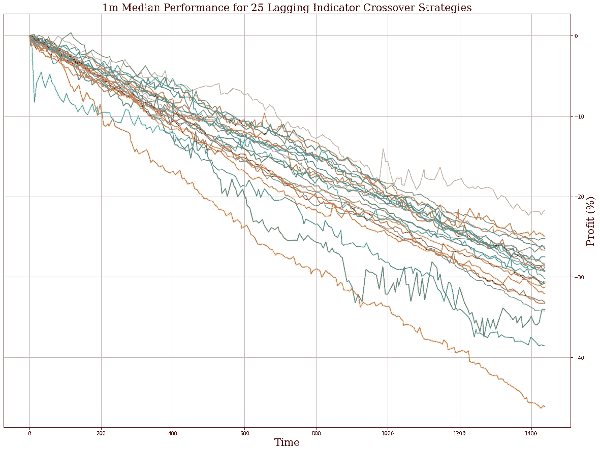
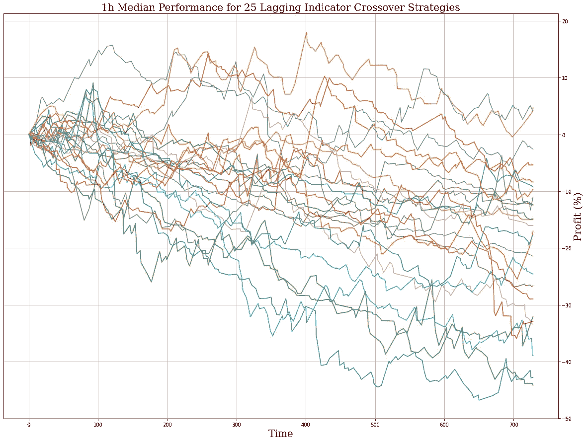
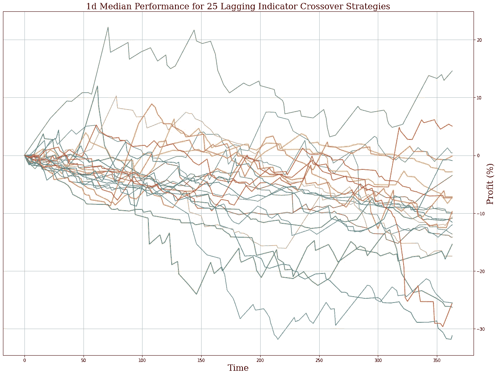
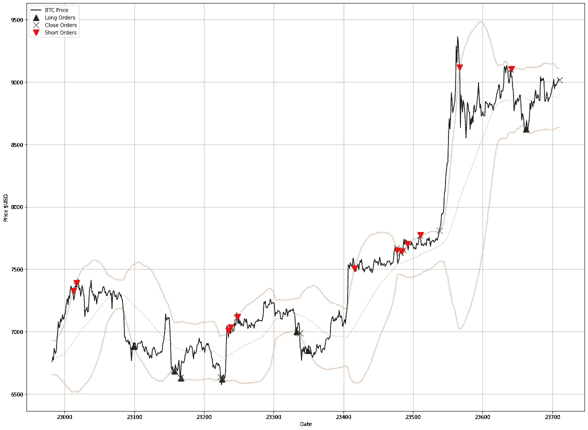

# 如何让你的(自动化)交易更上一层楼

> 原文：<https://medium.com/coinmonks/how-to-take-your-automated-trading-to-the-next-level-6b537310beab?source=collection_archive---------1----------------------->

本周，我们暂停[深度探讨](/coinmonks/deep-dive-part-3-analyzing-your-trading-performance-with-statistics-5d921d4aae23)系列，来回答一个新算法交易者经常提出的问题:

> 我已经尝试了许多自动化策略，但结果并不理想。我如何让我的交易更上一层楼？

在 [ArcTaurus](https://www.linktr.ee/arctaurus) ，我们多年来一直在交易加密货币和建立自动化策略，所以我们也犯了很多和你一样的错误。在这篇博文中，我们将触及一些最常见的错误和误解，并给你一些工具，让你的交易更上一层楼。

**不，我们不会给你一些你自己能很容易理解的“建议”——继续读下去，寻找一些提高你交易业绩的实际建议。**

*注意:这篇博文中的任何内容都不应被理解为财务建议。加密货币不稳定。不要交易超过你愿意失去的东西。*

# 业余选手对专业选手

许多主要的交易公司都有大批数据科学家、数学家和定量分析师，他们每周工作 60 多个小时，但这并不意味着你一个人用电脑和币安账户交易就无法盈利。

你需要的是一些时间、耐心和一点知识——其中一些我们将在这里传授给你。首先，让我们解决房间里的大象:大多数新交易者围绕你可以在交易视图上找到的指标建立策略。如果这听起来像你，我们的第一条建议是停止。

没错——均线、RSI、MACD、布林线……所有这些都是*滞后*指标，意味着它们是过去的指标，而不是未来的指标。当你盯着图表时，这些可以帮助你想象某些模式，但是到下一根蜡烛线结束时，你的机会可能已经失去了。

技术分析——也就是在图表上寻找模式的行为——并不是专业人士做的事情。当他们深入研究图表时，往往只是为了看看他们是否能找到方法，让人们认为某个特定的模式正在发挥作用。如果你不相信我，这是阿拉米达研究承认的:

此外，更重要的是，如果有一个单一的指标或基于指标的战略持续盈利，每个人都会知道。

**事实是，从长远来看，完全基于滞后指标的交易策略几乎普遍无利可图。为了让你的交易更上一层楼，你需要超越“均线交叉”的心态。**

不相信我？以下是在 1m、1h 和 1d 时间范围内对 25 个主要均线交叉进行的一系列回溯测试的中值结果:

MA crossover events, including MACD and Stoch RSI, perform particularly badly on low timeframes.

The 1h time frame is still quite poor, but we see a lot of variance between the strategies. 23/25 strategies lost money over the period of a month.

The 1d time frame still sees a lot of variance and volatility, however still the vast majority of strategies lose money.

你可以看到他们都表现不佳，亏损。不要浪费时间试图找出某种有利可图的交叉条件组合——不会的。你需要进入下一个思想流派，那就是你需要结合一些策略和启发，以便交易更有利可图。

 [## 加密交易机器人——最佳免费 16 个加密交易机器人(2022)

### 2022 年币安、比特币基地、库币和其他密码交易所的最佳密码交易机器人。Pionex，Bitsgap…

medium.com](/coinmonks/crypto-trading-bot-c2ffce8acb2a) 

# 集成方法

对于那些不熟悉的人来说，今天使用的许多机器学习系统正在利用一种称为“集合”的结构，这种结构使用一系列不同的算法来迭代地将问题约束到更易于管理或理解的大小。

通常，这些集成方法从一个相对基本的方法开始，例如[聚类](https://en.wikipedia.org/wiki/Cluster_analysis)。一旦结果被分类成簇，可以应用不同的方法，例如[回归](https://en.wikipedia.org/wiki/Regression_analysis)或[提升树](https://en.wikipedia.org/wiki/Decision_tree_learning)。

通过将问题分解成更小的部分，并使用每次迭代的结果通知后续流程，数据科学家能够更好地预测、分类或组织数据。

**类似于人工智能集成方法如何提高基础模型的性能，建立在彼此之上的策略通常比它们独立的部分表现得更好。**

它们还会让你减少交易频率，为交易设定更严格的条件，确保你的交易更有信心，风险更小。

从基本条件开始——当前的主流趋势是什么？我们是处于牛市还是熊市？你如何确定这一点？即使是一个简单的指标，如在高时间框架内快速移动平均线超过慢速移动平均线，也可能是一个足够好的开始(只是不要把它作为唯一的指标)。

一旦你定义了当前的趋势，你就可以开始深入更短的时间框架。如何识别反转，利用波动性，管理仓位大小，持续获利——这些都是专业人士在他们的自动化策略中包含的工具。

# 职位大小是关键

问任何专业交易者，他们都会告诉你仓位大小和风险管理是交易者可以拥有的最重要的工具。你将大大降低整个投资组合的风险，同时仍然确保你有适当的市场敞口，这样你就可以从强劲的方向性波动中获利。

当建立一个自动交易系统时，每次交易都使用 100%的交易余额可能很诱人，但即使有适当的风险管理，这也是有风险的。代码中的一个错误或一个失败的订单可能意味着一个失败的帐户。

不要用你投资组合的 X%,花些时间设计一种自动的方式来扩大交易。我们之前[已经就这个话题](https://arctaurushq.medium.com/scaling-in-and-out-of-a-trade-80da0050ef26)写了很长时间，所以一定要看看其他的博客帖子。

当你自动完成交易时，随着越来越多的有利条件成为现实，你可以增加你的风险敞口，随着条件的解除，你可以慢慢地减少风险。

# 可视化您的系统

人类是视觉导向的。充满数字的文本墙和电子表格比良好的数据可视化更难破译。

利用具有内置可视化系统的回溯测试库(比如 backtesting.py)来研究你的交易(或者手动浏览 TradingView 上的图表)是一种老式但非常直观的方法。通过在图表上看到你的交易，你可以更容易地确定你的逻辑是否有缺陷，或者你的策略是否做了你没有预料到的事情。

让我们来看一个非常基本的例子:

这种策略在价格高于上限时建立一个空头头寸，在价格低于下限时建立一个多头头寸，如果价格比进场价格低 1%，就平仓。

这只是一个示例策略(记得我们之前说过的基于滞后指标的策略)，但是很容易想象这个策略是如何工作的。通过观察你的策略何时进入仓位，你不仅可以评估策略本身，还可以设计新的启发式方法或条件来进一步增强你的策略。

如果您正在研究电子表格或命令行输出，筛选所有数据会令人疲惫不堪。花点时间想象一下吧！

# 使用 arc 金牛座

如果你实现了上述所有的提示和技巧，我们相信你会继续逐步提高你的表现，而不是盲目地回溯测试随机指标，希望你能找到你在最近的 TradingView 博客文章中看到的那个指标的“神奇设置”。

然而，如果这看起来对你来说是很多工作，那是因为它是！再说一遍，交易公司让数百人夜以继日地处理这类事情是有原因的。

你想建立和测试强大的交易策略，而不必编写成千上万行代码吗？试试 ArcTaurus 吧！我们的无代码平台允许你设计任何你能想象的交易机器人，用一个强大的内置回溯测试工具来确保你的策略是真正盈利的！

访问 www.arctaurus.com 或 www.linktr.ee/arctaurus 的[，像专业人士一样学习更多关于交易的知识！](http://www.arctaurus.com)

> 交易新手？尝试[加密交易机器人](/coinmonks/crypto-trading-bot-c2ffce8acb2a)或[复制交易](/coinmonks/top-10-crypto-copy-trading-platforms-for-beginners-d0c37c7d698c)