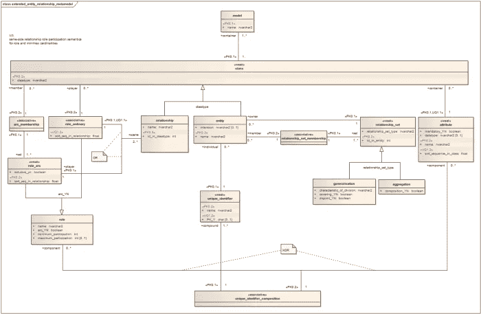

# 2023 年如何自学数据科学

> 原文：<https://medium.com/coinmonks/how-to-teach-yourself-data-science-in-2023-fb7f39ff0037?source=collection_archive---------13----------------------->

## 第 1 部分— SQL、Python、R 和数据可视化

这当然不是信息的缺乏使研究变得困难。恰恰相反，学习数据科学的资源泛滥使得很难从一般的资源中筛选出最好的资源。

So many choices, so little time… Photo by [Fahrul Azmi](https://unsplash.com/@fahrulazmi?utm_source=medium&utm_medium=referral) on [Unsplash](https://unsplash.com/?utm_source=medium&utm_medium=referral)

但首先，让我们了解一下…

> 从顶级交易者那里复制交易机器人。免费试用。

# 什么是数据科学？

啊，这是一个很难回答的问题，让招聘经理和面试者都感到困惑。事实是，不同的公司对数据科学有不同的定义，这使得该术语模糊不清，有些难以理解。有人说是编程，有人认为是数学，还有人说是理解数据。事实证明，他们都有些正确。对我来说，我最认同的定义是这样的—

> *数据科学是一个跨学科领域，它使用来自数学、计算机科学和领域知识的技术和理论。[1]*

Data Science as the Intersection of Multiple Disciplines. Illustration by author.

对我来说，这就是数据科学在图像中的样子。我举例说明了每个知识部分之间的界限是模糊的，以证明我的观点，即来自这些领域的知识融合在一起，形成了所谓的“数据科学”。

# 好吧，那我怎么学数据科学？

在这一系列的博客文章中，我想强调一下我在这个过程中参加的一些课程，以及它们的优缺点。通过这些，我希望能帮助那些和我一样的人规划他们在数据科学方面的自学之旅。这些员额是:

*   第 1 部分—用 SQL、Python 和 R(你来了！)
*   第 2 部分—数学、概率和统计
*   第 3 部分—计算机科学基础
*   第 4 部分—机器学习

在这篇文章中，我将重点介绍我是如何了解数据科学家所需的**数据处理**知识的。为了处理数据，通常需要学习

1.  使用 SQL(标准查询语言)从数据库中提取数据，以及
2.  清理、操作、分析数据(通常使用 Python 和/或 R)
3.  有效地可视化数据。

# 1.使用 SQL 进行数据提取

SQL 是与数据所在的数据库进行通信的语言。如果说数据是埋藏在地下的宝藏，那么 SQL 就是挖掘宝藏原始形态的铲子。更具体地说，它允许我们从数据库中的一个或几个表的组合中提取信息。

Mastering SQL need not be hard. Photo by [Caspar Camille Rubin](https://unsplash.com/@casparrubin?utm_source=medium&utm_medium=referral) on [Unsplash](https://unsplash.com/?utm_source=medium&utm_medium=referral)

SQL 有许多不同的“风格”，如 SQL Server、PostgreSQL、Oracle、MySQL 和 SQLite。其中每一个都略有不同，但是语法基本上是相似的，您不必担心您正在学习哪种风格的 SQL。

学习一门语言，首先要学习单词，然后再把它们组合成句子和段落。这同样适用于 SQL。

为了学习非常基本的概念(SQL 的单词或句子)，我使用了[data camp(SQL 简介)](http://datacamp.pxf.io/YgBARm)和 Dataquest ( [SQL 基础知识](https://www.dataquest.io/path/sql-skills?rfsn=5568975.14b887))。(稍后我会详细介绍 Datacamp 和 Dataquest 的优缺点。)总的来说，这些网站通过有启发性的练习和例子来介绍基本的 SQL 技能。涵盖的一些概念包括:

*   选择过滤和选择的位置
*   计数、总和、最大值、分组依据、聚集数据的 HAVING
*   DISTINCT、COUNT DISTINCT 用于生成有用的不同列表和不同聚合
*   外部(如左)和内部连接何时/何地使用
*   字符串和时间转换
*   团结和团结所有人。

(你可能不知道这些知道，但那完全没问题！这只是你可以期望学到的东西的列表。)

然而，能够完成这些练习并没有为我成为分析师做好充分的准备。我能够理解单词和句子，但我离写出一整段文字还差得很远。特别是，一些突出的中级和高级概念，如子查询和窗口函数，要么不存在，要么没有广泛涉及，尽管它们已经在几次技术访谈中进行了测试，并且对我目前作为分析师的角色是必不可少的。这些技能包括

*   用联合处理空值
*   子查询及其对查询效率的影响
*   临时表
*   自连接
*   窗口功能，如分区、超前、滞后
*   用户定义的函数
*   在查询中使用索引来提高操作速度。

为了学习这些技巧，我主要集中在使用 SQLZoo.net 的[、](http://sqlzoo.net/)，这是免费的，为每个概念提供了非常具有挑战性的练习。我最喜欢的 SQLZoo 的特点是，它有测试一个综合问题中不同概念的练习。例如，一个人被提供了下面的实体关系图，并被要求基于它创建复杂的查询。

Example of a Entity Relationship Diagram. Photo by [Ottomachin](https://commons.wikimedia.org/wiki/User:Ottomachin) under the Creative Commons License

这与我们作为一名分析师在工作中遇到的情况非常接近——我们使用不同的技术，这些技术是我们从同一个数据库中提取信息时学会的。以下是 SQLZoo 问题'[帮助台](https://sqlzoo.net/wiki/Help_Desk)'的实体关系图。鉴于此，要求您*显示 2017 年 8 月 12 日这一天的经理和每小时收到的电话数量。(自己试试* [*这里*](https://sqlzoo.net/wiki/Helpdesk_Hard_Questions) *！)*

我使用的其他资源包括[扎卡里·托马斯的 SQL 问题](https://quip.com/2gwZArKuWk7W)和 [Leetcode](https://leetcode.com/problemset/database/) 。

# 2.用 R 和 Python 进行数据操作

要开始学习数据科学所需的编程和工具，你不能离开 R 和/或 Python。它们是非常流行的编程语言，用于数据操作、可视化和争论。关于 [R vs Python](https://www.guru99.com/r-vs-python.html) 的问题是一个古老的问题，值得另发一篇帖子。我的看法？

> 无论你选择 R 还是 python 都没关系——一旦你掌握了其中一个，你就可以轻松地学会另一个。

我用 python 和 R 编写代码的旅程是从 CodeAcademy、Datacamp、Dataquest、SoloLearn 和 Udemy 这样的随身代码网站开始的。这些网站为您提供按语言或软件包组织的自定进度课程。每一个都将概念分解成可理解的部分，并给用户提供开始代码来填补空白。这些网站通常会带你做一个简单的演示，然后你会有机会通过练习来实践这个概念。有些会在之后提供基于项目的练习。

今天，我将重点介绍我最喜欢的两个产品，Datacamp 和 Dataquest。

请记住，在下面你会找到课程的附属链接。这对你来说没什么，因为价格是一样的，但是如果你决定购买，我会得到一点佣金。

# 数据营

DataCamp 提供由该领域专业人士讲授的视频讲座和填空练习。视频讲座大多简洁高效。

Image by author

我喜欢 DataCamp 的一个部分是组织成 SQL、R 和 python 职业道路的最新课程。**这消除了规划课程的痛苦，现在您只需遵循自己感兴趣的道路。** [一些路径](https://www.datacamp.com/tracks/career?tap_a=5644-dce66f&tap_s=1264035-087d1d&utm_medium=affiliate&utm_source=travistang)包括:

*   Python/R 中的数据科学
*   Python/R/SQL 中的数据分析师
*   R 中的统计学家
*   Python/R 中的机器学习科学家
*   Python/R 程序员

就我个人而言，我是从 R 中的[数据科学开始我的 R 教育的，它对 R 中的 tidyverse 提供了相当详细的介绍，这是一个非常有用的数据包集合，用于组织、操作和可视化数据，其中最著名的包括 ggplot2(用于数据可视化)、dplyr(用于数据操作)和 stringr(用于字符串操作)。](http://datacamp.pxf.io/QO49jM)

My favorite packages in R. Image by author.

然而，我确实对 DataCamp 有所抱怨——那就是在完成 DataCamp 后，信息的保留性很差。使用填空格式，很容易在没有真正理解概念的情况下猜出空白处需要什么。我在平台上做学生的时候，就努力在最短的时间内完成尽可能多的课程。我浏览了一下代码，在没有理解大局的情况下填补了空白。如果我可以在 DataCamp 上重新开始学习，我会花时间更好地消化和理解整个代码，而不仅仅是要求我填写的部分。

# DataQuest

Image by author

Dataquest 和 DataCamp 很像。它侧重于使用代码练习来阐明编程概念。像 Datacamp 一样，它提供了各种各样的 R、Python 和 SQL 课程，尽管它没有 DataCamp 那么广泛。例如，与 Datacamp 不同，Dataquest 不提供视频讲座。

Dataquest 提供的部分曲目包括:

*   R/Python 中的数据分析师
*   Python 中的数据科学
*   数据工程

DataQuest 的内容一般比 DataCamp 的难度大。也有更少的“填空”形式的练习。虽然花了更长时间，但我在 DataQuest 上的知识记忆更好了。

DataQuest 的另一大特色是每月与导师通话，导师会审阅你的简历并提供技术指导。虽然我没有亲自联系导师，但事后看来，我会联系的，因为那肯定会帮助我进步得更快。

# 3.数据可视化

数据可视化是展示从数据中获得的洞察力的关键。在学习了使用 python 和 R 创建图表的技术技巧之后，我从 Cole Knaflic 所著的《用数据讲故事》一书中学习了数据可视化的原理。

Sending a message with numbers. Photo by [Alexander Sinn](https://unsplash.com/@swimstaralex?utm_source=medium&utm_medium=referral) on [Unsplash](https://unsplash.com/?utm_source=medium&utm_medium=referral)

这本书是平台不可知论。换句话说，它并不关注任何特定的软件，而是通过启发性的例子来教授数据可视化的一般原理。你可以从这本书中学到的一些关键点是:

*   理解上下文
*   选择有效的视觉效果
*   消除杂乱
*   在你想要的地方吸引注意力
*   像设计师一样思考
*   讲故事

> 在我读到这本书之前，我一直以为我了解数据可视化。

在消化了这本书之后，我能够创建一个(有点)视觉上令人愉悦的图表，描述警察对黑人的暴行。这本书的一个主要学习点是*在你想要的地方吸引注意力。*这是通过用明亮的黄色突出非裔美国人的线条来实现的——让人想起 BLM 的颜色——同时确保图表的其余部分保持在白色和灰色等较暗的背景中。

Data visualization techniques applied to a chart that highlights police brutality. Image by author.

# 后续步骤

在这篇文章中，我讲述了我从零开始学习编程的步骤。通过这些课程，您现在已经掌握了操作数据的必要技能！然而，还有很长的路要走。在接下来的帖子中，我将介绍

*   第 2 部分—数学、概率和统计
*   第 3 部分—计算机科学基础
*   第 4 部分—机器学习
*   第 5 部分—构建您的第一个机器学习项目

如果你有任何问题，请随时与我联系。一切顺利，祝你好运！

# 参考

[1] Dhar，V. (2013)。[《数据科学与预测》](http://cacm.acm.org/magazines/2013/12/169933-data-science-and-prediction/fulltext)。*ACM 的通讯*。**56**(12):64–73。[doi](https://en.wikipedia.org/wiki/Doi_(identifier)):[10.1145/2500499](https://doi.org/10.1145%2F2500499)。[S2CID](https://en.wikipedia.org/wiki/S2CID_(identifier))6107147。[于 2014 年 11 月 9 日从原件存档](https://web.archive.org/web/20141109113411/http://cacm.acm.org/magazines/2013/12/169933-data-science-and-prediction/fulltext)。检索于 2015 年 9 月 2 日。

> 加入 Coinmonks [电报频道](https://t.me/coincodecap)和 [Youtube 频道](https://www.youtube.com/c/coinmonks/videos)了解加密交易和投资

# 另外，阅读

*   [如何在 FTX 交易所交易期货](https://coincodecap.com/ftx-futures-trading) | [OKEx vs 币安](https://coincodecap.com/okex-vs-binance)
*   [CoinLoan 评论](https://coincodecap.com/coinloan-review) | [YouHodler 评论](/coinmonks/youhodler-4-easy-ways-to-make-money-98969b9689f2) | [BlockFi 评论](https://coincodecap.com/blockfi-review)
*   [XT.COM 评论](https://coincodecap.com/profittradingapp-for-binance) | [币安评论](https://coincodecap.com/xt-com-review)
*   [SmithBot 评论](https://coincodecap.com/smithbot-review) | [4 款最佳免费开源交易机器人](https://coincodecap.com/free-open-source-trading-bots)