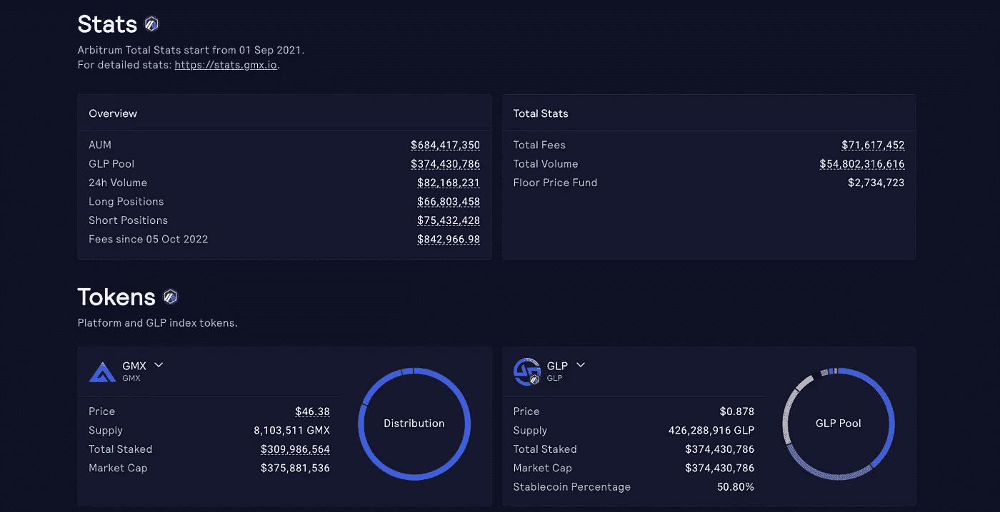

# 如何在不确定的市场中交易 1k 美元

> 原文：<https://medium.com/coinmonks/how-to-trade-1k-in-uncertain-market-2a9a1a18eb9c?source=collection_archive---------23----------------------->

BTC 可以阻止每日下跌的楔形和泵，或倾倒。大多数分析师和有影响力的人从几天前就开始预测，调整楔形，然后争论。那又怎样？

> 而投资的时候，有两个相关的要素:一是你想投资多少，二是带着什么目的。我有一千美元，我想积累 BTC。

我们多次听说，在 3 年的时间框架内，如果你以 19k 美元或 20k 美元购买比特币，将不会有什么不同。但是今天我想尽我所能把它付得低一些。它转储更多又如何？这就像一个伊索寓言中的兔子和乌龟的故事，风险是什么都不做。

所以，这是我在这个不确定的市场中的策略。

我要买美元 GLP，今天是 0.878 美元。$GLP，你可以在这里阅读**，是一项资产，50%来自稳定，50%来自主要加密，包括 BTC 和瑞士联邦理工学院，它们有望达到相同的水平。今天，用 1000 美元，我可以买 1.138，95 GLP。GLP 在 ETH current 支付的 APR 为 18.51%，每周根据 [**gmx.io**](https://app.gmx.io/#/earn) 收取的费用进行更新。**

****

**如果我今天以 19.500 美元的价格购买 1，000 美元的 BTC，我会购买 0，051282BTC。**

**如果 BTC 抛售，其他资产也相应抛售，由于 GLP 成分，我的敞口将减少 50%:因此，当我认为底部在那里，或者我对 BTC 价格没问题时，我可以交换我在 BTC 的 GLP，即使 GLP 价值较低，我也会买得比今天多:与此同时，我会赚 EHT。**

**如果 BTC 加仓，另一项资产也相应加仓，我将获得 50%的增长，无论收入多少，在我确信我们已经走出熊市的时候，进行交换:我的 BTC 将比预期的少，但无论如何都是有收入的。**

**而且，它最终可以获得仲裁空投的资格(见 [**此处**](https://twitter.com/Crypto_nite75/status/1577276137038057473) )。**

**这绝对不是一个中性的策略，但我要说这是一个保守的策略。有人说，至少需要两周才能看到相关的 BTC 运动:15 天的赌注一点也没有浪费。**

> **交易新手？尝试[加密交易机器人](/coinmonks/crypto-trading-bot-c2ffce8acb2a)或[复制交易](/coinmonks/top-10-crypto-copy-trading-platforms-for-beginners-d0c37c7d698c)**