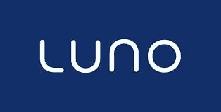

# 如何在尼日利亚的 Luno 上交易比特币

> 原文：<https://medium.com/coinmonks/how-to-trade-bitcoin-on-luno-in-nigeria-f61688c9ed4b?source=collection_archive---------11----------------------->

Luno 允许用户购买和出售加密货币，并将其存储在在线钱包中。该平台可从尼日利亚访问，并支持 Naira。与此同时，除了比特币，这个平台上还有其他加密货币。它们包括:瑞波(XRP)、莱特币(LTC)、比特币现金(BCH)和美元币(USDC)。

由于其简单的用户界面和钱包功能，Luno 很快在尼日利亚的交易者中流行起来。要开始在 Luno 上交易，您首先需要创建一个帐户。帐户创建后，您可以使用各种方法将资金存入您的帐户，包括银行转账。像 Luno 这样的平台有一个内置的 naira 钱包，你可以很容易地投资，然后购买你的加密货币，这与其他平台不同。在 Luno 上交易之前，您必须满足某些资格要求，其中包括:

*   要使用 Luno，您必须年满 18 岁并拥有有效的银行账户。
*   您必须拥有一个有效的政府颁发的身份，与您用来开设您的 Luno 帐户的名称相符。
*   在 Luno 上交易之前，您必须验证您的帐户。对于基本帐户，您需要有效的电话号码。随着您进入不同的帐户级别，将需要额外的文档来确认您的身份。

只需三个简单的步骤，你就可以轻松地在 Luno 上开始交易。去买比特币；

*   [在 Luno 上注册](https://www.luno.com):在 App store 或 Playstore 上下载 Luno，按照注册流程创建账户。
*   存款:用你喜欢的支付方式存入奈拉。这可能是银行转账或卡存款。
*   购买你的比特币:存款后，你可以继续购买你的比特币或 Luno 上列出的任何其他加密货币。

> 交易新手？试试[密码交易机器人](/coinmonks/crypto-trading-bot-c2ffce8acb2a)或者[复制交易](/coinmonks/top-10-crypto-copy-trading-platforms-for-beginners-d0c37c7d698c)

要在 Luno 上卖比特币，按照以下步骤操作；

*   进入你的比特币钱包，点击“出售”图标。
*   输入您想要出售的比特币数量。输入您的 pin 码并继续交易。你在奈拉的资金将被存入你的奈拉钱包。
*   去你的 naira 钱包，开始提取资金到你的银行账户。Luno 确实收取取款费。

然而，交易员警告称，Luno 上的利率通常较低，这意味着如果你在 Luno 上出售比特币，你可能不会获得最佳价格。还有其他平台提供比 Luno 更好的价格。Dart 非洲就是一个例子。该平台仅用于销售加密货币。他们的利率是行业内最好的，他们的支付时间非常快。总的来说，Dart Africa 是最著名的交易所之一，他们的服务不容忽视。

## 你如何在 Dart Africa 上销售你的加密货币？

*   访问 [dartafrica.io](http://dartafrica.io) 或[下载手机应用](https://play.google.com/store/apps/details?id=com.dartafrica&gl=US)。填写所需的详细信息并创建一个帐户。
*   输入您的银行详细信息并设置交易 pin。
*   选择您要出售的加密货币。Dart Africa 支持 7 种加密货币；比特币、、、戴、以太坊、和莱特币。系统将为您生成一个钱包。
*   将您的密码存入此钱包，确认后，您的资金将到达您的 naira 钱包。你可以开始向你的银行账户提款。提现在平台上是即时的。

总的来说，Luno 对于想要在尼日利亚使用加密货币的交易者来说是一个很好的平台。它易于使用，功能强大，而且可靠——这使得它成为任何希望在尼日利亚交易比特币和其他加密货币的人的完美选择。