# 如何用 AI 在自动驾驶仪上交易加密货币！

> 原文：<https://medium.com/coinmonks/how-to-trade-cryptocurrencies-on-autopilot-with-ai-46ae380f126c?source=collection_archive---------5----------------------->

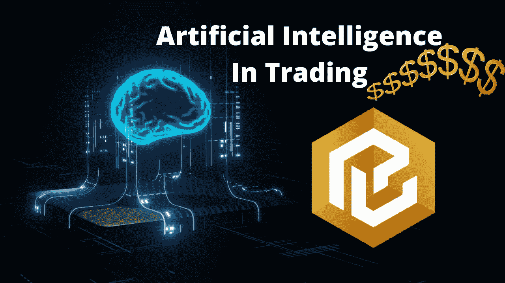

I 是自动化的未来，更少的努力转化为更大的回报。在令人兴奋的金融和加密货币领域，人工智能交易机器人已经成为一种可行的解决方案，可以在预设的交易参数内自动化低买高卖的过程。在过去利用多个交易机器人，如 [Pionex](https://www.pionex.com/en-US/sign/ref/mWhH4v29) 、 [Kucoin](https://www.kucoin.com/r/af/rJH29LZ) & [Huobi](https://www.huobi.com/en-us/topic/double-invite/register/?invite_code=5t5jb) 进行盈利交易后，我只想说镇上还有另一个强大的玩家，我想进一步探索他。

# 引入一键大写

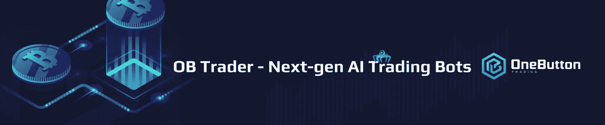

O **自 2020 年起直播**，One Button Capital 是一个由人工智能驱动的交易机器人的集合，它们全天候交易以有效管理您的加密货币投资组合，**每月跑赢市场 4%**。事实上，配备了**止损**功能，人工智能可以在市场下跌时保护你的投资组合。

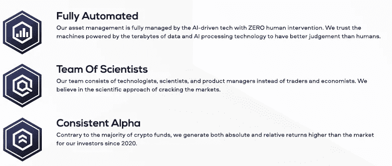

# 人工智能背后的技术

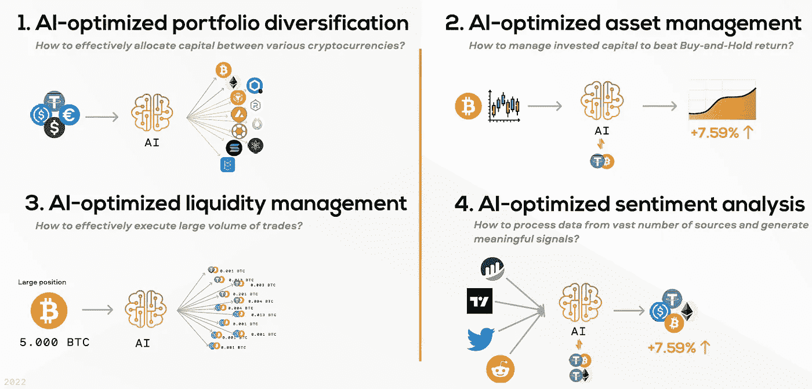

T 何艾模型使用**递归神经网络和强化学习，在交易加密货币的同时实现收益最大化**。这些模型建立在类似于亚马逊、谷歌&脸书等主要科技公司用于数据处理和分析的架构之上。

> 这个模型是你的电脑代理，它的使命是代表你在指定的市场上进行交易以获取利润。

One Button Capital 中使用的神经网络不是基于规则的算法/套利策略/趋势跟踪策略，而是一种使用历史市场数据训练的模型，它使用新的市场数据作为输入，可以像人脑一样全天候自动做出自己的决策。

OB 交易机器人在 1 小时和 4 小时图上进行市场扫描。**基于最新的数据和检测到的价格模式，机器人决定这是买入、卖出还是持有信号。**考虑到风险大小和市场的预期变化等因素，机器人然后计算从 0 到 100 的*信心阈值*，这将用于决定购买/出售的资产数量。

要进一步了解 One Button Capital 背后的技术，请点击[此处](/onebuttoncapital/ai-portfolio-management-technology-3f362a35ceca)。

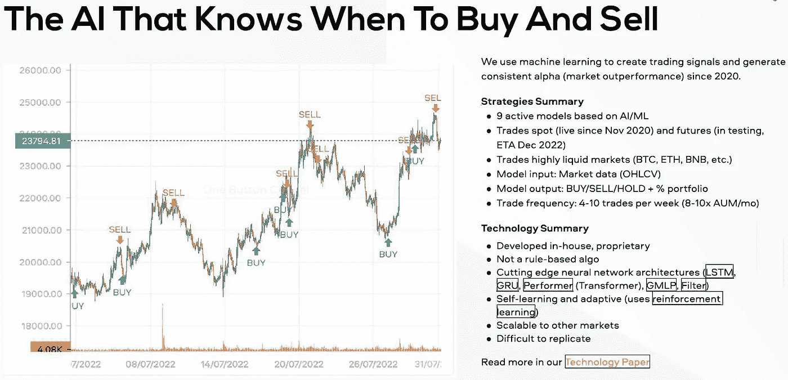

# 战略

这里有各种不同的策略可供选择，每一种都适合不同的市场条件和投资偏好。总的来说，Performer v2 似乎是最健康的机器人，而 Solar 是最保守和最安全的人工智能。

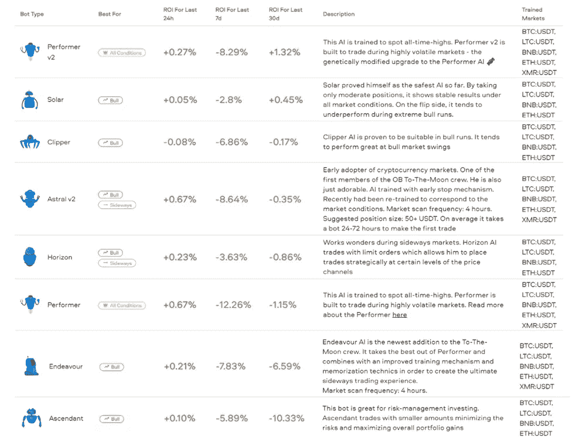

Various strategies available

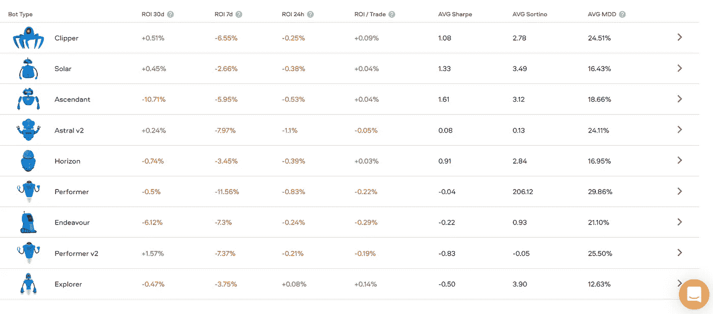

While also affected by adverse market swings, the bots do a good job to buffer the market losses.

# 历史业绩

平均而言，人工智能机器人每月比市场高出 4%。如下图所示，在从 2021 年 11 月到现在的加密冬季月份中，人工智能可以追溯性地使投资者免受 ETH 和 BTC 分别损失-61% & -68%！

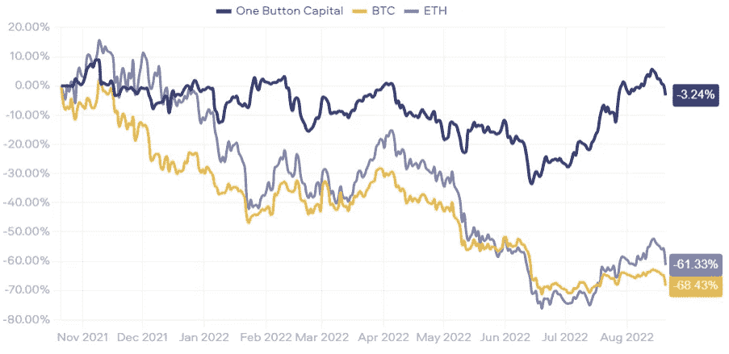

Performance of the AI bot vs simply holding BTC & ETH.

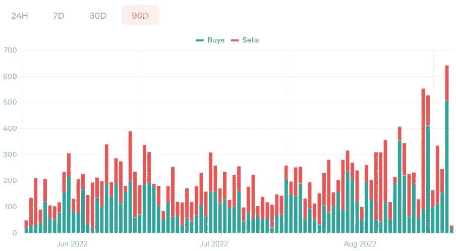

The number of trades executed by the AI per day for the past 3 months.

# 支持的交换

B **币安** [**。美国**](http://binance.us/) **、北海巨妖、比特币基地 Pro、比特瓦沃、比特熊猫 Pro** 。更多的交流正在进行中。

# 机器人如何交易？

他的机器人通过 API 密匙访问你的加密货币交易所(如币安),没有取款权限。因此，请放心，您不必将您的资金委托给另一个第三方平台。

# 定价

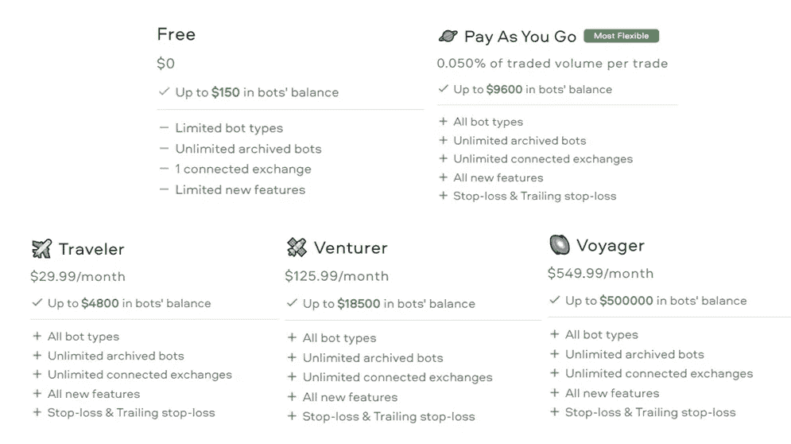

ne Button Capital 可免费用于 150 美元以下的投资组合。除此之外，根据不同的交易需求，还有各种方案可供选择。灵活的“现收现付计划”利用 OB 代币(OBT)形式的预付费信用，根据持有的代币数量提供分级交易量折扣。

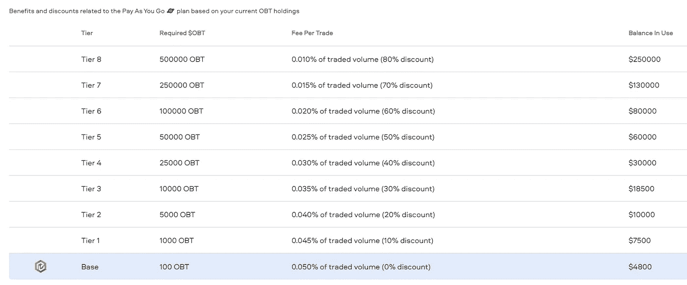

# 赞成的意见

*   **简化了**加密货币投资组合管理— **一键**简直就是全部！
*   **在缓慢波动的市场中表现良好**
*   市场崩溃时可用的**止损**
*   **透明的**统计数据——关于机器人及其性能的公开数据

# 骗局

*   关于市场对和 bot 类型的交易数据不足；因此，很难确定哪种 bot 在哪种市场条件下最有效。
*   只能每隔 1/4 小时交易一次。

# 最后的想法

事实上，One Button Capital 是一种创新的交易人工智能，让人们只需点击一个按钮，就可以在自己喜欢的交易所轻松创建交易机器人。**点击** [**此处**](https://app.onebutton.capital/sign-up?ref=X%2Bak1CB1aLL2Cg1g&s=MTAtMTA%3D) **报名&享受交易手续费 10%返现**使用一键资金！

你对此有什么想法？欢迎在下面发表评论，并继续关注关于导航[一键资本](https://app.onebutton.capital/sign-up?ref=X%2Bak1CB1aLL2Cg1g&s=MTAtMTA%3D)生态系统的进一步更新和教程！

[延伸阅读](https://uploads-ssl.webflow.com/60f734e368db4c73e10daef1/62f37f0a64eac207ed045502_OBC%20Fund%20Deck%20Aug%202022.pdf)

*🎁*[*honey gain*](https://r.honeygain.me/CYBER577DD)*一款被动收入 app，从你未使用的互联网带宽中赚钱。* [*免费获得 5 美元*](https://r.honeygain.me/CYBER577DD) *，无需投资。*

*🎁* [*蛋糕 Defi*](https://cakedefi.com/?ref=677920) *一站式投资平台，以高达 100%的年利率烘焙被动现金流！* [*在 DFI 用 50 美元存款获得 50 美元奖金*](https://cakedefi.com/?ref=677920) *。*

*🎁*[*Nexo*](https://nexo.io/ref/hce5cfdt5o?src=web-link)*一家先进、受监管的数字资产机构，提供即时加密贷款，资产年利率高达 36%，是一家交易所，在 200 多个司法管辖区提供 40 多种法定货币的服务。* [*用 100 美元存款获得 25 美元*](https://nexo.io/ref/hce5cfdt5o?src=web-link) 奖金*。*

*🎁* [*币安*](https://www.binance.info/en/activity/referral-entry/CPA?fromActivityPage=true&ref=CPA_00BFAOLI96) *全球最大的加密货币交易所，无需介绍！*

*🎁* [*Kucoin*](https://www.kucoin.com/r/af/rJH29LZ) *一个庞大的加密货币交易所，提供有趣的产品，如赌注、自由交易机器人和比特币云挖掘服务。*

*🎁* [*火币*](https://www.huobi.com/en-us/topic/double-invite/register/?invite_code=5t5jb) *一个提供多样化产品、免费空投和交易机器人的加密货币交易所。*

*🎁*[*MEXC*](https://www.mexc.com/en-US/register?inviteCode=mexc-1NAJC)*一家持有 MX 令牌的加密货币交易所，有着有趣的列表和频繁的空投。*

*🎁*[*Crypto.com*](https://read.cash/@TraderFX/10-tips-to-maximize-earnings-on-honeygain-an-effortless-free-passive-income-app-68535728#bad-link)*一家位于新加坡的加密货币交易所。* [*获得 25 美元*](https://crypto.com/app/fcbsjmf5pb) *在 CRO 赌一张红宝石卡。*

*🎁*[*Pionex*](https://www.pionex.com/en-US/sign/ref/mWhH4v29)*一个免费的多功能套利交易机器人，自动化低买高卖的过程，全天候。*

*🎁* [*一键资本*](https://app.onebutton.capital/sign-up?ref=X%2Bak1CB1aLL2Cg1g&s=MjAtMA%3D%3D) *一个由神经网络驱动的 AI 机器人，它在自动驾驶仪上管理你的加密货币投资组合。*

***针对马来西亚投资者***

*🎁*[*Luno*](https://www.luno.com/invite/EDXG2X)*在 BTC 用 100 令吉购买 BTC 获得 25 令吉奖金！*

*🎁* [*斯塔沙威*](https://www.stashaway.my/referrals/kenleel9jx) *获得 6 个月免费投资！*

*🎁Wahed code 'KENLIE1' RM10 注册奖金*

*🎁Capbay P2P 代码' 8879c6' RM100 注册奖金*

*🎁* [*亦然*](https://download.versa.com.my/1bAf/referral?deep_link_value=QF218MMB) *用 100 令吉存款获得 10 令吉奖金！*

*🎁***存款 250 令吉获得 10 令吉奖金！**

****接我*** [***中***](https://cybery.medium.com/)***|***[***read . cash***](https://read.cash/r/TraderFX)***|***[***Youtube***](https://www.youtube.com/c/SmartInvestingChannel)***|****

> ***交易新手？尝试[加密交易机器人](/coinmonks/crypto-trading-bot-c2ffce8acb2a)或[复制交易](/coinmonks/top-10-crypto-copy-trading-platforms-for-beginners-d0c37c7d698c)***