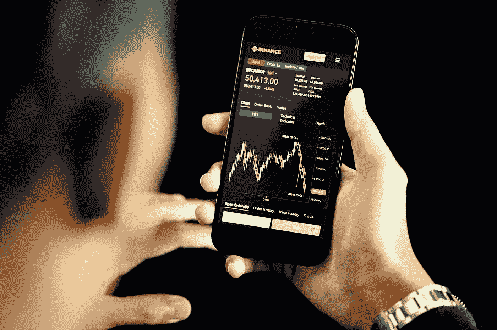
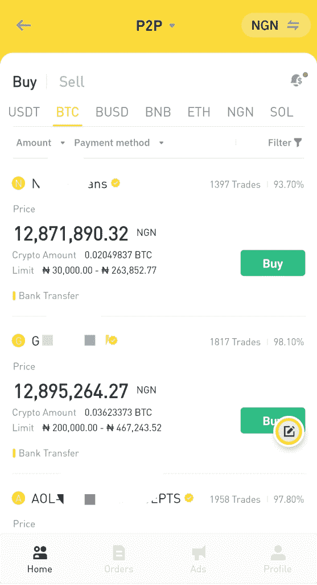
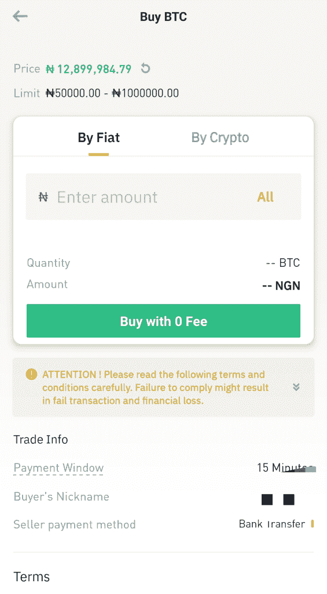

# 如何使用 P2P 交易所进行加密货币交易——Mellon post

> 原文：<https://medium.com/coinmonks/how-to-trade-cryptocurrency-using-p2p-exchange-mellonpost-9a477b742467?source=collection_archive---------30----------------------->

正如我们所知，加密货币是一种数字货币，现在它也享受 P2P 商业交易模式。

虽然它还没有得到许多政府的支持和接受，但事实上许多政府已经禁止了它，因为他们认为这是对传统烘焙和菲亚特系统的威胁。

而在现实中，它实际上是商业世界的一个很好的补充，因为它在很短的时间内创造了比当今世界任何其他部门都多的百万富翁。

加密货币交易像股票市场中的其他交易形式一样，对于许多加密爱好者来说是一个非常有利可图的商机。

然而，由于一些国家和政府已经禁止它，这使得居住在这些国家和地区的人们很难从事这些资产的交易。这就是 p2p 的想法开始发挥作用的时候。

点对点(P2P)只是一个交易系统，在这种情况下是加密资产，人们通过它在自己(两个人)之间进行交易，除了提供服务的平台之外，没有第三方的参与。

所以，在 P2P 中，你只是字面上把你的钱转给别人，然后他们转而转账加密(BTC，USDT，SHIB 联邦理工学院等)。)还给你。

注意:在大多数平台上，硬币汇款通常是在硬币发送之前完成的。这是因为，在任何欺诈或误解的情况下，都可以很容易地追踪到这笔钱，但加密将是困难的。

通常这种交易是在没有政府或任何金融银行系统可以追踪的交易痕迹的情况下完成的。

换句话说，没有具体的记录显示这笔款项用于加密交易。

这个系统已经变得非常流行和重要，因为政府倾向于追踪任何从事加密交易的人，冻结他们的银行账户，甚至逮捕个人，例如在尼日利亚和中国。

# P2P 是什么？

P2P 系统是一种交易系统，它只涉及两方，并且只有他们知道交易。为此，只有当双方同意所述条款和条件，即要传输的密码量和传输速率时，交易才会发生。

然而，要开始用 crypto 进行 P2P 交易，你首先需要有一个支持用这种方法进行交易的平台。

一些支持该系统的流行平台包括币安和 Paxful。所以，如果你还没有账户，你需要访问币安或 Paxful 来免费注册。

# 如何在币安 P2P 上交易密码

在币安上注册后，我会鼓励你在交易前确保你的账户被验证。

*使用手机应用程序比桌面应用程序更容易、更快捷(请选择您最喜欢的应用程序，但我更喜欢该应用程序)

登录应用程序后，点击您的个人资料图像，然后点击身份验证和申请验证，有不同的级别，但您现在只需要获得第一级(第 1 级)。

下一步你应该做的是添加一个支付方式，在这种情况下，一个银行账号或一个支付处理器平台，当你在 P2P exchange 上将你的硬币转移给某人时，你希望在那里接收你的付款。

注意:这并不自动意味着您的帐户用于加密交易，因为它只会对您的交易对象可见，以便他们能够在币安或 Paxful 加密交易所之外将资金转移到您的帐户。

# 如何在币安 P2P 上购买密码

如果币安允许你们国家的商人用信用卡购买密码，那么你也可以用它来交易，否则你就需要使用 P2P 方法。

要使用 P2P 交易，请转到主屏幕

点击 p2p 交易，然后在顶部菜单点击 P2P

这会把你带到 P2P 版块，当你在 P2P 版块的时候；

点击货币符号，将其更改为您首选的国家货币，这样您就可以看到您所在国家的交易商可以用您的当地货币进行支付和收款。

所以，如果你想买。

点击购买菜单，如果你想出售，分别点击出售菜单。

点击首选菜单，即购买。现在你也可以选择你想交易的硬币，例如 BTC，USDT，瑞士联邦理工学院和许多其他的硬币

点击后，你会看到平台上其他卖家列出的所有可用的未结订单(交易)。

现在，您可以向下滚动，根据您打算购买的报价和数量选择您感兴趣的任何报价。

当对话框打开时，输入您想用当地货币购买的准确金额，即 1000 奈拉、人民币等。

点击“零手续费购买”进入新页面，你将看到卖家银行账户的详细信息，你将向其付款。

*注意:强烈建议在支付过程中，即在叙述中，不要包含与加密/比特币相关的术语或词语，例如当被问及这笔钱的用途时。如果你必须写点什么，就写礼物。

在币安交易所外付款后，你会看到一个写着“我已付款”的按钮，点击它，然后等待。

一旦卖家收到他们银行账户里的钱，他们就会把密码发给你。

祝贺你，你已经使用币安的 P2P 加密交易所成功完成了一笔交易。

这一过程也适用于当你想出售你的硬币，只是现在是在相反的地方，由你将是一个在你当地的银行账户收到付款，然后释放密码给买家。

所以，如果你想出售，你所要做的就是点击顶部的出售菜单，选择你想卖的密码。

选择一个买家，他的出价是你喜欢的，需要的数量在你当时愿意出售的范围内。

点击报价，输入你要出售的硬币数量，选择付款方式(你要付款的银行账户)，然后继续。

一旦买家收到你的报价，他们将继续向你的银行账户付款，在你确认付款后，你现在可以继续向他们发放硬币。

# P2P 中的托管系统是什么

托管只是一个用来保护平台上的交易者的系统(这个系统也用于加密交易之外的各种情况)

# 托管系统如何工作

在托管系统中，一旦你拿出想要出售的硬币，并启动了出售过程，系统(即币安)将自动冻结你在出售过程中从钱包中承诺的硬币金额，以确保硬币将始终可供表示有兴趣从你这里购买的人使用。

这将确保你不能转售或重新上市的硬币两次，并出售给别人。

因此，硬币将保持冻结，直到最初的交易完成或适当取消，然后您才能再次获得硬币。

这是一种防止欺诈的机制，以确保买卖双方正确履行其交易义务。

换句话说，如果买方未能按要求将钱发送给卖方，并且卖方可以证明他们没有收到任何钱，那么硬币将不会发放给买方，而是会返回到卖方的钱包中。

如果卖方声称他们没有从买方收到任何付款，并且没有任何有形的证据来支持它，而买方有证据/证据来支持他们的资金转移，那么无论如何硬币都将被释放给买方。

*当然，出现问题时，需要立即在应用程序/平台上提出申诉，以便进行审查和解决。

*原载于 2022 年 11 月 12 日*[*【https://mellonpost.com】*](https://mellonpost.com/how-to-trade-cryptocurrency-using-p2p-exchange/)*。*

> 交易新手？尝试[加密交易机器人](/coinmonks/crypto-trading-bot-c2ffce8acb2a)或[复制交易](/coinmonks/top-10-crypto-copy-trading-platforms-for-beginners-d0c37c7d698c)