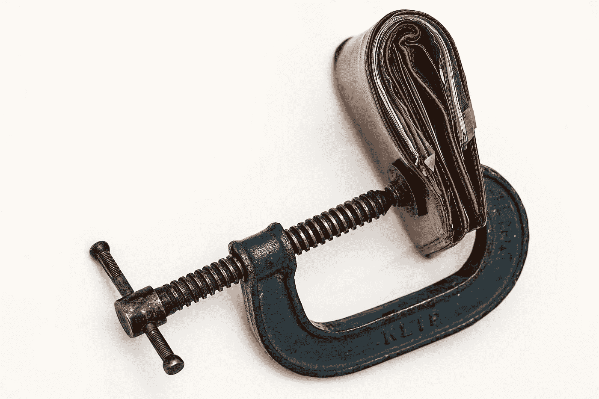

# 高通胀时期如何交易密码

> 原文：<https://medium.com/coinmonks/how-to-trade-cryptos-during-high-inflation-5ed022de01b6?source=collection_archive---------29----------------------->

Source photo [Pungă Bani Credit Squeeze — Fotografie gratuită pe Pixabay](https://pixabay.com/ro/photos/pung%c4%83-bani-credit-squeeze-portofel-522622/)

“通货膨胀”一词指的是一个经济体中价格的全面上涨。货币供应量的增加，商品和服务供应量的下降，或者两者都有可能是罪魁祸首。加密货币市场很容易受到通货膨胀的影响，就像任何其他金融市场一样。如果您想在通货膨胀期间交易加密货币，请考虑以下因素: