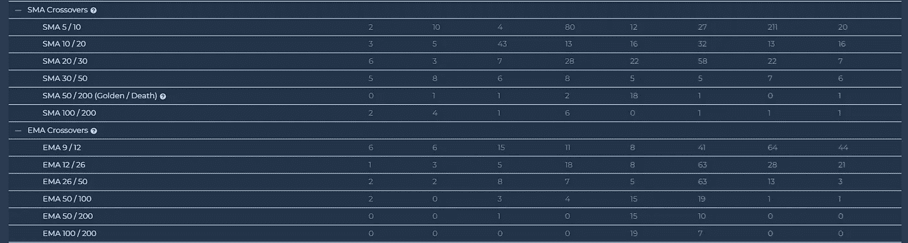

# 如何交易 EMA 12 / 50 交叉加密交易策略？

> 原文：<https://medium.com/coinmonks/how-to-trade-ema-12-50-crossover-crypto-trading-strategy-7f90a79f9dba?source=collection_archive---------21----------------------->

Source: [altfins.com](https://altfins.com/education/trading-videos)

*   **观看视频:如何交易均线 12 / 50 交叉加密交易策略**
    均线交叉是评估价格趋势的有力信号。
    当短期均线穿过长期均线时，均线交叉发生，无论是在上方(看涨，上升趋势)还是下方(看跌，下降趋势)。
    12/50 均线交叉是一种简单的趋势跟踪策略，使用移动平均线交叉。这个策略使用 12 天和 50 天指数移动平均线(EMA)。
    要快速轻松地找到加密货币的 EMA 或 SMA 交叉新闻，看涨或看跌(跨越 4 个时间间隔)，请查看我们的信号摘要页面。

# 如何交易 Ema 12 / 50 加密交易策略？

Source: [altfins.com](https://altfins.com/education/trading-videos)

# 均线交叉

指数移动平均线(MA)交叉是评估价格趋势的有力信号。

当短期均线穿过长期均线，或者在上方(看涨，上升趋势)或者在下方(看跌，下降趋势)时，均线交叉发生。altFINS 允许您比较 EMA。例如，你可以在 5 日均线穿过 10 日均线的地方找到硬币。你也可以指出 5 日均线高于或低于 10 日均线多少(%)。你也可以组合多个均线交叉(5/10，5/20，5/30，或者 5/10，10/20，20/30 等等。)来加强你屏幕的信号功率。

# 什么是均线 12/ 50 交叉交易策略？

## 均线 12 / 50 是一个简单的趋势跟踪策略，使用移动平均线交叉。

这个策略使用 12 天和 50 天指数移动平均线(EMA)。

**交易规则:**

1.  当均线 12 穿过均线 50，价格高于均线 12 时买入。
2.  当均线 12 低于均线 50 时卖出。

**您可以在 altFINS 中设置一个** [**自定义屏幕**](https://platform.altfins.com/screener) **来使用这些标准捕捉这些机会。**

下面是一个关于如何创建这个自定义屏幕的视频教程。

我们还建议为特定的均线或均线交叉设置警报。见[如何在这里。](https://altfins.com/knowledge-base/create-an-alert-2/?seq_no=2)

## 我们还建议为特定的均线或均线交叉设置警报。这里看[如何。](https://altfins.com/knowledge-base/create-an-alert-2/?seq_no=2)

下面是一个关于如何创建这个自定义屏幕的视频教程。

**均线交叉在任何时间段都有效(15 分钟，1 小时，4 小时，12 小时，1 天)。你可以用更低的时间框架来做更短的交易，用更高的时间框架来做更长的交易。较低的时间框架更容易受到噪声和错误信号的影响，因此不建议在 1h 以下使用。**

此外，理想情况下，只采取 LTF(较低的时间框架)的 HTF(较高的时间框架)方向的交易

另外，EMAs 的长期定位有助于避免拉锯交易(无论日线图上 14/50 均线是在 200 均线之上还是之下)。200 日均线是长期趋势的良好指标。

对于新手来说，你可以通过在上升趋势中买入(即“逢低买入”)或在长期下降趋势中卖出(即“回调卖出”)来增加胜算。

# 什么是指数移动平均线？

## **指数移动平均线(MA)有助于识别 1)价格趋势和 2)潜在的支撑位和阻力位。**

交易均线交叉是趋势交易的基本策略。

**当短期均线(如 12 天)穿过长期均线(如 50 天)时，均线交叉发生在上方(看涨，上升趋势)或下方(看跌，下降趋势)。**

你可以阅读简单移动平均线(SMA)和指数移动平均线(EMA)之间的[差异，但简而言之，EMA 更重视最近的价格，因此滞后于 SMAs。因此，均线对价格变化反应更快，比均线提供更早的趋势信号。](https://altfins.com/knowledge-base/sma-vs-ema/)

有很多均线交叉交易的可能性(EMA 12/26，EMA 26/50，SMA 5/10，SMA 10/30 等。).

# 你应该交易哪个均线或均线？

这取决于你想多早或多晚，以及你愿意接受多少错误信号。

**1。**使用短期移动平均线(5、10、12、20、26 个周期)将导致**及早发现趋势，利润潜力高，但有许多错误信号**(即胜率较低)。

**2。**使用长期移动平均线(30、50、100、200 周期)将导致**在趋势更加确定时检测到趋势，但可能会留下更少的上涨潜力**，因为你在趋势上跳跃的时间稍晚。然而，你应该得到更少的错误信号，因此胜率更高。

你可以通过结合均线交叉和其他指标来提高成功率(减少错误信号)，比如 [MACD](https://altfins.com/knowledge-base/macd-line-and-macd-signal-line/) (动量)[相对强弱指标](https://altfins.com/knowledge-base/trading-rsi-and-rsi-divergence/)、 [OBV](https://altfins.com/knowledge-base/obv/) 等等。

**altFINS 允许您比较 EMA。例如，你可以在 5 日均线穿过 10 日均线的地方找到硬币。你也可以组合多个均线交叉(5/10，5/20，5/30，或者 5/10，10/20，20/30 等等。)来加强你屏幕的信号功率。**

要快速轻松地找到 EMA 或 SMA 交叉的[加密货币新闻](https://altfins.com/how-to-find-cryptocurrency-news/)，看涨或看跌(跨越 4 个时间间隔)，请查看我们的[信号摘要](https://platform.altfins.com/summary)页面。altFINS 不断扫描超过 2700 枚 [altcoins](https://altfins.com/knowledge-base/how-to-trade-cryptocurrencies/) 以识别信号:

Source: [altfins.com](https://altfins.com/signals-summary)

我们还建议为特定的均线或均线交叉设置警报。见[如何在这里。](https://altfins.com/knowledge-base/create-an-alert-2/?seq_no=2)

> 交易新手？尝试[加密交易机器人](/coinmonks/crypto-trading-bot-c2ffce8acb2a)或[复制交易](/coinmonks/top-10-crypto-copy-trading-platforms-for-beginners-d0c37c7d698c)