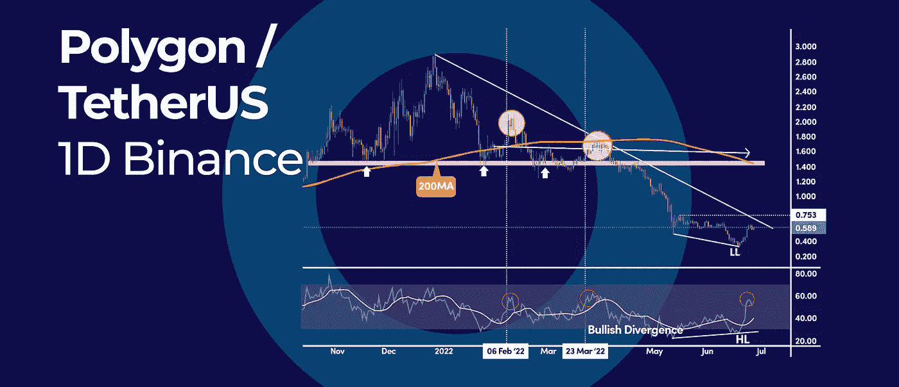

# 如何在一个加密熊市中交易？

> 原文：<https://medium.com/coinmonks/how-to-trade-in-a-crypto-bear-market-and-more-in-this-weeks-crypto-update-ea2cccae4926?source=collection_archive---------22----------------------->

*   多边形的 RSI 暗示看涨背离
*   为什么比特币能在 10000 美元大整数见底？
*   如何在加密熊市中交易？

## 多边形的 RSI 暗示看涨背离

[“Polygon(MATIC)](https://polygon.technology/)已经在日线图上打印出看涨背离信号，帮助加密货币升值 65%。 [RSI](https://www.cryptohopper.com/resources/technical-indicators/274-relative-strength-index-rsi) 看涨背离是一个经典信号，暗示着 MATIC 价格可能从看跌变为看涨。

在整个分析过程中，我们将检验当前的反弹是否有更多的上行空间，或者这只是一次短暂的反弹。

## RSI 看涨背离

当 MATIC 价格创出更低的低点，同时动量振荡指标创出更高的低点时，RSI 看涨背离形成。这通常被认为是买入信号。然而，整体价格结构看起来仍然看跌。从技术角度来看，有两件事对多头不利:

1.  价格仍远低于 200 天的简单移动平均线，这暗示着一个看跌的趋势。
2.  MATIC 的价格仍然低于从前一个历史高点绘制的下降趋势线。
3.  虽然 RSI 在前两次突破 50 中位水平，但它显示了相同的模式；随着看涨势头的消失，MATIC 的价格开始回落。

## 什么是 RSI 看涨背离？

看涨背离是一种技术形态，在这种形态中，资产价格创造了更低的低点，而动量振荡指标创造了更高的低点。

RSI 看涨背离通常在下跌趋势结束时形成。价格越是连续走低，背离越是看涨。

看涨背离被认为是一种强烈的反转模式，因为它表明抛售压力已经消失，多头开始控制市场。

## 200 天移动平均线

当 200 天简单移动平均线持平时，这通常是未来进一步盘整的迹象。可能的区间波动要考虑的一些关键水平是 0.75 美元的短期阻力位和 0.31 美元的前期低点。

## 展望未来

RSI 看涨背离暗示了 MATIC 价格趋势的可能变化。然而，看跌的价格结构仍主导着长期前景。

如果价格突破下降趋势线，并收复 200 天简单移动平均线，这将被视为一个强烈的看涨信号。

## 为什么比特币能在 10000 美元大整数见底？

比特币(BTC)于 2021 年 11 月创下 69，000 美元的历史新高，在更广泛的市场崩溃中一直处于自由落体状态，目前已下跌约 70%。因此，虽然比特币在短期内正在与 20，000 美元的巨大心理数字进行斗争，但真正的底部甚至可能在 10，000 美元左右。

## 比特币的 4 年减半周期

比特币的 4 年减半周期对长期价格预测有很大影响，并帮助投资者非常成功地绘制了价格走势图。4 年周期模型表明，比特币价格可能平均暴跌 85%左右，这将使我们接近 10，000 美元的整数。

然而，由于加密市场的波动性通常比开始时小，我们也可以假设比特币可能不会下跌得那么低，我们可能只会下跌 80%左右。在这种情况下，如果加密市场的波动性持续下降，14，000 美元的支撑可能会成为底部。

在之前的减半周期中，每一次周期性高点之后都是极端的抛售期:

*   从 2013 年的高点，BTC 价格暴跌了 86%
*   从 2017 年的高点，BTC 价格暴跌 84%

此外，每个减半周期低点都是在下一个减半事件之前 18 到 17 个月建立的。下一次减半事件定于 2024 年 3 月发生，这意味着如果我们从那个时期开始计算 17-18 个月，我们需要在今年 9-11 月左右达到下一个周期低点。

> 交易新手？试试[加密交易机器人](/coinmonks/crypto-trading-bot-c2ffce8acb2a)或者[复制交易](/coinmonks/top-10-crypto-copy-trading-platforms-for-beginners-d0c37c7d698c)

## RSI 振荡器

相比之下，在之前的半周期低点，月 RSI 振荡器接近 44 的读数，今天的 RSI 读数接近相同的动量读数。

虽然我们需要等待月蜡烛线收盘来获得最终的 RSI 读数，但接下来的两个月是至关重要的，因为在理想情况下，我们需要 BTC 价格快速向下移动，以重新测试 10，000 美元。接下来应该是一个快速的恢复，这样月度收盘在 20，000 美元左右，这将给我们一个完美的“V”形底部。

然而，一个更现实的方法是在恢复之前，在底部附近先有一个长的盘整期，这样就有了一个“U”形底部。这个“U”形底部发生在最近两次抛售之后。因此，它很可能再次发生。

## 如何在加密熊市中交易？

随着比特币的(BTC)价格跌破 20，000 美元的里程碑，大多数加密货币的价格比峰值低 85%，加密的冬天正在到来。全球最大的密码交易所币安首席执行官赵昌鹏认为，“[的密码寒冬至少还会持续两年多在这篇文章中，我们将讨论如何在秘密熊市中交易的一些方法。](https://fortune.com/2022/06/16/binance-boss-cz-talks-about-crypto-downturn-plans-spending-spree/)

无论他对当前加密熊市长度的看法是对是错，我们都将分享度过加密寒冬的三个技巧。

## 秘密熊市的历史

加密冬天对加密世界来说并不新鲜。自 2009 年问世以来，比特币经历了四次主要的加密熊市。第一次加密熊市发生在 2011 年 6 月至 11 月，当时比特币的价格从 32 美元跌至 2 美元。

从上面的图表可以看出，比特币的价格在 2011 年 11 月触底，在接下来的一年里反弹了近 3000%。第二次加密冬天发生在 2013 年 4 月，比特币的价格在短短几天内从 140 美元跌至 50 美元。第二次熊市过后，比特币的价格在随后的半年里暴涨了 1500%。

第三次熊市发生在 2013 年 12 月至 2015 年 1 月，当时比特币的价格从 1100 美元暴跌至 200 美元。第三次熊市之后，比特币的价格在随后的两年里飙升了 2000%。

第四次加密熊市发生在 2017 年 12 月至 2018 年 12 月期间，当时比特币的价格从 2 万美元暴跌至 3200 美元。

从上图可以看出，比特币的价格在 2018 年 12 月触底，在随后的两个月内反弹了 80%。至于目前的加密熊市，我们不能确定底部，但是，从目前的历史高点下跌 80%将使我们达到 14，000 美元左右。

正如你所看到的，每次主要的加密熊市后，比特币总是会反弹。

## 1 HODL

如果你是一个没有杠杆的投资者/交易者，度过加密冬天的最好方法是耐心地 [HODL](https://www.investopedia.com/terms/h/hodl.asp) 直到风暴过去。除此之外，你还可以用平均成本法来买入。如果历史可以提供某种指导，那么可以肯定地说，比特币总是会反弹的。

当加密价格回升并超过之前的峰值时，低价买入者将获得丰厚的利润。

在 [Cryptohopper](https://www.cryptohopper.com/) ，我们提供高级 [DCA](https://www.cryptohopper.com/features/dollar-cost-averaging) 设置，你可以添加到你的[自动交易机器人](https://www.cryptohopper.com/features/automatic-trading)中。这样就省去了计算何时使用平均成本的麻烦。

## 2 远离保证金交易

杠杆是一把双刃剑，尤其是在熊市，因为加密冬天的波动性。在糟糕的一天，加密价格下跌超过 20%的情况并不少见，这可能会在你接到追加保证金通知后轻易地抹去你的杠杆头寸。

## 3 对冲秘密风险

最后，聪明的投资者会采用对冲策略来减少你的加密投资组合的总体损失和波动性。最常见的对冲策略包括卖空，当资产价格下跌时获利。

## 结果

神秘的冬天并没有结束。它们是整个市场周期的一部分，因为没有哪种资产类别会永远下跌，同时也没有哪种资产会在没有调整的情况下上涨。因此，如果你打对了牌，你会在熊市中变得更强！

订阅我们的媒体每周博客和更新。
关注我们的推特|[脸书](https://www.facebook.com/cryptohopper)|[Reddit](https://www.reddit.com/r/CryptoHopper/)|[insta gram](https://www.instagram.com/cryptohopper/?hl=nl)

在 [Cryptohopper](https://www.cryptohopper.com/) 开始交易！