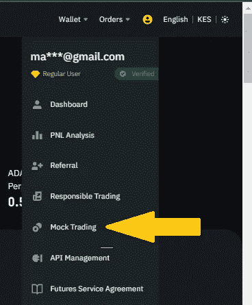

# 如何用策略交易像专业人士一样交易

> 原文：<https://medium.com/coinmonks/how-to-trade-like-a-pro-with-strategy-trading-74e1f469d805?source=collection_archive---------18----------------------->

*策略交易:你所有交易活动的框架*

说到密码世界，交易者可以通过各种方式获利。然而，本质是将这些方法和技术组织成一个公式来遵守。这就是大多数人所说的交易策略。

交易策略要么建立在技术分析上，要么建立在基本面分析上。因此，密码交易员采用交易策略，监控和优化它们，以获得更好的盈利结果。把这些策略想象成交易者用来在加密市场上投机的基础。

哦，它不仅仅是密码。像外汇、股票和期权这样的金融资产包含交易策略。尽管如此，重要的是要注意交易策略不是一成不变的，任何交易者都可以建立自己的交易策略。

现在让我们来定义策略交易的核心。

## 什么是策略交易？

简而言之，策略交易为你所有的交易活动提供了一个广泛的计划，将它们构建成一个框架，通常可以指导你所有的交易活动。

当你进行策略交易时，你能够降低金融风险，消除最后一刻做决定的可能性。采用策略交易不是必须的，但是，它会对你的交易努力产生相当大的影响。

交易总是伴随着意想不到的结果，交易策略会让你脚踏实地。否则，你一定会根据自己的情绪做出草率和冲动的决定。

一个设计良好的交易策略通常包括资产类别、设置、工具和指标、止损位置和仓位大小。此外，交易策略是不受限制的，可以归结为个性化的一般准则。

例如，当你觉得自己足够清醒可以进入市场时，你可以坚持在特定的日子交易。您还可以在一天中您可能更高效、更警觉的特定时间使用特定设备。坚持个性化的交易策略对大多数交易者来说会有更好的交易结果。

## 交易策略的好处

1.  客观决策——当你有了交易策略，你一定会有一个无缝的决策过程，因为你用交易策略作为你的蓝图。
2.  建立纪律——说到交易，纪律是非常重要的。交易策略为建立纪律提供了坚实的基础。
3.  让交易过程变得更容易——交易不一定是一项耗费你大量时间和精力的困难任务。采用交易策略是简化交易过程的关键。
4.  创造改进的空间——有了交易策略，你可以识别性能模式，并做出必要的改变来提高你交易活动的结果。

## 什么是期货网格交易？

一般来说，网格交易包括一个交易机器人，可以自动完成期货合约的买卖功能。它通常被设计成以预设的时间间隔和定制的价格范围在市场上下单。

网格交易将包括高于和低于设定价格的订单，从而最终创建一个价格递增和递减的订单网格。

期货网格交易背后的想法是从微小的价格变动中获利。这是在价格在给定范围内波动的高度波动和横向市场中采用的最佳技术。包含的网格越多，发生的交易就越多；虽然每笔订单的利润相对较低。

在 usdⓢ-m 期货下，在币安电网交易中，用户能够配置和设置电网参数，确定电网的上限和下限以及电网的总和。在创建网格时，系统自动以预设的价格买卖订单。

让我们假设你预测以太坊的价格在未来 24 小时内将在 1000 美元到 2000 美元之间波动。在这种情况下，你可以建立一个网格交易系统，在推测的范围内交易。

在 grid trading 面板上，继续设置策略的参数，包括:

1.  价格范围的上限和下限
2.  定制范围内的订单总数。
3.  每笔买卖订单之间的差价

在这种情况下，当以太坊走向 1500 美元时，网格交易机器人将在下跌过程中以低于市场价的价格收集买入头寸。或者，如果价格回升，交易机器人将以高于市场价的价格出售。

因此，这种策略的关键公式是从价格波动中获利。

## 什么是 TWAP 算法交易？

TWAP 全指*时间加权平均价格*。这是一种算法交易执行策略，目的是获得接近用户指定期间的时间加权平均价格的平均执行价格。

TWAP 交易算法的主要作用是通过在特定时间内分割订单执行来提高交易的平均价格。众所周知，交易员会采用 TWAP 策略来执行大额订单，同时削弱他们的市场影响力。

*在下列情况下，TWAP 策略更适合产生更好的执行价格:*

1.  当订单规模大于订单簿上可获得的流动性时
2.  当预测价格会大幅波动，并有模糊的上涨或下跌趋势时。

## 什么是成交量参与算法交易？

批量参与算法交易提出了一种机会主义的算法执行策略，旨在以确定的紧急程度执行较大的订单。

如果想要限制订单市场影响，同时以执行时间内的平均市场交易价格为目标，这种类型的交易会很方便。

VP 算法适用于订单执行策略，其重点是执行大于可获得的市场流动性的重要名义订单，同时将对市场的影响降至最低。

> 交易新手？试试[加密交易机器人](/coinmonks/crypto-trading-bot-c2ffce8acb2a)或者[复制交易](/coinmonks/top-10-crypto-copy-trading-platforms-for-beginners-d0c37c7d698c)

## 逐步使用币安战略登录页面

币安的策略交易登陆页面包括网格交易，TWAP，副总裁，以及其他各种算法交易功能。

新设计的策略交易登录页面为用户提供了一个全面的现货和网格交易策略展示，以及他们的成就和受欢迎程度。

***访问和导航币安策略交易登陆页面:***

1.  导航至“交易”菜单，在下拉菜单中选择“策略交易”。

2.一旦进入策略交易登陆页面，你将可以访问不同的交易策略，包括现货网格，期货网格，TWAP 和副总裁算法交易机器人。

3.策略池部分概述了最佳现货和期货网格交易策略，让用户有机会复制相应的交易策略参数。使用过滤器，用户可以显示一组特定的网格交易策略，展示相应的 ROI、PNL 和流行度，并复制相应的参数，从而创建一个复制的网格交易策略。

4.用户可以在特定的选定时间段内检查现货交易对或期货合约的相应 ROI 和 PNL。

5.通过“*复制流行度*”功能，用户可以查看订单在现货网格或期货网格上的复制频率。

6.在期货网格下，*“方向”*功能显示网格交易策略的实时/当前方向，通常为多头、空头或中性。

7.当您选择“*使用参数*功能时，您可以显示订单及其其他共享参数。

## 在币安的模拟交易环境中推进你的策略交易

币安期货模拟交易平台是为了让用户提高他们的交易技能。从本质上来说，testnet 环境提供了一个模拟交易平台，用于*【基本练习】*交易实时加密市场，而不必冒任何投资风险。

对于初学者来说，这是一个完美的平台，可以让他们掌握所有事情的运作方式，并评估他们的能力，以确定他们是否准备好在现实世界的交易环境中交易。

***进入币安期货模拟交易环境***

1.  要访问币安期货模拟交易，您需要导航至*。如果您没有币安期货账户，您可以在此 ***注册一个 [***。***](https://www.binance.com/en/futures?ref=431277160)****

**

*2.登录币安期货后，在您的个人资料仪表板下，点击“*模拟交易*”。*

**

*3.在下一页，点击“*继续*”使用您的币安凭证作为您的币安期货测试网账户登录。*

**

*拥有一个币安期货测试网账户，你将获得一个无风险的 3000 USDT，给你一个“尝试”币安期货每个方面的黄金机会。在这个平台上，你可以通过运用杠杆和设置止损来管理你的虚拟投资组合，测试不同的风险水平。*

*当你觉得自己已经准备好投入真实的市场时，只需点击页面右上角的“回到现实”选项。*

**

*[***还不是个 Binancian？在这里创建一个账户> >***](https://accounts.binance.com/en/register?ref=431277160)*

*[***币安期货入门> >***](https://www.binance.com/en/futures?ref=431277160)*

*[***了解更多关于策略交易登陆页面> >***](https://www.binance.com/es-ES/support/faq/f0c2bd5bc16c40b9998d22549e91cd1c?ref=431277160)*

****关联披露:*** *本帖包含关联链接。如果您使用这些链接购买一些东西，我们可能会赚取佣金，对您没有额外的费用。感谢*。*