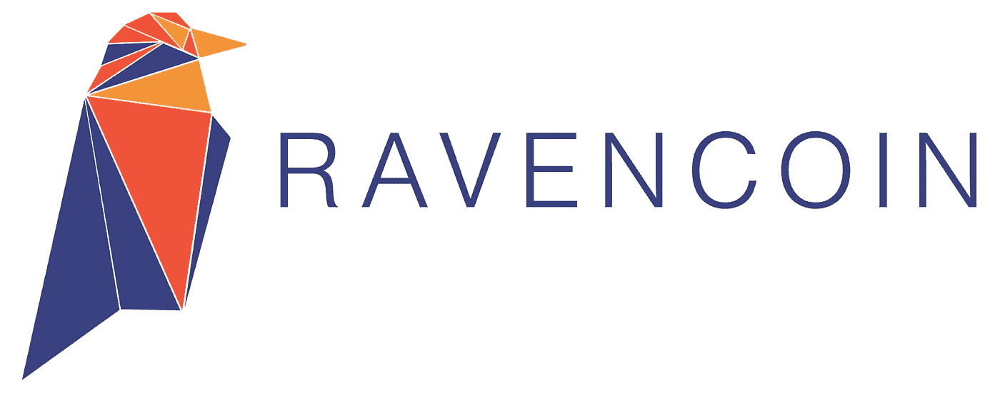
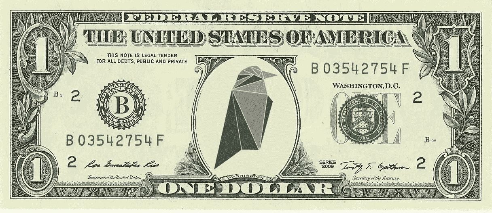

# 如何交易瑞文币？

> 原文：<https://medium.com/coinmonks/how-to-trade-ravencoin-8de3d36fba4?source=collection_archive---------43----------------------->

## [Ravencoin](http://sevenb.io/currencies/ravencoin?utm_source=medium) (RVN)是一款不可或缺的区块链，允许您管理网络参与者之间的资金转移。在该平台的帮助下，用户转移即时国际支付，这保证了高度的安全性。交易进行得很快，没有中间人的参与，这是区块链乌鸦币的先进技术。

# 什么是瑞文币(RVN)？

Ravencoin (RVN)是一种用于用户之间高速交易的加密货币。创始人受到电视剧《权力的游戏》的启发，在这部电视剧中，乌鸦是传达真理的使者。

> “在虚构的维斯特洛世界中，渡鸦被用作传递真理的使者。Ravencoin 是一个用例特定的区块链，旨在承载关于谁拥有什么资产的真实陈述"*——一篇 Ravencoin 从 2017 年 11 月*开始在媒体*上发布的帖子*

在这种情况下，渡鸦就是 raven coin——一个对等网络，参与者在其中传输资产所有权的主张。Ravencoin 是一个开放源代码的平台，允许你对已经设计好的结构进行令牌化，以及创建新的有趣的项目。如果需要，该系统的客户端可以很容易地相互传输令牌，这些令牌是使用特定算法发布的，并且它们的提取是透明和公开的。与作为基础的比特币不同，Ravencoin 的特点是优先考虑隐私、用户安全和抵制经济审查。加密货币的技术特征也增加了。

*   发放时间表(原[块奖励](https://ravencoin.org/halving/)5000 卢比)
*   封锁时间(1 分钟)
*   硬币供应量(210 亿)
*   挖掘算法(KAWPOW 以前分别为 X16R 和 X16RV2)

RVN 加密货币的推出发生在 2018 年 1 月 3 日，尽管该项目宣布的时间要早得多。RVN 使用 KAWPOW 算法，这使得该项目很受欢迎，因为它旨在克服采矿的集中化问题。Ravencoin 加密货币是开发人员辛勤工作的结果，他们为匿名和安全支付奠定了稳定的基础。截至 2022 年 9 月 55 日的市值为 337 124 783 美元，每枚硬币的价格为 0.032 美元。

# 我为什么要买 Ravencoin？

凭借 0.07 美元的低价，RVN 成功进入了资本化数字资产 100 强。硬币加入最大的国际交易所上市再次证明了该项目的巨大前景。分析师对投资 RVN 持积极态度。Ravencoin 加密货币不仅保持其地位，而且还呈现上升趋势，因此在 2021 年 4 月，一枚 RVN 硬币的价格为 0.22 美元。

DigitalCoinPrice 对 2022 年 Ravencoin 价格的预测是，该硬币将在明年达到 0.0538 美元之前以 0.0475 美元的价格交易，明年将滑回到 0.0534 美元。根据该网站对 2025 年 Ravencoin 价格的预测，RVN 将在 2026 年跌至 0.0672 美元之前交易于 0.07 美元，2027 年升至 0.0795 美元，并以 0.15 美元收盘。该网站对 2030 年 Ravencoin 价格的预测显示，那一年应该会达到 0.17 美元。

# 哪里买 Ravencoin？

有许多不同的方式来购买和交易 Ravencoin。有些方法既快又简单，比如加密交易平台。在 [7b](https://sevenb.io/) 买 Ravencoin 是最好的地方，快速，稳定，方便。一个简单和安全的方法来交换 Ravencoin 美元，反之亦然，贸易在最低的佣金 0，1，没有 KYC 要求。此外，7b 是一个没有 KYC 的[密码交易所](http://sevenb.io/blog/?utm_source=medium)(每天最多 2 个 BTC)。

# 如何使用 7b crypto broker app 购买 Ravencoin？

7b 以最具竞争力的价格实现了 2000 多项数字资产的无缝 RVN 购买和交易。购买或出售 RVN 不会花你超过 10 分钟。要购买或销售 RVN，请遵循以下步骤:

1.  [将 7b](https://play.google.com/store/apps/details?id=io.sevenb.terminal) crypto broker 应用程序下载到您的智能手机上。
2.  如果您是第一次使用 7b，请登录您的帐户或注册它。
3.  向您的帐户转账以购买加密货币。
4.  选择所需的交易对。
5.  输入买入或卖出的越南盾金额。
6.  确认交易细节。
7.  获取“成功”信息。

# 常见问题解答

# Ravencoin 是一个好的投资吗？

自其出现以来，当一枚硬币的价格为 0.02 美元时，RVN 硬币显示出上升趋势，变得更加昂贵，今天的价格为 0.07 美元。2021 年春天，价格大幅上涨，每枚越南盾硬币的成本达到 0.2 美元。现在价格已经下跌，所以现在是买入的适当时机。

# **我如何投资 Ravencoin？**

有很多投资 RVN 的平台可供选择。使用我们的 7b 加密经纪人应用程序，您可以轻松地投资 RVN。只需按照我们应用程序中的简单说明进行操作。

# 新手如何交易瑞文币？

如果你是密码行业的新手，想开始交易 RVN，那么 7b 是最适合你的地方。只需注册您的帐户，选择一个交易对，存入资金并确认交易。学习加密交易的基本知识并练习，开始时不要投入大量资金。最佳投资不超过你自由资金的 30%。

# 什么是 Ravencoin 区块链？

Ravencoin 是比特币的硬分叉，是为了提高其技术特性而创造的。该平台的主要目标是用户之间安全的资金交换，无需中介。

选择 7b、安全和[匿名加密交易](http://sevenb.io/?utm_source=medium)的 Ravencoin 交易选项，享受[低廉的加密交易费用](http://sevenb.io/faq?utm_source=medium)。

*原载于 2022 年 9 月 5 日*[*https://seven b . io*](https://sevenb.io/blog/how-to-trade-ravencoin/)*。*

> 交易新手？尝试[加密交易机器人](/coinmonks/crypto-trading-bot-c2ffce8acb2a)或[复制交易](/coinmonks/top-10-crypto-copy-trading-platforms-for-beginners-d0c37c7d698c)