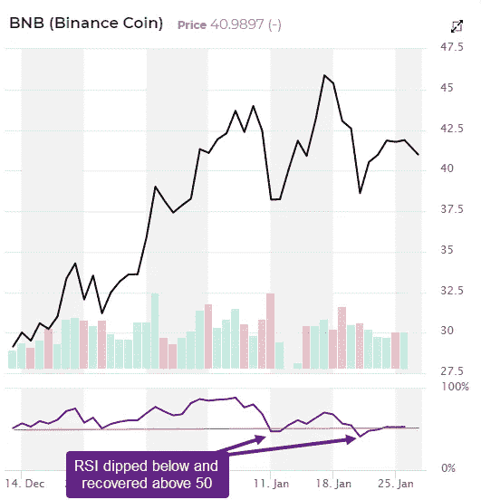
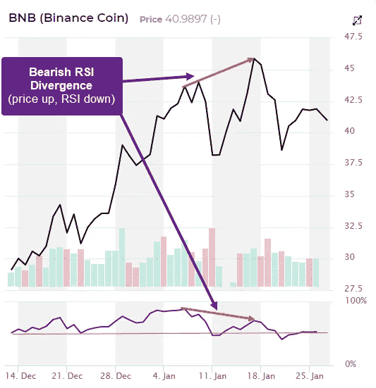
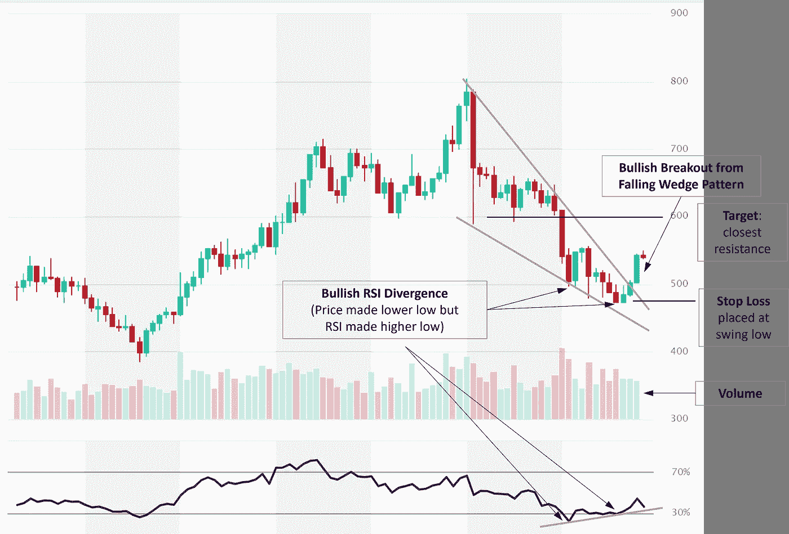
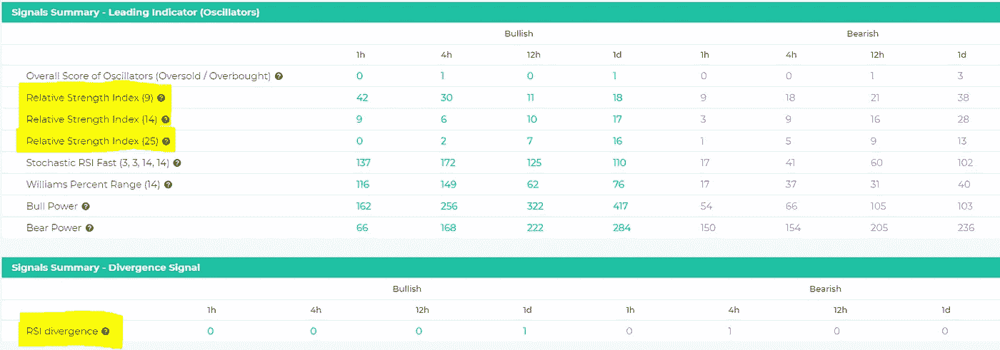

# 如何交易 RSI 指标和 RSI 背离

> 原文：<https://medium.com/coinmonks/how-to-trade-rsi-indicator-and-rsi-divergence-9d84aaab8b7b?source=collection_archive---------22----------------------->

# 相对强度指数(RSI)是一个动量指标，衡量最近价格变化的幅度，以分析超买或超卖的情况。

RSI 值的范围从 0 到 100。

相对强度指数(RSI)使用以下公式计算:RSI = 100–100/(1+RS)其中 RS =指定时间范围内上升期的平均收益/指定时间范围内下降期的平均损失

# 当 RSI 高于 70 时，资产价格被认为是超买(由于修正)，当它低于 30 时，被认为是超卖(由于反弹)。一些交易者使用更极端的水平(80/20)来减少错误的读数。

在强劲的上升趋势中，RSI 通常会达到 70 或更高，持续一段时间，而下降趋势会在 30 或以下停留很长时间。虽然一般的超买和超卖水平可能是准确的，但它们可能不会为趋势交易者提供最及时的信号。

趋势交易者可以在趋势上升时使用 RSI 在超卖附近买入(即在下跌时买入——见下图 1 ),在下跌时在超买附近做空(即在反弹时卖出)。让我们假设一项资产的长期趋势是上升的。当 RSI 运行到 50 以下，然后又回到 50 以上时，出现买入信号。本质上，这意味着价格回调已经发生，一旦回调似乎已经结束(根据 RSI ),趋势正在恢复，交易者就买入。使用 50 水平是因为 RSI 在上升趋势中通常不会达到 30，除非潜在的反转正在进行中。当趋势下降，RSI 上升到 50 以上，然后又回到 50 以下时，就会出现短线交易信号。

RSI 通常与趋势线结合使用，因为趋势线的支撑位或阻力位通常与 RSI 读数中的支撑位或阻力位一致。

# 观察价格和 RSI 指标之间的背离是使用它的另一种方法。

当加密货币价格创出新高或新低，但 RSI 没有创造相应的新高或新低时，就会出现背离。当硬币价格创下更高的高点，RSI 形成更低的高点时，就会形成看跌背离。RSI 没有确认新高，这表明势头减弱。**看涨背离**，被解读为买入信号，出现在价格创出新低时，但 RSI 值没有出现。

# RSI 背离信号在较长的时间框架内(最小 1 小时图)更准确。你会得到更少的错误信号。

# RSI 背离也可以用来确认突破。

这里有一个[的例子](https://altfins.com/using-bullish-rsi-divergence-to-confirm-a-breakout/)，说明多头 RSI 背离如何先于下跌楔形形态的多头突破。这两个信号一起构成了一个强有力的案例:

失败波动也可能是即将发生逆转的强烈迹象。失败波动与价格行为无关。换句话说，失败波动只关注信号的相对强弱，而忽略了背离的概念。当 RSI 移动到 30 以下(超卖)，反弹到 30 以上，拉回，保持在 30 以上，然后突破之前的高点时，牛市失败摆动形成。它基本上是一个移动到超卖水平，然后在超卖水平之上一个更高的低点。

当 RSI 移动到 70 以上，拉回，反弹，未能超过 70，然后打破之前的低点时，熊市失败摆动形成。它基本上是一个移动到超买水平，然后在超买水平之下的一个较低的高点。

**alt fins 上的加密交易员可以通过检查我们的** [**信号摘要**](https://platform.altfins.com/summary) **页面，轻松过滤 2700 多种加密货币，找到 RSI 超卖或超买的情况(见下文)。或者，交易者也可以使用 altFINS**[**Screener**](https://platform.altfins.com/screener)**构建自己的自定义过滤器。在这里看到如何使用我们的** [**筛选程序**](https://altfins.com/knowledge-base/create-a-signal-or-filter/) **。**

在 altFINS 知识库中找到更多有用的文章:[https://altfins.com/knowledge-base/](https://altfins.com/knowledge-base/)

> 交易新手？尝试[加密交易机器人](/coinmonks/crypto-trading-bot-c2ffce8acb2a)或[复制交易](/coinmonks/top-10-crypto-copy-trading-platforms-for-beginners-d0c37c7d698c)