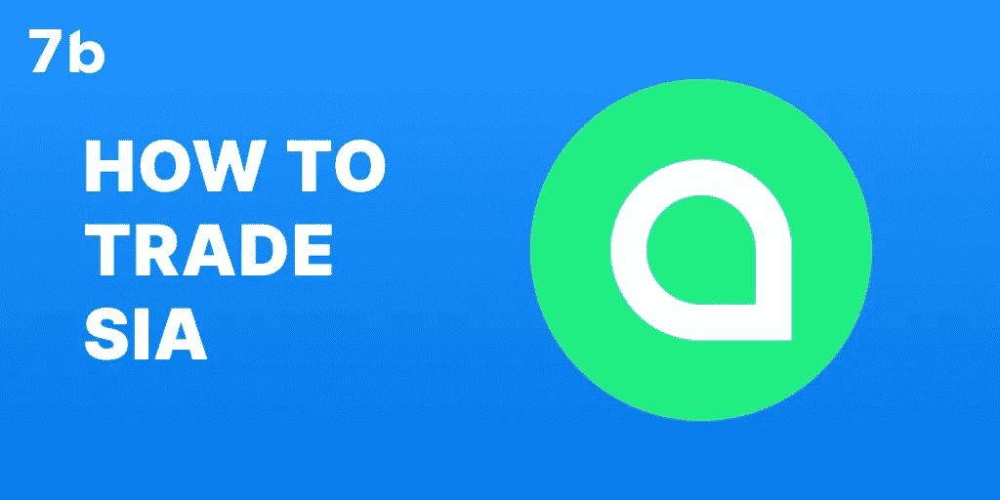
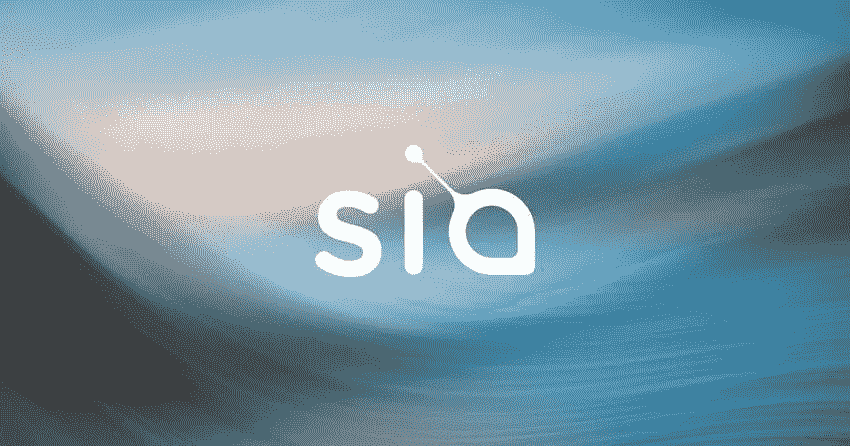

# 如何交易 Siacoin？

> 原文：<https://medium.com/coinmonks/how-to-trade-siacoin-12516beab10e?source=collection_archive---------23----------------------->

# 随着其本地实用令牌 SC 的推出，Siacoin 是 DeFi 空间的重要贡献者。如果你正在考虑投资新航加密货币，在你决定交易之前，这里有一些你应该知道的基本事实。

# 什么是 Sia (SC)？

Siacoin (SC)是 Sia 项目背后的令牌。Sia 本身是一个依赖区块链技术的分散式云存储平台。它旨在提供比传统存储平台更低的价格和更多的选择。Sia 是完全私有的，您可以完全控制您的加密密钥和数据。

Siacoin，Sia crypto，是代币存储空间提供者和购买者用来交换市场上的服务。如果你愿意，你也可以交换我的硬币。

# 谁创造了新航？

Sia 基金会创立了 Sia。总裁和核心开发人员是卢克·尚皮内，王居仁担任主席。天网实验室也为 Sia 工作。

# Siacoin 是如何工作的？

要了解 Sia 硬币加密的工作原理，您需要了解 Sia 平台和使用 Sia 进行支付的加密市场。

Sia 将文件分成 30 个片段，每个片段由不同的存储主机上传。由于里德-所罗门擦除编码，这些文件是冗余的。这意味着您只需要 10 个文件段就可以访问该文件。文件在离开您的计算机之前会被加密。

智能合同控制付款以及接收文件的主机。租户不仅要用 Siacoins 支付存储空间的费用，而且主机会存放一些 Sia coins 作为抵押。这种间接影响阻碍了主机离线。

# Sia 交易与投资

你不需要 Sia 应用程序来交易或投资硬币，因为你可以在交易所购买。如果你决定购买新航以持有它，这就是投资。如果你抱着这是短线的想法买入，并打算在价格上涨时卖出，这就是交易。

# 我为什么要交易(SC)？

Siacoin 提供了几个考虑交易它的理由。首先，由于它在 Sia coin 云存储应用程序中的使用，它具有强大的功能。这意味着，如果新航网络扩大，其价格可能会上涨。

交易 SC 也很容易，因为你可以在各种经纪人和交易所进行交易。

# 交易硬币的方法

如果你正在研究如何交易新航，有几种方法。你的选择取决于你的目标和策略。大多数人会选择长期或短期策略。这是指他们持有加密货币的时间。

# 交易 Sia 的步骤

Sia 的交易过程是相似的，不管你在什么平台上交易。

1.  存入您的加密货币。
2.  在硬币列表中搜索 Sia。
3.  选择买入或卖出多少 Sia。
4.  确认你的交易。
5.  根据需要重复。

[如何交易 SIA | 7b 加密经纪人|新手交易](https://www.youtube.com/watch?v=YJ_spzp8y7M)

# 硬币价格预测

目前，SC 的交易价格约为 0.003823 美元，市值为 199，079，079 美元，流通供应量为 52，005，562，992 SC，24 小时交易量为 4，077，451 美元。

根据历史数据和当前趋势，Siacoin 价格预测显示，到 2022 年底，它可能达到 0.0124 美元。基于短期和长期的价格趋势，Siacoin 在 2023 年上半年可能不会有很好的表现。即便如此，Sia live network 在这段时间内可能会获得强大的用户群，同时专注于提高其安全性。

至于 2025 年 Siacoin 价格预测，Sia 网络有可能实现增强保护并跟上最新发展。因此，SC 的价格可能会超过 0.022 美元。那些长期出售 Siacoin 的人可以获得可观的利润。

想知道哪里可以买到 Siacoin？选择 7b、安全和[匿名加密交易](http://sevenb.io/?utm_source=medium)的 Siacoin 加密交易选项，享受[的低加密交易费用](http://sevenb.io/faq?utm_source=medium)。

*原载于 2022 年 9 月 15 日*[*https://seven b . io*](https://sevenb.io/blog/how-to-trade-sia/)*。*

> 交易新手？尝试[加密交易机器人](/coinmonks/crypto-trading-bot-c2ffce8acb2a)或[复制交易](/coinmonks/top-10-crypto-copy-trading-platforms-for-beginners-d0c37c7d698c)