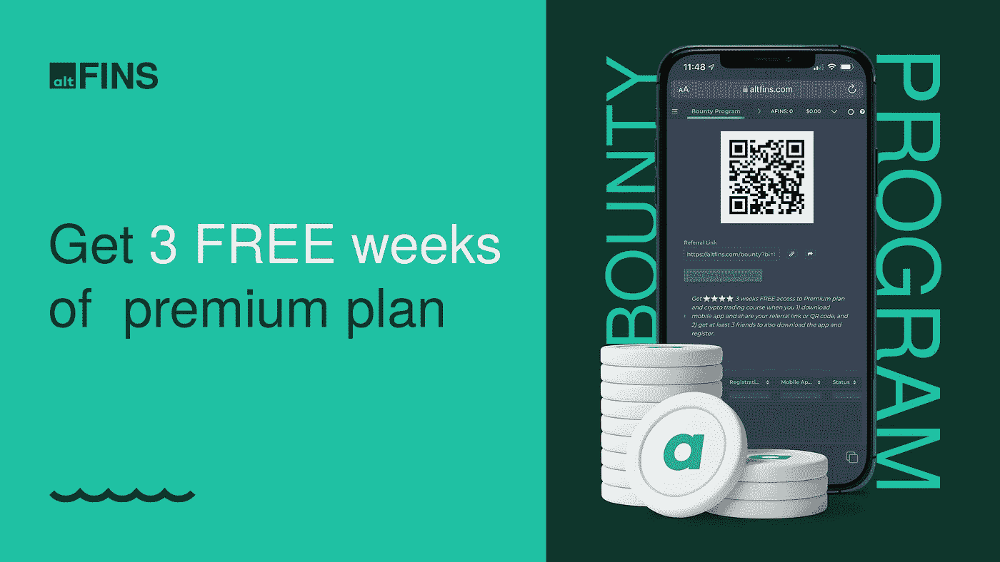

# 横盘通道怎么交易？

> 原文：<https://medium.com/coinmonks/how-to-trade-sideways-channel-3c2b99550f17?source=collection_archive---------40----------------------->

Source: [altFINS](https://altfins.com/education)

⭐ **观看奥特芬教育新交易** [**视频**](https://altfins.com/education?utm_source=sendinblue&utm_campaign=Trade%20with%20Richard&utm_medium=email) ！这个视频是专为奥尔特芬斯订户和阿芬斯霍德勒。

在制造业活动数据弱于预期后，市场在过去几天处于上升趋势，表明美国经济正在放缓。交易员认为，这可能促使美联储放缓加息步伐，这对加密和科技股是利好消息。

在今天的[视频](https://altfins.com/education?utm_source=sendinblue&utm_campaign=Trade%20with%20Richard&utm_medium=email)中，Richard 放置了 **3 个新的交易**并演示了**如何交易一个横盘通道**，这是最近常见的模式。

他还向您展示了如何利用 altFINS 平台在[策划图表](https://altfins.com/curatedCharts?utm_source=sendinblue&utm_campaign=Trade%20with%20Richard&utm_medium=email)部分中找到这样的模式，其中包括对 55 枚硬币的技术分析。这为你节省了大量的时间去寻找交易设置，识别模式，支撑和阻力区域等。

他还回顾了他最近的交易(KNC，RVN)，这些交易仍然有效。

视频中涉及的硬币包括 **ADA、LTC、UNI、EGLD、MKR 和 QNT。**

**在**[**alt fins**](https://altfins.com/education?utm_source=sendinblue&utm_campaign=Trade%20with%20Richard&utm_medium=email)**上看到他所有的交易视频。**

刚开始做交易的，完成 **altFINS** [**密码交易课程。**](https://altfins.com/education?utm_source=sendinblue&utm_campaign=Trade%20with%20Richard&utm_medium=email)

使用 altFINS [**赏金程序**](https://altfins.com/knowledge-base/altfins-bounty-referral-program/?utm_source=sendinblue&utm_campaign=Trade%20with%20Richard&utm_medium=email) **查看所有理查德的加密交易视频和交易提示。获得 3 周的保费计划！**

Source: altFINS

> 交易新手？试试[加密交易机器人](/coinmonks/crypto-trading-bot-c2ffce8acb2a)或者[复制交易](/coinmonks/top-10-crypto-copy-trading-platforms-for-beginners-d0c37c7d698c)