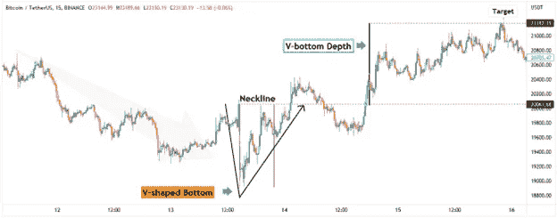

# V 型底怎么交易？

> 原文：<https://medium.com/coinmonks/how-to-trade-the-v-shaped-bottom-59eedcd11e5c?source=collection_archive---------18----------------------->

顾名思义，V 形底部类似于 V 形价格形态，当价格从激进的卖出转为激进的买入时形成。这种图表模式要求趋势反转，但由于涉及到高波动性，很难实时识别 V 型底部模式。

# 如何交易 V 字底？

首先，要有趋势反转，我们需要有一个流行趋势。在 V 形底部的情况下，整体趋势是看跌的。V 型底的一个重要特征是从非常强烈的熊市趋势中急剧下降的角度。

V 型底的第二阶段是卖家投降，买家积极介入。这可以在价格图表上看到，价格直线上升，或多或少与图形的第一部分对称。

一旦大幅下跌被完全逆转，反转形态就被确认了。

# 购买和退出

在突破并收于颈线上方后可以买入，这代表了最初大幅下跌的起点。止损点通常等于从底部到颈线高点的距离，并把同样的价格距离投射到顶部。

或者，风险较高的人会更加激进，一旦价格开始上涨，他们就会试图进入市场。

另一个需要考虑的重要因素是 V 型底是否是由新闻事件引发的。如果 V 型底部模式背后有新闻催化剂，加密货币标志着底部的概率就越高。

# 用 V 型底交易的四个技巧

当用 v 型底交易时，记住几件事很重要。

*   首先，你需要耐心等待合适的机会。
*   第二，在你进入交易之前，你需要清楚地知道你想从哪里出去。
*   第三，当交易开始对你有利时，不要害怕从桌上拿走一些利润。
*   最后，不要忘记使用止损来保护你的利润。

# 展望当前的熊市

许多投资者想知道如何在当前的熊市中交易。V 形底部是典型的熊市模式，通常发生在大规模抛售之后。首先要寻找的是一个快速反弹的 V 型底部。接下来是市场稳定的盘整期。在此之后，市场通常会恢复跌势。

*最初发表于*[*【https://www.cryptohopper.com】*](https://www.cryptohopper.com/blog/7429-how-to-trade-the-v-shaped-bottom)*。*