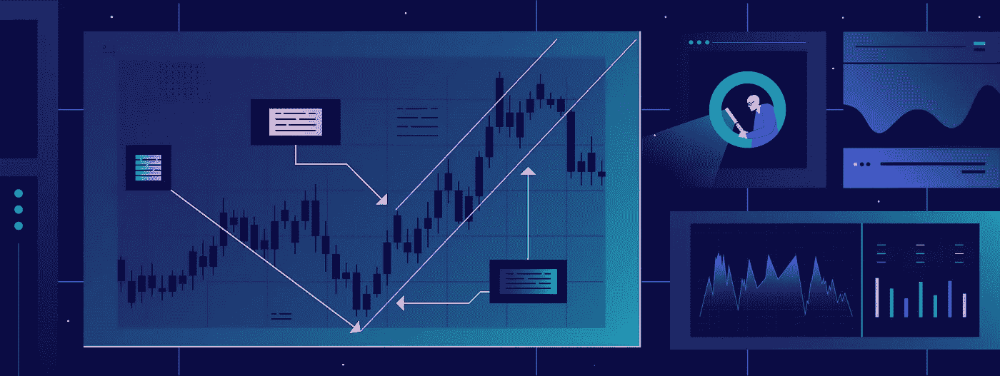
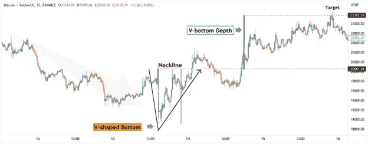

# 如何交易 V 型底部？|以及本周加密更新的更多内容。

> 原文：<https://medium.com/coinmonks/how-to-trade-the-v-shaped-bottom-and-more-in-this-weeks-crypto-update-f39bab5b06a4?source=collection_archive---------31----------------------->

How to Trade the V-Shaped Bottom? | And More in This Weeks Crypto Update.

*   十八因逆头肩模式呼唤反弹
*   比特币上涨的看涨通道将下跌上限定在 20，000 美元
*   如何交易 V 型底部？

# 十八因逆头肩模式呼唤反弹

Shiba Inu Inverse Head and Shoulder Pattern Calls for a Rally

shiba Inu(SHIB)的日线图描绘了一个几乎完美的头肩倒挂模式，预示着涨势将向 0.000025 美元靠拢。此外，由于大多数 RSI 读数都高于 50 的中间水平，每日 RSI 振荡器似乎正在建立势头。

## 反向头肩模式

左肩以 0.000009 美元的低摆结束，然后头部以 0.0000071 美元结束。右肩可以称为完成在 0.000010 美元的低点。目前，SHIB 的价格是调情与领口，而打破以上将确认逆头和肩膀模式。

左肩和头部之间也存在看涨背离，为看涨情况增加了更多汇合点。

如果看涨的场景成为现实，H&S 模式的标准目标是头部和加到突破点的领口之间的价格距离。目前，H&S 的预测目标为 0.000025 美元。

## 什么是反向头肩模式？

逆 H&S 模式是一种技术指标，用于识别证券价格的潜在反转。当证券的价格形成两个较低的高点和一个较高的低点时，就形成了这种模式。这样就在证券的价格走势图上形成了一个“不相上下”的形象。领口是通过连接两个肩膀的低点创造的。突破上述瓶颈意味着这种证券的价格有可能继续走高。

## RSI 指标

在我们开发左肩的整个过程中，RSI 震荡器一直保持在 50°中间水平以上，从而形成了看涨的势头。如果看多者的持仓水平在领线以上，如果趋势值在 50 以上，RSI 震荡器可以帮我们确认。

**展望未来:**在领口以上，第一个关注点是 1 月中旬的摆动低点 0.000017 美元，之后是 0.000030 美元附近的阻力位。

*你想了解更多有关 Shiba Inu 等 Meme 币的信息吗？请阅读博客《2022 年迷因币的潜在未来》* [*此处为*](https://www.cryptohopper.com/blog/6876-the-potential-future-of-meme-coins-in-2022) *。*

# 比特币上涨的看涨通道将下跌上限定在 20，000 美元

Bitcoin’s Rising Bullish Channel Caps Downside at $20,000

整体技术走势图显示，比特币(BTC)正在上升的看涨通道中交易，这增加了它继续上行的机会。此外，自 6 月 18 日触及低点以来，比特币的价格走势一直围绕着一个重要的 12 天周期，即 8 月中旬将是另一个中间底部，因此具有一定的周期性。

## 上升通道

从 6 月 18 日低点开始，比特币的整个价格行动结构可以被框定在一个上升通道格局内，这是一个看涨信号。只要 BTC 价格保持在上升通道内，上涨和下跌的上限分别为 25，500 美元和 20，000 美元。

## 什么是上升通道？

上升通道是当价格在两条平行趋势线之间上涨时形成的看涨形态。这种形态表明买家在控制，他们愿意介入并在更高的水平支持市场。通道的上趋势线是阻力，下趋势线是支撑。突破阻力位可能意味着进一步上涨，而跌破支撑位可能导致更多损失。

## 12 天周期

虽然周期从来不打算以 100%的精度确定顶部和底部，但 12 天 BTC 周期几乎完美对称，因为它可以在两个高点和两个低点之间找到。

第一个 12 天的高点到高点周期可以从 6 月 26 日高点到 7 月 8 日高点进行测量。随着每一个随后的 BTC 高点，我们可以注意到，在短期内，周期已经开始略有收缩。最近两次 BTC 高点之间的距离只有 10 天。

然而，12 天的低到低周期更重要，因为它可以预示下一次低点的到来。12 天周期低点的目标日期是 8 月 17 日。

**展望:**22000 美元关口附近的通道中间可以提供短期支撑。但更重要的是日线 RSI 要守住 50 中级以上，或者更重要的是 RSI 趋势线以上。RSI 跌破趋势线会危及看涨的情况。

# V 型底怎么交易？

How to Trade the V-Shaped Bottom?

顾名思义，V 形底部类似于 V 形价格形态，当价格从激进的卖出转为激进的买入时形成。这种图表模式要求趋势反转，但由于涉及到高波动性，很难实时识别 V 型底部模式。

## 如何交易 V 字底？

首先，要有趋势反转，我们需要有一个流行趋势。在 V 形底部的情况下，整体趋势是看跌的。V 型底的一个重要特征是从非常强烈的熊市趋势中急剧下降的角度。

V 型底的第二阶段是卖家投降，买家积极介入。这可以在价格图表上看到，价格直线上升，或多或少与图形的第一部分对称。

一旦大幅下跌被完全逆转，反转形态就被确认了。

## 购买和退出

在突破并收于颈线上方后可以买入，这代表了最初大幅下跌的起点。止损点通常等于从底部到颈线高点的距离，并把同样的价格距离投射到顶部。

或者，风险较高的人会更加激进，一旦价格开始上涨，他们就会试图进入市场。

另一个需要考虑的重要因素是 V 型底是否是由新闻事件引发的。如果 V 型底部模式背后有新闻催化剂，加密货币标志着底部的概率就越高。

## 用 V 型底交易的四个技巧

当用 v 型底交易时，记住几件事很重要。

*   首先，你需要耐心等待合适的机会。
*   第二，在你进入交易之前，你需要清楚地知道你想从哪里出去。
*   第三，当交易开始对你有利时，不要害怕从桌上拿走一些利润。
*   最后，不要忘记使用止损来保护你的利润。

# 展望当前的熊市

许多投资者想知道如何在当前的熊市中交易。V 形底部是典型的熊市模式，通常发生在大规模抛售之后。首先要寻找的是一个快速反弹的 V 型底部。接下来是市场稳定的盘整期。在此之后，市场通常会恢复跌势。

订阅我们的媒体每周博客和更新。
在[推特上关注我们](https://twitter.com/cryptohopper) | [脸书](https://www.facebook.com/cryptohopper)|[Reddit](https://www.reddit.com/r/CryptoHopper/)|[insta gram](https://www.instagram.com/cryptohopper/?hl=nl)

在 [Cryptohopper](https://www.cryptohopper.com/) 开始交易！

> 交易新手？尝试[加密交易机器人](/coinmonks/crypto-trading-bot-c2ffce8acb2a)或[复制交易](/coinmonks/top-10-crypto-copy-trading-platforms-for-beginners-d0c37c7d698c)