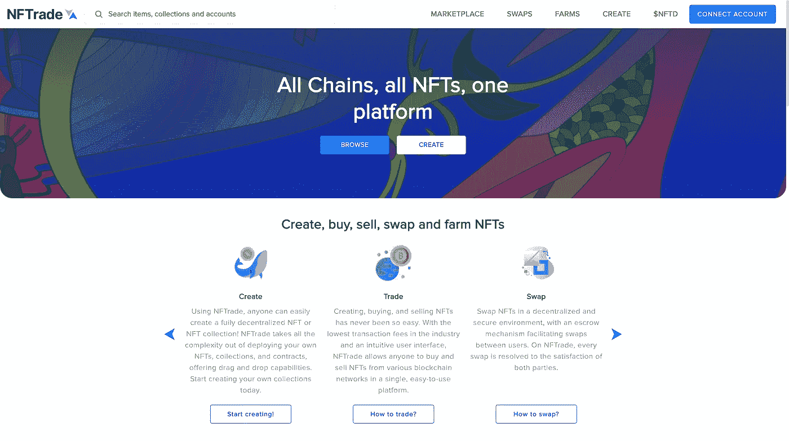

# 如何将 NFT 转移到另一个钱包

> 原文：<https://medium.com/coinmonks/how-to-transfer-your-nft-to-another-wallet-28427b5ea167?source=collection_archive---------15----------------------->

日常生活中的人们越来越容易接触到非功能性食物。NFTrade 建立了一个奇妙的平台，让任何人都可以轻松购买 NFT。

NFTrade 是一个跨链 NFT 市场，按照下面的教程将您的 NFT 转移到另一个钱包。

**第一步。去 nftrade.com 连接你的钱包**

打开您首选的浏览器，打开 www.nftrade.com 的[，点击屏幕右上方的**连接账户**蓝色按钮。](https://nftrade.com/)

**第二步。选择 NFT 所在的区块链**

NFTrade 是多链，有 6 个不同的区块链网络，你的帐户可以互动。选择您要传输的 NFT 所在的区块链网络。

**第三步。查看您的 NFTs**

选择**我的 NFTs，**您将看到该钱包地址中当前的所有 NFTs。选择要转移到另一个钱包的 NFT。

**第四步。转移你的 NFT**

在 NFT 页面的右上角，选择 **3 个点**并选择**传送 NFT** 。将出现一个窗口，粘贴您要将 NFT 发送到的钱包地址。点击**批准**勾选框，选择**转移 NFT** 按钮。

确认元掩码事务，稍后事务将批准。NFT 现在被发送到另一个钱包地址。

然后，您可以**断开** NFTrade 并在 MetaMask 上切换您的帐户，再次按照步骤 1-3 查看在其他钱包地址中传输的 NFT。

# 关于 NFTrade

NFTrade 是第一个跨链和区块链无关的 NFT 平台。我们是所有 NFT 市场的聚合者，拥有完整的 NFT 生命周期，允许任何人在不同的区块链无缝地创建、购买、销售、交换、耕种和利用 NFT。使用 NFTrade，任何人都可以访问他们的整个 NFT，释放 NFT 市场的总价值。

[**电报**](https://t.me/nftrade) **|** [**网站**](https://nftrade.com/) **|** [**推特**](https://twitter.com/NFTradeOfficial) **|** [**中**](/@NFTrade)**|**[**LinkedIn**](https://www.linkedin.com/company/nftrade/)|[**insta gram**](https://www.instagram.com/nftradeofficial)**|**

> 加入 Coinmonks [电报频道](https://t.me/coincodecap)和 [Youtube 频道](https://www.youtube.com/c/coinmonks/videos)了解加密交易和投资

# 另外，阅读

*   [Bookmap 评论](https://coincodecap.com/bookmap-review-2021-best-trading-software) | [美国 5 大最佳加密交易所](https://coincodecap.com/crypto-exchange-usa)
*   [密码交易机器人](/coinmonks/crypto-trading-bot-c2ffce8acb2a) | [硬币门评论](https://coincodecap.com/coingate-review)
*   最佳加密[硬件钱包](/coinmonks/hardware-wallets-dfa1211730c6) | [Bitbns 评论](/coinmonks/bitbns-review-38256a07e161)
*   [新加坡十大最佳加密交易所](https://coincodecap.com/crypto-exchange-in-singapore) | [购买 AXS](https://coincodecap.com/buy-axs-token)
*   [红狗赌场评论](https://coincodecap.com/red-dog-casino-review) | [Swyftx 评论](https://coincodecap.com/swyftx-review)