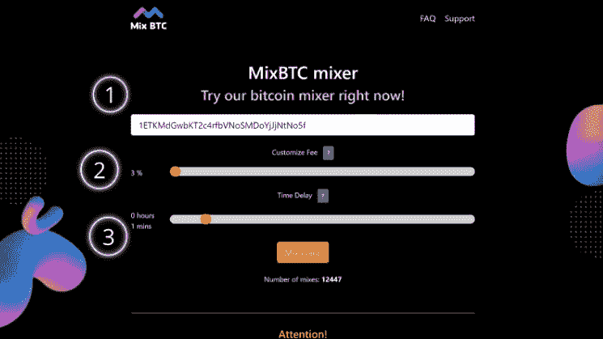

# 如何使用比特币搅拌器

> 原文：<https://medium.com/coinmonks/how-to-use-a-bitcoin-mixer-27d5a967bf99?source=collection_archive---------24----------------------->

加密货币的操作据说是匿名和安全的。然而，每一次加密操作都被记录在区块链上。每个人都可以检查谁，在哪里，多少，和谁你送你的硬币。在这个透明的世界里，有时候我们都需要一些不透明。

[**MixBTC.online**](https://mixbtc.online/) 是一种解决方案，让其用户将其比特币与其他用户混合，以保护他们的隐私并保持匿名。你可以购买任何你不想让其他人知道的东西，支付在线服务和你希望保密的商品，对你的接收者隐藏你的秘密资本，把你的钱分到不同的钱包里。

任何人都可以把他们的硬币寄到另一个地址，然后得到新的硬币。没有日志，没有跟踪，只有保密。请记住，所有的公务员制度和社会正义可以跟随你所有的钱包。不要违法。

[**MixBTC.online**](https://mixbtc.online/) 有一个用户友好的基于滑块的界面。

1.  插入您要接收混合硬币的**地址**。
2.  使用**时间延迟**滑块，在 1 分钟到 24 小时之间调整您的个人混音“速度”。一个时间间隔给你的混合增加了一个随机性的元素，并使你的硬币输入和输出脱钩，确保了更高水平的匿名性。
3.  然后使用**自定义费用**滑块，在 3%至 5%范围内设置个人费用。调整随机数量，最高可达千分之一。它防止找到相同的输出交易减去标准费用大小。
4.  点击 [**混合**](https://mixbtc.online/) **硬币**按钮。

在这之后，一个新的页面会打开，上面有一个地址，你可以把你的比特币转移到这个地址进行混合。该数量应大于 0.005 BTC。对这项服务的捐赠将会减少。

此外，该金额应在一次交易中整体发送。不要把它分成几笔付款。否则，只会处理第一个事务，而忽略下一个事务。

这项服务提供一份担保函作为他们义务的证明，这样一旦你投入硬币，他们就不能拒绝或拒绝你的付款。下载成. txt 文件保存，直到得到混合币。

您可以在这里查看您得到的金额，即金额减去您设置的服务费。

 [## MixBTC

### 混合量应大于 0.001 BTC。此外，它应该作为一个整体在一个交易中发送，而不是分割…

mixbtc.online](https://mixbtc.online/) 

[https://mixbtc.online/](https://mixbtc.online/)

> 交易新手？试试[加密交易机器人](/coinmonks/crypto-trading-bot-c2ffce8acb2a)或者[复制交易](/coinmonks/top-10-crypto-copy-trading-platforms-for-beginners-d0c37c7d698c)