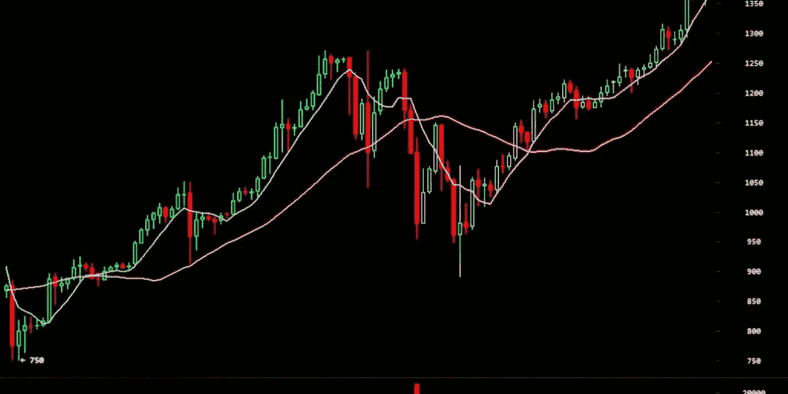

# 如何使用阿尔法通话信号

> 原文：<https://medium.com/coinmonks/how-to-use-alpha-calls-signals-e1a308bf6190?source=collection_archive---------42----------------------->

首先让我说这些指标非常准确。他们 75-85%的时间都是正确的。也就是说，你应该在交易加密时始终采取风险缓解措施，因为许多外部因素，如新闻和经济状况会影响趋势，图表和模式，他们总是有能力在错误的一方抓住你。

我们认可的系统是适当的风险管理。你不应该用 100%的资金进行交易，除非你可以承受 100%的损失。当你用 30-50%的可用交易资金进行买入或卖出信号交易，并设置一些较低的买入限额以防价格对你不利时，系统工作得最好。我们称之为平均成本。本质上，你是在建立一个安全网，如果你在市场下跌时下单，而你希望市场价格上涨，那么价格就会下跌。然后，如果价格下跌，你可以在预定的价格进入更多的资金，并通过简单地在较低的价格注入更多的资金，将你的%损失减半。那么你的收支平衡/利润目标就更容易实现。

简而言之，我们想重申，你会得到非常准确的调用，但始终有一个安全网在适当的位置，因为加密可以非常不稳定。还要记住，在熊市中交易/刷单可能不会一直产生巨大的收益，但它很可能会让你的投资组合从 50%下跌，像所有其他 HODL 人一样，只下跌 25%，这意味着一旦市场反转，你将先于其他人获利。

最后一点:在更高的时间框架内交易，比如 4 小时和日线，会提供更少的买卖信号，但是会更准确，风险更小。在更低的时间框架内交易，如 1 小时，可以提供更多的交易机会，但有时会被更高的时间框架击败，并可能在到达真正的底部之前产生多个买入信号。用适当的风险管理进行交易，你会过得更好，压力更小。

现在，你会问——我该如何利用这些惊人的指标呢？请访问电报频道，查看即将推出的令牌的详细信息，这是需要购买的治理令牌，以便访问所有内幕交易提示和买入/卖出电话！

 [## 阿尔法呼叫入口

### 这是通往阿尔法呼叫电报的通道！

t.me](https://t.me/alphacallsportal) 

*   *免责声明**交易风险自担。这是作者的观点，不应视为财务建议。

> 交易新手？试试[加密交易机器人](/coinmonks/crypto-trading-bot-c2ffce8acb2a)或者[复制交易](/coinmonks/top-10-crypto-copy-trading-platforms-for-beginners-d0c37c7d698c)