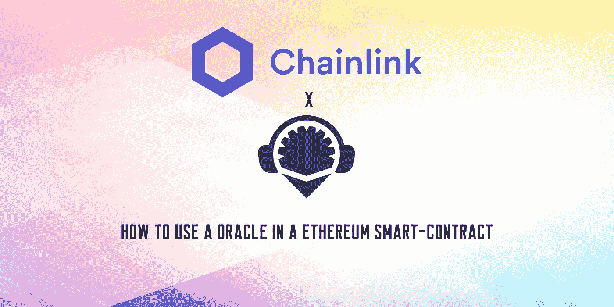

# 如何在以太坊智能合约中使用甲骨文

> 原文：<https://medium.com/coinmonks/how-to-use-an-oracle-in-a-ethereum-smart-contract-b5a325797a1f?source=collection_archive---------2----------------------->

Oracle 是可在智能合同中使用的外部数据源。Oracles 为智能合约提供了一种与外部数据交互并基于该数据触发合约执行的方式。

Chainlink 是一个分散的 oracle 网络，允许智能合约安全地访问链外数据馈送、web APIs 和传统银行支付。它提供了一个可靠的…