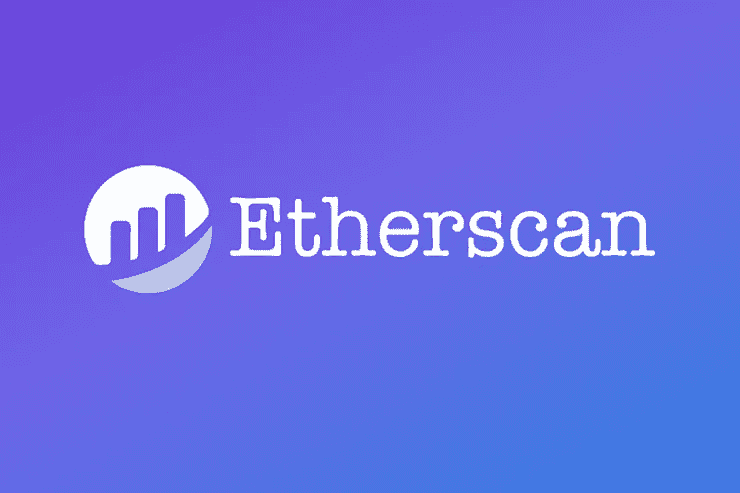
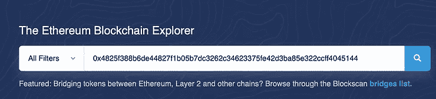
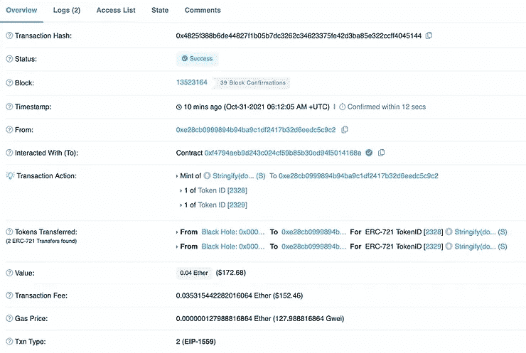

# 如何使用以太网扫描检查您的交易

> 原文：<https://medium.com/coinmonks/how-to-use-etherscan-to-check-your-transaction-82006f0f2ef6?source=collection_archive---------10----------------------->

本文讨论了块浏览器以太扫描以及如何使用它来检查以太坊区块链上的加密交易。

**关键要点**

*   以太扫描是一个块浏览器，用于浏览以太坊区块链上的数据。
*   用户可以在 Etherscan 的帮助下与以太坊的区块链、其他钱包、智能合约和 Dapps 进行交互。
*   在 Etherscan 上搜索所需信息需要钱包地址、交易 ID、合同地址或其他标识符。

第二代区块链网络以太坊应用广泛，而比特币只不过是一种数字货币。开发者可以在以太坊网络的基础上构建新的应用和程序，从而推动分散金融(DeFi)的发展。

由于以太坊不仅仅是持有和转移加密货币，学习如何在区块链航行不仅是必要的，而且是有益的。以太扫描是最受欢迎的工具，它允许用户在以太坊区块链上找到任何种类的数据。让我们看看什么是 Etherscan，以及它如何帮助在区块链上搜索不同类型的数据。

# 什么是以太扫描？

[以太扫描](https://etherscan.io/)是领先的块浏览器，帮助用户在[以太坊区块链](https://www.blog.xanpool.com/post/what-is-ethereum-london-upgrade?utm_source=blog&utm_medium=organic&utm_campaign=How+to+Use+Etherscan+to+Check+Your+Transaction)上查看交易、智能合同、地址、钱包等公共数据。由于以太坊是一个开放的区块链网络，任何人都可以查看区块链上记录的所有交互历史。以太扫描是一个像谷歌一样的搜索引擎，但不同的是它允许用户搜索、确认或验证发生在以太坊区块链上的交易。

Etherscan 由一组开发人员独立开发和运营，他们对建立在[以太坊](https://www.blog.xanpool.com/post/how-to-buy-and-sell-ethereum-in-2021?utm_source=blog&utm_medium=organic&utm_campaign=How+to+Use+Etherscan+to+Check+Your+Transaction)网络上的不同类型的分散信息和基础设施应用充满热情。以太坊基金会没有资助、运营和管理以太坊。著名的块浏览器作为一个独立的实体存在。

以太网扫描不提供任何钱包服务，也不存储用户的私钥。因此，它对以太网中发生的交易没有任何控制权。以太网扫描无助于撤销或重定向交易以及追回损失的资金。

# 为什么要用以太扫描？

以太扫描是以太坊区块链最值得信赖的块浏览器。几个分散的应用程序建立在以太网之上。因此，有必要使用以太网扫描来了解区块链上发生的分散式应用程序和事务。这有助于用户通过监控数据来检测任何可疑的区块链活动，从而确保应用程序的安全。

例如，whale alerts 将帮助用户了解何时大量加密货币被转移到交易所。这一信息可能意味着在某些情况下会出现大规模抛售。用户还可以使用 Etherscan 查看项目创始人如何使用他们的令牌。当开发人员放弃他们的项目并出售他们的代币时，使用 Etherscan 来发现骗局或骗局将会很有帮助。

# 如何在 Etherscan 上检查加密交易和钱包

以太扫描最基本的用例是检查发生在以太坊区块链上的加密交易。当用户知道如何追踪他们的加密货币时，他们可以轻松解锁区块链的其余信息。

如果用户从他/她的钱包向其中一个钱包地址发送 0.025 ETH，他们还需要支付一定数量的交易费。完成交易后，用户的钱包会显示一个翻译 ID。

让我们假设用户想要检查交易是否已经成功完成。他/她需要按照下面提到的步骤来检查 Etherscan 上的加密交易。

1.在 Etherscan 主页上，用户需要找到页面顶部的搜索字段。

2.用户需要将交易 ID 复制并粘贴到搜索字段中，然后点击搜索图标。

3.现在，用户可以看到与该交易相关的所有信息，如状态、块号、时间戳、交易费用、油价等。

4.用户还可以点击“点击查看更多”选项，了解更多详细信息。

从显示的数据中，用户可以确定交易是否成功执行并收到足够的确认。还有另一种方法，通过使用收件人的钱包地址来找到它。当用户输入接收者的钱包地址并进行搜索时，他可以在页面底部查看与该地址相关的所有交易。

# 如何在以太坊区块链搜索智能合约

经常与分散应用程序的智能合约进行交互的开发人员或用户可以从使用 Etherscan 中受益。他们可以交叉检查资金是否发送到准确的合同。智能合约的地址包含令牌的逻辑、如何进行令牌传输以及其他相关行为。

当用户想要向他们的钱包地址添加新令牌时，他们可以找到与令牌相关的所有信息。他们可以在 Etherscan 网站或社区中其他流行的网站(如 CoinMarketCap 和 CoinGecko)上找到令牌地址。从不同网站添加令牌地址时，仔细检查令牌地址以确保其正确是很重要的。

让我们考虑一个用户想要在以太坊上搜索一个 uni WAP ERC-20 令牌。用户需要将智能合同地址复制并粘贴到搜索字段中，以找到合同余额等详细信息以及有关 Uniswap 令牌合同的其他一般信息。当用户由于技术问题或网站中断而无法使用 DeFi 平台时，他们可以点击“写合同”来与 DeFi 平台进行交互。

# 如何在以太网上查询天然气价格

每个用户在以太坊上进行交易时都需要支付燃气费。这些费用是可变的，取决于包括交易和网络流量的块。Etherscan 有一个名为“气体跟踪器”的功能，可以显示不同气体价格下的价格和时间差异。该工具还可用于根据网络流量和传输量粗略预测燃气费用。

# 结果

以太网扫描是一个免费和简单的块浏览器。这是一个伟大的工具来检查以太坊区块链不同种类的数据。它也是 BscScan 等其他块资源管理器的基础。如果用户想要确认交易状态或搜索任何分散应用程序的智能合约，Etherscan 是一个很好的起点。

> 交易新手？试试[加密交易机器人](/coinmonks/crypto-trading-bot-c2ffce8acb2a)或者[复制交易](/coinmonks/top-10-crypto-copy-trading-platforms-for-beginners-d0c37c7d698c)