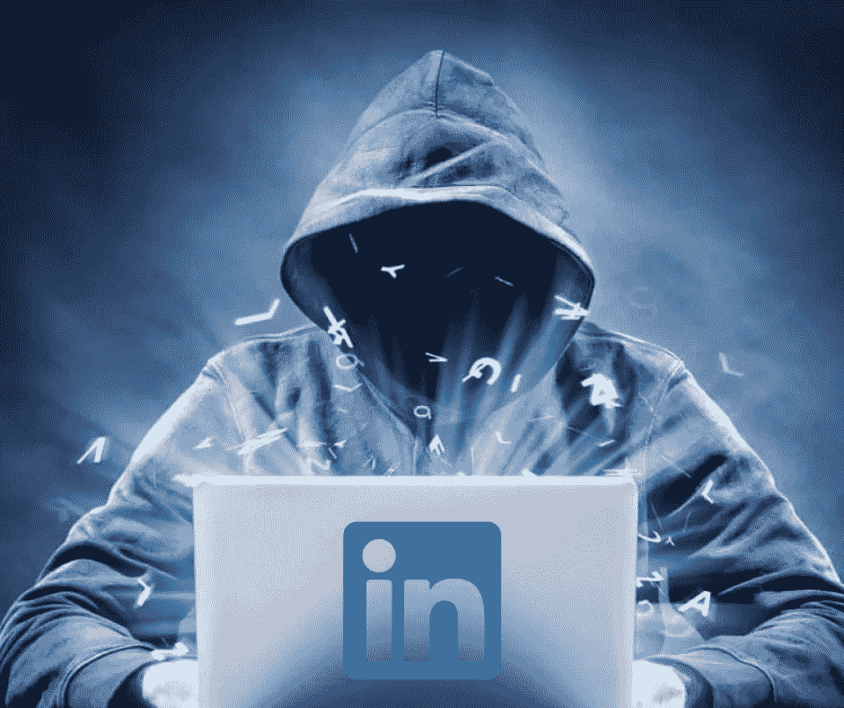

# 如何利用 LinkedIn 进行网络犯罪

> 原文：<https://medium.com/coinmonks/how-to-use-linkedin-for-cybercrime-122975208e6c?source=collection_archive---------17----------------------->

我曾经认为拥有 LinkedIn 个人资料是社交媒体真实性的核心特征之一。鉴于该平台的专业性，我们没有看到在脸书、推特和 Instagram 等其他社交媒体平台上猖獗的社交工程骗局的同样问题。然而，与所有事情一样，网络犯罪分子找到了更有效的利用途径，目前，选择的平台是 LinkedIn，潜在的受害者是利润丰厚的 Web 3 公司及其数字资产。

回到今年 3 月，Axie Infinity 背后的公司 Sky Mavis 通过浪人侧链被引流 6.22 亿。美国政府后来证实，这次攻击是由朝鲜支持的国家支持的黑客组织 Lazarus Group 实施的。中华人民共和国已成为网络犯罪领域的主要参与者，因为它希望通过加密货币洗钱来避免日益严格的国际制裁。可能受到 Axie 黑客攻击成功的启发，国家支持的网络犯罪分子现在正在扩大他们的野心，并利用 LinkedIn 等平台渗透公司，利用它们的安全漏洞。

根据网络威胁防御解决方案公司 Mandiant 的说法，黑客通常会从 LinkedIn 上令人信服的专业账户中窃取细节。他们会复制受害者的简历和职业背景。然后，网络犯罪分子将在一系列远程位置(通常在 Web 3 IT 领域)进行申请。目标是访问对组织的在线安全基础设施有影响力的职位。一旦进入公司，黑客将识别潜在的安全失误和漏洞，这些漏洞可能被用来提取加密货币和 NFT。LinkedIn 上丰富的专业信息使得身份盗窃和随后的欺诈成为可能。网络犯罪分子通常将自己伪装成韩国人或日本人，并将目标锁定在北美和欧洲的有利位置。

man diant 的首席分析师乔·多布森(Joe Dobson)表示，“这可以归结为内部威胁……如果有人受雇于一个加密项目，他们成为核心开发人员，这就允许他们影响事情，不管是好是坏。”

在这个远程工作和 NFT 个人资料照片成为我们行业常态的时代，网络犯罪带来的威胁远远超出了我们在 Web 2 中看到的情况。除了审查潜在的新员工，雇主现在还需要谨慎行事，因为 LinkedIn 上的身份盗窃问题只会随着时间的推移而加剧。

感谢您的阅读。

看看我在推特上未经过滤的想法:

[https://twitter.com/wasifmrahman](https://twitter.com/wasifmrahman)

在 LinkedIn 上关注我的职业生涯:

[https://www.linkedin.com/in/wasifmrahman/](https://www.linkedin.com/in/wasifmrahman/)

我对媒体的另一个想法是:

https://medium.com/@wasifmrahman

来源:

[https://decrypt . co/106491/网络罪犯-剽窃-LinkedIn-indeed-profiles-to-apply-crypto-jobs-report](https://decrypt.co/106491/cybercriminals-plagiarize-linkedin-indeed-profiles-to-apply-crypto-jobs-report)

[https://www . Bloomberg . com/news/articles/2022-08-01/north-Koreans-suspected-of-use-fake-resumes-to-steal-crypto？srnd =溢价](https://www.bloomberg.com/news/articles/2022-08-01/north-koreans-suspected-of-using-fake-resumes-to-steal-crypto?srnd=premium)

> 交易新手？尝试[加密交易机器人](/coinmonks/crypto-trading-bot-c2ffce8acb2a)或[复制交易](/coinmonks/top-10-crypto-copy-trading-platforms-for-beginners-d0c37c7d698c)