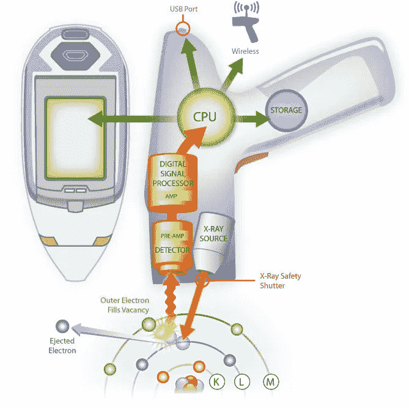
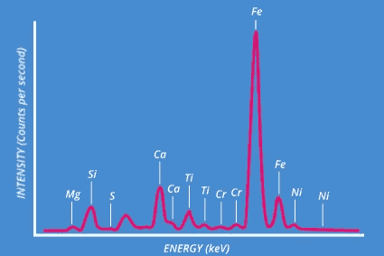

# 如何利用 NFT 和 XRF 阻止艺术品造假

> 原文：<https://medium.com/coinmonks/how-to-use-nfts-and-xrf-to-stop-art-fraud-f73dd4a66b9c?source=collection_archive---------35----------------------->

原创艺术界最大的问题之一就是真实性。赝品市场的价值逐年增长，但几乎没有办法证明原创作品不可改变的所有权。

# 什么是 XRF

XRF (X 射线荧光)是使用特定波长和光栅分析物体光谱特征的过程，以确定可用于验证作品真实性的准确指纹。

> 从顶级交易者那里复制交易机器人。免费试用。

这种光谱签名几乎不可能复制，如果没有物理接触的作品，使其成为一种更安全的转移和跟踪所有权的方式，有助于使伪造成为过去。

# 数字化签名

一旦收集到签名波形，看起来会有点像这样。这幅画独特的数字结构将被转换成化学指纹，用来保证真实性。

# 智能合同

像往常一样，在这个例子中，我们将使用快速节能 [ERC721A](https://www.erc721a.org/) 来确保最便宜的合同交互。继续之前，请将最新版本下载到您的目录中。

NFT 公司持有光谱数据的合同可以在下面的存储库中找到:

 [## 主 Arkay92 上的 Contracts/spectral analysis . sol/Contracts

### 一系列有趣的合同项目供大家学习！-Contracts/spectral analysis . sol at master…

github.com](https://github.com/Arkay92/Contracts/blob/master/SpectralAnalysis.sol) 

# 合同分解

一旦一件作品第一次被注册，我们就传递作品名称、所有者(以钱包地址的形式)、作品的价格和包含从枪接收的 XRF 数据的多维字符串数组。

注册后，XRF 数据存储在每幅画的 struct 中，并与它的令牌 ID 绑定。然后，令牌被铸造，并附有所有权数据，允许令牌证明真实性。

# 证明真实性

如果 XRF 数据与我们允许销售的作品相匹配，我们可以使用验证作品功能来证明作品的真实性。随着时间的推移，光谱特征将会改变，这意味着仅使用绘画的 XRF 数据是不够的。

搭配具有独特签名的智能水解决方案，不会降解，您可以使用完全相同的方法来验证真伪。

# 膨胀

为了对此进行扩展，我们可以注册一个函数，允许所有者使用块时间每月更新一次 XRF 签名，以确保它总是最新的，从而克服退化问题。

# 结论

我们甚至还没有开始意识到一点点想象力和乐趣会带来什么！这个过程可以用来跟踪债券，钻石，铁路财产和更多的所有权！

> 加入 Coinmonks [电报频道](https://t.me/coincodecap)和 [Youtube 频道](https://www.youtube.com/c/coinmonks/videos)了解加密交易和投资

# 另外，阅读

*   [什么是保证金交易](https://coincodecap.com/margin-trading) | [美元成本平均法](https://coincodecap.com/dca)
*   [支持卡审核](https://coincodecap.com/uphold-card-review) | [信任钱包 vs 元掩码](https://coincodecap.com/trust-wallet-vs-metamask)
*   [Exness 回顾](https://coincodecap.com/exness-review)|[moon xbt Vs bit get Vs Bingbon](https://coincodecap.com/bingbon-vs-bitget-vs-moonxbt)
*   [如何开始通过加密贷款赚取被动收入](https://coincodecap.com/passive-income-crypto-lending)
*   [BigONE 交易所评论](/coinmonks/bigone-exchange-review-64705d85a1d4) | [电网交易机器人](https://coincodecap.com/grid-trading)