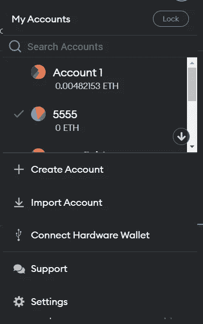
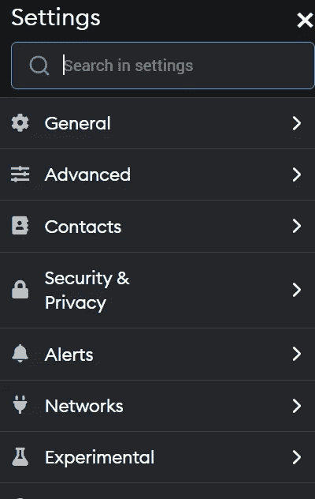
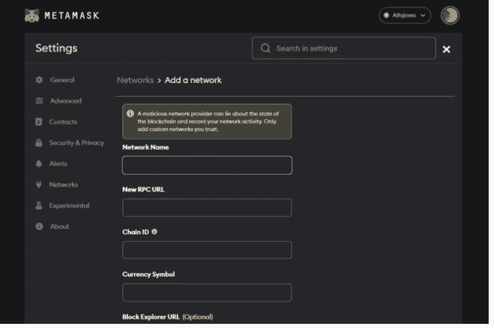
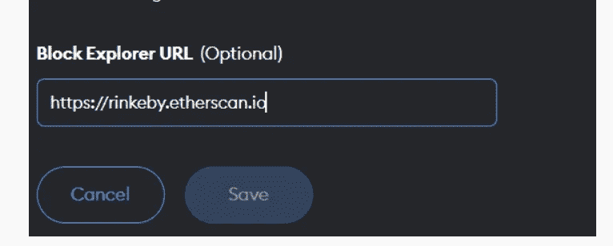
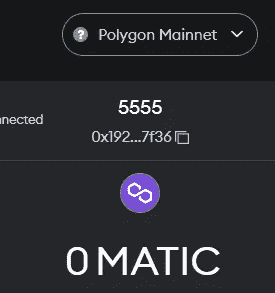
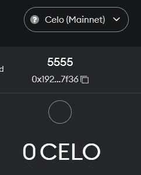
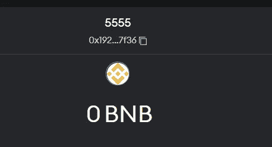

# 如何使用多边形，Celo 和币安元蒙版

> 原文：<https://medium.com/coinmonks/how-to-use-polygon-celo-and-binance-with-metamask-e6f28cee8b53?source=collection_archive---------11----------------------->

Metamask 是一个默认网络为以太坊的钱包。它支持其他 EVM 链，但由于默认情况下这些链不附带钱包，我们必须添加它们。

# 多边形:

Polygon 是建立在以太网层之上的第二层区块链网络。Polygon 在生态系统中获得了广泛的认可，因为它的可伸缩性、速度以及在汽油费用方面的可负担性。它的本国货币被称为马蒂克。

**如何添加元掩码**

*   转到钱包右上角的图片，点击它。下一步将会有一些选择。然后点击设置选项。

*   一旦设置打开，你会看到网络选项作为其内容的一部分，然后点击它。

*   你会看到添加网络按钮，点击它。这将为您打开一个新的屏幕来开始输入。

网络名称:多边形

新 RPC URL:选择以下选项之一

*   https://polygon-rpc.com
*   [https://RPC-mainnet . matic . net](https://rpc-mainnet.matic.network)
*   [https://rpc-mainnet.maticvigil.com](https://rpc-mainnet.maticvigil.com)
*   [https://RPC-mainnet . matic . quiknode . pro](https://rpc-mainnet.matic.quiknode.pro)

链条编号:137

货币符号:MATIC

阻止浏览器 URL(可选):[https://p](https://explorer.celo.org)olygonscan.com

单击保存以添加网络

当你回到你的钱包，你会看到网络已被添加。

# Celo:

Celo 是第一层区块链，这意味着它不同于以太坊。它有自己的节点，不运行在任何其他区块链之外。主要区别在于，Celo 允许你用其他加密资产支付交易费用，而不是像以太坊那样使用以太的本地货币。它的货币是 CELO。

**如何添加到元掩码**

遵循步骤 1–3，然后参考:

网络名称:Celo (Mainnet)

新的 RPC URL:[https://forno.celo.org](https://forno.celo.org)

链条编号:4220

货币符号:CELO

阻止浏览器 URL(可选):[https://explorer.celo.org](https://explorer.celo.org)

# 币安:

币安智能链(BSC)是 EVM 兼容，共识层，并与枢纽多链。理论上，这使得开发者很容易从以太坊移植他们的项目。对于用户来说，这意味着像 MetaMask 这样的应用程序可以很容易地配置为与 BSC 一起工作。

**如何添加到元掩码**

遵循步骤 1–3，然后参考

网络名称:币安智能链

新 RPC URL:选择一个(推荐)

*   [https://bsc-dataseed.binance.org/](https://bsc-dataseed.binance.org/)
*   https://bsc-dataseed1.defibit.io/
*   【https://bsc-dataseed1.ninicoin.io/ 
*   [https://bsc.nodereal.io](https://bsc.nodereal.io/)

链 ID: 0x38，十进制 56(如果 56 不行，试试 0x38)

货币符号:BNB

阻止浏览器 URL(可选):[https://bscscan.com](https://bscscan.com)

> *加入 Coinmonks* [*电报频道*](https://t.me/coincodecap) *和* [*Youtube 频道*](https://www.youtube.com/c/coinmonks/videos) *了解加密交易和投资*

# 另外，阅读

*   [SmithBot 评论](https://coincodecap.com/smithbot-review) | [4 款最佳免费开源交易机器人](https://coincodecap.com/free-open-source-trading-bots)
*   [比特币基地僵尸程序](/coinmonks/coinbase-bots-ac6359e897f3) | [AscendEX 审查](/coinmonks/ascendex-review-53e829cf75fa) | [OKEx 交易僵尸程序](/coinmonks/okex-trading-bots-234920f61e60)
*   [如何在印度购买比特币？](/coinmonks/buy-bitcoin-in-india-feb50ddfef94) | [瓦济克斯审查](/coinmonks/wazirx-review-5c811b074f5b)
*   [加密交易机器人](/coinmonks/crypto-trading-bot-c2ffce8acb2a) | [Probit 审查](https://coincodecap.com/probit-review)
*   [隐翅虫替代品](/coinmonks/cryptohopper-alternatives-d67287b16d27) | [HitBTC 审查](/coinmonks/hitbtc-review-c5143c5d53c2)
*   [CBET 评论](https://coincodecap.com/cbet-casino-review) | [库科恩 vs 比特币基地](https://coincodecap.com/kucoin-vs-coinbase)