# 如何使用策略交易像专业人士一样交易

> 原文：<https://medium.com/coinmonks/how-to-use-strategy-trading-to-trade-like-a-pro-604db73206b2?source=collection_archive---------15----------------------->

[credit](https://therealtimereport.com/2020/12/29/distinguishing-between-good-and-bad-trading-strategies-like-a-pro/)

> “没有战略，执行就是漫无目的的。没有执行力，战略是没有用的。”
> ― **张忠谋**

W ikipedia 将交易策略定义为一个固定的计划，旨在通过在市场上做多或做空来实现盈利回报。交易策略应该是客观的，一致的，可量化的，可验证的。非常重要的是，在交易时使用交易策略，以确定交易的规格，何时执行，何时退出交易，以及在每个位置应该冒险投入多少资金。如果遵循正确，它们为你提供了一种客观评估交易是否值得承担前期风险的方法。

币安的战略交易主页包括网格交易，TWAP，副总裁和其他自动算法交易功能。币安的策略主页允许交易者全面了解现货和期货网格交易策略及其在交易者中的表现和受欢迎程度，并允许交易者快速复制他们的设置。

## 策略交易的好处

*   策略交易帮助交易者发现自己处于非常有利的市场条件下，以避免在趋势市场的另一边。
*   它通过设置适当的杠杆比率和设置适当的止盈止损单来帮助交易员实施适当的风险管理措施，以避免因市场波动而遭受损失。

## 什么是期货网格交易？

Grid Trading 是一个自动买卖期货合约的交易机器人。设计为在设定的价格范围内以预设的时间间隔从市场订购。网格交易创建了一个订单网格，订单被置于设定价格之上和之下，价格逐渐上升或下降。这就是你如何建立你的交易网。例如，交易者可以发出高于比特币市场价 1000 美元的买入指令和高于比特币市场价 1000 美元的卖出指令。这滥用了分流条件。

当价格在一定范围内波动时，期货网格交易在波动和横向市场中表现最佳。这种技术试图通过微小的价格变化来获利。你包含的网格越多，你的交易就越频繁。但是，这样做的成本很高，因为你从每笔订单中获得的利润很小。

请注意，网格创建在以下情况下可能会失败:
如果您当前正在使用所选符号进行网格交易。
如果所选符号有未平仓订单或头寸。
对于对冲持仓模式，设置为单向模式。
如果超过限额，工作和限额触发的网格交易总额为 10。

## 设置您的期货网格交易策略

登录后，进入 usdⓢ-m 期货交易界面，点击**网格交易**。

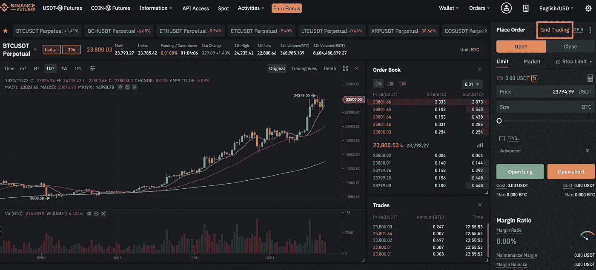

[https://www.binance.com/es-ES/support/faq/f0c2bd5bc16c40b9998d22549e91cd1c](https://www.binance.com/es-ES/support/faq/f0c2bd5bc16c40b9998d22549e91cd1c)

选择一个符号来执行策略并设置网格参数。点击**创建**确认。

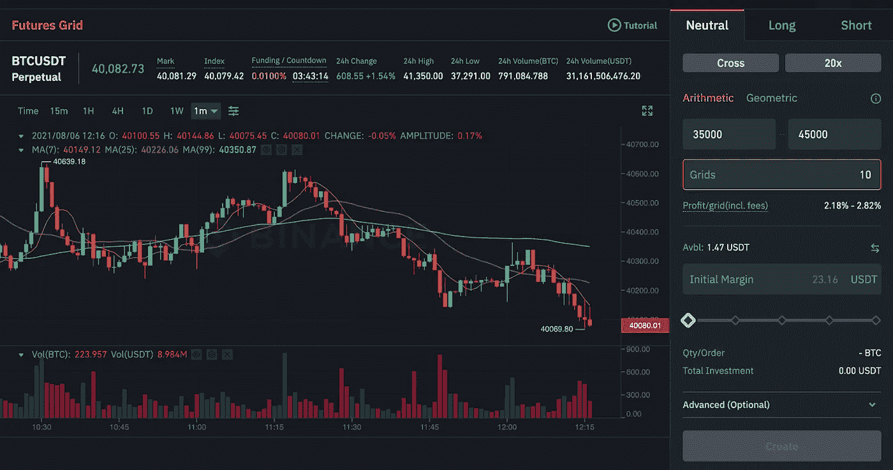

[https://www.binance.com/es-ES/support/faq/f0c2bd5bc16c40b9998d22549e91cd1c](https://www.binance.com/es-ES/support/faq/f0c2bd5bc16c40b9998d22549e91cd1c)

## 什么是 TWAP 算法交易？

TWAP(时间加权平均价格)是一种算法交易执行策略，旨在在交易员指定的一段时间内实现接近时间加权平均价格的平均执行价格。TWAP 交易算法是币安期货执行算法 API 解决方案的一部分，用户可以通过编程利用币安的内部算法交易功能，将大订单分成较小的数量，并定期自动运行，以最大限度地减少价格影响。

TWAP 交易算法旨在通过在特定时间段内分配订单的执行来优化交易的平均价格。交易员通常采用 TWAP 策略来处理大订单，同时减轻重大的市场影响。当订单规模大于订单簿上的可用流动性时，以及当预计价格波动性较高且没有明显上升或下降趋势时，TWAP 最有可能提供更好的执行价格。

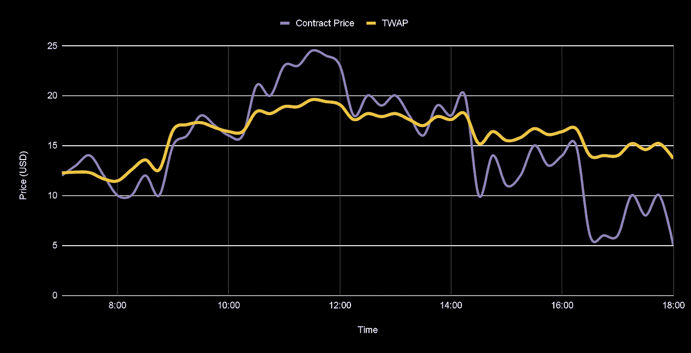

[Illustration of TWAP Algorithm Execution Patterns](https://www.binance.com/es-ES/support/faq/f0c2bd5bc16c40b9998d22549e91cd1c)

## 制定 TWAP 战略

*   确定交易规模，这是你选择买入或卖出合约的总规模。TWAP 策略的最小允许大小相当于 10，000 个 USDT。当 TWAP 策略完成所有命令时，TWAP 命令将停止。
*   选择持续时间，这是目标 TWAP 执行期间。最短持续时间为 5 分钟，最长为 24 小时。

## 什么是成交量参与算法交易？

成交量参与(VP)交易算法是一种机会主义的执行策略，允许以指定的紧急程度执行较大的订单。它的目标是在目标交易量参与范围内，以接近实时市场交易量一小部分的速度完成交易。如果您希望在执行过程中以平均市场价格为目标的同时限制订单的市场影响，VP 非常有用。成交量参与算法与订单匹配策略保持一致，以执行超过市场流动性的大额名义订单，同时最大限度地降低市场影响。

> 交易新手？试试[密码交易机器人](/coinmonks/crypto-trading-bot-c2ffce8acb2a)或者[复制交易](/coinmonks/top-10-crypto-copy-trading-platforms-for-beginners-d0c37c7d698c)

要检查 VP 订单的状态，可以使用查询订单端点(GET SAPI/v1/algo/futures/open orders 或 GET SAPI/v1/algo/futures/historical orders)。请注意，订单填写更新将不提供 WebSocket 通知。况且，收到*“成功”:真*并不代表你的订单就会被执行。例如，如果您的期货余额不足，或者您的账户处于*仅减少*状态，您将收到*“成功”:真*，但订单将无法执行。

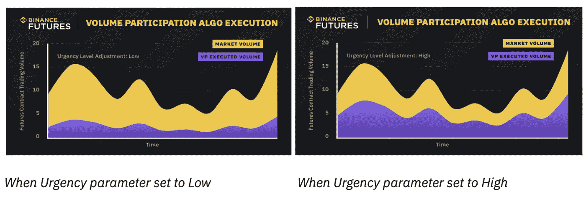

[Illustration of Volume Participation Algorithm Execution Patterns](https://www.binance.com/en/support/faq/b0b94dcc8eb64c2585763b8747b60702)

## 如何使用策略交易登录页面

*   要访问策略交易登录页面，请转到[币安](https://www.binance.com/en)并点击**交易** > > > **策略交易**。

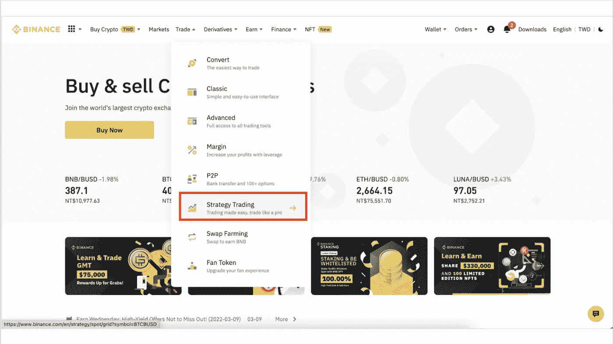

[https://www.binance.com/en/futures](https://www.binance.com/en/futures)

*   使用过滤器显示特定的网格交易策略面板

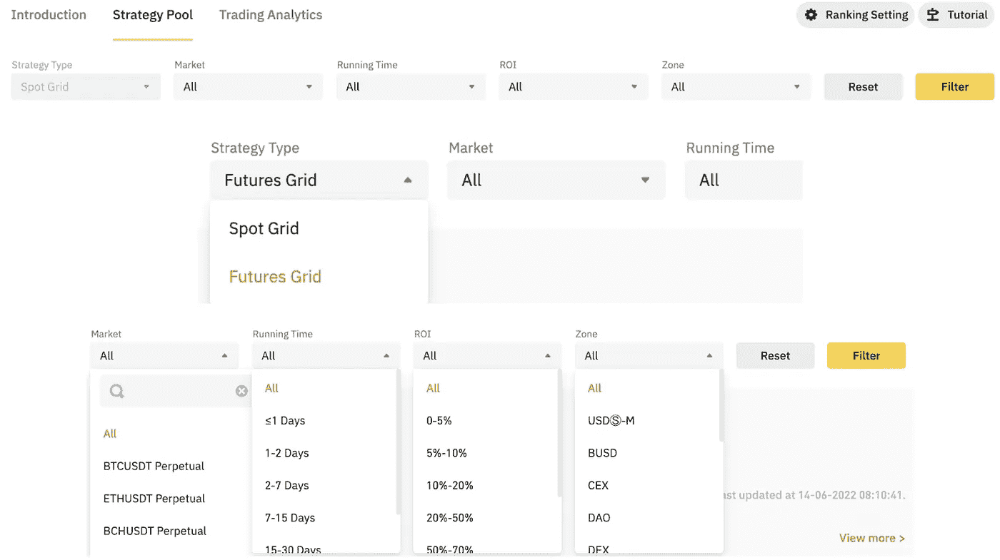

[https://www.binance.com/en/futures](https://www.binance.com/en/futures)

*   显示相应的 ROI、NLP 或受欢迎程度

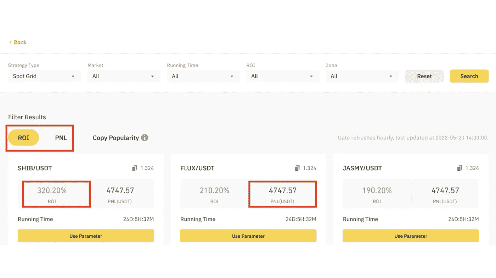

[https://www.binance.com/en/futures](https://www.binance.com/en/futures)

*   **复制流行度**强调在币安的现货网格或期货网格中复制订单的频率。

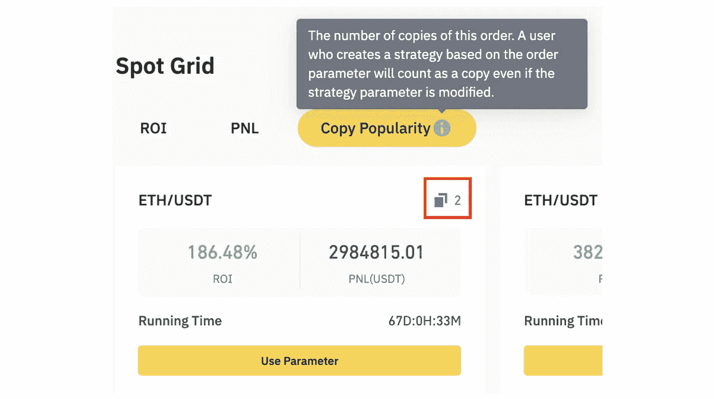

[https://www.binance.com/en/futures](https://www.binance.com/en/futures)

*   在期货网格中，**方向**显示网格交易策略的当前方向，可以是多头、空头或中性。

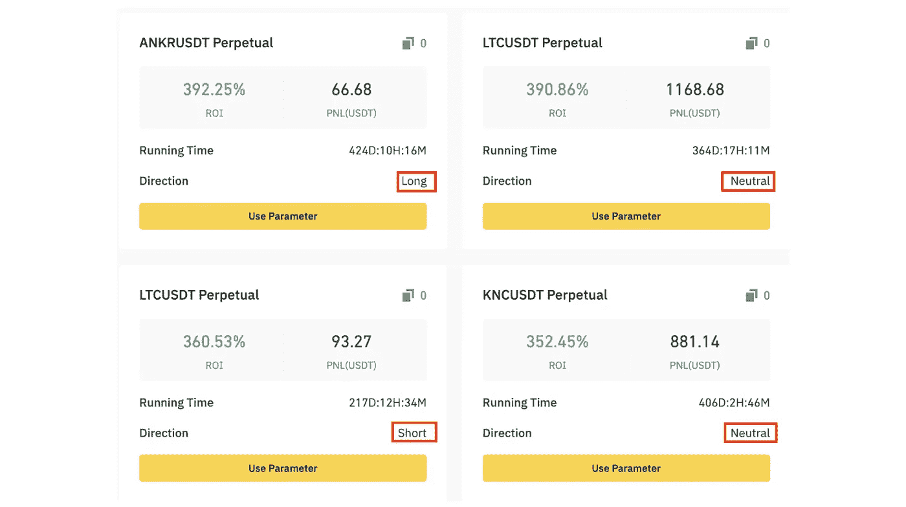

[https://www.binance.com/en/futures](https://www.binance.com/en/futures)

*   在现货网格和期货网格上复制/调整网格交易参数选择**使用参数**显示订单及其共享参数。

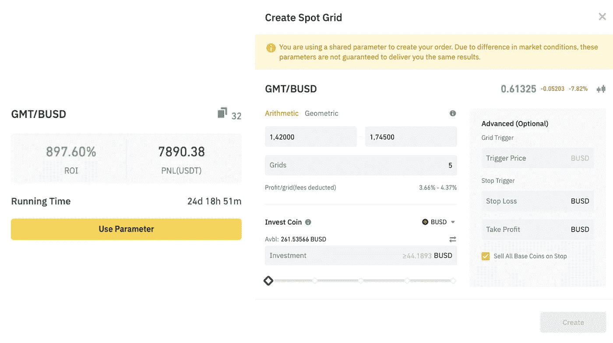

[*Spot Grid Parameters Replication*](https://www.binance.com/en/futures)

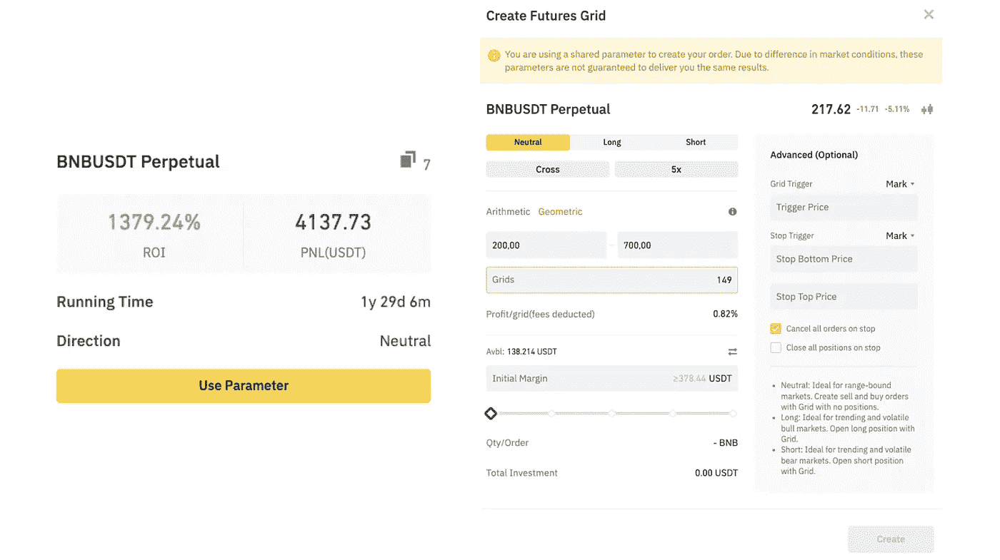

[*Futures Grid Parameters Replication*](https://www.binance.com/en/futures)

利用模拟交易环境练习策略交易也是可以的，这样会更好。以下是步骤…

从币安主页点击**简介** > > > **模拟交易**

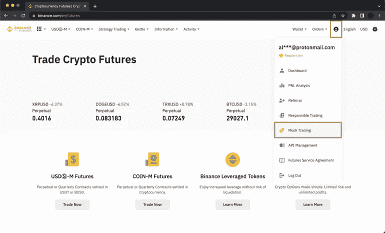

[https://www.binance.com/en/futures](https://www.binance.com/en/futures)

授予对测试网的访问权，并点击**继续**

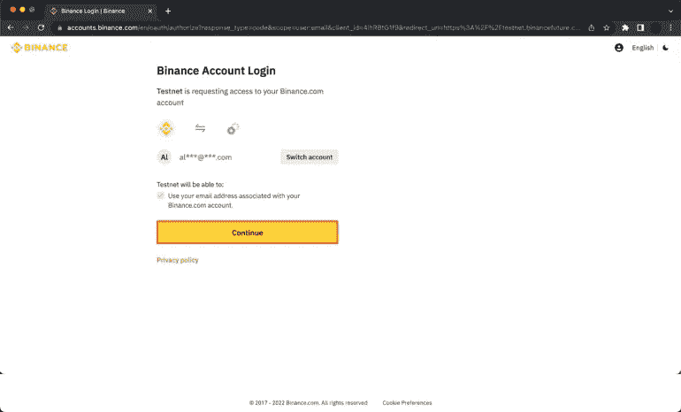

[https://www.binance.com/en/futures](https://www.binance.com/en/futures)

您可以使用 3000 美元的无风险初始余额作为演示余额来练习策略交易，并在随后提高策略交易水平。一旦你有足够的信心开始真正的交易，点击**回到生活**

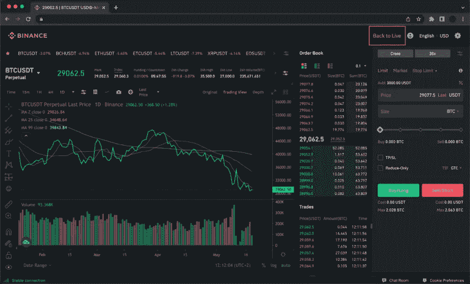

[https://www.binance.com/en/futures](https://www.binance.com/en/futures)

总之，记住，没有一个策略是有效的，除非它被执行。

了解更多…[https://www . binance . com/ES-ES/support/FAQ/f 0 C2 BD 5 BC 16 c 40 b 9998d 22549 e 91 CD 1 c](https://www.binance.com/es-ES/support/faq/f0c2bd5bc16c40b9998d22549e91cd1c)

今天就开始你的期货交易之旅吧！[https://www.binance.com/en/futures](https://www.binance.com/en/futures)

今天就创建一个免费的 https://www.binance.com/en/buy-sell-crypto?ref=ZCF73TU7 帐户

**快乐交易:)**