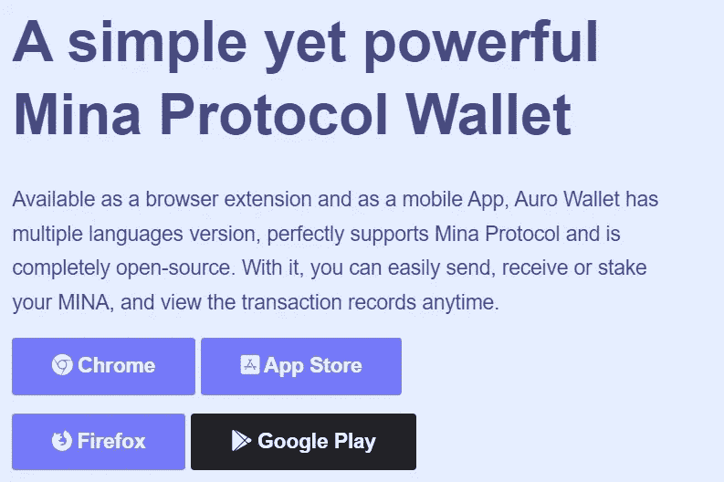
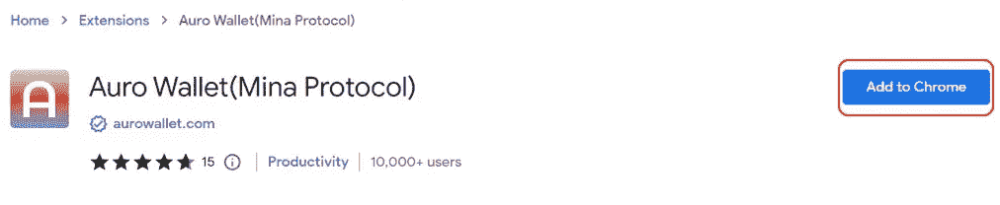
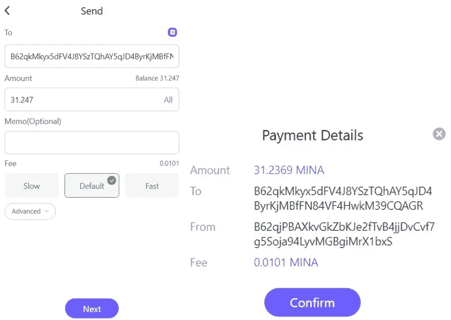
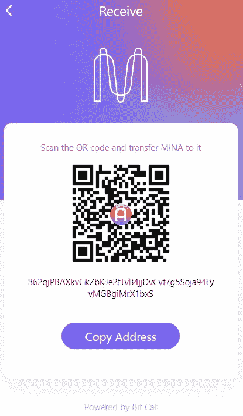
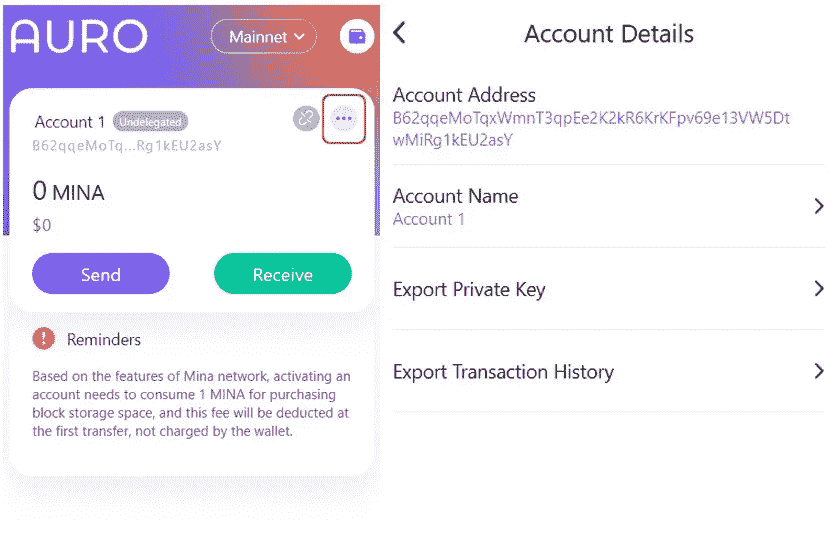
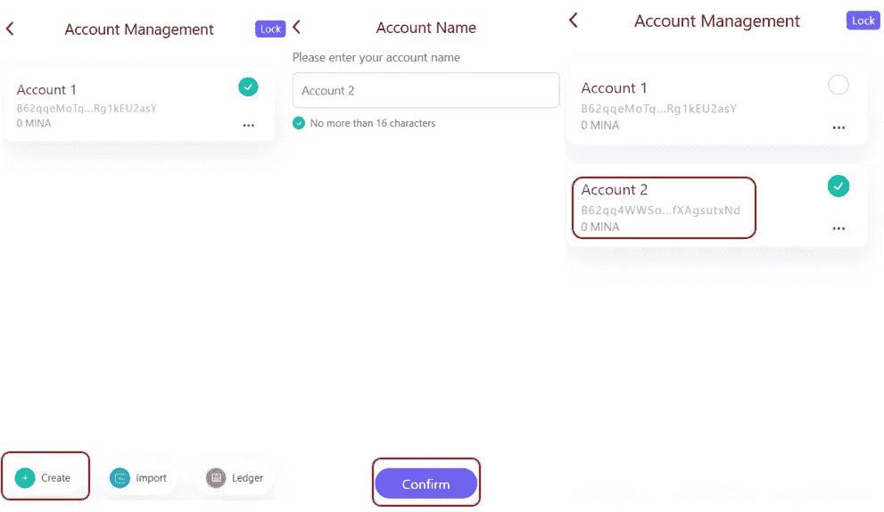
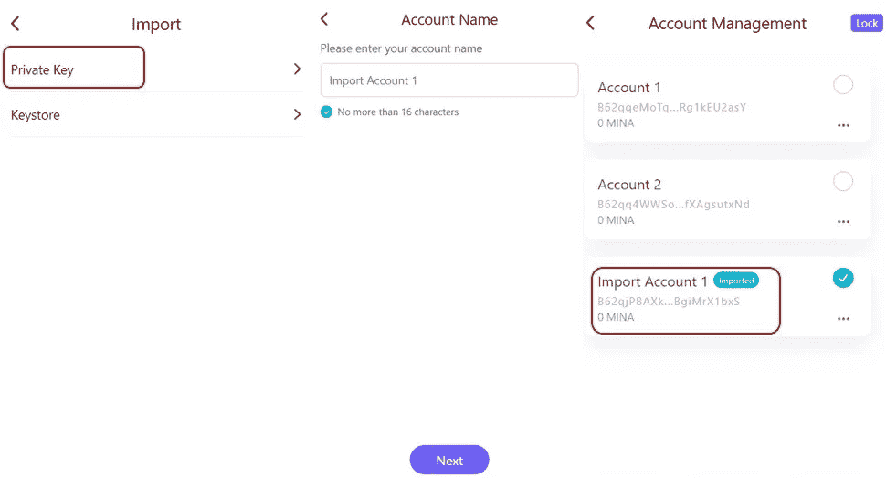
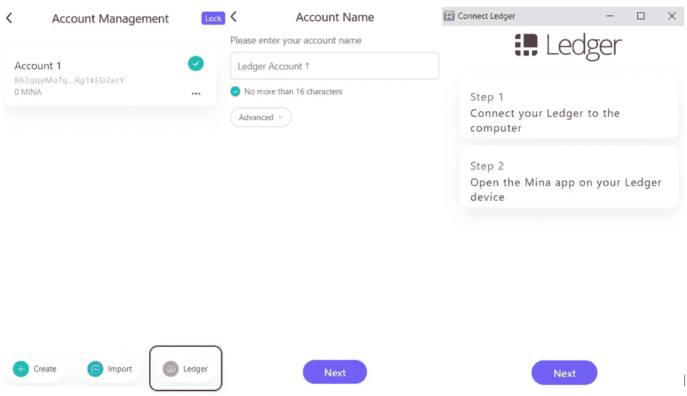

# 如何使用奥诺钱包

> 原文：<https://medium.com/coinmonks/how-to-use-the-auro-wallet-eb6606634665?source=collection_archive---------12----------------------->

本指南包含如何安装、设置和使用奥诺钱包的详细步骤。

## [奥诺钱包](https://www.aurowallet.com/)是一个简单而强大的钱包，允许用户与 Mina 协议进行交互。该钱包可作为谷歌浏览器、火狐浏览器和移动应用程序(Android、iOS)的浏览器扩展。用户可以使用该应用程序发送、接收或下注他们的 MINA 令牌。它还支持硬件设备，即分类帐。

在本文中，我们将解释如何为谷歌 Chrome 浏览器安装和使用奥诺钱包。

**访问奥诺钱包**

要安装钱包，请访问[链接](https://www.aurowallet.com/)。从下面的截图可以看出，该平台显示了为谷歌 Chrome、Firefox、App Store (iOS)和谷歌 Play 商店安装钱包的选项。选择你想要的选项。

如前所述，我们将安装 Google Chrome 浏览器扩展的应用程序。

**安装奥诺钱包**

点击 **Chrome** 选项，应用程序将带你进入[页面](https://chrome.google.com/webstore/detail/auro-walletmina-protocol/cnmamaachppnkjgnildpdmkaakejnhae)。

在这里，你会发现**添加到 Chrome** 按钮。点击此按钮。浏览器将要求您批准将应用程序添加到您的扩展中。

提供您的批准，应用程序将安装在您的扩展中。您可以在您的扩展中看到下面突出显示的图标。

**设置奥诺钱包**

点击奥诺应用程序。您将获得以下选项来设置您的钱包:

*   **为新用户创建钱包-**
*   **为现有用户恢复钱包-**

**创建钱包**

想要访问网络的新 Mina 协议用户可以使用创建钱包选项创建新的钱包。

点击**创建钱包**选项。该应用程序将要求您设置您的钱包的密码。接下来，它将显示您需要安全存储的 12 个字的备份短语。在最后一步，应用程序会要求您验证关键短语，一旦验证正确，您就可以看到钱包的登录页面。

**注意:**Mina 协议购买块存储收取 1 个 Mina 令牌。这是因为该协议的内置架构要求用户支付 1 MINA 令牌来激活帐户。当您第一次向您的钱包帐户转账时，将自动扣除该令牌。

**发送**

使用发送选项，您可以将 MINA 令牌转移给其他 wallet 用户。

要传输，点击**发送**按钮。将出现一个页面，您需要在其中输入收件人地址和您希望转移的 MINA 令牌数量。提供备忘录(如果您知道，可选)。您可以将交易速度和交易成本设置为慢速、默认和快速。

审查并确认流程。

**接收**

要在您的帐户中接收 MINA 令牌，您需要知道您的公共/接收地址。你可以和其他用户分享这个地址，或者简单地用它从交易所或其他平台转移 MINA。

要获得您的接收地址，您需要点击出现在您钱包登录页面上的**接收**按钮。该应用程序将向您显示 QR 代码和地址，您可以使用这些代码和地址来接收您帐户中的资产。

**账户明细**

用户可以从该选项卡查看其帐户相关的详细信息。

1.  **账户地址-** 在此查看您的账户/公共地址
2.  **帐户名称-** 设置/更新您的帐户名称
3.  **导出私钥-** 您可以在这里看到您的私钥，并可以进行备份
4.  **导出交易历史-** 使用此选项保存您交易历史的副本
5.  **删除账户-** 删除您选择的账户

**账户管理**

奥诺钱包提供以下方式来管理您的帐户:

1.  **创造**

钱包允许用户在应用程序中创建多个帐户。用户可以通过进入**创建**选项卡创建账户。为您的帐户命名并确认该过程。这些账户彼此完全独立，您可以使用它们分别存储和管理您的资金。

1.  **导入**

使用**导入**选项，您可以导入现有账户。该应用程序提供了两种导入帐户的方法:

*   通过私钥
*   通过密钥库文件

我们将向您展示如何通过提供您的私钥来导入帐户的步骤。

选择此选项，应用程序将要求您给这个帐户一个名字。接下来，输入所需钱包的私钥，并确认该过程。

可以看到账户已经导入，并标有 **Imported** 。

**重要提示:**所有导入的账号都会打上**导入的**标签。

1.  **总账**

奥诺钱包为莱杰提供支持。您可以按照以下步骤访问您的分类帐设备:

*   将您的分类帐设备与笔记本电脑/计算机连接，并通过输入您的个人识别码进行连接
*   在应用程序目录(分类帐设备)中搜索 MINA 应用程序并安装它
*   按照屏幕上显示的过程在奥诺钱包和分类帐之间建立连接。
*   将 MINA 从钱包转移到分类帐。

在本文的下一部分，我们将解释如何使用奥诺钱包来下注你的 MINA token。

***注:*** *本帖首发* [*此处*](https://www.altcoinbuzz.io/bitcoin-and-crypto-guide/how-to-use-the-auro-wallet/) *同*[*ltcoinbuzz . io*](https://www.altcoinbuzz.io/)**。**

***跟着我***

***👉**推特*

***👉**[**Linkedin**](https://www.linkedin.com/in/ruma-das-a1439320/)*

> ***交易新手？尝试[加密交易机器人](/coinmonks/crypto-trading-bot-c2ffce8acb2a)或[复制交易](/coinmonks/top-10-crypto-copy-trading-platforms-for-beginners-d0c37c7d698c)***