# 如何使用 Blockchain.com 交易所

> 原文：<https://medium.com/coinmonks/how-to-use-the-blockchain-com-exchange-25be96c21021?source=collection_archive---------24----------------------->

详细了解如何在 Blockchain.com 交易所创建账户，以及如何使用该账户交易加密资产。

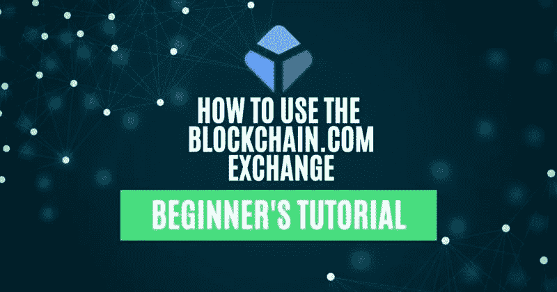

## Blockchain.com 是一个集中的交易所，允许用户存放、提取、存储和管理加密资产。它允许用户进行现货和保证金交易。但平台对保证金交易有一些地域限制。因此，美国、加拿大和其他一些国家的用户不能进行保证金交易。除了交易所，Blockchain 平台还包括一个主要产品，即区块链钱包。

在本指南中，我们将介绍 Blockchain.com 交易所的工作原理及其支持的各种功能。

**进入 Blockchain.com 平台**

要使用该平台，请访问其[网站](https://www.blockchain.com/)。

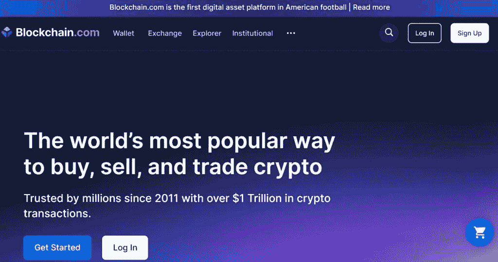

现有用户可以通过提供他们的电子邮件地址和密码登录。新用户需要通过提供一些强制性的细节来注册，如姓名、电子邮件地址、居住地址等。

**报名**

要将**注册到**Blockchain.com 平台，用户需要首先提供以下详细信息:

*   电子邮件地址
*   侨居国
*   设置帐户密码

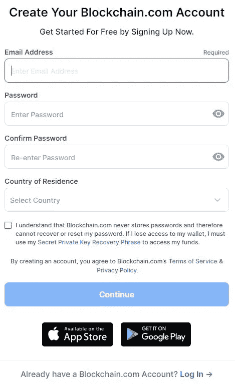

现在，点击**继续**。一封验证邮件将发送到您的电子邮件地址。验证您的电子邮件，您的帐户将被创建。

现在，您将有两种产品可供选择:

*   交换
*   钱包

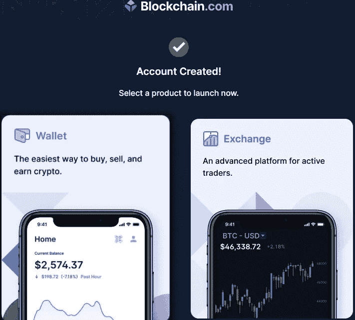

如前所述，我们将在本文中讨论交换。选择**交换**选项卡，应用程序会将您重定向到身份验证流程。

**身份验证**

要使用该交易所，用户首先需要通过身份验证过程。要完成身份验证，他们需要提供以下强制性详细信息:

*   西方人名的第一个字
*   姓
*   告发
*   国家
*   地址

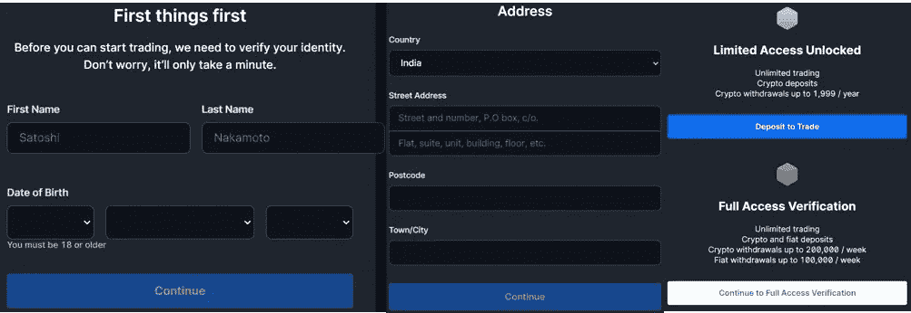

请注意，根据平台，有了这些详细信息，您只能有限地访问交换。这意味着:

*   无限存款
*   无限交易
*   每年最多只能提取 1999 美元
*   不支持固定存款
*   不支持法定提款

但是，我们注意到，在完成**完全访问验证**流程之前，我们不允许存放任何资产。

**完全访问验证**

点击**完全访问验证**，应用程序会要求您回答几个问题。之后，它会要求你提交一份身份证明文件(驾驶执照、身份证或任何政府授权的文件)，然后是一张现场自拍。所有这些细节将提交给 Blockchain.com 团队[进行核实。一旦他们批准了您的详细信息，您就可以使用您的帐户。](https://www.blockchain.com/)

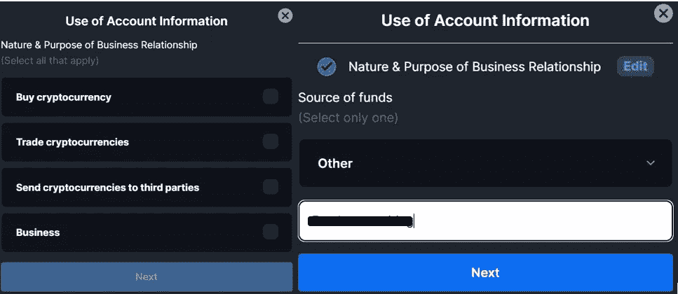

用户现在可以继续将资产存入他们的帐户。

**存款**

要将任何资产存入您的账户，请点击**存款**选项卡。现在从下拉列表中选择资产，应用程序将生成您可以用来存放该特定资产的地址。

注意:你会发现大部分资产都支持存放在以太坊网络。因此，建议用户在从其他地址/交易所提取资产时，选择**以太坊/ERC 20** 作为网络。

一旦你收到资产，你就可以去**投资组合**选项卡查看你的余额。

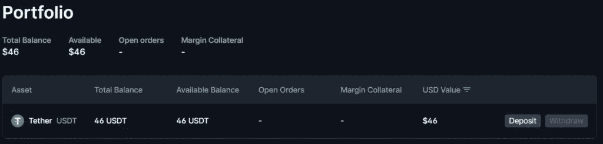

**撤回**

要从您的 exchange 帐户中提取任何资产，用户必须首先设置 2FA。你可以访问这个[链接](https://login.blockchain.com/en/#/security-center/basic)并通过 Google Authenticator 应用程序设置你的 2FA。

一旦完成，你就必须将取款地址加入白名单(见下面的截图)。

一旦你完成了这两个步骤，你就可以开始提取你的资产了。

**市场**

**市场**标签列出了现货交易平台支持的各种资产对。

您可以针对任何资产对点击**交易**按钮进行交易。生成的页面将显示有关其价格趋势(左侧)、购买/出售订单簿(右侧)和您的订单历史(页面底部)的信息。

在最右边，你会看到“买入/卖出”标签，你可以在这里下单。在这里，您将看到订单类型的不同选项卡，即市价、限价和止损限价。

*   **市场** —以市场价格下单。
*   **限价** —允许您设定买入/卖出的价格。
*   **止损限额** —允许用户在资产触及特定价格时买入/卖出。

**购买**

要购买任何资产，首先从**市场**选项卡中选择交易对。现在转到**买入**选项，选择您希望下的适当订单类型，即市价、限价或限价止蚀单。

在这个例子中，我们以市场价格下了一个简单的购买订单。输入您希望用于购买合成令牌(此处为 ADA)的源令牌(此处为 USDT)的金额或百分比。预览并提交订单。

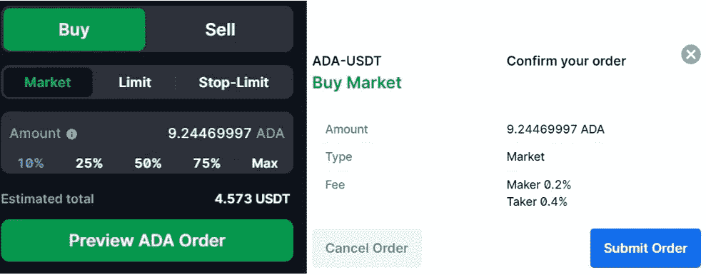

交易成功后，生成的令牌将出现在您的投资组合中。

**出售**

如果您希望出售现有资产来购买其他资产，请转到**出售**选项卡。要下单，请进入**现货交易- >卖出选项卡**。现在，再次选择您想要执行的交易类型。填写您希望出售的现有源令牌的数量，应用程序将显示您将收到的结果令牌的数量。

确认该过程，您可以在您的帐户中看到最终的令牌金额。您的现有资产将减少您在下订单时输入的金额。

**边距**

用户需要明确地验证他们的保证金交易账户。一旦你的账户被确认，你就可以下保证金订单。

要下保证金订单，请转到**保证金**选项卡。在这里，您可以看到可用于保证金交易的交易对列表。

要执行保证金交易，请遵循以下步骤:

*   选择交易对。
*   选择您希望执行的操作，即购买或出售。
*   选择订单类型，如市价或限价。
*   填写您希望交易的金额。
*   选择 2 倍于 5X 的杠杆比率。注意高杠杆意味着高风险。
*   选择担保品类型并填写金额。
*   设定止损价格(如果你愿意)来管理你的风险。
*   查看并下订单。
*   从**位置**标签检查所有的边缘位置。如果您愿意，您可以结束通话或调整宣传资料。

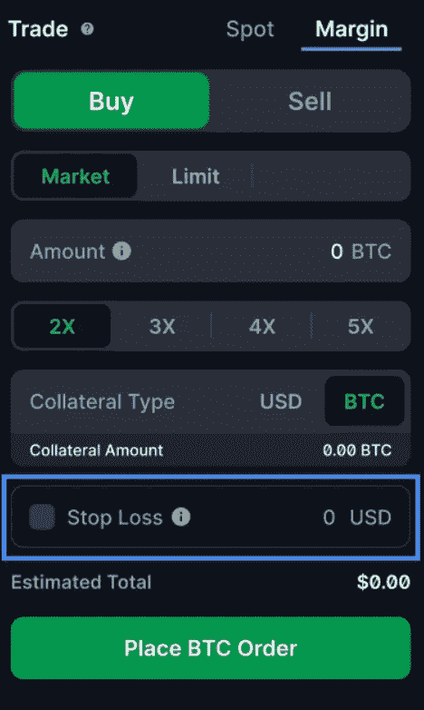

请注意，保证金交易目前在美国、加拿大、日本、德国、荷兰、意大利和受制裁国家不可用。

**历史**

请在此查看您的账户交易历史。从不同的可用选项卡检查现货、保证金、存款和提款的单个交易详细信息。

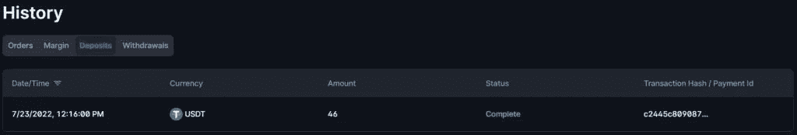

**设置**

在**设置**选项卡下，您可以检查/更新以下详细信息:

*   **帐户—** 检查您的姓名、注册电子邮件地址、推荐链接和货币类型。
*   **安全—** 更新您的密码，启用/禁用 2FA，以及启用/禁用地址白名单选项。
*   **限额和费用—** 在此检查出票人/收款人费用。您还可以查看您的账户存款和取款限额。
*   **税务中心—** 此部分帮助您管理税务。您可以导出整个交易历史，并将其上传到税务中心。

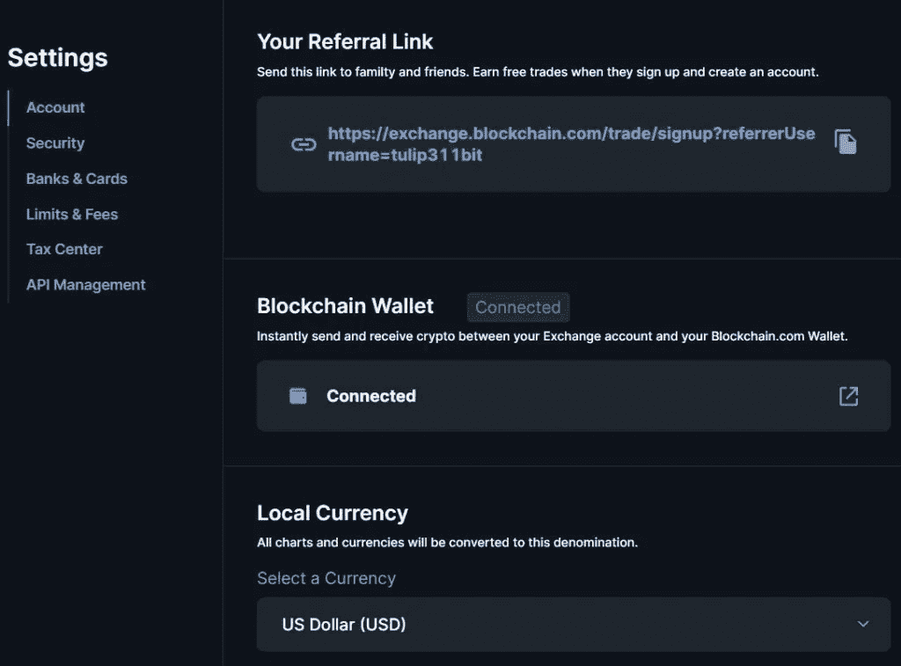

**结论**

Blockchain.com 曾经是最受欢迎的交易所之一。然而，在使用 exchange 时，您可能会注意到您经常被注销，这很令人沮丧。该应用程序会向您发送电子邮件，并在您每次尝试登录时要求您进行验证。我们也注意到只有几个交易对可用，所以你很可能找不到你正在寻找的交易对。大部分的资产押金只能用于以太坊网络，这可能会让你付出很高的代价。取款费也很高，而且要花更多的时间。

***注:*** *本帖首发* [*此处*](https://www.altcoinbuzz.io/bitcoin-and-crypto-guide/how-to-use-the-blockchain-com-exchange/) *同*[*ltcoinbuzz . io*](https://www.altcoinbuzz.io/)**。**

*跟我来*

***👉** [推特](https://twitter.com/rumadas123)*

***👉**[**Linkedin**](https://www.linkedin.com/in/ruma-das-a1439320/)*

> ***交易新手？尝试[加密交易机器人](/coinmonks/crypto-trading-bot-c2ffce8acb2a)或[复制交易](/coinmonks/top-10-crypto-copy-trading-platforms-for-beginners-d0c37c7d698c)***