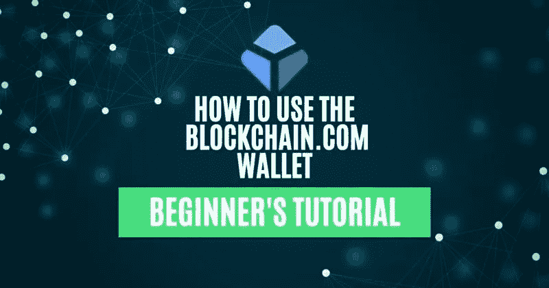
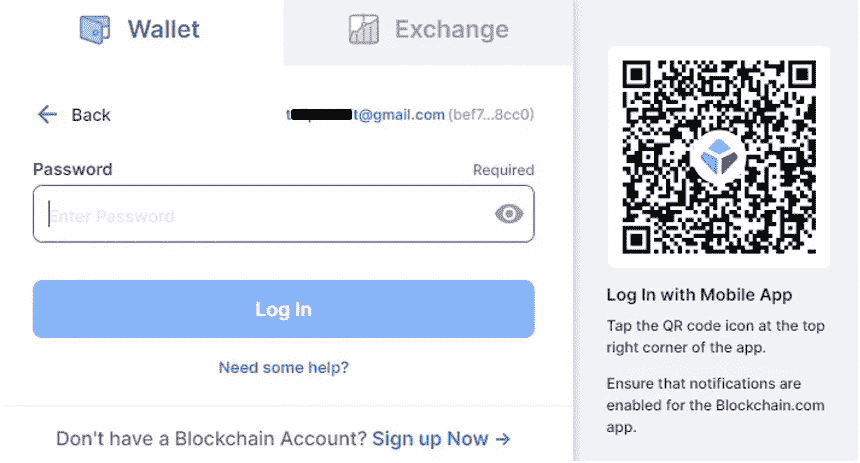
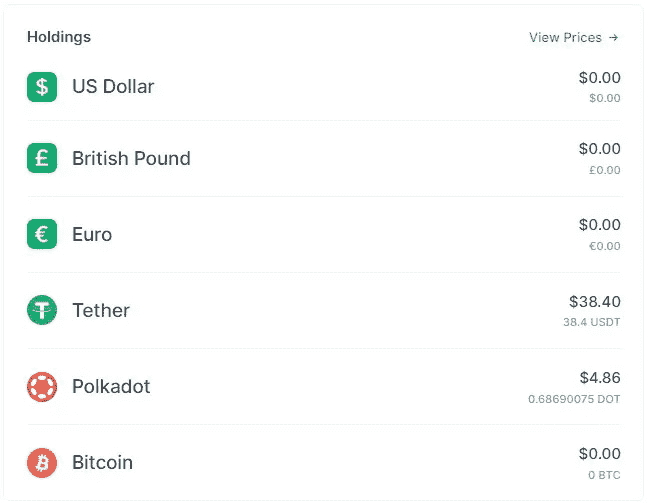
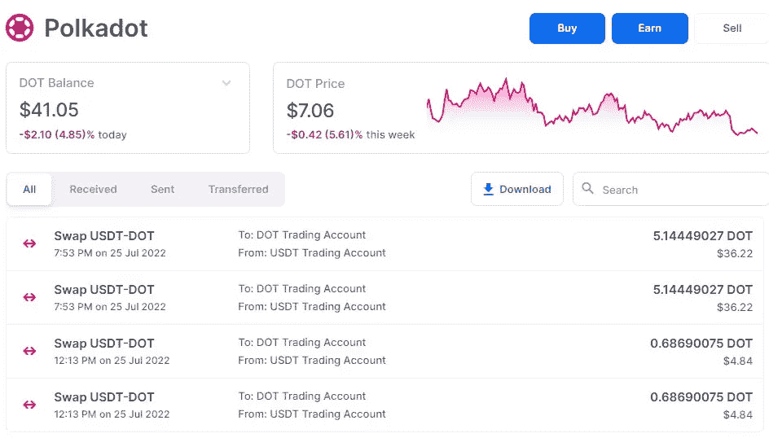
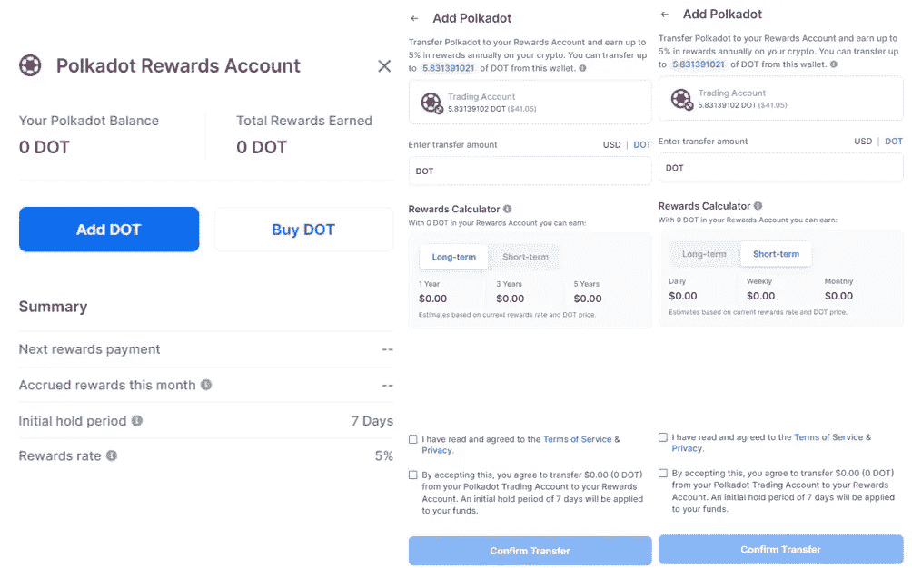
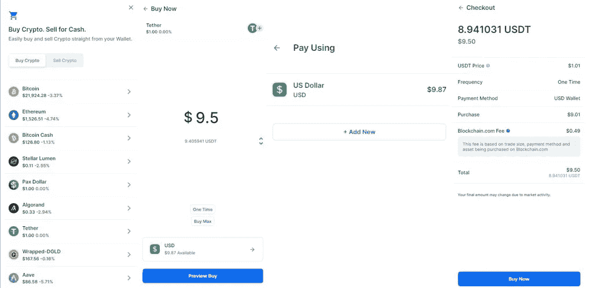
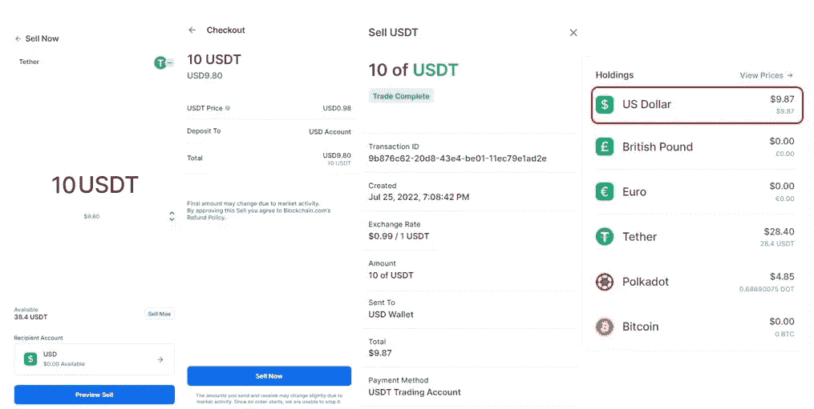
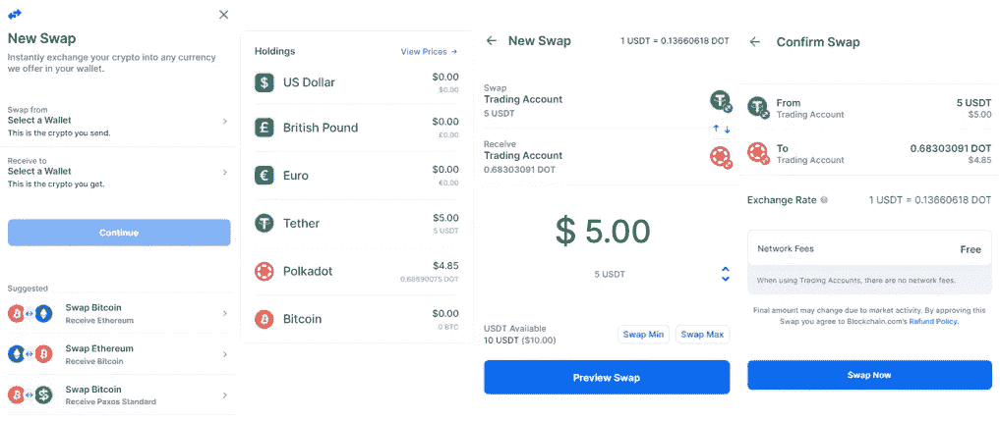
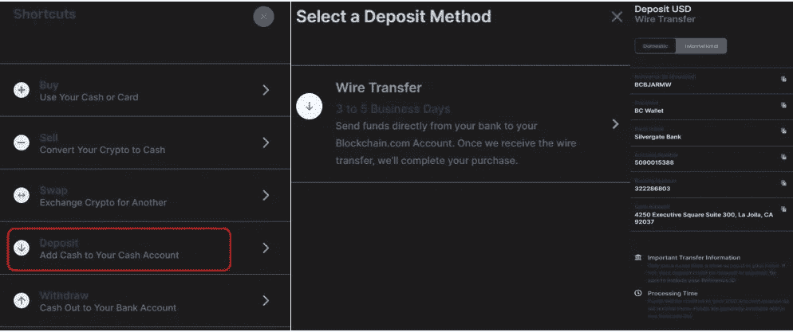
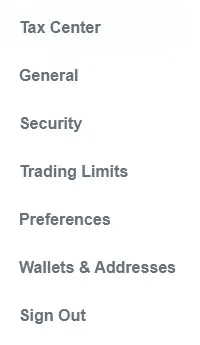

# 如何使用 Blockchain.com 钱包

> 原文：<https://medium.com/coinmonks/how-to-use-the-blockchain-com-wallet-d2110cca89bf?source=collection_archive---------28----------------------->

本指南包含安装和使用 Blockchain.com 钱包的详细步骤。

## 在我们的[上一篇文章](/coinmonks/how-to-use-the-blockchain-com-exchange-25be96c21021)中，我们解释了如何在 Blockchain.com 交易所创建一个账户以及如何使用它。在本文中，我们将讨论 Blockchain.com 平台的另一个重要产品，即 Blockchain.com 钱包。这是一个简单的钱包，允许用户发送、接收、交换和购买/出售加密货币。该应用程序有移动(Android、iOS)和桌面两个版本。

我们试图在我们的手机上安装安卓版的 Blockchain.com T4 钱包。但是，应用程序不允许我们截图。因此，我们将用电子钱包应用程序的 web 版本来介绍该指南。

**进入 Blockchain.Com 钱包**

要访问钱包的网络版本，请访问此[链接](https://www.blockchain.com/en/wallet)。你会看到下面的屏幕。

如果您是现有用户，那么您可以通过提供您的凭证通过**登录**按钮登录。

新用户需要点击**注册**按钮。这将允许他们通过提供一些基本信息来创建一个帐户。

**报名**

如果你是新用户，点击页面右上角的**注册按钮**。

**注意:**如果您已经注册了 Blockchain.com 交易所，那么您不需要再次注册钱包。你可以在 Blockchain.com 交易所**查看我们的指南来了解如何注册。**

因此，已经注册的用户可以通过给出他们的电子邮件地址和密码来登录。

也可以用手机(安卓、iOS)扫描二维码安装使用该应用。

**首页**

**Home** 选项卡包含用户在他/她的账户中持有的资产列表。它显示你的加密令牌和一些法定货币。

**发送**

通过**发送**选项，用户可以将资产转移到其他一些钱包地址。

要发送，首先选择资产和账户(主要是交易)。接下来，填写接收地址和您希望发送的金额。最后，检查并确认流程。

**接收**

通过**接收**选项卡，您可以生成一个接收地址，用于接收 Blockchain.com 钱包中的资金。

要生成地址，点击**接收**按钮。现在，选择您希望接收的资产。选择账户作为交易账户。此外，该应用程序将显示接收地址和二维码，您可以使用这些地址和二维码或与其他用户共享来接收资产。

**资产明细**

用户可以点击特定的资产来了解关于它的更多细节。例如，在下面的截图中，您可以看到 **Polkadot** 资产的详细信息。在这里，您可以查看您的持仓量、价格走势、资产交易摘要(可以去个人发送、接收标签了解更多详情)等。您可以在这里找到一个**下载**按钮，您可以用它来下载交易详情。

**赚**

在上面的截图中，可以看到**赚**按钮。该选项卡允许用户以不同的期限(短期/长期)存放资产，并从中赚取奖励。

请注意，用户需要持有资产至少七天，并且在此期间不允许提取资产。奖励每日累积，每月发放。您可以在您的奖励账户中查看您的奖励。

如果您希望存放代币，请单击**赢得**选项卡。现在点击**添加圆点**。现在填写金额和期限。你也可以在这里查看奖励率。确认转账并赢取奖励。

**贸易**

在**贸易**选项卡下，您可以找到以下功能:

1.  **购买**

**购买**标签让你用 USD(美元)购买密码。我们的账户里有一些美元，我们将用来购买 USDT(系绳)。

要购买，点击**购买**按钮。接下来，选择资产并填写您希望购买的美元金额。选择 USD 作为您的付款方式(如果有多种付款方式，您可以选择任何一种)。核对费用，确认购买流程。

交易完成后，您将收到代币。

1.  **出售**

**出售**选项允许您出售您的加密资产，以换取传统货币，如美元、英镑等。

要出售，首先选择资产(本例中为 USDT)和您希望出售的金额。在收款人账户中选择 USD。查看并确认订单。交易成功后，您将立即收到美元。

1.  **互换**

交换选项允许您将一项资产与另一项资产进行交换。您可以交换现有资产以获得新的加密资产。

要交换，点击**交换**按钮。选择**换出【来源】**和**接收到【输出】**资产。填写源令牌的金额并确认流程。

1.  **存款**

使用存款功能，用户可以将美元存入他们的钱包账户。目前钱包仅在网页版支持美元的存取款。选择**存款(将现金添加到您的现金账户)- >电汇。**然后，应用程序将显示一个唯一的存款地址，包括您的唯一参考号、账号和银行代号以及一些说明。

使用这些详细信息存款，您将在钱包中收到所需金额的美元。查看此[链接](https://support.blockchain.com/hc/en-us/articles/4417075779604-How-can-I-deposit-USD-via-wire-transfer-)了解更多详情。

**设置**

从**设置**选项卡，您可以检查/执行以下活动:

*   **税务中心—** 帮你管理资产。您可以从此部分导出您帐户的交易详细信息，并将其上传到税务中心。
*   **常规—** 检查您唯一的钱包 ID，并在此添加信用卡详细信息。
*   **安全—** 检查/更新注册的电子邮件，启用/禁用 2FA，并在此检查您的备份短语。
*   **交易限额—** 查看您与购买/销售、发送/接收/交换、银行提款、奖励等相关的限额。
*   **首选项—** 在此部分，您可以设置语言、货币和主题，添加手机号码，以及设置自动超时限制。
*   **钱包和地址—** 导入并管理您的比特币地址。

***注:*** *本帖首发* [*此处*](https://www.altcoinbuzz.io/bitcoin-and-crypto-guide/how-to-use-the-blockchain-com-wallet/) *同*[*A*ltcoinbuzz . io](https://www.altcoinbuzz.io/)*。*

跟我来

**👉** [推特](https://twitter.com/rumadas123)

**👉**[**Linkedin**](https://www.linkedin.com/in/ruma-das-a1439320/)

> **交易新手？试试[加密交易机器人](/coinmonks/crypto-trading-bot-c2ffce8acb2a)或者[复制交易](/coinmonks/top-10-crypto-copy-trading-platforms-for-beginners-d0c37c7d698c)**