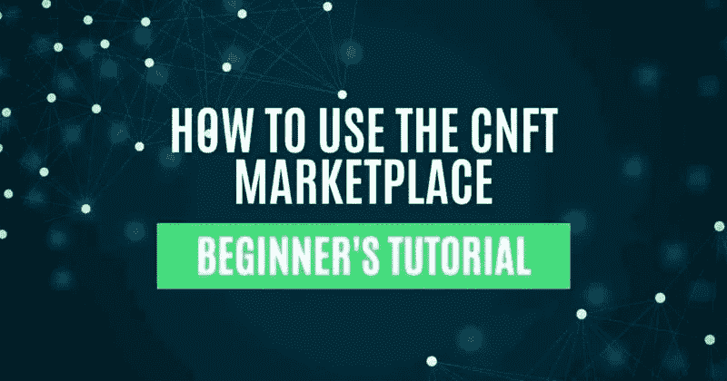

# 如何使用 CNFT 市场

> 原文：<https://medium.com/coinmonks/how-to-use-the-cnft-marketplace-5a62446ba9a7?source=collection_archive---------35----------------------->

本指南包含如何访问和使用 CNFT 的详细步骤，CNFT 是 Cardano 网络上的一个 NFT 市场。

## 2021 年 7 月推出， [CNFT。IO](https://cnft.io/) 是 [Cardano](https://www.altcoinbuzz.io/cryptocurrency-news/cardano-updates-vasil-hard-fork-update-august-week-2/) 网络上的 NFT 市场。它声称是卡尔达诺第一个官方的 NFT 市场。该平台拥有一些受欢迎的 NFT 卡尔达诺生态系统收藏，包括 Spacebudz、Pavia、Clay mates、Ape society 等。用户可以探索大量的 NFT 来安全地购买、出售或交易。CNFT marketplace 支持连接各种 Cardano 网络钱包，如 Nami、Gero、Flint 等。

市场对上市项目施加了严格的验证过程。您可以根据每个已验证的 NFT 检查已验证的策略 ID(黄色星形勾号)。该平台为即将到来的 NFT 项目提供 Launchpad 功能，并通过在 Launchpad 仪表板和 Discord 服务器上展示这些功能来推广它们。

因此，在本文中，我们将解释如何访问和使用 CNFT 市场的各种功能。

**进入卡尔达诺 NFT 市场**

要访问卡尔达诺 NFT 市场，请访问[链接](https://cnft.io/)

**连接钱包**

要连接您的钱包，请点击主页右上角的**链接钱包**按钮。该平台允许用户使用以下任何钱包类型进行连接:

*   娜美钱包
*   永恒
*   弗林特钱包
*   Gero 钱包
*   Typhon 钱包

使用以上任何一个钱包连接到平台。我们将使用纳米钱包进入市场。

如果你是 Cardano 的新用户，并且第一次使用 Nami、Gero 和 Flint 钱包，请阅读下面链接中的指南:

*   [如何使用娜美钱包](https://www.altcoinbuzz.io/bitcoin-and-crypto-guide/how-to-use-the-nami-wallet/)
*   [Gero 钱包指南](https://www.altcoinbuzz.io/bitcoin-and-crypto-guide/how-to-use-the-gerowallet/)
*   [如何使用火石钱包](https://www.altcoinbuzz.io/bitcoin-and-crypto-guide/how-to-use-the-flint-wallet/)

**仪表盘**

从“dashboard”部分，用户可以导航到以下选项卡，并获得有关其投资组合的更多详细信息:

1.  **概述**

从**概述**选项卡，您可以获得关于您个人资料的综合数据。用户可以从该选项卡检查以下内容:

*   你的库存
*   您创建的项目
*   你喜欢的项目
*   最近启动的项目

1.  **库存**

从这个部分，用户可以检查他们持有的数字对象列表。

1.  **发售**

检查你出售的物品清单。

1.  **项目**

从该选项卡中，您可以获得有关他/其他用户的项目的信息:

*   你的项目
*   喜欢的项目
*   你可能喜欢的项目
*   最近推出

1.  **通知**

在此查看有关您购买、出售 NFT 的通知/消息。

1.  **最爱**

点击这里查看你最喜欢的资产/ NFT 列表。

1.  **简介**

**配置文件**选项卡，让您设置您的帐户详细信息，包括:

*   配置文件名称
*   电子邮件地址
*   电影《阿凡达》
*   横幅图像
*   启用/禁用设置对项目和资产的公共/私人访问的选项
*   启用/禁用将库存项目设置为公开/私有的选项
*   设置对项目进行公共/私人访问的选项

1.  **外观**

在此更改仪表板外观(暗模式/亮模式)。

**探索**

从该选项卡中，用户可以查看当前可供销售的数字资产列表。用户可以基于以下字段对 NFT 应用过滤器:

*   销售类型(全部、立即购买、捆绑)
*   最高和最低价格
*   类别(艺术、音乐、摄影、游戏、收藏品、元宇宙)
*   项目(帕维亚、JRney 等)

如果你不太了解任何项目，只想简单地购买 NFT，那么你可以根据价格范围和他们的上市时间表来分类。

如果你点击出现在 NFT 列表顶部的省略号，你可以找到一个 **Like、Share** 和 **Report** 选项。因此，即使你不想购买任何 NFT，你也可以简单地喜欢它们或者通过复制链接与用户/平台分享它们。如果您注意到 NFTs 没有遵守平台设定的规则，您甚至可以通过点击**报告**按钮来报告 NFTs。

**项目**

从此选项卡查看市场上可用的活动项目列表。该页面还列出了趋势项目、最近列出的项目和 10 大收藏，以便于访问。

**活动**

从 Activity 选项卡，您可以检查平台统计信息。用户可以在这里找到两个部分:

**排名**

根据交易量、底价、销售额和铸币量，查看卡尔达诺网络上排名靠前的 NFTs 项目的统计数据和排名。

**销售**

检查 NFT 销售相关数据，跟踪最新的资产交易细节。

**发射台**

在定义项目参数时，创建者可以选择在 Launchpad 上显示他们的项目。如果您选择该选项，您即将推出的项目将显示在卡尔达诺 NFT 市场的启动台上以及 Discord 服务器上。(我们将在**创建项目**部分解释您需要选择什么选项来显示您的项目)。

**如何购买 NFT**

愿意购买数字资产的用户，导航至**浏览**选项卡。在这里，你可以找到所有目前在售的 NFT。用户可以基于市场支持的各种参数来过滤 NFT。选择所需的资产，您现在可以看到**购买**按钮。

当您打开任何要购买的 NFTs 时，您会注意到一个免责声明，要求在进行最终购买之前验证策略 ID。用户需要将卡尔达诺 NFT 市场的 NFT 中给出的策略 ID 与项目网站上提到的策略 ID 相匹配。

您也可以从页面底部检查 NFT 属性。

完成 NFT 后，点击**购买**按钮。这将触发你的纳米钱包交易。通过输入您的钱包密码来确认交易。您的购买请求已提交至网络。一旦请求得到处理，用户将在其帐户中收到通知。然后，您可以在**库存**中检查所需的 NFT。

**如何在市场上刊登物品**

创作者可以在市场上以固定价格列出他们的 NFT。目前不支持拍卖功能。

要列出项目，请从清单中选择资产。现在，点击**出售资产**按钮(见上面的截图)。

接下来，输入您希望出售资产的金额(以 ADA 币为单位)。

如果你想将此物品设为私人物品，请点击**标记为私人出售**按钮**。**选中此按钮后，只有拥有列表链接的用户才能访问该对象。

**不同类型的助推**

用户可以使用$CNFT 代币来增加他们的列表。你可以找到两个选项来增加你的列表:

*   **单次促销-** 收取标价的 20%。您的 NFT 将显示在探索页面的一个单幅图块中。例如，如果你以 100 ADA 列出你的资产，那么你需要为一次提升支付 20 元 CNFT
*   **双提升-** 收取标价的 40%。您的 NFT 将显示在探索页面的双磁贴中

无论您选择哪个选项，应用程序都将显示流程所需的$CNFT 令牌数量。也查一下服务费。

填写完所有必需的详细信息后，点击**创建列表**。

这将触发你的纳米钱包交易。通过输入您的钱包密码来确认交易。该过程需要几分钟来确认。

完成后，您可以进入您的**个人资料- >出售**标签，查看您已出售的商品列表。

如果用户不想出售他们的 NFT，他们可以通过点击**取消出售**按钮随时取消他们的列表。但是，请注意，要将您的 NFTs 退市，您需要支付网络费用。此外，为提升列表而支付的$CNFT 令牌将不会退还给您。

**创建项目**

在 CNFT 卡达诺 NFT 市场上市项目并不容易。用户可以创建他们的项目，但要列出来，他们需要在 Twitter 或 Discord 上联系 Cardano 支持团队进行验证。用户需要提交一张票据，提及有关其项目的强制性详细信息，包括:

*   项目名
*   项目描述
*   项目 URL
*   徽标、横幅和特色图像
*   策略 ID
*   类别(艺术、音乐、摄影、游戏、元宇宙等)
*   社交媒体链接(Twitter、discord 等)
*   发射台

在核实了细节之后，小组将决定他们是否将该项目列入清单。你可以在这里阅读链接[来了解更多关于创建项目的信息。](https://cnft.zendesk.com/hc/en-gb/articles/4806285342737-How-do-I-get-my-PolicyIDs-verified-on-CNFT-IO-)

**结论**

CNFT 是 Cardano 网络上最受欢迎的 NFT 市场之一。该平台允许用户通过安全的智能合约代码以固定价格(稍后将实施拍卖选项)购买/出售经过验证的 NFT。除了上市，CNFT marketplace 还计划在不久的将来提供造币、拍卖、项目启动平台、批量销售和 DEX 设施。

***注:*** *本帖首发* [*此处*](https://www.altcoinbuzz.io/bitcoin-and-crypto-guide/how-to-use-the-cnft-marketplace/) *同* [*一个* ltcoinbuzz.io](https://www.altcoinbuzz.io/) *。*

跟我来

**👉** [推特](https://twitter.com/rumadas123)

**👉**[**Linkedin**](https://www.linkedin.com/in/ruma-das-a1439320/)

> **交易新手？试试[加密交易机器人](/coinmonks/crypto-trading-bot-c2ffce8acb2a)或[复制交易](/coinmonks/top-10-crypto-copy-trading-platforms-for-beginners-d0c37c7d698c)**