# 如何使用比特币基地 NFT 市场

> 原文：<https://medium.com/coinmonks/how-to-use-the-coinbase-nft-marketplace-48525f79af52?source=collection_archive---------20----------------------->

本指南包含如何访问和使用比特币基地 NFT 市场的详细步骤。

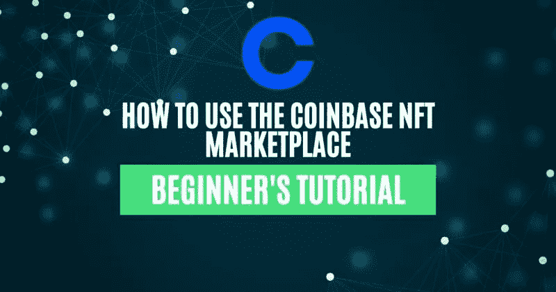

## 2022 年 4 月 20 日，[比特币基地](https://www.altcoinbuzz.io/cryptocurrency-news/polygon-updates-coinbase-wallet-now-supports-polygon-nfts-july-week-1/)平台推出 NFT 市场。该市场最初只对注册用户开放，然而，在 2022 年 5 月之后，它对所有用户开放，以买卖 NFT。铸造功能仍然仅限于一些预先批准的创作者。

目前，[比特币基地 NFT 市场](https://nft.coinbase.com/discover)仅支持以太坊网络上的 NFT，并接受 ETH 支付。该平台计划在不久的将来与其他区块链一起运行。市场不收取任何费用来购买或出售资产(仅在有限的时间内)。因此，用户只需支付燃气费用就可以批准交易。创作者可以互相关注，并可以将他们的推特账户与他们的比特币基地·NFT 个人资料联系起来。

此外，比特币基地 NFT 市场正处于测试阶段，所以在连接你的钱包时要格外小心。因此，在这篇文章中，我们将解释如何使用比特币基地 NFT 市场来买卖 NFT。

**如何进入比特币基地 NFT 市场**

要访问比特币基地 NFT，请访问[链接](https://nft.coinbase.com/)。用户可以看到下面的登陆页面。然后你需要签到。

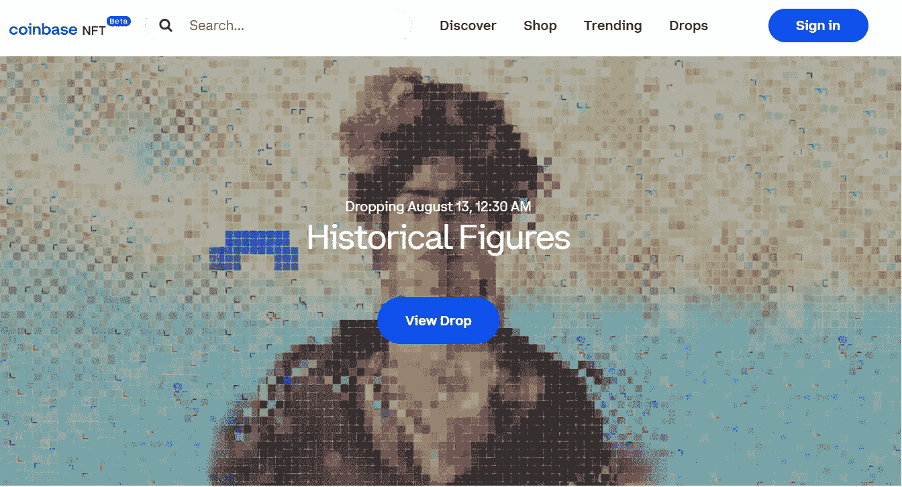

来源:[比特币基地 NFT 市场](https://nft.coinbase.com/) **1)签到**

另一方面，用户需要通过连接自己的加密钱包与平台建立连接。您需要点击出现在主页右上角的“**注册”**按钮。您可以使用 coinbase wallet、metamask 和 WalletConnect。

因此，在本文中，我们将使用我们的 Metamask 钱包来使用该平台。此外，正如我们前面提到的，该平台目前支持以太坊网络的 NFTs。现在，我们将教你如何设置你的帐户。

**2)账户设置**

用户可以在**用户名**字段中搜索他们想要的名字。此姓名将显示在比特币基地 NFT 仪表板/帐户中。接下来，提供您的电子邮件地址。

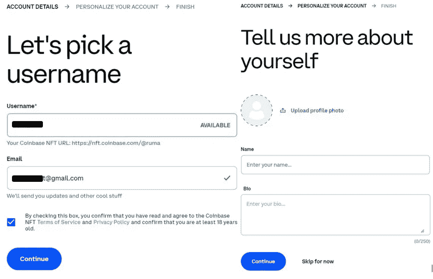

来源:[比特币基地 NFT 市场](https://nft.coinbase.com/)

要个性化您的帐户，您可以添加个人资料图片、姓名和简短简历。然后，将发送一封验证电子邮件。因此，验证您的电子邮件，您将登陆到平台的登录页面。

此外，已验证其帐户的用户将在其个人资料名称中有一个验证标记(√)。这将有助于检查用户帐户的真实性。买家将确信看到从一个经过验证的卖家那里完成的购买。现在，你需要添加加密到你的帐户。在这种情况下，我们将使用 ETH。

**3)向比特币基地支付添加 ETH**

因为市场只支持以太坊网络。用户需要在他们的联网钱包中有 ETH 来购买资产。如果你没有持有 ETH，那么你可以通过连接到你的比特币基地交易所账户来购买。现在，我们将描述现有的可用选项卡:

**一)发现**

在**发现**标签页，您可以查看平台用户评论和点赞最多的热门收藏/ NFT(当前)。

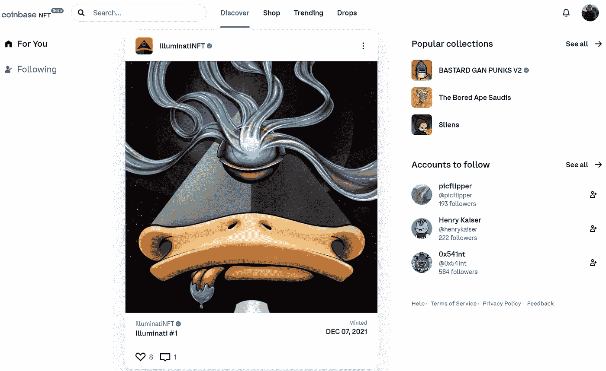

来源:[比特币基地 NFT 市场](https://nft.coinbase.com/)

而且，从“**关注”**部分，可以看到你关注的艺人名单。点击**账号关注**按钮，获取所有平台艺人名单，想关注就关注。

**b)商店**

**商店**标签包含当前市场上可交易的所有非功能性食品的列表。该平台向用户提供多个参数来过滤出想要的对象。用户可以使用以下字段来过滤结果:

*   根据最新/旧列表、高价和低价对 NFT 进行排序
*   最低和最高价格
*   货币类型(瑞士法郎，美元)
*   收藏品

来源:[比特币基地 NFT 市场](https://nft.coinbase.com/)

除了这四个参数之外，用户还可以通过给出 NFT 的名称来直接搜索对象。在每个 NFT 下，你可以找到一个评论和喜欢的图标。用户可以喜欢和评论任何 NFT，即使他们不希望购买它们。

所以，如果你想跟踪所有喜欢和评论 NFT 的人，那么你可以访问你的个人资料并查看“**管理 NFT”**部分。

如何购买一辆 NFT

用户可以购买比特币基地 NFT 市场上列出的任何 NFT。你可以查看物品底部给出的 NFTs 的价格。

要购买，点击“**购买”**按钮(见上图截图)。现在，您可以看到有关 NFTs 的更多详细信息，包括:

*   介绍
*   集合名称
*   创建者姓名
*   NFT 属性(背景、布料、眼睛、嘴唇、皮肤等)
*   铸造日期
*   总版本
*   版税
*   所有者列表
*   评论/活动
*   列出的版本。

在下图中，您将看到这些信息是如何显示的:

来源:[比特币基地 NFT 市场](https://nft.coinbase.com/)

所以，你需要点击“**买 1”**版，你会被重定向到**结账页面**。接下来，点击**打开钱包支付**。这将触发您需要确认的元掩码事务。而且，一旦交易成功，你可以去你的**个人资料- >管理 NFT- >拥有**查看新买的 NFT。

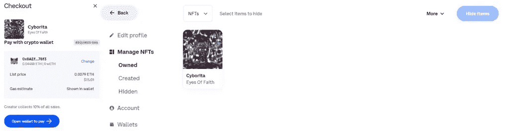

**注意:**您所购买的 NFT 可能在您的个人资料中的 **Owned** 部分不可见。在这种情况下，转到**隐藏**选项卡，选择 NFT，然后**取消隐藏**它。然后，它将移动到**拥有的**字段。

**如何刊登待售 NFT**

用户可以在市场上列出他们的待售物品。要出售，请访问您的个人资料，选择所需的对象，并点击“**列表出售”**选项。

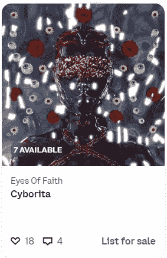

此外，您将被重定向到 NFTs 主要描述选项卡，在这里您可以看到各种列表，并可以选择列出您的版本。

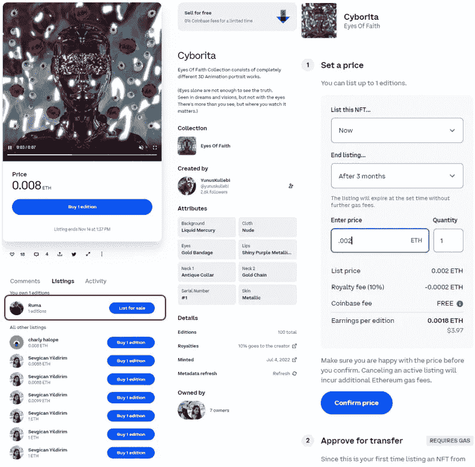

然后，您需要点击**待售清单**。用户现在必须定义几个参数来登记要列出的项目:

*   定义登记出售 NFT 的时间(现在、明天、具体日期和时间)
*   列表结束(1 周、4 周、3 个月、从不、具体日期)
*   设定销售价格

**注:**比特币基地 NFT 平台不收取任何费用(仅在有限的时间内)。将扣除 10%的版税(最初由创作者设定)，一旦售出，您将收到剩余的金额。

因此，如果你是第一次从某个系列中挑选 NFT 作品，你必须:

*   **首先批准转账流程:**要批准，请确认您的 Metamask wallet 中生成的交易。
*   **再次签署 Metamask 交易以在市场中列出项目:**参见第二个截图，NFT 被列出。

如果你愿意，你可以点击**取消列表**按钮从列表中删除你的物品。此外，用户需要支付交易成本来从市场列表中移除该项目。

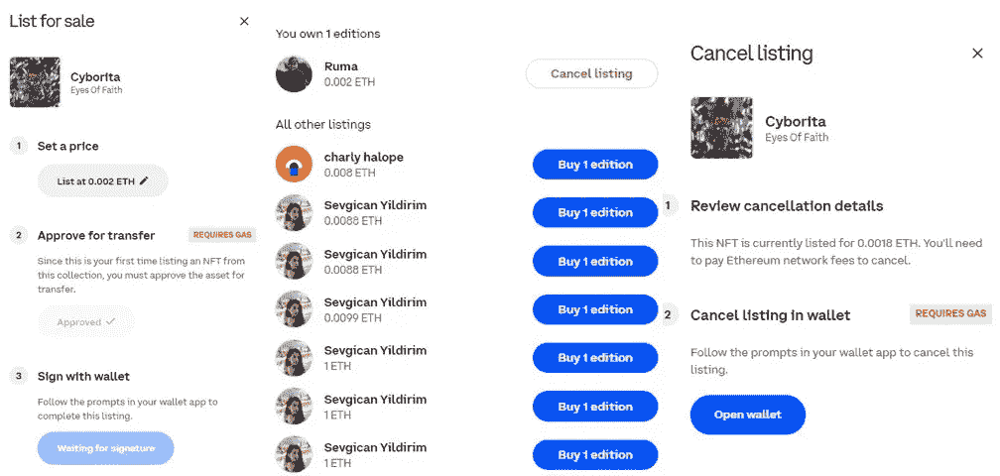

物品售出后，你的帐户会收到通知。

**NFT 趋势**

此外，检查趋势**集合**的交易量列表。用户可以根据 7 天、30 天或所有时间值重新组织数据。您还可以查看特定收藏的所有者数量、总项目数、日交易量和交易量变化百分比。

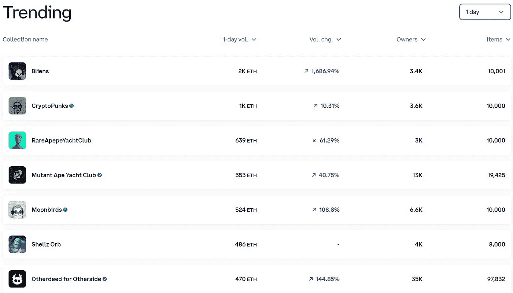

然后，您可以单击任何一个集合来获取更详细的信息。

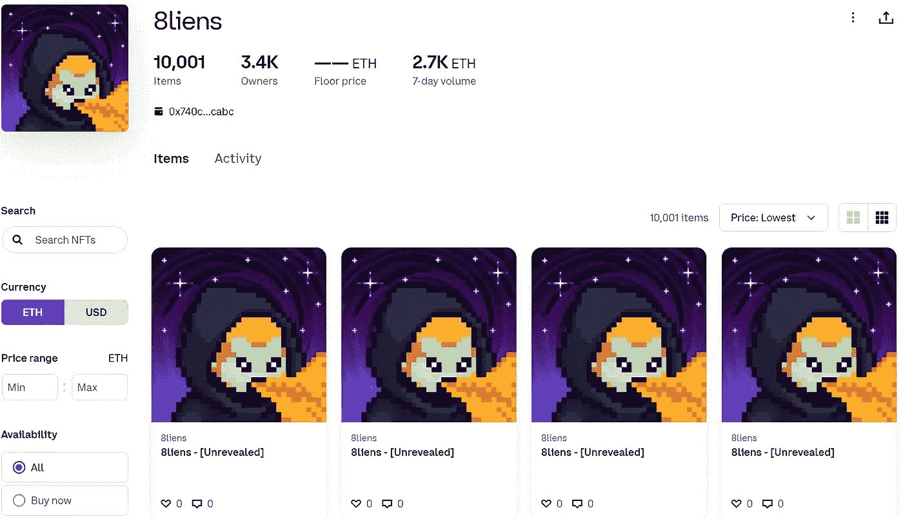

**NFT 滴**

点击此处查看即将进行的空投清单。你可以点击**提醒我**按钮，在你的电子邮件地址中设置关于 NFT 系列未来空投的通知。

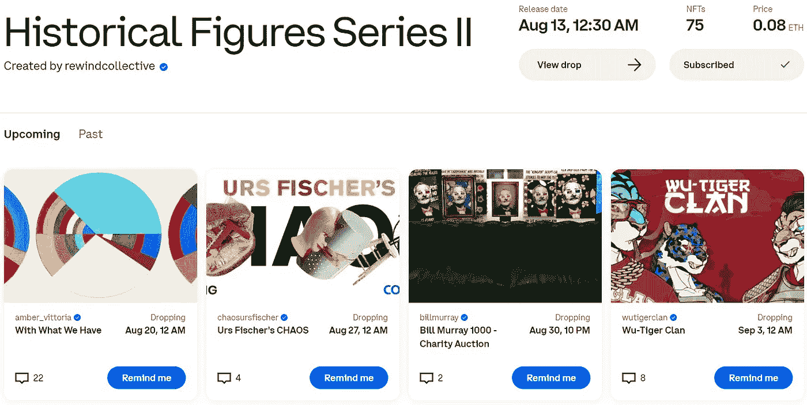

**设置**

此外，设置选项卡允许您检查/更新以下参数:

**1)简介**

在 **Profile** 选项卡下，您可以检查以下字段:

*   NFT 是你的了
*   **创建-** 由您创建/铸造的 NFT
*   **喜欢-** 您喜欢的 NFT 列表
*   **活动-** 用户的活动(购买、销售、铸造、发送、评论)
*   **隐藏-** 任何隐藏的 NFT
*   **管理-** 隐藏/取消隐藏您拥有/创建的 NFT

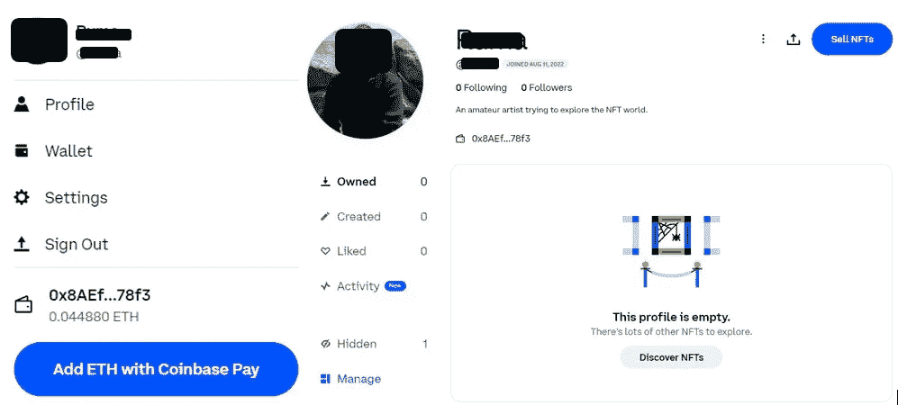

此外，**编辑个人资料**部分可让您更改/更新上述详细信息。用户也可以在这里链接他们的推特账户和比特币基地·NFT 的个人资料。

**比特币基地 NFT 钱包**

另一方面，你可以在这里查看连接到平台的钱包。如果您想切换钱包，点击**连接新钱包**按钮，连接任何支持的钱包。

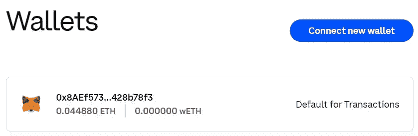

**1)更新您的比特币基地账户**

此外，在此部分，用户可以更改/更新他们的帐户相关数据:

*   请求个人数据
*   改变外观
*   更改或删除帐户
*   启用/禁用交易、促销活动、社交活动等的通知选项

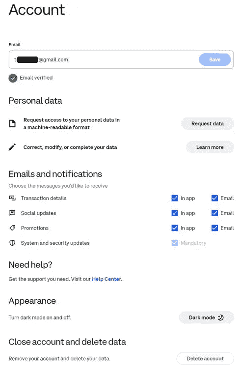

**结论**

此外，比特币基地是最受欢迎和最大的集中式密码交易所之一。随着最近 NFT 市场的启动，该平台旨在为 NFT 行业带来彻底的创新。NFT 市场正处于测试阶段，并非所有的功能都对所有用户开放。

目前，它只支持以太坊网络上的 NFT。随着它开始支持其他网络，将会有更多来自不同网络的用户加入。如果你是一个新用户，想要探索这个界面，那么这是一个理想的时机，因为市场对买卖 NFT 不收取平台费。

最后，你也可以在这里阅读我们之前关于如何使用比特币基地钱包[的指南。](https://www.altcoinbuzz.io/bitcoin-and-crypto-guide/everything-you-need-to-know-about-the-coinbase-wallet/)

***注:*** *本帖首发* [*此处*](https://www.altcoinbuzz.io/bitcoin-and-crypto-guide/how-to-use-the-coinbase-nft-marketplace/) *同*[*ltcoinbuzz . io*](https://www.altcoinbuzz.io/)**。**

***跟着我***

***👉**推特*

***👉**[**Linkedin**](https://www.linkedin.com/in/ruma-das-a1439320/)*

> ***交易新手？尝试[加密交易机器人](/coinmonks/crypto-trading-bot-c2ffce8acb2a)或[复制交易](/coinmonks/top-10-crypto-copy-trading-platforms-for-beginners-d0c37c7d698c)***