# 如何使用 Crypto.com 交易所(第一部分)

> 原文：<https://medium.com/coinmonks/how-to-use-the-crypto-com-exchange-part-1-3deec765b430?source=collection_archive---------16----------------------->

本指南包含如何创建账户和使用 Crypto.com 交易所的详细步骤。

## Crypto.com 的[是遍布 90 多个国家的主要加密货币交易所之一，为全球超过 5000 万用户提供服务。该平台的套件中有多种产品，包括加密货币交易所、defi 钱包、crypto.com 卡(金属 visa 卡)和 NFT 市场。它有一个名为 CRO 的本地令牌，在 Crypto.com 的](https://crypto.com/)[环境中有多个用例，包括赌注、交易费回扣、访问辛迪加等等。](https://www.altcoinbuzz.io/cryptocurrency-news/cronos-chain-updates-crypto-com-receives-license-approval-from-mas-june-week-4/)

我们将涵盖 Crypto.com 平台的所有主要产品。在这篇文章中，我们将解释如何在 crypto.com 交易所创建一个账户，以及如何使用它。

**什么是 Crypto.com 交易所？**

Crypto.com 交易所提供集中交易所拥有的所有设施，包括现货和保证金交易、衍生品交易、赌注、辛迪加(购买新上市的代币，尚未推出)、借贷、场外交易等。

**进入 Crypto.com 交易所**

要使用交换，请访问页面[https://crypto.com/exchange](https://crypto.com/exchange)

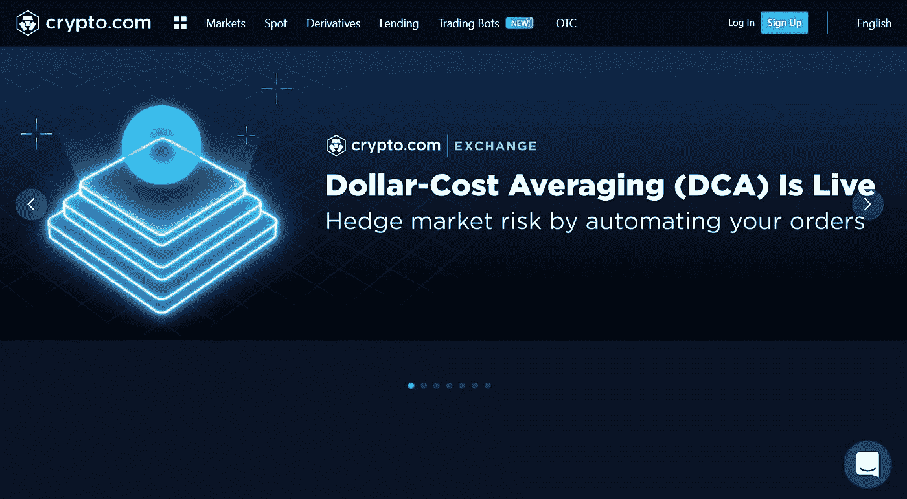

**注册/登录**

现有用户可以通过进入**登录**页面并提供正确的凭证来登录他们的帐户。新用户可以通过**注册**页面创建账户。

对于注册，用户需要提供以下详细信息:

*   西方人名的第一个字
*   姓
*   国籍
*   电子邮件
*   出生日期
*   设置帐户密码
*   推荐代码(如果有)

一封验证邮件将被发送到您的指定电子邮件地址，请验证您的电子邮件。用户现在会收到一个提示，要求通过身份验证过程。

要创建帐户，用户需要通过身份验证过程。这是强制性的。他们需要提交任何政府批准的身份证明文件(护照、驾驶执照或身份证)，并附上一张自拍。Crypto.com 团队将核实您的详细信息。当团队批准您的请求时，您将被允许使用交换。

**存款**

用户可以在帐户验证完成后将资产转移到他们的帐户。

要在您的帐户中获得任何代币，请进入您的 **Spot Wallet** 。现在，针对您想要的代币点击**存款**按钮。这将打开有关令牌的存款详细信息。选择首选网络(ERC-20、Cronos、bep20、Polygon 和 SOL)。选择网络，应用程序将生成存款地址和二维码，您可以复制和共享。

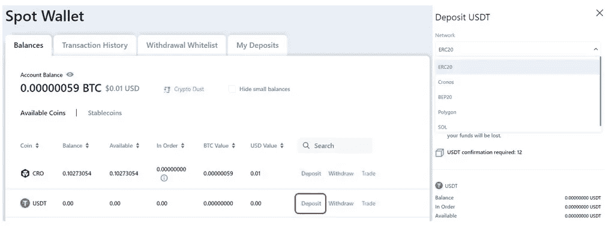

注意，对于不同的令牌，支持网络可能会改变。

**撤回**

要从您的外汇账户中提取资产，您的资金应该在您的现货钱包中。如果不是，那么先把它转到你的现货钱包里，然后再发起取款请求。

要撤销，请单击您要转移的令牌旁边的撤销按钮。关于您的目的地帐户地址，交易所将为您提供两种选择:

*   外部钱包地址
*   com 应用程序-无需任何费用

选择您想要的选项。接下来，您需要填写**目的钱包地址**和您希望转账的**金额**。如果您愿意，您可以转到**添加取款地址**字段，将该目的地地址保存在您的通讯录中(参见下面的屏幕截图)。

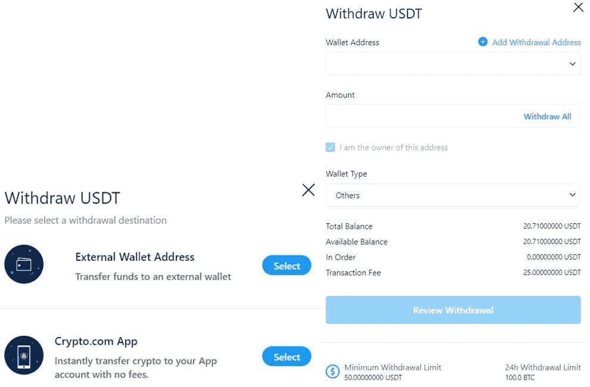

审查并确认流程。

**市场**

从**市场**选项卡，您可以看到现货、保证金和衍生品交易中可用的不同交易对。用户可以根据各种行业过滤市场，包括 Defi、NFTs、产量农业等。

您可以点击交易对的**交易**按钮，并可以直接进入他们的市场，在那里您可以下达买入/卖出订单。

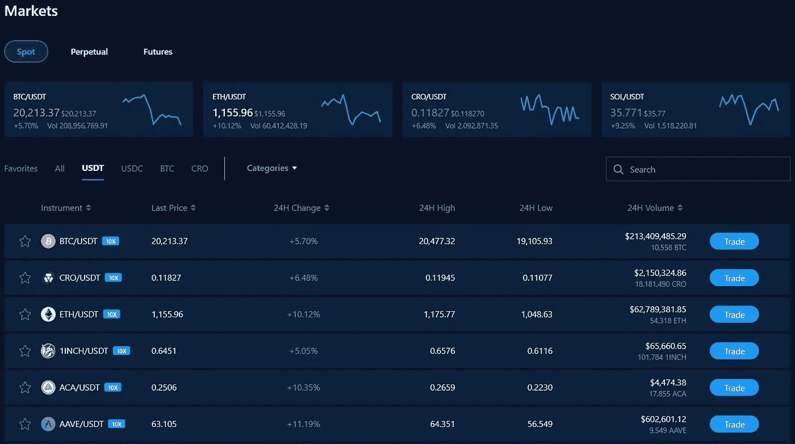

**如何购买/出售代币**

用户需要首先选择他们想要的交易类型，即现货、保证金或衍生品。要进行这些交易，他们需要将其资产转移到相应的钱包类型。比如现货交易可以从现货钱包进行。对于市场或衍生产品交易，将资金从现货钱包转移到保证金或衍生产品钱包。

我们的账户里有一些 USDT，我们将用来购买 CRO(现货交易)。点击**现货市场**选项卡中 **CRO/USDT** 交易对的交易按钮。

将打开一个页面，您可以在其中找到三个不同的下单选项:

*   立即以市场价格买入/卖出
*   限价--允许你设定一个买入/卖出的价格
*   止损限额--当资产达到特定价格时，你可以买入/卖出

现在，去**市场**标签，填写你想购买的 CRO 代币数量。确认流程。您可以从页面底部查看订单详情。

交易将需要几秒钟来确认，一旦完成，您就可以在您的 **Spot 钱包**中看到想要的 CRO。

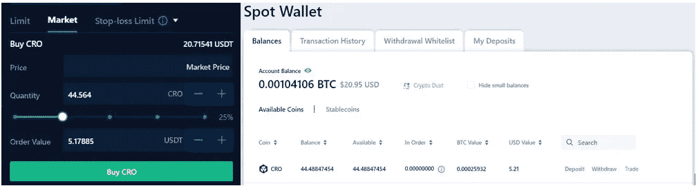

**钱包**

在**钱包**部分，您可以找到以下钱包类型:

*   现货钱包
*   保证金钱包
*   衍生钱包

以上每一种钱包类型都可以让你进行特定的交易活动。例如，无论何时您存取资产，都将使用您的**现货钱包**来完成。

**保证金/衍生品钱包**用于执行保证金/衍生品交易。在进行任何保证金/衍生品交易之前，用户需要首先将资产从他们的现货钱包转移到所需的保证金/衍生品钱包。

**仪表板**

仪表板部分提供了您帐户余额的整体视图。顶部显示了一段时间内您的帐户余额的图形摘要。底部包含用户持有的资产的详细信息。

在页面的右侧，您可以查看最佳表现者、按数量列出的最佳资产以及新条目。

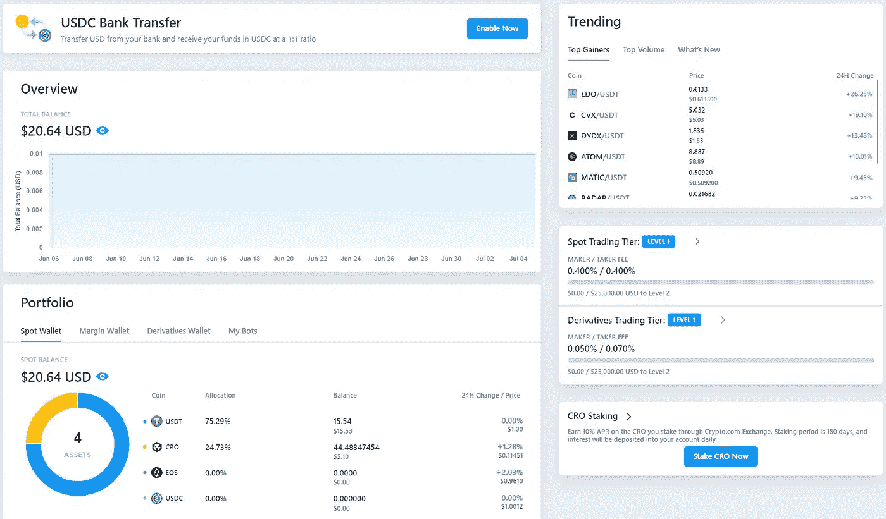

你可以在这里查看你的等级和与之相关的制作者/接受者费用。以及移动到下一个级别所需的 CRO 量。

**银行转账**

Crypto.com 允许用户通过银行账户转账美元，并以 1:1 的比例将 USDC 存入他们的外汇账户。

用户需要到**银行转账**部分添加他们的银行和账单详情。项目团队将核实您的详细信息，并在获得批准后通知您。

之后，你可以按照指示从你的银行账户存入美元，并收到 USDC 作为回报。

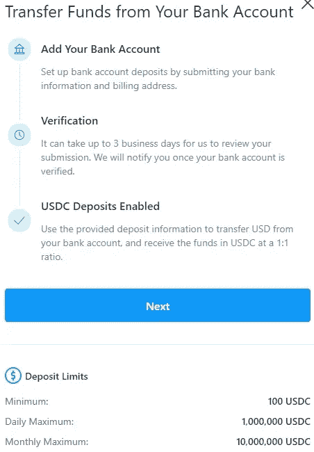

**子账户**

“子帐户”部分允许您创建和管理各种辅助帐户。用户可以为所有三个主要交易账户创建子账户。

*   **账户管理**

此部分允许您创建子帐户，并管理它们。

要创建子账户，进入**账户管理**，点击**创建子账户**按钮。为您的帐户指定一个唯一的名称，并确认该过程。

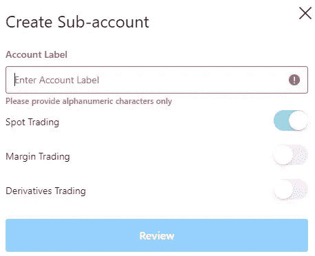

您的子帐户将被创建。

**注:**要创建保证金或衍生产品交易下的子账户，用户需要先创建自己对应的钱包。

您现在可以将资金从您的主(现货)钱包转移到子账户，并分别进行管理。

用户可以查看**更多操作**字段，查看他们可以对现有子账户执行的不同操作。他们可以通过转到此字段来暂停、终止或重新配置。

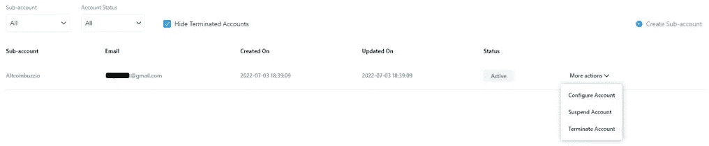

*   **资金管理**

从**账户管理**选项卡创建子账户后，您可以进入**资金管理**选项卡，在主账户和子账户之间转移资金，反之亦然。

正如您在下面的屏幕截图中看到的，基金管理选项卡有三个部分，每个部分描述了交易所支持的三种主要钱包类型。您可以转到任何选项卡，点击**转移**按钮进行资产转移。

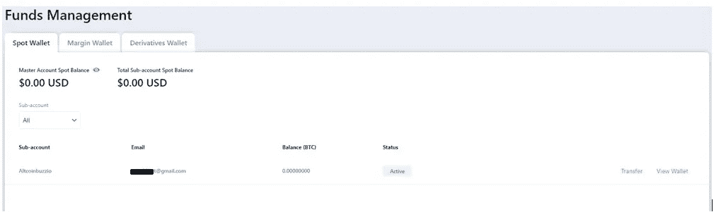

**订单管理**

在该选项卡中，用户可以检查其现货或保证金账户的**未结订单**或**订单历史**。

您可以根据子账户、买入/卖出类型或货币方式过滤订单。

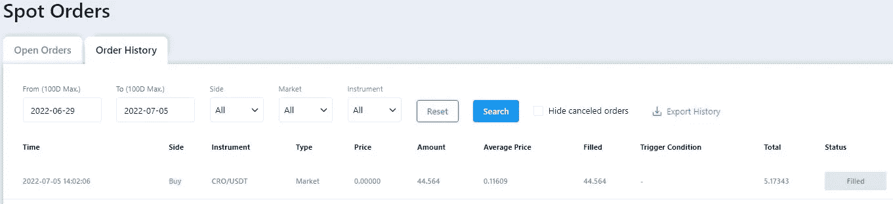

**传输历史**

点击此处查看您的账户转账(转入/转出)历史记录。

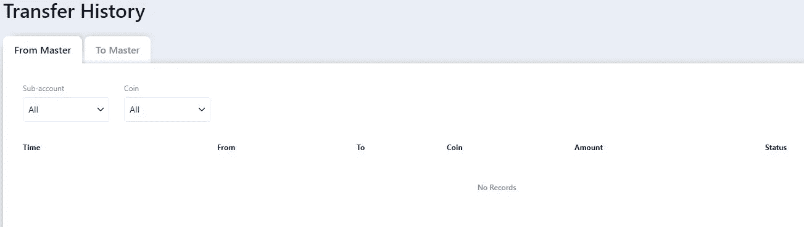

**借贷**

Crypto.com 交易所允许用户存放抵押品，并以此为抵押借入贷款。用户最多可以获得 3 笔贷款，合计最高金额为 50 万美元。他们可以在 12 个月的期限内偿还贷款。下注 CRO 硬币的用户可以享受更高的利率。从本部分的其他选项卡，您可以检查您的贷款和调整历史。

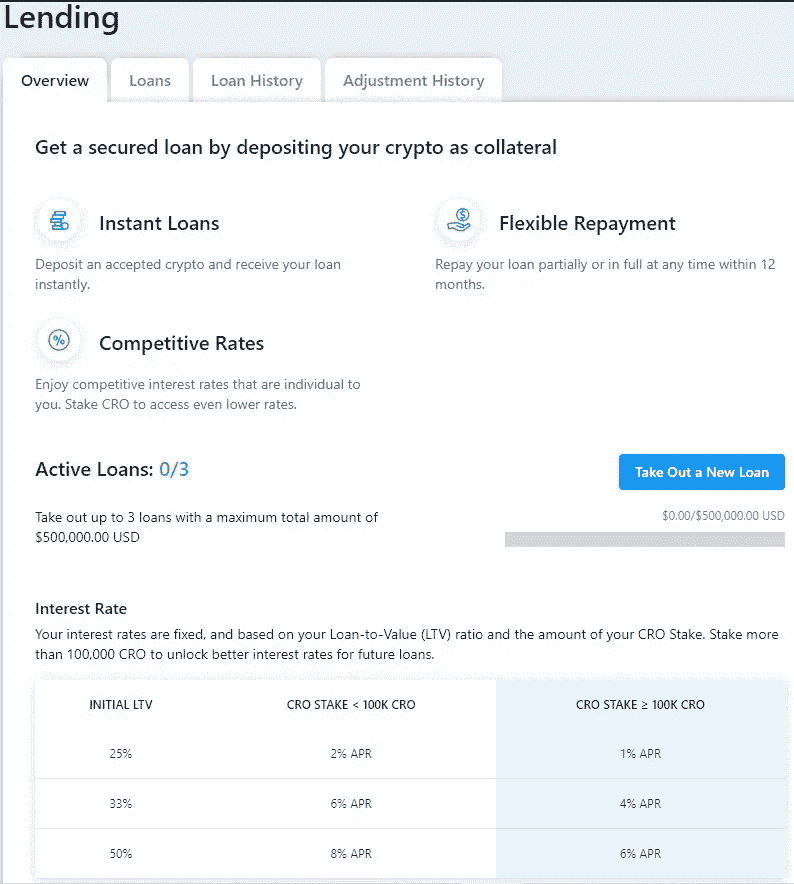

要借一笔贷款，点击**拿出一笔新贷款**按钮。将打开一个页面，然后用户需要填写以下详细信息:

*   选择一个代币作为贷款
*   贷款金额
*   选择一个代币作为抵押品
*   填写担保金额
*   选择 LTV 百分比(贷款/抵押品价值)

从下面的截图可以看出，期限是固定的(12 个月)。年化利率和每日利率将随着 LTV 值的变化而变化。

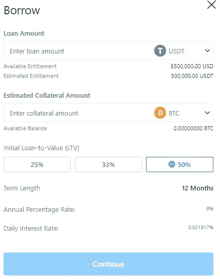

确认该过程，您可以从**贷款**选项卡中看到您的贷款详细信息。

在本文的下一部分，我们将解释如何让 CRO 在 exchange 门户中占有一席之地。

***注:*** *本帖首发* [*此处*](https://www.altcoinbuzz.io/bitcoin-and-crypto-guide/how-to-use-the-crypto-com-exchange-part-1/) *同* [*一个* ltcoinbuzz.io](https://www.altcoinbuzz.io/) *。*

跟我来

**👉** [推特](https://twitter.com/rumadas123)

**👉**[**Linkedin**](https://www.linkedin.com/in/ruma-das-a1439320/)

> **交易新手？试试[加密交易机器人](/coinmonks/crypto-trading-bot-c2ffce8acb2a)或者[复制交易](/coinmonks/top-10-crypto-copy-trading-platforms-for-beginners-d0c37c7d698c)**