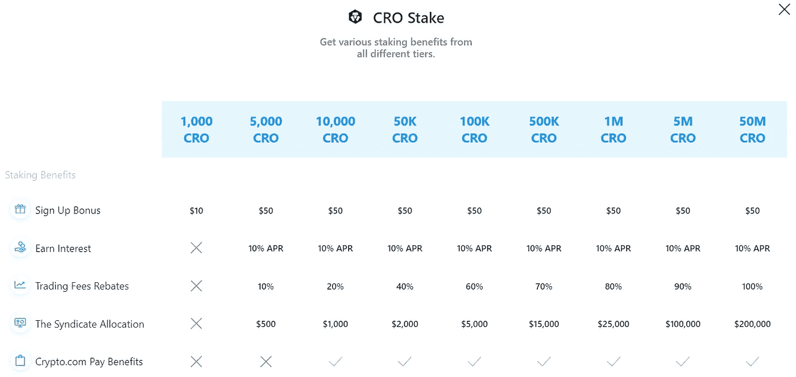
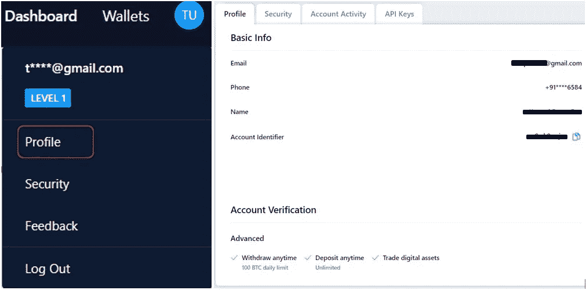
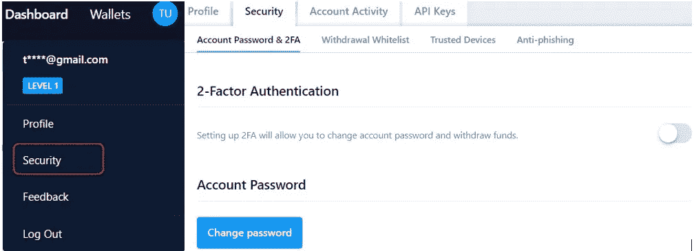
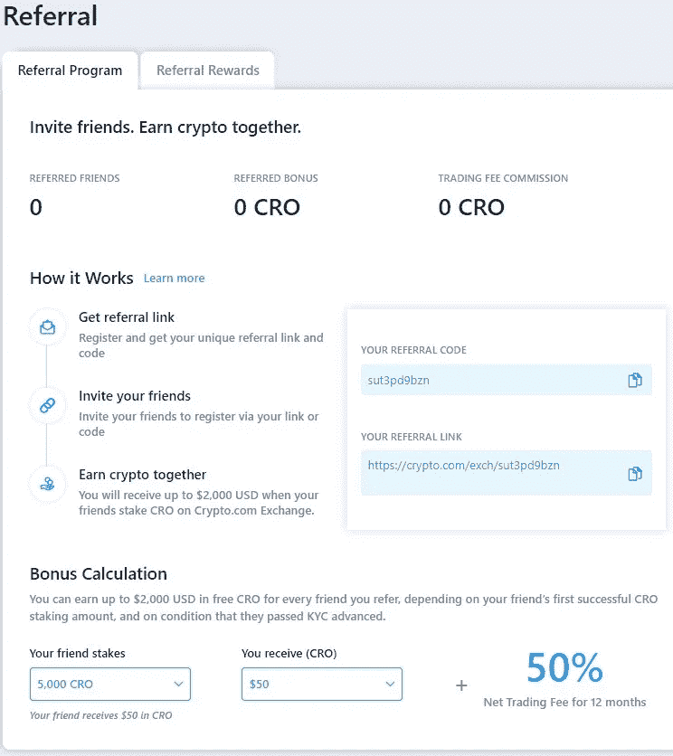
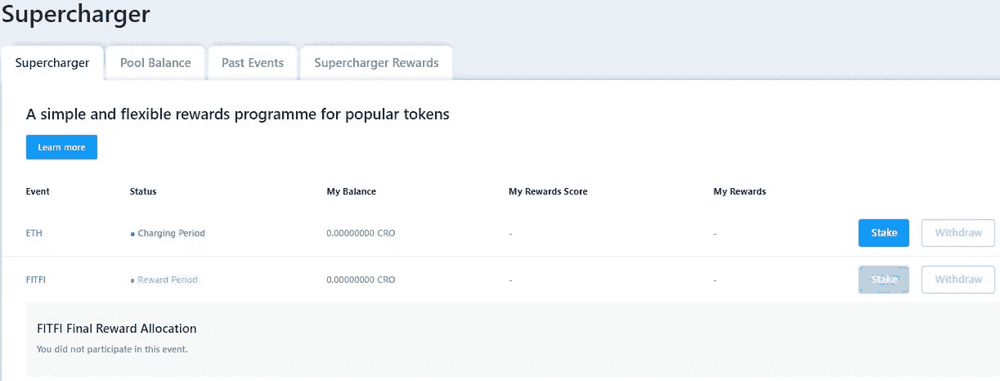
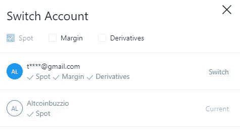
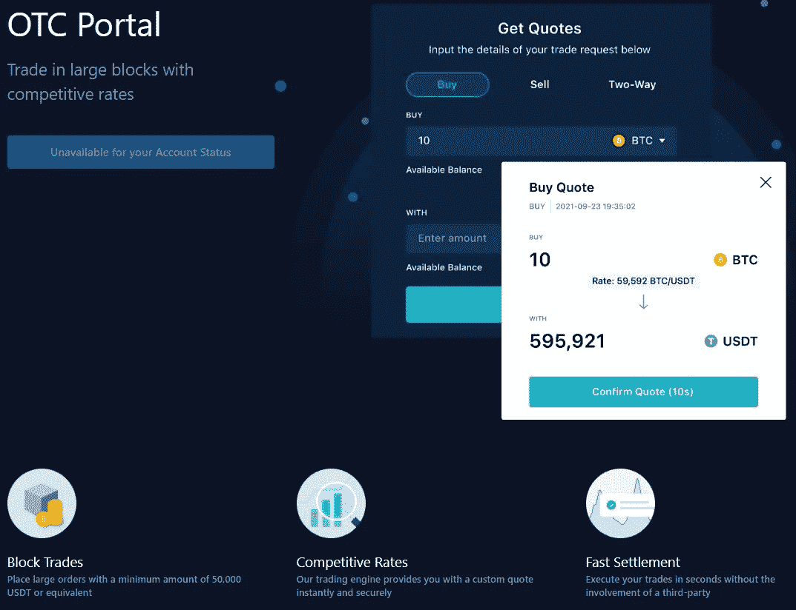

# 如何使用 Crypto.com 交易所(第二部分)

> 原文：<https://medium.com/coinmonks/how-to-use-the-crypto-com-exchange-part-2-828328f24acf?source=collection_archive---------34----------------------->

本指南包含如何在 crypto.com 交易所投资 CRO 并赢取奖励的详细步骤。

## 在本系列的[前一部分](https://ruma-das.medium.com/how-to-use-the-crypto-com-exchange-part-1-3deec765b430)中，我们已经解释了如何注册 Crypto.com 交易所，并完成你的 KYC。此外，我们已经描述了交换所支持的重要特性。这包括不同的钱包类型、订单类型、借出和借入、购买/出售以及从 exchange 帐户存款/提款。

现在，在这一部分中，我们将解释你如何下注 Crypto.com 本地人 [CRO](https://www.altcoinbuzz.io/cryptocurrency-news/cronos-chain-updates-crypto-com-receives-license-approval-from-mas-june-week-4/) 令牌。此外，赚取交易费奖励和回扣，以及其他功能。

**I)如何下注&赚取 CRO 代币**

在[赢取选项](https://crypto.com/eea/earn)下，您会发现两个下注计划，您可以在其中下注代币并赢取奖励:

1.  **CRO 打桩**

用户可以在 crypto.com 本地令牌，CRO，并享受诱人的福利。此外，他们必须至少存入 1000 CRO 币。因此，通过下注 CRO，用户可以获得以下好处:

*   如果你通过 crypto.com 交易所持有 CRO 股票 180 天，每天赚取 10%的年利率
*   独家访问 crypto.com 筹款平台[辛迪加](https://crypto.com/exchange/syndicate)
*   使用 CRO 支付时，交易费可享受 10%-100%的折扣

另一方面，根据用户的 CRO 赌注量，用户被分为多个等级。您可以参考下面的屏幕截图，了解不同的层级及其相关优势。

来源:[Crypto.com 赚](https://crypto.com/eea/earn)

**注意:**当您存入 CRO 进行下注时，您的代币将被锁定 180 天。在此期间，您不能提取代币。

1.  **软铆接**

Crypto.com 向仅仅持有交易所账户资产的用户提供奖励。没有锁定期。奖励的计算基于您的每日钱包余额和 CRO 赌注。

因此，要启用软锁定，您需要切换以下突出显示的按钮。

来源:[Crypto.com](https://help.crypto.com/en/articles/3744398-crypto-com-soft-staking)

用户需要满足代币的最低持有标准，才有资格获得软赌注奖励。查看您的外汇账户中的**软赌注**部分，了解有关利率、代币最低持有量以及 6 个月所需 CRO 赌注的更多信息。

【T2 II)Crypto.com 设置

从**设置**选项卡，用户可以进行以下活动:

*   **剖面图**

用户可以查看他们注册的电子邮件、电话号码、全名以及取款和存款限额。

*   **安全**

**安全**选项卡允许您更改帐户的密码并启用/禁用 2FA 选项。这是一个非常重要的功能，可以让您的帐户更加安全。

*   **账户活动**

检查您的帐户登录历史。

**III)活动和奖励**

在此选项卡下，您可以找到交易所提供的活动和奖励的详细信息:

*   [**引荐:**](https://help.crypto.com/en/articles/3124990-bg25-referral-program) 用户可以将自己唯一的引荐码分享给好友，邀请好友加入平台。然后，一旦您的朋友加入交易，完成 KYC 并下注 CRO，您将有权获得高达 2000 美元的奖励(CRO 代币)。除此之外。你也将获得交易费的优惠。

*   [**增压器**](https://help.crypto.com/en/articles/4478744-supercharger-crypto-com-exchange-general-information) **:** 另一个奖励计划，让用户存放他们的 CRO 代币。这些平台至少提前 3 天宣布任何新的增压器事件。用户需要存入至少 100 个 CRO 代币才能参加 Supercharger 活动。

注意:如果你愿意，你可以随时卸下你的 CRO，或者把它留在泳池里，参加将来的机械增压活动。活动结束后，平台会发放奖励。你的奖励份额取决于你相对于资金池大小的赌注。

还有，从上面的截图可以看到，ETH 充电期开启了。用户可以通过点击**赌注**按钮来存放 CRO(最少 100 个 CRO)代币。

*   [**交易竞技场**](https://help.crypto.com/en/articles/6086788-trading-arena-common-faq)

获取交易所组织的各种交易竞赛的详细信息。

**IV)切换账户**

**切换账户**部分允许您切换到任何现有账户。你可以从你的主账户跳到任何子账户(保证金/衍生品)。

**注意:**当您从一个账户跳转到另一个账户时(主要是从主账户跳转到子账户)，账户参数、设施、仪表盘明细都会发生变化。

**V)** [**场外交易**](https://help.crypto.com/en/articles/5733702-what-is-otc-trading)

用户可以在他们的账户上找到 OTC 交易选项，但是这种设施只限于机构和 VIP 用户。

此外，属于这些层的用户可以下大订单并接收即时定制代码。对于场外交易，用户需要满足以下订单金额标准:

*   最低订购金额:50，000 USDT 或等值货币
*   最大订单金额:1，000，000 USDT 或等值货币

**注**:目前平台支持 BTC/USDT、瑞士联邦理工学院/USDT、阿达/USDC、索尔/USDC、XRP/USDC 场外交易对。场外交易全天候可用。

此外，用户可以选择任何可用的交易对来进行买入、卖出或双向交易(买入和卖出的报价)。要获取报价，他们需要填写详细信息并选择**获取报价**选项。因此，如果您选择获取报价，您将会收到报价，报价在接下来的 10 秒内有效。然后，如果您满意，您可以确认报价，所需金额将从您的**现货账户中扣除。**您将收到生成的令牌。

**结论**

Crypto.com 是一个非常受欢迎的交易所。一个好的交易所必须提供稳定性、流动性、配对可用性和监管。还有，平台已经存在很久了，是一个非常稳定的大交易所。随着良好的流动性，大多数重要的货币对都可以在交易所买到。

最后，欧盟、马耳他、迪拜、新加坡等都对平台进行了监管。像赚取、借贷、场外交易等流行功能的可用性使它成为一个非常令人兴奋的交易所。

***注:*** *本帖首发* [*此处*](https://www.altcoinbuzz.io/passive-income/staking/how-to-use-the-crypto-com-exchange-part-2/) *同* [*一个* ltcoinbuzz.io](https://www.altcoinbuzz.io/) *。*

跟我来

**👉** [推特](https://twitter.com/rumadas123)

**👉** [Linkedin](https://www.linkedin.com/in/ruma-das-a1439320/)

> 交易新手？尝试[加密交易机器人](/coinmonks/crypto-trading-bot-c2ffce8acb2a)或[复制交易](/coinmonks/top-10-crypto-copy-trading-platforms-for-beginners-d0c37c7d698c)