# 如何使用 Crypto.com 钱包

> 原文：<https://medium.com/coinmonks/how-to-use-the-crypto-com-wallet-717b3344cf1a?source=collection_archive---------36----------------------->

本指南包含安装和使用 Crypto.com 钱包的详细步骤。

## Crypto.com 在其套件中包含多种产品。在我们之前的文章中，我们已经详细解释了如何在 Crypto.com 的[交易所](https://www.altcoinbuzz.io/passive-income/staking/how-to-use-the-crypto-com-exchange-part-2/)创建账户以及如何使用。作为该系列的延续，我们将介绍另一款 Crypto.com 产品，即 Crypto.com 钱包。

官方的 Crypto.com DeFi 钱包，钱包是一个强大的移动钱包应用程序，允许您购买超过 250+加密货币和 20+法定货币。用户可以使用它来存储、访问、管理、转移资金、铸造和收集 NFT。该应用程序适用于 Android 和 iOS 用户。

在本文中，我们将解释如何为 Android mobile 安装应用程序，并使用它来管理您的资产。

**钱包安装(安卓版)**

用户可以从 Google Play 商店下载 Crypto.com 钱包应用程序。下载应用程序时，请始终检查用户的评分和下载次数。这有助于检查应用程序的真实性。

点击**安装**，应用程序将被下载到您的手机上。

**设置 Crypto.com 钱包**

要设置您的帐户，请启动 Crypto.com 钱包应用程序。您会发现钱包设置有两个选项:

*   创建新帐户
*   登录到现有帐户

“创建新帐户”选项将允许您创建新的 Crypto.com 钱包。如果您是现有用户，可以通过提供凭据并选择第二个选项来登录。

**创建新账户**

如果您希望创建新账户，选择**创建新账户**。钱包应用程序会要求您输入电子邮件地址。验证您的电子邮件地址。

接下来，用户需要接受身份验证过程。要验证您的身份，您需要提供以下所有详细信息和文件:

*   全名
*   政府授权的身份证明
*   自拍照

完成上述步骤后，您将被引导至钱包的登录页面。

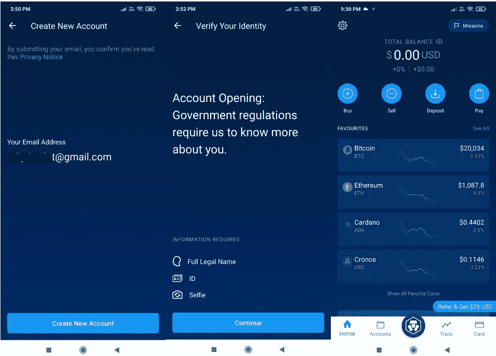

**添加令牌**

在默认设置下，用户只能在钱包的登录页面上看到一些令牌。如果您希望添加任何特定的令牌，那么您必须打开令牌详细信息并单击页面顶部出现的**星形**图标(参见下面的截图)。

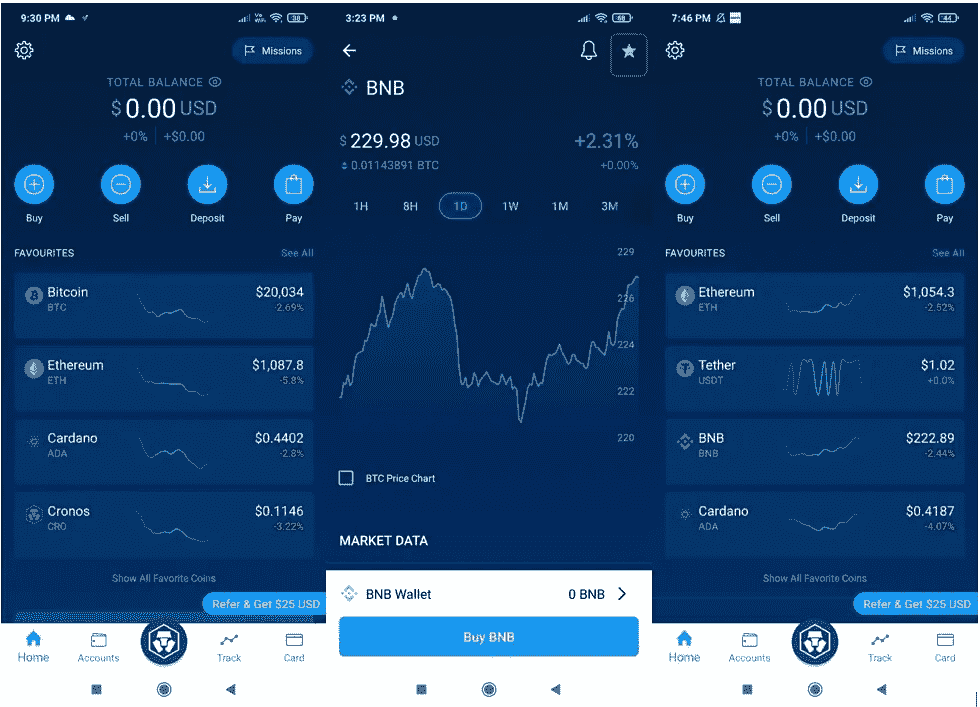

用户可以反向执行相同的活动，从收藏夹列表中删除任何令牌。

**轨道**

钱包应用程序允许您跟踪资产价格的变化。你不需要经常查看手机来了解资产价格的变动。

用户可以在令牌上设置警报，一旦达到，应用程序将通知您。

要设置提醒，进入**提醒**并点击**创建提醒。**接下来，您需要选择您希望设置警报的资产。

该应用程序将为您提供两个选项来定义警报类型:

*   **目标价格警报** —当硬币价格高于/低于定义值时通知您。
*   **百分比变动警报—** 当代币价格以定义的百分比变化时，会通知您。

现在，让我们假设我们想要在 **CRO 上设置**目标价格警报**。**我们已经从可用选项中选择了所需的令牌和警报类型。

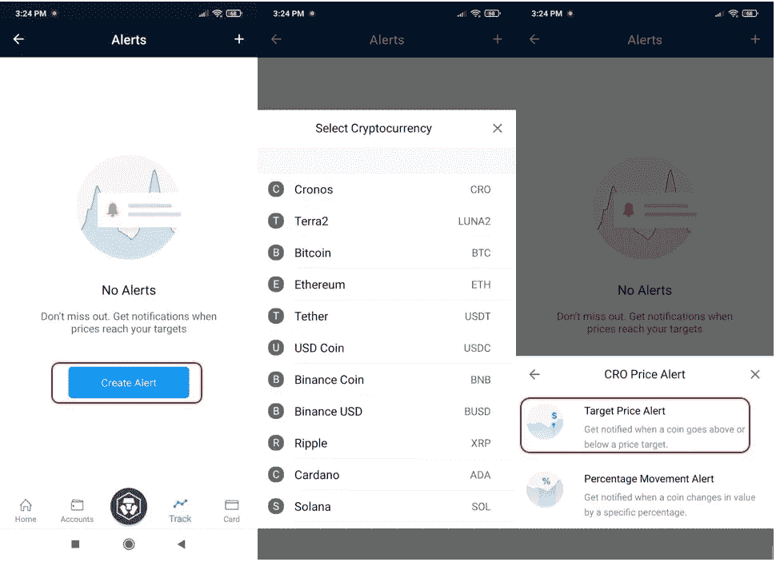

将打开一个页面，您可以在其中输入目标价格来设置警报。您可以在警报部分找到所有警报的列表。

一旦点击，您将在手机上收到通知，警报状态将变为**触发**。

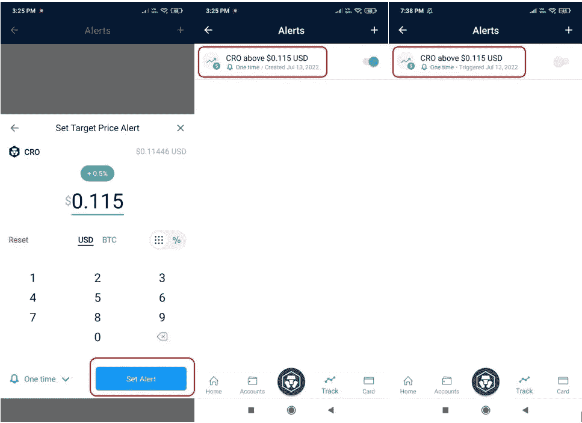

**撤回**

Crypto.com 钱包提供了多种提取资产的方式。

点击**Crypto.com**图标并选择**加密钱包。**在这里你会发现不同的**换乘**选项:

*   Crypto.com 用户
*   Crypto.com 交易所
*   Crypto.com DeFi 钱包
*   外部钱包
*   银行存款

您可以选择适当的账户类型进行转账。现在，让我们假设我们希望转移到任何外部钱包账户。

接下来，应用程序将要求您添加地址并指定网络(Cronos、Crypto.org 或 ERC20)。一旦您添加了地址，您就可以继续转移资金。

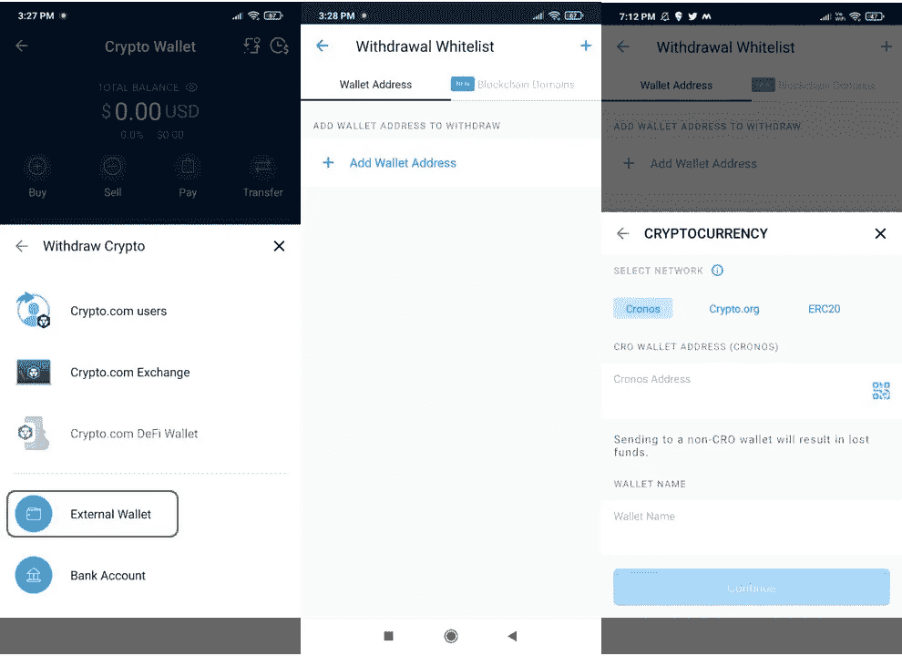

您也可以通过提供收款人的工资明细来转移资金。

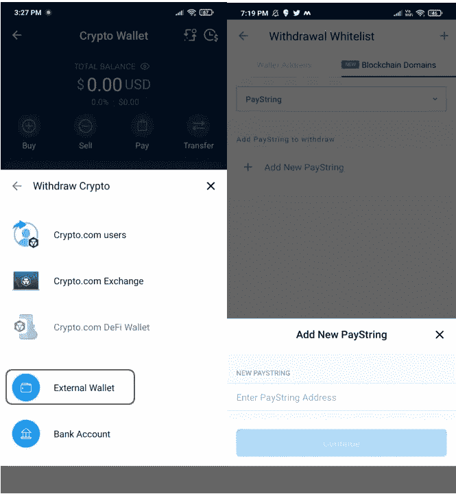

**购买**

用户可以从他们的 Crypto.com 钱包界面购买加密货币。他们可以使用信用卡/借记卡、加密钱包或法定钱包购买资产。还可以设置购买频率(一次性，递归)。

首先，选择你想购买的资产。接下来，该应用程序将为您提供购买资产的不同选项，即信用卡、加密钱包或法定钱包。选择你想要的选项。

如果您希望通过信用卡购买，那么您必须添加信用卡的详细信息(卡号、有效期、3 位 CVV 代码、名字和姓氏)。

您的卡详细信息将被验证，0.10 美元的金额将被临时锁定七天(不收费)。确认交易。

完成后，您可以再次进入您的帐户并继续购买。

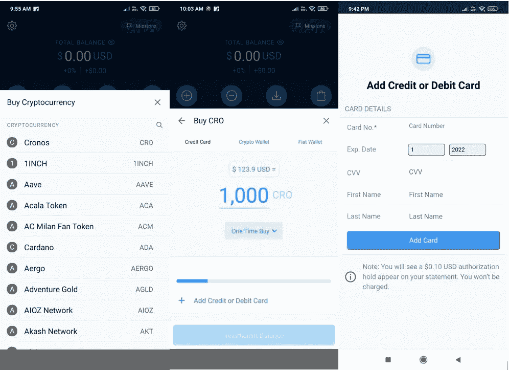

**出售**

使用**出售**选项，您可以出售现有的加密货币来获得另一项资产。

点击卖出，它会显示你有余额的资产列表。接下来，选择您希望获得回报的资产，并填写您希望购买的源令牌的金额。确认该过程，生成的令牌将出现在您的帐户中。

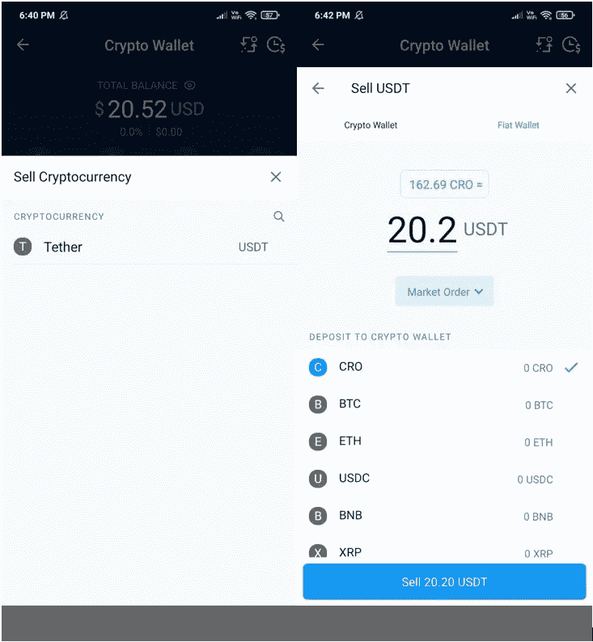

**存款**

**存款**选项让你将资产存入你的账户。用户可以找到两种不同的存款方式:

*   **存款加密**

顾名思义，使用此选项可以存放受支持的加密货币。用户需要首先选择他们希望存放的资产。接下来，他们需要选择合适的网络。一旦您选择了这两个详细信息，您就可以获得存款地址或 PayString 详细信息，您可以使用这些信息从其他地址转移资产。

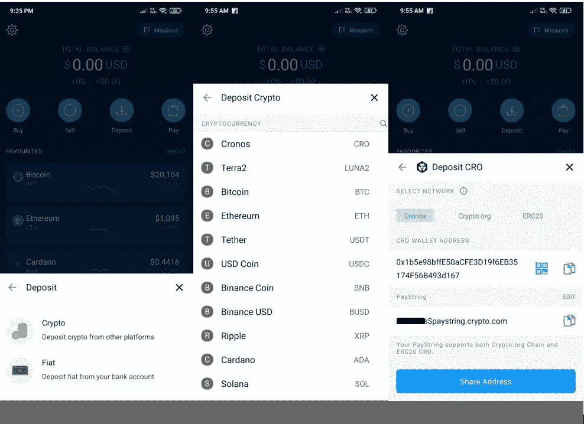

*   **存款利率**

Crypto.com DeFi 钱包允许用户存入欧元。请注意，要转移菲亚特，您必须首先设置您的菲亚特钱包。您可以点击货币(此处为欧元),获取将菲亚特(此处为欧元)存入您的 Crypto.com 账户的详细信息。

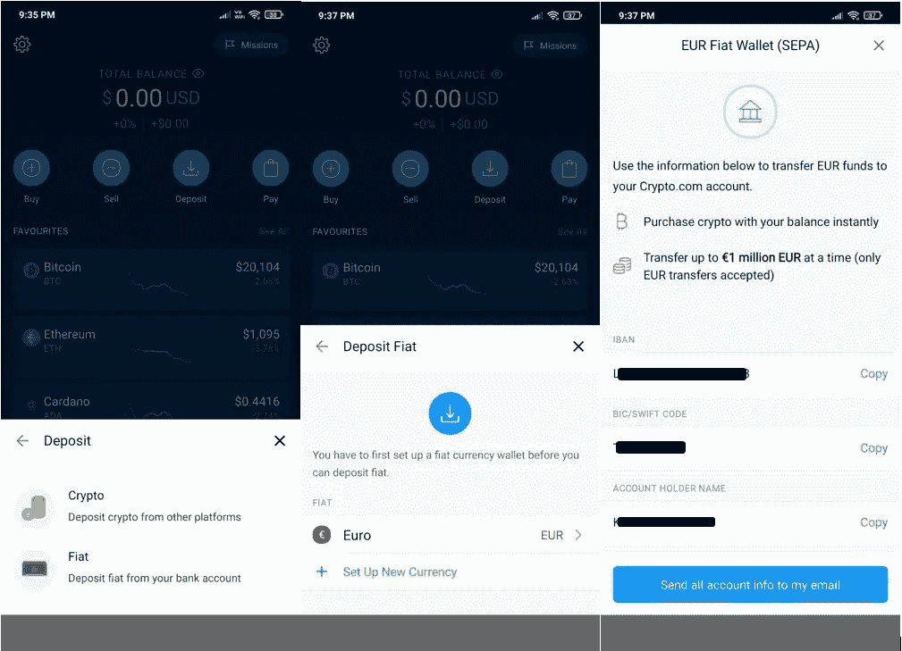

**支付**

在**支付**下，你会发现购买各种**礼品卡、移动通话时间、向朋友发送 CRO 以及使用 CRO 作为支付货币的选项。**用户在执行上述任何任务并使用其 CRO 代币付款时，将获得 CRO 代币返现。您可以在**支付奖励**字段查看您获得的奖励。

正如你从下面的截图中看到的，在礼品卡下，你可以找到 310 个流行品牌，遍布 30 多个国家。你可以购买任意金额的礼品卡，并在用 CRO 代币付款时获得现金返还。

Crypto.com·NFT

从该选项卡中，您可以访问 Crypto.com 支持的 NFTs。用户需要先通过**连接**按钮连接他们的钱包账户和 Crypto.com NFT 账户(见下面截图)。

一旦连接上，你就可以购买/出售，铸造 NFT，并对列出的项目进行投标。用户可以使用他们的 Crypto.com 帐户余额进行支付，或者可以请求从您的 Crypto.com 帐户的 NFT 帐户中支付。

**增压器**

SuperCharger 是一个奖励计划，用户可以用他们的 CRO 代币(最少 100 个 CRO 代币)下注，并参加 SuperCharger 活动来获得奖励。请注意，与 CRO 赌注不同，这里您的 CRO 代币没有锁定。你可以随时提取你的代币。

您可以查看增压器部分，了解任何即将到来/正在进行的活动。如果任何池都处于收费期，用户可以将他们的 CRO 代币存入该池。在期限结束时，您将获得奖励。

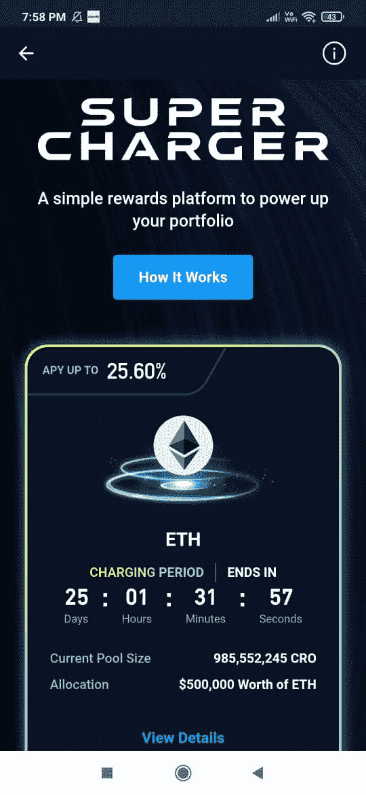

**卡片**

Crypto.com 维萨卡是一种预付卡，就像你的借记卡一样，你可以通过 Crypto.com 应用程序使用你的菲亚特钱包、Crypto.com 钱包或信用卡/借记卡进行充值。来自约 40 个国家的用户可以使用该卡，享受机场休息室使用权、银行间汇率和海外费用的专属优惠。卡用户可以获得以下回扣:

*   **旅行** —每次 Expedia(相当于 50 美元)或 Airbnb 预订(相当于 100 美元)享受 10%的购物折扣。
*   **音乐(Spotify)** —标准订阅计划的 100%折扣(相当于 13.99 美元)。
*   **电影(网飞)** —基本订阅计划的 100%折扣(最高相当于 13.99 美元)。
*   **额外奖励** —本地或海外消费最高可获得 5%的返现(无最低或最高限额)。

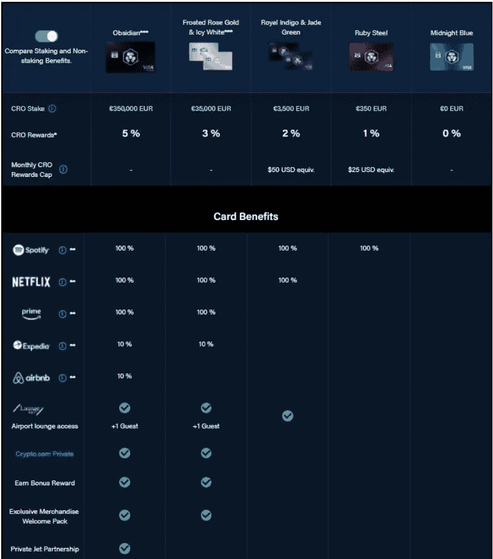

要获得 Crypto.com Visa 卡的资格，你需要持有 CRO 代币 180 天。然后你可以从钱包里申请各种卡。

每种类型的卡都为您提供奖励，这些奖励会以 CRO 代币的形式立即支付到您的 Crypto.com 应用程序中。

可以去**卡**板块了解更多各卡种的好处和要求。

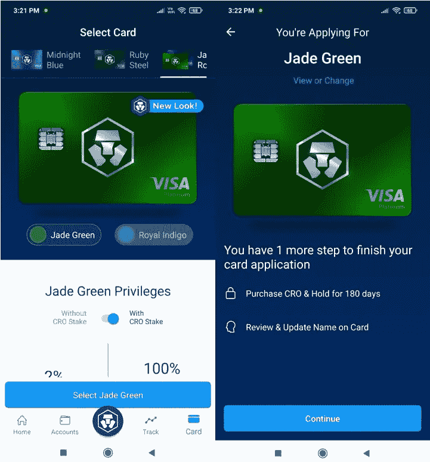

**设置**

在钱包的**设置**选项卡中，您可以执行以下操作:

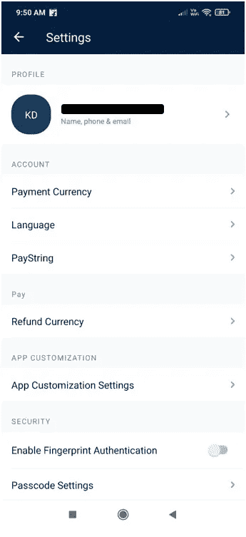

*   **简介**

在此部分，您可以更改您的电话号码和电子邮件地址。

*   **支付货币**

此部分让您选择货币，您的余额和交易将以所需的面额显示。

*   **语言**

在这里设定钱包的语言。

*   **工资线**

使用 PayString，用户可以为他们的帐户设置一个易读的名称。这类似于设置 ENS，您可以设置人类可读的字符串来代替长的字母数字帐户地址。您可以与其他兼容的钱包共享您的 PayString 来发送或接收资金

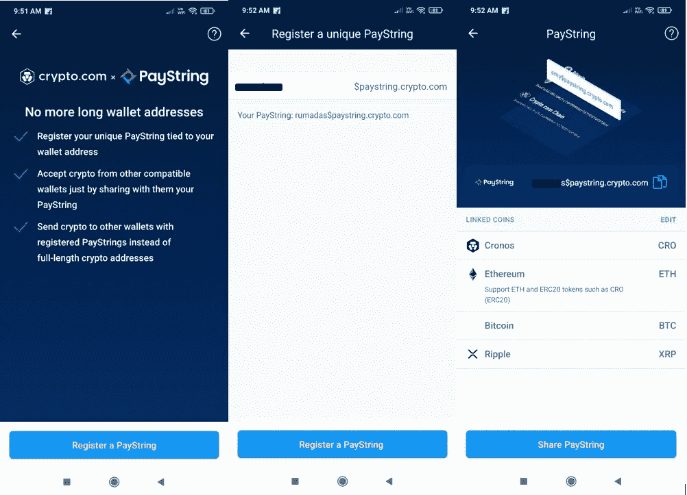

要设置您的工资线，请点击**注册工资线**。现在，输入你独特的工资串，并检查可用性。如果可用，您可以将该字符串设置为您的 PayString。用户可以共享他们的 PayString 来接收受支持的令牌。

*   **退款货币**

设置您的首选退款货币以结算商家付款。

*   **App 定制设置**

将钱包的登录页面设置为主页(默认)或帐户，启用/禁用钱包的快捷方式。

*   **启用指纹认证**

启用/禁用指纹验证选项。

*   **密码设置**

启动应用程序时启用/禁用密码选项。

*   **更改密码**

在此更改钱包的密码。

*   **双因素认证**

启用/禁用 2FA (Google 认证)。添加 2FA 会增强资金安全性，从钱包或白名单账户中提取资金时需要提供。

*   **反网络钓鱼代码**

用户可以为他们的帐户设置唯一的反网络钓鱼代码。该代码将包含在所有来自 Crypto.com 的正版电子邮件的标题中。它有助于检查 Crypto.com 电子邮件的真实性。

*   **通知设置**

启用/禁用市场提醒、Crypto.com 更新或产品的通知选项。

***注:*** *本帖首发* [*此处*](https://www.altcoinbuzz.io/bitcoin-and-crypto-guide/how-to-use-the-crypto-com-wallet/) *同*[*ltcoinbuzz . io*](https://www.altcoinbuzz.io/)**。**

*跟我来*

***👉** [推特](https://twitter.com/rumadas123)*

***👉**[**Linkedin**](https://www.linkedin.com/in/ruma-das-a1439320/)*

> ***交易新手？尝试[加密交易机器人](/coinmonks/crypto-trading-bot-c2ffce8acb2a)或[复制交易](/coinmonks/top-10-crypto-copy-trading-platforms-for-beginners-d0c37c7d698c)***