# 如何使用 Electrum 钱包

> 原文：<https://medium.com/coinmonks/how-to-use-the-electrum-wallet-665803afa023?source=collection_archive---------3----------------------->

本指南包含如何安装和使用 Electrum Wallet 的详细步骤。

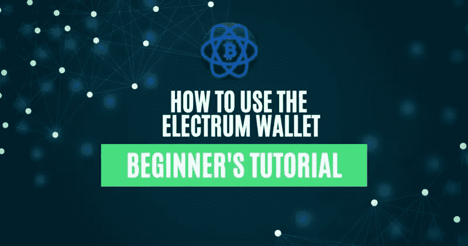

## Electrum 是一个安全、快速、易用的钱包，仅设计用于支持[比特币](https://www.altcoinbuzz.io/top-article/is-bitcoin-near-the-bottom-of-the-bear-market/)网络。它是在麻省理工学院许可下发布的自由软件。这意味着任何用户都可以运行 Electrum 服务器，应用程序将验证比特币网络中的交易。

该应用程序还支持硬件设备，如 Ledger、Trezor 和 Keepkey。此外，Electrum 钱包适用于各种操作系统用户，如 Windows、Linux、Python 等。因此，在本文中，我们将解释如何为 Android 设备安装和设置电子钱包。

**如何安装 Electrum 钱包？**

首先，要安装 Electrum 钱包，请访问官方[网站](https://electrum.org/#home)

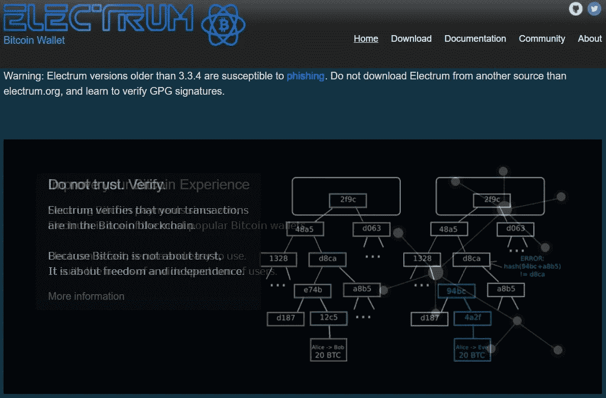

然后，在主页上，您可能会注意到一条关于易受网络钓鱼攻击的应用程序版本的警告消息。因此，建议用户下载 3.3.4 或以上版本进行安全交易。

现在，您需要点击页面顶部出现的**下载**按钮。因此，用户可以选择为不同的操作系统下载应用程序。

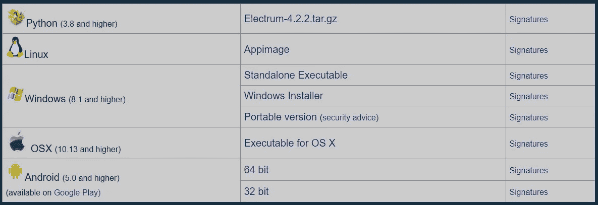

**来源:** [**驻极体**](https://electrum.org/#home)

选择您想要的选项。

**1)如何在 Android 上安装 Electrum 钱包**

在 [Google PlayStore](https://play.google.com/store/apps/details?id=org.electrum.electrum) 上搜索 **Electrum** 应用。

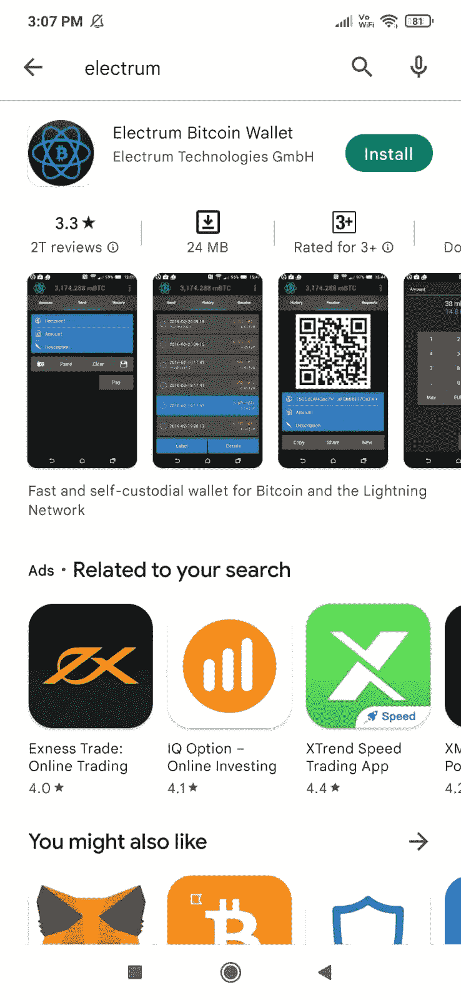

现在，点击**安装**，应用程序将下载到您的设备上。

**不同类型的银金矿钱包**

接下来，我们将详细解释不同的钱包类型，以便您决定需要哪种类型的钱包:

*   **标准钱包-** 每个地址使用一个私钥。
*   **双因素认证钱包-** 要求用户设置 2FA。每当用户发起任何撤销/地址白名单活动时，他/她都需要提供在他们的 Google authenticator 应用程序中生成的安全代码。因此，这种方法被认为是最安全的方法，因为代码是随机生成的。
*   **多签名钱包-** 多签名钱包需要多个用户批准才能签署交易。然后，当您为多重签名 wallet 设置 Electrum wallet 时，您可以定义它将拥有的人数(称为联合签名者)。以及批准交易所需的最小签名数。

您可以在多个设备上安装 Electrum wallet(拥有不同的私钥，不同或相同的所有者)。触发交易时，需要由最少数量的所有者(在设置过程中指定)签名以批准该流程。这种方法也是安全的，因为它需要多人来批准交易。

*   **导入比特币地址或私钥-** 钱包是用其他软件生成的私钥创建的

**如何设置你的 Electrum 钱包**

另一方面，要设置您的 electrum 钱包，您需要选择您希望创建的钱包类型。如果你想创建一个简单的钱包，那就选择标准钱包。接下来，您将看到以下钱包设置选项:

*   创造新的种子
*   我已经有种子了
*   使用万能钥匙

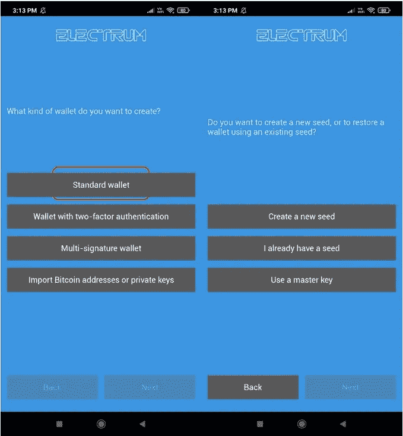

**来源:** [**驻极体**](https://electrum.org/#home)

第一个选项，即**创建新种子**将让您创建一个新的 Electrum 钱包。然后，现有用户可以通过使用种子短语再次在不同的设备上设置他们的帐户。他们只需选择选项 2，即**我已经有一个种子。**此选项要求您输入 12 个字的备份短语。一旦您提供正确的关键短语，您的帐户将被导入。

**如何创建新的 Electrum 钱包**

希望创建新钱包的新用户需要选择此选项。接下来，应用程序将显示您的 12 个单词的备份短语，并要求您验证您的关键短语。

**注意:**一个 12 或 24 个字的备份短语对于将来在你丢失设备的情况下恢复你的账户及其相关资金非常重要。因此，请安全地存储您的关键短语。如果你失去了访问它，你将无法取回你的资金。或者如果有人得到它，他们可以窃取你的资产。

应用程序现在会提示您设置钱包的密码。完成后，您可以看到登陆(**历史**)页面。

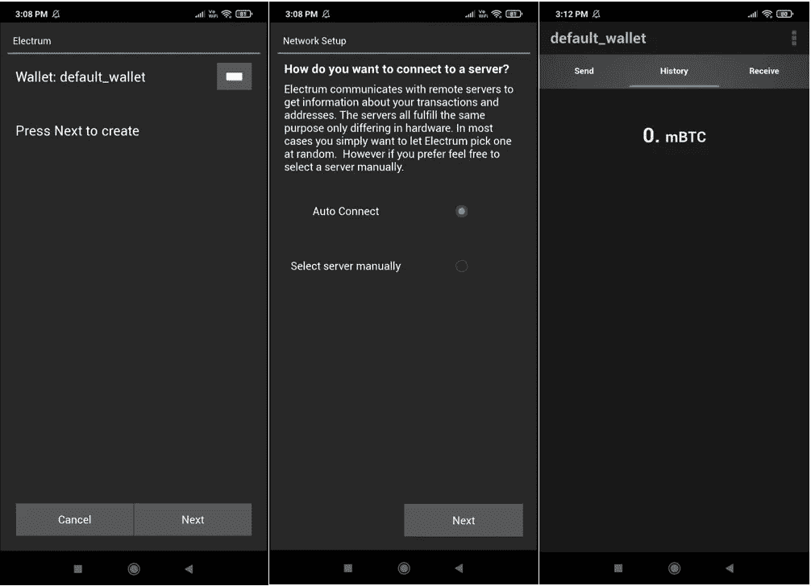

**来源:** [**驻极体**](https://electrum.org/#home) **驻极体钱包如何接收资金**

然后，要在你的钱包中接收 BTC，你需要接收地址。然而，获取接收地址的过程并不像其他网络那样容易。

首先，转到**接收**选项卡。然后，您可以将到期日期更改为 **Never。**

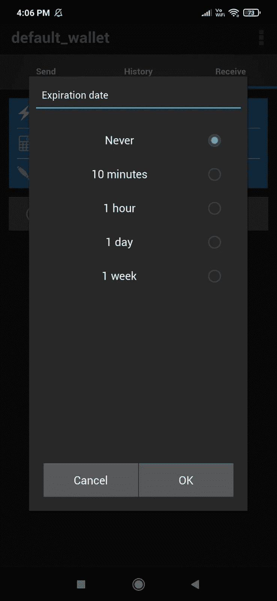

现在，在**接收**选项卡中，您可以看到几个字段:

*   闪电
*   数量
*   描述

填写**金额**和**描述**字段。现在，点击**请求**。然后，您可以在底部看到您提交的请求。

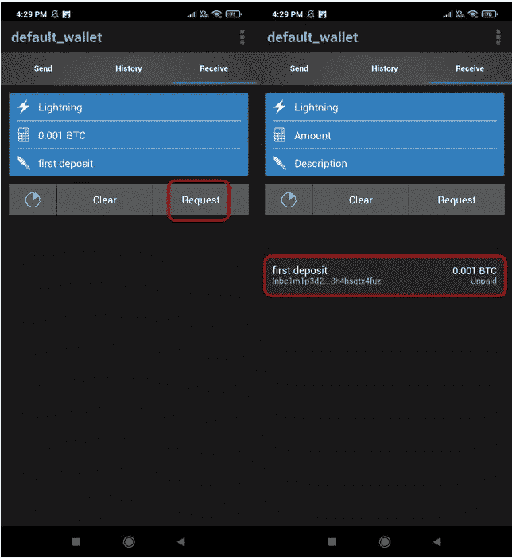

**注意:**您输入的金额仅供参考。发件人可以向该地址发送任意金额的邮件。

接下来，转到**地址**部分。在这里，您可以看到所有未使用的地址列表，您可以使用这些地址来接收 BTC。然后，选择并复制任何地址。你可以用这个地址接收 BTC。

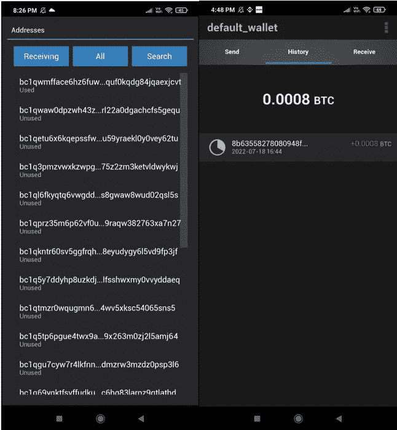

**如何在 Electrum 钱包上发送资金**

要从您的 Electrum 钱包中转账 BTC，您需要填写以下详细信息:

*   收件人地址
*   数量
*   描述

现在，点击**支付。一个窗口将会出现，你可以在这里查看预计到达时间和采矿费用。然后，一旦你满意了，就确认流程。**

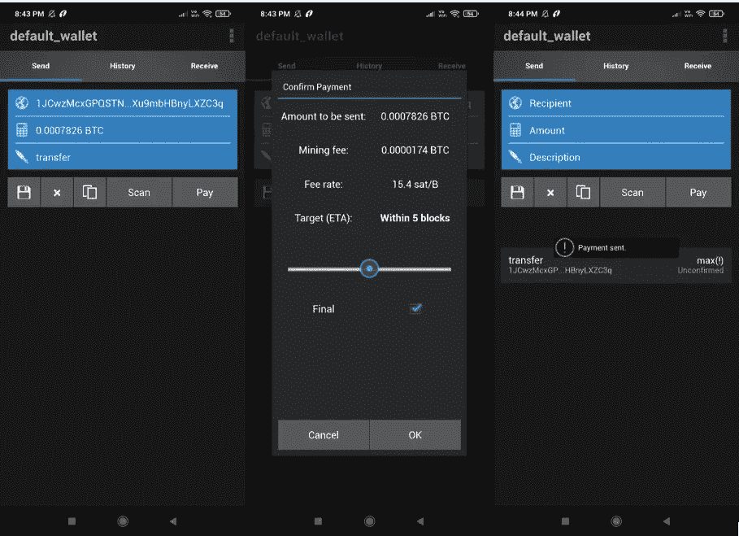

**如何打造一款银金矿钱包**

此外，在**钱包**部分，您可以查看自己创建的钱包。然后，如果你想创建另一个钱包，你可以点击**新建**按钮。因此，这将创建一个具有不同关键短语的新钱包。因此，请按照以下步骤创建钱包:

*   点击**新建**
*   给钱包一个唯一的名称
*   选择您希望创建的钱包类型(标准钱包、多签名钱包等)
*   选择钱包的种类(新的、现有的)
*   备份并验证您的种子短语

然后，您现在可以在**钱包**部分查看您新创建的钱包。

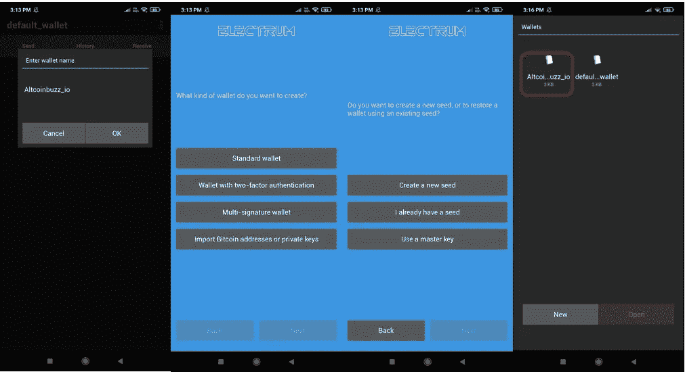

**Electrum 钱包设置**

此外，从设置页面，您可以检查以下参数:

*   **语言-** 设置为默认。有许多语言可供选择，如果你愿意，你可以选择任何一种
*   **PIN 码-** 在此添加/重置您的 PIN 码
*   不同的面额是 BTC、mBTC、比特和 sat。然后，您可以选择任何来改变您的钱包余额在该面额
*   **法定货币-** 设置为无
*   **标签同步-** 启用/禁用跨设备同步钱包的选项
*   **花费未确认-** 设置为**是(默认)**
*   **使用更改地址-** 设置为**是(默认)**
*   **密码-** 在此更改您钱包的密码
*   **创建可恢复通道-** 设置为**是(默认)**
*   **闪电路由-** 设置为**蹦床(默认**)。你可以选择你的闪电路线为**蹦床**或**八卦**

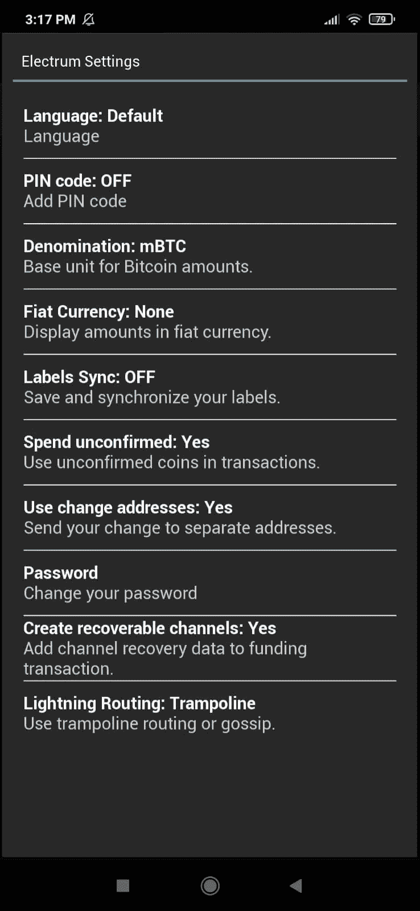

最后，我们建议我们的用户不要改变任何默认设置，直到他们有适当的知识。

***注:*** *本帖首发* [*此处*](https://www.altcoinbuzz.io/bitcoin-and-crypto-guide/how-to-use-the-electrum-wallet/) *同* [*一* ltcoinbuzz.io](https://www.altcoinbuzz.io/) *。*

跟我来

**👉** [推特](https://twitter.com/rumadas123)

**👉**[**Linkedin**](https://www.linkedin.com/in/ruma-das-a1439320/)

> ***加入 Coinmonks* [*电报频道*](https://t.me/coincodecap) *和* [*Youtube 频道*](https://www.youtube.com/c/coinmonks/videos) *了解加密交易和投资***

# **另外，阅读**

*   **[3 commas Review](/coinmonks/3commas-review-an-excellent-crypto-trading-bot-2020-1313a58bec92)|[Pionex Review](https://coincodecap.com/pionex-review-exchange-with-crypto-trading-bot)|[coin rule Review](/coinmonks/coinrule-review-2021-a-beginner-friendly-crypto-trading-bot-daf0504848ba)**
*   **[莱杰 vs Ngrave](/coinmonks/ledger-vs-ngrave-zero-7e40f0c1d694) | [莱杰 nano s vs x](/coinmonks/ledger-nano-s-vs-x-battery-hardware-price-storage-59a6663fe3b0) | [币安评论](/coinmonks/binance-review-ee10d3bf3b6e)**
*   **[加密交易机器人](/coinmonks/crypto-trading-bot-c2ffce8acb2a) | [Bingbon 评论](https://coincodecap.com/bingbon-review)**
*   **[Bybit Exchange 评论](/coinmonks/bybit-exchange-review-dbd570019b71) | [Bityard 评论](https://coincodecap.com/bityard-reivew) | [Jet-Bot 评论](https://coincodecap.com/jet-bot-review)**
*   **[3 commas vs Cryptohopper](/coinmonks/3commas-vs-pionex-vs-cryptohopper-best-crypto-bot-6a98d2baa203)|[赚取加密利息](/coinmonks/earn-crypto-interest-b10b810fdda3)**