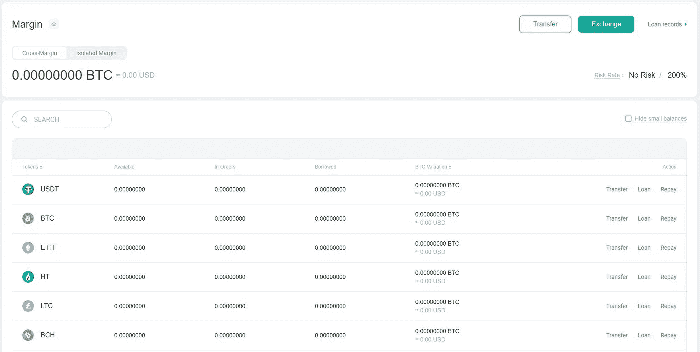
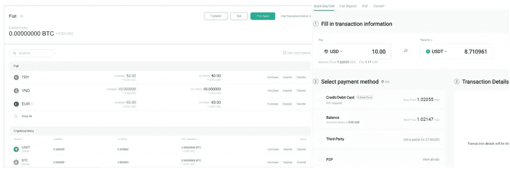
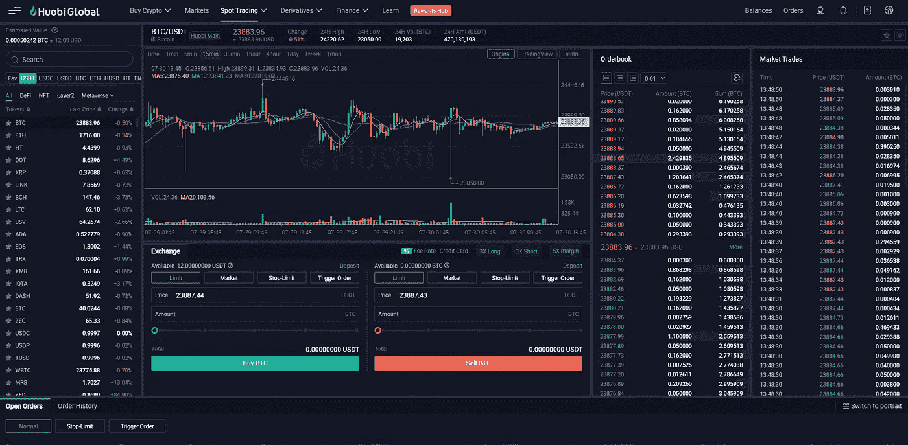

# 如何使用火币交易所

> 原文：<https://medium.com/coinmonks/how-to-use-the-huobi-exchange-a5969d37348c?source=collection_archive---------9----------------------->

本指南包含如何创建账户和使用 Huobi exchange 的详细步骤。

## [Huobi](https://www.altcoinbuzz.io/reviews/altcoin-projects/huobi-lists-efinity/) 成立于 2013 年，是全球最大的加密货币交易所之一，为全球超过 1000 万用户提供服务。这是一个集中的交易所。该平台允许用户购买/出售、存储、借用和持有大量加密资产。该平台有一个名为 Huobi Token (HT)的本地令牌。该交易所遵循最高的安全和风险管理参数，因此自成立以来从未报告过一起安全故障事件。

因此，在本文中，我们将解释如何在 Huobi exchange 中创建一个帐户，以及如何使用它。我们在日本、新加坡、美国和加拿大的读者和粉丝们，很抱歉你们被 Huobi 拒之门外。相反，试试 [MEXC](https://www.altcoinbuzz.io/bitcoin-and-crypto-guide/how-to-buy-crypto-from-mexc-exchange/) ，在那里你们都可以交易。

**进入火币交易所**

要访问交易所，请访问[链接](https://www.huobi.com/en-us/)。下面是平台的登陆页面。

**登录/注册**

要开始使用 exchange，用户需要首先创建一个帐户。新用户可以使用**注册**选项在交易所创建账户。

现有用户可以通过点击**登录**按钮并给他们凭证来访问他们的账户。

注册过程非常简单。要注册，用户可以提供他们的电子邮件地址或电话号码，并需要设置帐户的密码。

包含代码的验证电子邮件将发送到您的指定电子邮件地址。验证代码，您将被重定向到 exchange 登录页面。

**简介**

在**个人资料**选项卡下，您可以查看您注册的电子邮件地址和唯一的 UID。除此之外，您会发现下面的安全和帐户相关的参数，您可以检查或更新。在转移任何资产之前，用户应该转到他们的个人资料部分并设置 2FA 和身份验证。我们现在将解释如何做到这一点，并加强您的帐户安全。

*   **账号&安全**

用户可以在这里设置各种安全选项。您可以在这里找到进行 ID 验证、设置 2FA、密码管理、货币和通知管理的选项。

要设置 2FA，你需要用手机上安装的谷歌认证器应用程序扫描你的 Huobi 账户上出现的二维码。

如果你想增强你的安全性，那么你也可以设置你的电话号码。交易所会发送一个代码到你的手机上，并要求你在每次取款时进行验证。

*   **身份验证**

创建帐户后，用户需要验证他们的身份。身份验证将增强平台的安全性，并提高用户账户的存款和取款限额。用户必须首先选择他们持有的账户类型:

*   个人的
*   制度的

我们将解释申请**个人账户**的步骤。选择此帐户。火币允许用户进行四个级别的身份验证，每个级别都有不同的存款和取款限额。

根据您的要求，您可以完成全部四个或几个级别。

**菲亚特设定**

在此部分，您可以设置固定存款和取款模式。但是，请注意，用户需要完成他们的 KYC，否则您将无法进行 P2P 交易。

菲亚特设置页面是这样的。您可以在这里设置以下内容。

*   设置您的唯一名称。做 P2P 交易的时候会显示。
*   添加付款方式-设置收款方式和详细信息
*   添加银行卡详细信息

**费用设置**

在该选项卡中，用户可以设置他们喜欢的现货交易支付方式。该平台对通过邀请选择的几个用户组采用分级收费结构。对于不在邀请名单上的用户，交易费率将保持不变。

**子账户**

子账户是二级账户，用户可以创建子账户来单独管理他们的资金。要创建子账户，点击**创建子账户**按钮(下面突出显示)，给出一个唯一的名称，并确认该过程。

您现在可以看到新创建的子账户以及您可以执行的各种交易操作。您可以使用**转账**选项将资金从您的**主账户**转账至您的**子账户**。

**转诊仪表板**

火币用户可以邀请他们的朋友和亲戚加入交流，并赚取佣金作为回报。每个用户都可以从其帐户的推荐仪表板中看到他们唯一的推荐代码和链接。他们可以与其他用户分享这个链接，并可以赚取回扣来换取费用。

**资产概述**

该选项卡概述了持有各种外汇账户(即现货账户、保证金账户等)的用户。用户可以单击每个帐户，导航到该特定帐户，查看帐户和资产类型的详细信息。

**现货账户**

即期账户是用户进行存款或取款活动的主要账户。从下面的截图可以看出，现货账户分为两个部分。顶部显示用户持有的法定货币，底部显示您的加密持有。

我们现在将解释如何执行存款和取款功能。

**存款**

如果您是新用户，并且想从任何其他地址或交易账户将资金存入您的 Huobi exchange 账户，请点击**存款**按钮。你可以看到下面的屏幕。现在，从下拉列表中选择您希望存入的硬币，然后选择所需的网络。

然后交易所会显示一个地址，你可以用它来接收资金。

注意，这个地址只对特定的硬币和网络有效。不能用来发一些别的币，不管网络是不是一样的。

**撤回**

提取选项允许您提取或转移现有资产到其他地址。

要撤销，请点击您希望转移的代币旁边的**撤销**按钮。你可以看到下面的屏幕。

您可以先选择令牌，也可以从下拉列表中选择。现在，输入目的地地址，选择合适的网络，最后输入您要发送的令牌数量。确认流程。

**融资融券交易**

在保证金交易下，火币允许其用户从交易所借入资金，然后用这笔资金进行交易并成倍增加利润。用户需要支付一些费用和利息来进行保证金交易。这将放大你的收益，但它涉及一个高风险的策略。因此，它适合专业交易者。

保证金交易通常包括三个基本步骤:

*   贷款请求
*   进行(多头/空头)保证金交易
*   带息偿还保证金贷款

**菲亚特**

法定账户显示你的法定货币余额。目前，该交易所允许您处理 TRY、越南盾、欧元、美元和其他一些货币。在此账户下，您可以选择进行以下与法定货币相关的活动:

*   通过电汇存款
*   P2P 交易
*   通过给予法定货币(通过信用卡/借记卡、钱包余额、第三方服务提供商等的各种支付选项)轻松购买/出售加密资产

**通过 P2P 购买密码**

P2P 意味着点对点交易。加密用户可以去 P2P 交易标签下订单。普通加密订单和 P2P 订单之间的唯一区别是，在这里，您可以通过提供加密资产来获得传统货币(美元、印度卢比等)。

正如你从下面的截图中看到的，你可以找到一个买卖密码的供应商的号码。转到您想要的选项卡(买入或卖出)。

现在选择您的传统货币，最低或最高金额(如果有的话)，以及支付方式(如果您想通过一些特定的支付方式进行交易)。现在，选择供应商。我们建议我们的用户只选择那些完成率高的供应商。最后，下订单。

**市场**

**市场**标签列出了现货和期货交易下在 Huobi 交易所可用的各种交易对。你也可以在仪表板上查看主要交易对的价格变动。

**现货交易**

如果您希望下现货订单，请转到**现货交易**部分。在这里，您会发现以下交易类型:

*   **限制-** 允许用户限制他们希望买入/卖出的价格
*   **市场-** 允许您以市场价格下单买入/卖出
*   **止损-限价-** 当资产价格达到期望值时买入/卖出
*   **触发订单-** 允许用户设置触发价格、订单价格和订单大小。当资产达到目标时，系统会根据定义的参数自动下单

**购买**

购买选项允许您通过提供任何现有资产来购买加密资产。Huobi 支持大量的交易对。你可以从**市场**标签查看你想要的交易对。接下来，转到**购买**选项卡。在这里，您可以找到不同的下单选项(如限价、市价等)。现在，输入您希望花费的现有资产(本例中为 USDT)的金额或百分比。该应用程序将显示结果令牌的数量，你将得到回报。最后，确认订单。您可以立即在您的现货账户中获得所需的代币。

**出售**

“出售”选项允许您出售现有资产以获得其他资产。在这里，您也可以首先从**市场**选项卡检查或搜索交易对。接下来，转到**出售**选项卡，选择订单类型，并输入您希望出售的资产的金额或百分比。确认流程。

**财务**

在 Huobi finance 选项卡下，您会发现以下选项可以让您的资产和收益倍增。

1.  **打桩**

在“下注”选项卡下，您可以查看可以下注并赢取奖励的各种加密资产。在写这篇文章的时候，这个平台允许用户下注 NEAR，AVAX，SOL，CRO，ATOM，SCRT，还有一些不同 APY 的代币。您可以访问“赌注”选项卡了解更多信息。

请注意，您需要在下注令牌之前完成身份验证过程。

1.  **灌注池**

火币允许用户在一段时间内锁定他们的资产，并通过空投获得有吸引力的 APY。用户可以从该选项卡查看任何即将举行的活动，并可以通过投入所需的代币来参与活动。

1.  **火币赚**

在 Huobi earn 下，你可以找到不同时期不同加密资产的赌注选项。用户可以定期或灵活地存放他们的资产。每项资产都有最低存款标准，用户需要遵守这些标准才能参与下注。

1.  **加密贷款**

火币允许用户通过存放抵押品来借入资产。请注意，用户应通过 KYC 验证，否则他/她将有资格借用资产。

您可以从下拉列表中选择要借用的资产。每项资产都有一些最低借入标准。例如，在 USDT，用户需要借最少 100 USDT。填写借款金额。

在第二个字段中，您可以选择您希望作为抵押品存放的资产，并填写抵押品金额。该应用程序将向您显示 LTV 值。不要越过阈值，否则，当市场下跌时，你的资产将处于清算的边缘。

点击**立即借款**按钮提交您的贷款请求。你的抵押品将被扣除，你会得到想要的贷款令牌。

1.  **伊藤健**

iTokens 是一个移动钱包应用程序，允许用户存储和管理加密资产。Android 和 iOS 用户均可使用该钱包。

**语言和货币**

用户可以点击下方突出显示的图标来设置首选语言和货币。

**结论**

火币是最大和最早的密码交易所之一。该平台充满了以用户为中心的功能，包括日常交易、灵活和固定的赌注选项、空投、加密贷款等。它为用户提供了大量的交易配对。最重要的是，强大的安全措施使它在密码爱好者中闻名。该平台拥有强大的用户基础和社交网络。

***注:*** *本帖首发* [*此处*](https://www.altcoinbuzz.io/bitcoin-and-crypto-guide/how-to-use-the-huobi-exchange/) *同* [*一* ltcoinbuzz.io](https://www.altcoinbuzz.io/) *。*

跟我来吧

**👉** [推特](https://twitter.com/rumadas123)

**👉** [Linkedin](https://www.linkedin.com/in/ruma-das-a1439320/)

> 加入 Coinmonks [电报频道](https://t.me/coincodecap)和 [Youtube 频道](https://www.youtube.com/c/coinmonks/videos)了解加密交易和投资

# 另外，阅读

*   [3 商业评论](/coinmonks/3commas-review-an-excellent-crypto-trading-bot-2020-1313a58bec92) | [Pionex 评论](https://coincodecap.com/pionex-review-exchange-with-crypto-trading-bot) | [Coinrule 评论](/coinmonks/coinrule-review-2021-a-beginner-friendly-crypto-trading-bot-daf0504848ba)
*   [莱杰 vs Ngrave](/coinmonks/ledger-vs-ngrave-zero-7e40f0c1d694) | [莱杰 nano s vs x](/coinmonks/ledger-nano-s-vs-x-battery-hardware-price-storage-59a6663fe3b0) | [币安评论](/coinmonks/binance-review-ee10d3bf3b6e)
*   [加密交易机器人](/coinmonks/crypto-trading-bot-c2ffce8acb2a) | [Bingbon 评论](https://coincodecap.com/bingbon-review)
*   [Bybit Exchange 审查](/coinmonks/bybit-exchange-review-dbd570019b71) | [Bityard 审查](https://coincodecap.com/bityard-reivew) | [Jet-Bot 审查](https://coincodecap.com/jet-bot-review)
*   [3 commas vs crypto hopper](/coinmonks/3commas-vs-pionex-vs-cryptohopper-best-crypto-bot-6a98d2baa203)|[赚取加密利息](/coinmonks/earn-crypto-interest-b10b810fdda3)
*   [SmithBot 评论](https://coincodecap.com/smithbot-review) | [4 款最佳免费开源交易机器人](https://coincodecap.com/free-open-source-trading-bots)
*   [比特币基地僵尸程序](/coinmonks/coinbase-bots-ac6359e897f3) | [AscendEX 审查](/coinmonks/ascendex-review-53e829cf75fa) | [OKEx 交易僵尸程序](/coinmonks/okex-trading-bots-234920f61e60)
*   [如何在印度购买比特币？](/coinmonks/buy-bitcoin-in-india-feb50ddfef94) | [WazirX 评论](/coinmonks/wazirx-review-5c811b074f5b)
*   [加密交易机器人](/coinmonks/crypto-trading-bot-c2ffce8acb2a) | [Probit 审查](https://coincodecap.com/probit-review)
*   [隐翅虫替代品](/coinmonks/cryptohopper-alternatives-d67287b16d27) | [HitBTC 审查](/coinmonks/hitbtc-review-c5143c5d53c2)
*   [CBET 评论](https://coincodecap.com/cbet-casino-review) | [库科恩 vs 比特币基地](https://coincodecap.com/kucoin-vs-coinbase)