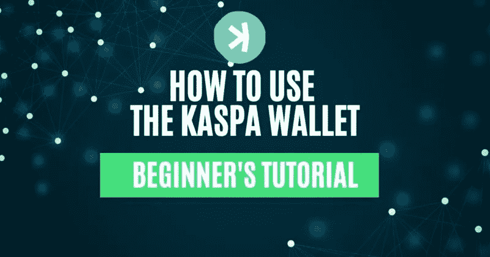
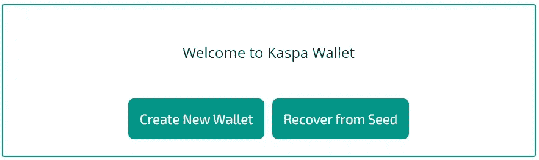
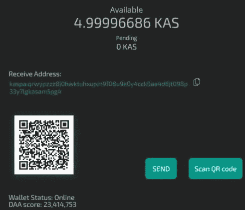
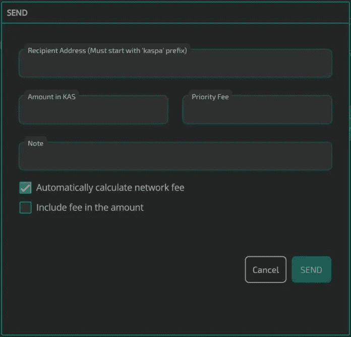
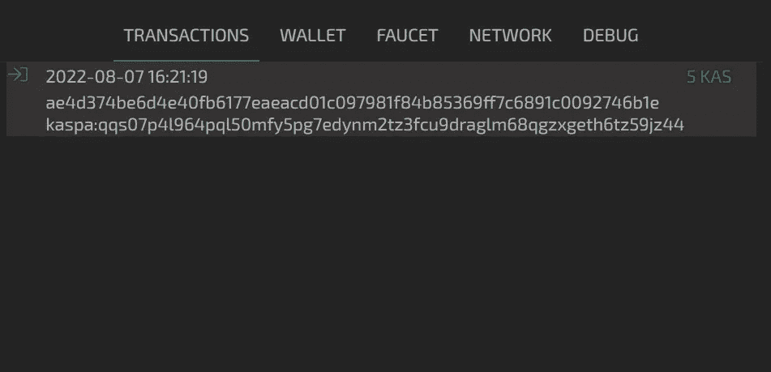
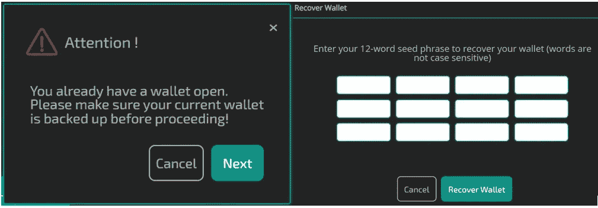
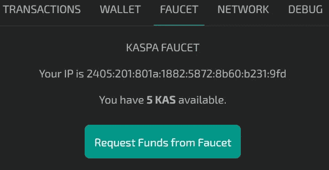
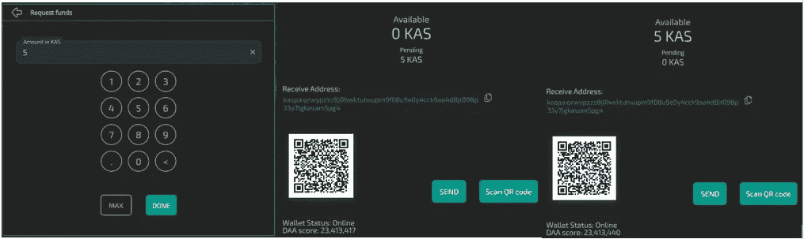
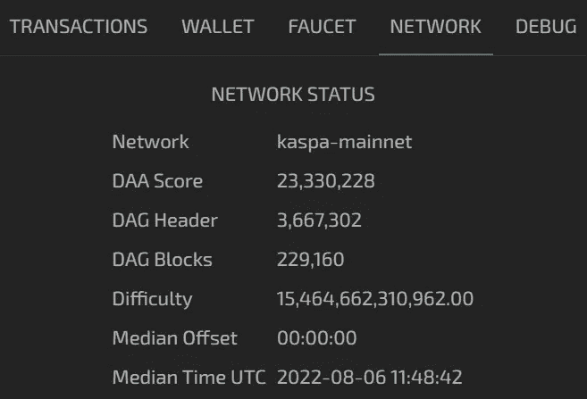

# 如何使用 Kaspa 钱包

> 原文：<https://medium.com/coinmonks/how-to-use-the-kaspa-wallet-18335b7fc94?source=collection_archive---------3----------------------->

*本指南包含如何访问和使用 Kaspa 钱包的详细步骤。*

## [Kaspa](https://kaspanet.org/) 是基于 GHOSTDAG 协议的 PoW(工作证明)项目。这是中本聪共识的一般版本。然后，该项目是开源的、基于社区的，并且不遵循中央治理或商业模型。这个想法是由 Yonatan Sompolinsky 和 Aviv Zohar 在 2016 年首先实现的。

通过使用 GHOSTDAG 协议，该团队旨在解决 Nakamoto 或任何基于 PoW 的项目中存在的规模限制。Kaspa 将提供设计第二层应用的工具。因此，该项目将像任何基于 PoW 的项目一样提供安全保证，具有更快的块处理速度和可调的块时间和奖励的优势。在本文中，您将学习如何使用 Kaspa 钱包。

**卡斯帕的钱包特色**

目前，Kaspa testnet 每秒处理 1 个块。然而，该团队正在努力将这一水平提高到每秒 10 块甚至 100 块。此外，KASPA 项目仍处于早期阶段。用户可能会遇到一些错误或网络连接问题。此外，我们将解释如何从水龙头中获得一些免费的 KAS[代币](https://www.altcoinbuzz.io/?s=tokens)并学习使用钱包。我们将开始学习如何得到卡斯帕的令牌。

**1)如何获得 KAS 代币**

然后，用户可以通过以下渠道获得卡斯帕的令牌 [KAS](https://www.coingecko.com/en/coins/kaspa) :

*   **TXBIT Exchange-** 从 TXBIT Exchange 获得 KAS 令牌，与 USDT 配对。
*   **通过采矿-** 你可以建立一个采矿节点来加入 Kaspa 生态系统，并获得 KAS 代币作为奖励。
*   **赏金-** 通过向卡斯帕社区捐款，从社区成员那里获得一些赏金令牌。

**2)Kaspa 钱包的种类**

此外，目前钱包有 3 种不同的形式:

*   Kaspa 网络钱包
*   桌面钱包
*   Kaspa 命令行钱包

此外，我们将解释如何访问和使用基于网络的钱包应用程序。

**3)如何使用 Kaspa 钱包**

要访问 Kaspa 网络钱包，请访问[链接](https://wallet.kaspanet.io/)

来源:[卡斯帕钱包](https://wallet.kaspanet.io/)

在这里，您可以找到两个选项来设置您的钱包:

*   **创建新钱包:**这将允许用户创建新钱包。
*   **从种子中恢复:**这允许用户通过给出他们的 12 个字的备份种子短语来取回他们现有的钱包和资金。

**4)如何打造 Kaspa 钱包**

然后，要创建一个新的[钱包](https://wallet.kaspanet.io/)，点击此选项。该应用程序将要求您设置您的钱包的密码。接下来，它将向您显示 12 个单词的备份短语，并要求您验证一些关键短语。一旦你确认无误，你就可以看到钱包的登陆页面。

**注意:**始终安全地存储您的备份短语。此外，备份短语是在任何设备上设置帐户的关键。如果您丢失了备份短语，您的资金就会丢失。

**5)如何接收 Kaspa 钱包中的资金**

在钱包的登陆页面，可以看到**接收地址。然后，用户可以使用这个地址或二维码从交易所或任何其他 Kaspa 钱包获得 KAS 代币。**

来源:[卡斯帕钱包](https://wallet.kaspanet.io/)

**6)如何从 Kaspa 钱包汇款**

发送选项允许您将您的 KAS 令牌转移到另一个 Kaspa 钱包。要传输，点击**发送**按钮。您现在需要填写收件人地址、您希望发送的金额和备注(可选)。

用户还可以设置交易的优先费用。然后，你需要确认交易。您可以使用**发送**选项来完成。

**7)如何查看 Kaspa 钱包中的交易**

从“交易”选项卡检查所有进出交易活动。你可以看到 KAS 代币的数量，以及交易的时间和日期。

来源:[卡斯帕钱包](https://wallet.kaspanet.io/)

**8) Kaspa 钱包的特点**

此外，在钱包选项卡下，用户可以找到以下功能:

1.  **复合交易**
2.  **备份种子-** 输入密码，检查您的种子短语
3.  **从 seed 恢复—** 此选项允许您通过提供 Seed 短语来恢复现有的 Kaspa wallet 帐户。此外，用户可以在选择导入其他帐户之前备份当前钱包中的短语。

接下来，它会要求您输入 12 个单词的备份短语。然后，如果您输入的短语正确，您的帐户将被导入。

来源:[卡斯帕钱包](https://wallet.kaspanet.io/)

1.  **导出 Wallet 种子文件(KPK)——**使用此选项导出当前 Kaspa wallet 的种子文件
2.  **导入 Wallet 种子文件(KPK) —** 使用此选项导入 Kaspa wallet 的种子文件以导入帐户。此外，应用程序将为您提供在本地驱动器中搜索种子文件的选项。

**9)如何从水龙头获得免费的 KAS 代币**

此外，从水龙头标签，你可以要求一些免费的 KAS 代币。用户可以请求显示在他们的钱包水龙头的标签中的可用余额(见下面的截图)。

来源:[卡斯帕钱包](https://wallet.kaspanet.io/)

此外，要请求点击**从水龙头**按钮请求资金。

此外，会出现一个窗口，您可以在其中输入您想存入钱包帐户的 KAS 币金额。然后，确认该过程，KAS 令牌将显示在您的帐户中。

然后，用户可以在 24 小时后从水龙头请求更多的资金。

**10)卡斯帕的网络**

通过此选项卡查看 Kaspa 主网络的详细信息。

**结论**

最后，项目处于早期阶段。我们在网上没有找到很多关于这个项目的资源。而且，效用令牌还是不明确的。总的来说，我们有望在未来获得更多关于这个项目及其生态系统的信息。

***注:*** *本帖首发* [*此处*](https://www.altcoinbuzz.io/bitcoin-and-crypto-guide/how-to-use-the-kaspa-wallet/) *同* [*一* ltcoinbuzz.io](https://www.altcoinbuzz.io/) *。*

跟我来吧

**👉** [推特](https://twitter.com/rumadas123)

**👉**[**Linkedin**](https://www.linkedin.com/in/ruma-das-a1439320/)

> **交易新手？试试[加密交易机器人](/coinmonks/crypto-trading-bot-c2ffce8acb2a)或[复制交易](/coinmonks/top-10-crypto-copy-trading-platforms-for-beginners-d0c37c7d698c)**