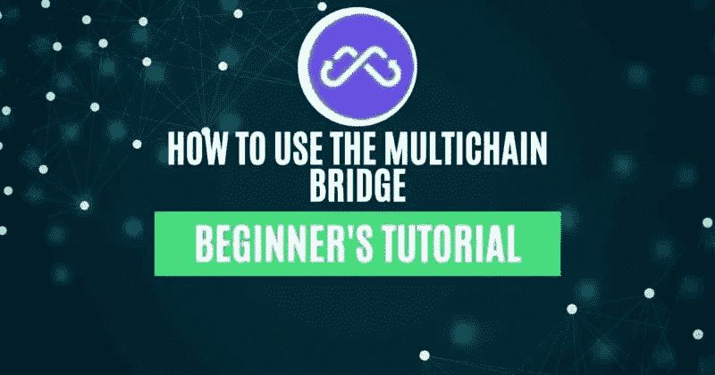
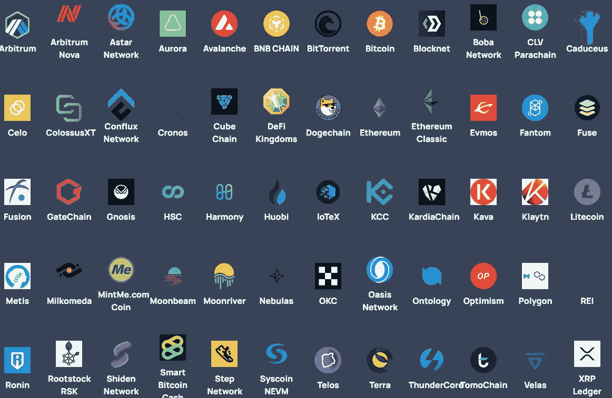
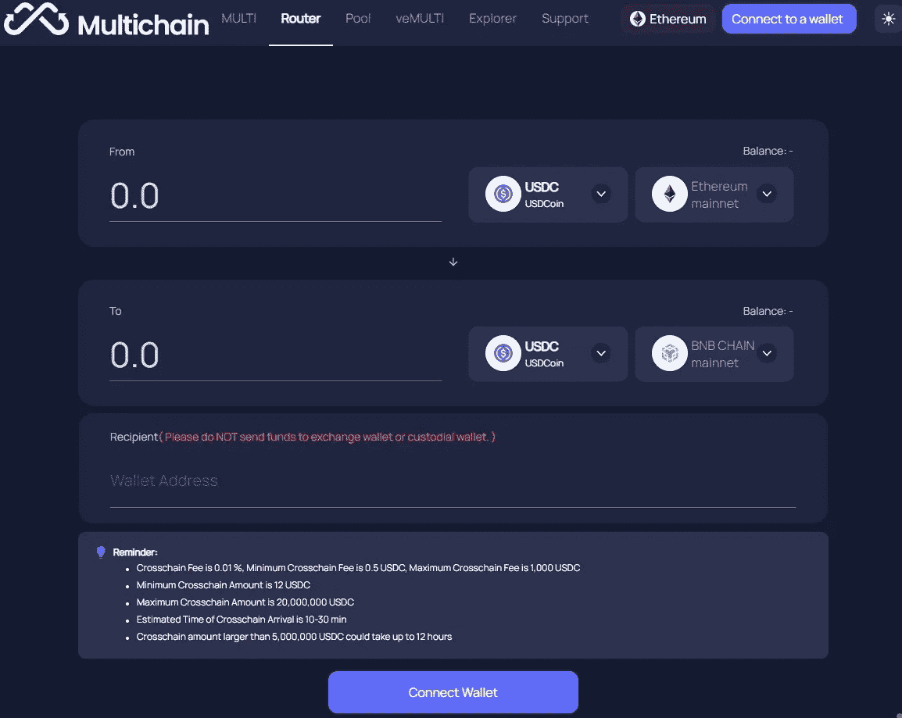
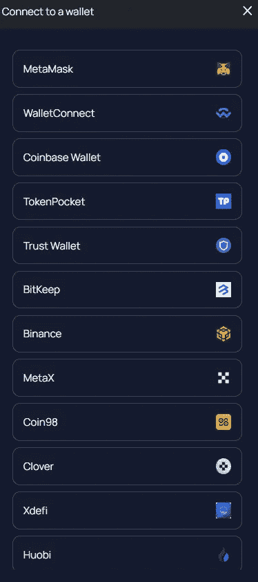
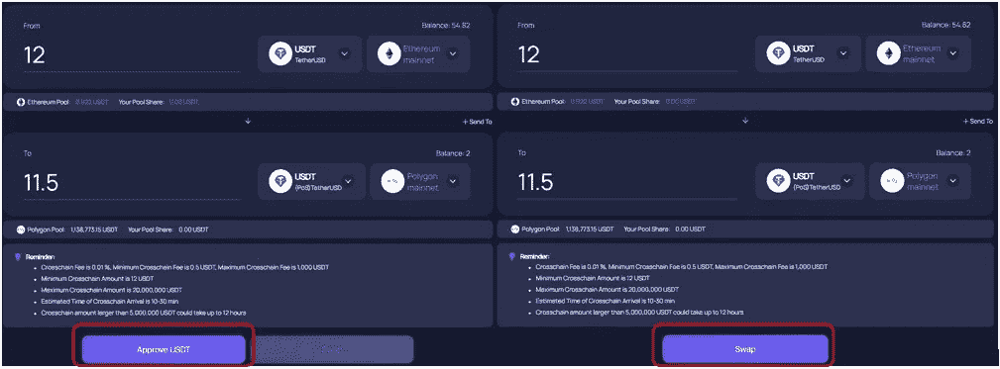
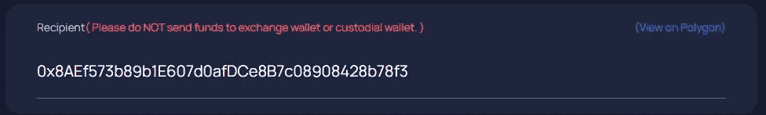
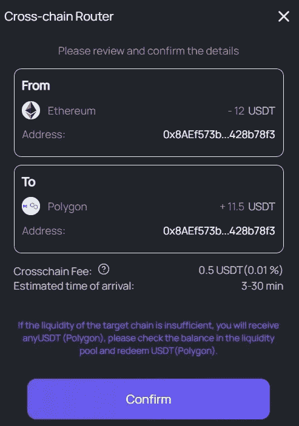
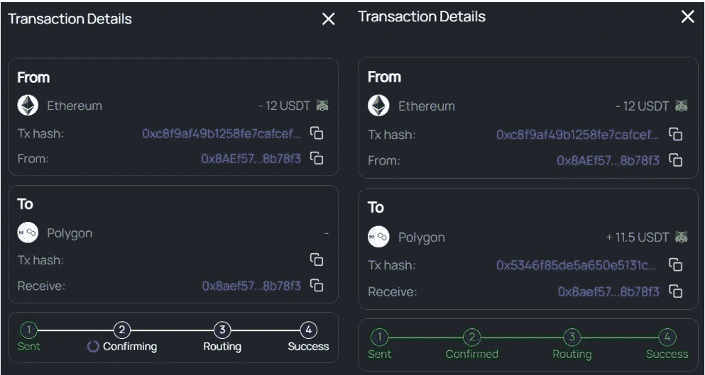
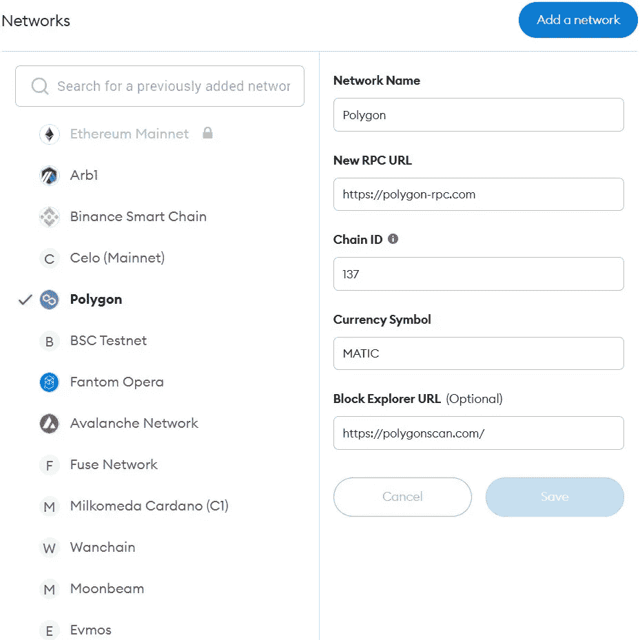
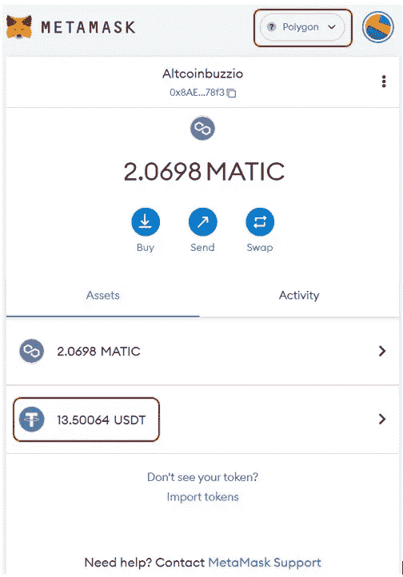

# 如何使用多链电桥

> 原文：<https://medium.com/coinmonks/how-to-use-the-multichain-bridge-837933ee3ac0?source=collection_archive---------27----------------------->

本指南包含如何访问和使用多链网桥将资产从以太坊网络传输到多边形网络的详细步骤。

## [多链](https://multichain.xyz/)是一种 Web 3.0 路由协议，有助于各种区块链网络之间的跨链交互。该协议诞生于 2020 年 7 月 20 日，名为 Anyswap，是开源的，并作为一个可互操作的层来支持几乎所有的区块链(要么已经集成，要么将在未来集成)。用户现在可以自由地将资产从任何一层网络如[以太坊](https://www.altcoinbuzz.io/reviews/technical-analysis/will-etc-maintain-its-rally-ahead-of-the-ethereum-merge/)转移到二层网络如 Polygon、Arbitrum 或 parachains (Moonbeam)等。

在本文中，我们将解释如何使用多链桥将资产从以太坊网络转移到多边形网络。

您也可以阅读我们之前关于 [Multichain 的指南，将资产从 BSC 网络转移到 CELO 网络](https://www.altcoinbuzz.io/bitcoin-and-crypto-guide/how-to-use-the-multichain-platform/)。

**关于多链桥的关键细节**

以下是多链桥的一些激动人心的数字:

*   支持 Metamask、比特币基地钱包等 13 款热门钱包
*   目前支持 61 个链。网络支持正在快速增长
*   2656+支持的令牌
*   支持 NFTs 网桥(ERC721 和 ERC1155)
*   TVL 总计锁定了 26.1 亿美元

**支撑链条**

多链网桥支持大量的链，包括第 2 层网络，如 Polygon、Arbitrum、optimistry 等。查看下面截图中支持的链的完整列表。用户可以使用多链桥在任意两个受支持的链之间转移资产。

**访问多链桥**

要使用多链桥，请访问[链接](https://app.multichain.org/#/router)

你可以看到下面的屏幕。用户需要在以下字段中输入一些必需的详细信息，以启动桥接转移:

*   源网络
*   目的网络
*   令牌和您希望转账的金额

但是在继续之前，用户需要首先连接他们的钱包来与桥一起工作。

**连接钱包**

点击**连接到钱包**按钮连接您的钱包。Multichain 允许您使用以下任何钱包类型连接到平台:

*   元掩码
*   WalletConnect
*   比特币基地钱包
*   令牌袋
*   信任钱包
*   灵知安全
*   比特保持
*   币安
*   MetaX
*   Coin98
*   三叶草
*   Xdefi
*   火币

我们将使用 Metamask 钱包连接到网桥。

**如何从以太坊转移到多边形**

正如我们前面提到的，用户需要填写某些字段作为输入参数来启动转移。因此，在这里，为了从以太坊转换到多边形，我们将在必填字段中填入以下值。

此外，将 Metamask 钱包中的网络(在本例中)设置为以太坊，因为传输是从以太坊网络生成的。

*   选择**以太坊**作为**来源网络**
*   选择**多边形**作为**目的网络**

我们的联网钱包中有一些 USDT，我们将使用多链网桥进行转账。输入您希望转移的代币金额。现在，检查您将在目的网络中收到的令牌和数量。

该桥对资产转移施加某些标准，并显示在屏幕上。举个例子，

*   最低转账金额是 12 USDT
*   用户最多可以转移 20，000，000 USDT
*   处理时间大约为。10-30 分钟
*   金额超过 5，000，000 USDT 可能需要 12 个小时来处理
*   跨链费用为 0.01 %，跨链费用范围为 0.5 USDT(最低)至 1，000 USDT(最高)

**更改收件人地址**

如果您不希望将资产发送到您连接的电子钱包的相同地址(但使用不同的网络)，您可以点击**+发送到**按钮。现在，您可以删除默认地址，并输入所需的收件人地址。但是，请注意，该地址不应是交换地址或保管钱包的地址。

如果您是第一次使用资产和网络对，那么您必须首先**批准**该流程。一旦批准，您可以看到**交换**按钮。最后，检查并确认流程。

用户将在其 Metamask 钱包中收到一笔交易。确认交易，流程将提交到网络。您可以在屏幕上检查进程的状态。

**重要提示:**源令牌在目的网络中的流动性可能不足。在这种情况下，您将收到其他固定资产。

**在元蒙版中添加多边形网络**

用户需要在其元掩码钱包中添加网络和令牌详细信息，以查看生成的令牌。要在元蒙版中添加多边形网络，进入**设置- >添加网络**，并填写以下细节:

*   **网络名称-** 多边形
*   **新建 RPC 网址-**[https://polygon-rpc.com](https://polygon-rpc.com)
*   **链条 ID**–137
*   **货币符号**–MATIC
*   **屏蔽浏览器网址(可选)——**【https://polygonscan.com/ 

**元掩码中的合成 USDT**

如果您无法在元掩码钱包中看到生成的令牌(在目的网络中)，那么您必须通过转到**导入令牌**字段来添加令牌合同地址。添加后，您可以在钱包中看到最终的代币余额。

***注:*** *本帖首发* [*此处*](https://www.altcoinbuzz.io/bitcoin-and-crypto-guide/how-to-use-the-multichain-bridge/) *同* [*一* ltcoinbuzz.io](https://www.altcoinbuzz.io/) *。*

跟我来

**👉** [推特](https://twitter.com/rumadas123)

**👉**[**Linkedin**](https://www.linkedin.com/in/ruma-das-a1439320/)

> **交易新手？尝试[加密交易机器人](/coinmonks/crypto-trading-bot-c2ffce8acb2a)或[复制交易](/coinmonks/top-10-crypto-copy-trading-platforms-for-beginners-d0c37c7d698c)**