# 如何使用绿洲钱包

> 原文：<https://medium.com/coinmonks/how-to-use-the-oasis-wallet-17d699ca83f?source=collection_archive---------6----------------------->

本指南包含如何设置和使用 Oasis wallet 的详细步骤。

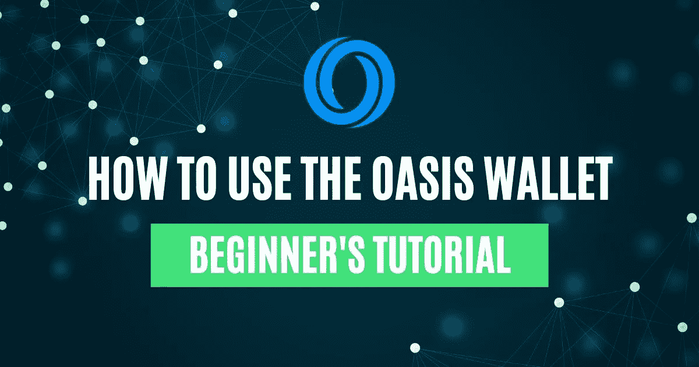

## [Oasis Network](https://oasisprotocol.org/) 是一个第 1 层区块链平台，旨在为 Defi 平台带来隐私和可扩展性。它提供私有智能合约、高吞吐量和数据令牌化。用户可以使用这种独特的数据令牌化方法，通过在希望以受控和受限的方式分析数据的应用程序中标记他们的数据来获得奖励。

该平台有一个名为 ROSE token 的本机令牌。用户可以下注玫瑰令牌，并获得每年高达 20%的奖励。该平台有一个本地 Oasis 钱包，既可以作为 web 应用程序，也可以作为浏览器扩展。用户可以通过这个[链接](https://wallet.oasisprotocol.org/)使用网页版。

在本文中，我们将解释如何为 Google Chrome 浏览器扩展设置 Oasis wallet。

**安装 Oasis Wallet 应用程序**

要安装钱包应用程序，请访问此[链接](https://chrome.google.com/webstore/detail/oasis-wallet/ppdadbejkmjnefldpcdjhnkpbjkikoip)。

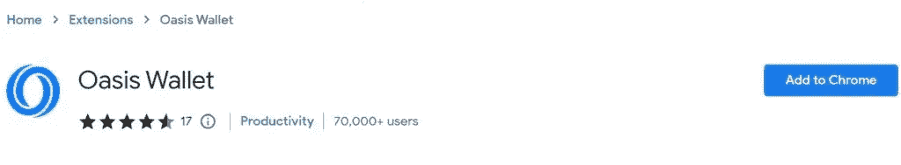

你会发现**添加到 Chrome** 按钮。点击它，应用程序将请求您允许将钱包应用程序添加到您的浏览器扩展中。

提供您对安装应用程序的批准。安装过程完成后，您可以在扩展栏上看到应用程序图标(下面突出显示)。

**设置钱包**

要使用钱包，用户需要在安装完成后设置他们的钱包帐户。

单击应用程序图标，查看各种设置选项。您可以使用以下两种方法设置您的帐户:

*   创建钱包
*   恢复钱包

“创建钱包”选项允许您创建新的 Oasis 帐户，而“恢复钱包”选项可帮助您在新设备上恢复现有帐户。

**创建钱包**

加密用户可以使用此选项创建新的 Oasis wallet。

点击**创建钱包**，应用程序将要求您设置钱包的密码。接下来，它会向您显示 24 个单词的备份短语，并要求您验证您的密钥短语。验证正确后，您将被引导至钱包的登录页面。

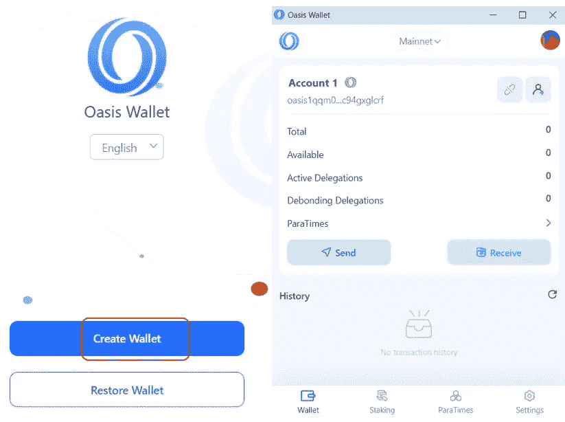

**重要提示:**用户当然应该安全地存储他们的关键短语。如果您丢失了设备，您可以使用**导入**功能来恢复您的资金。如果你丢失了你的关键短语，你以后就不能收回资金了。

**恢复钱包**

“恢复钱包”选项允许您恢复现有帐户及其相关资金。如果你想恢复一个账户，那么，在设置钱包时，你必须选择**恢复** **钱包**选项。

该应用程序将要求您填写 24 个单词的备份短语。提供正确的关键短语，您的关联帐户将被恢复，您可以看到钱包余额。

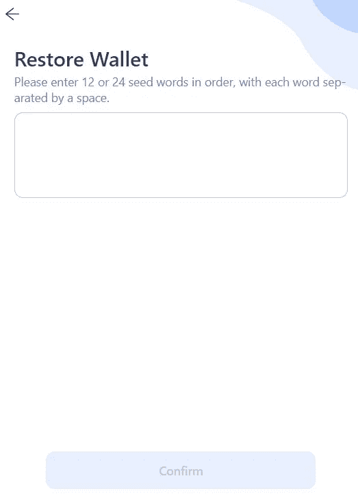

**导出私钥**

用户也可以通过给钱包的私钥来恢复他们现有的账户。在将任何资金转入您的帐户之前，建议您备份您的帐户(私钥和密钥短语)。

您可以单击下面突出显示的图标，获得导出您的私钥的选项。

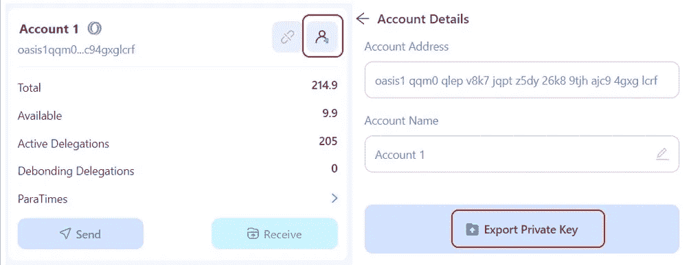

**账户管理**

Oasis wallet 应用程序提供以下三种方法来管理您的钱包帐户:

1.  **创建账户**

钱包允许用户在应用程序中创建多个帐户。

要创建另一个账户，请转到**账户管理**部分，点击**创建账户**。为您的帐户命名并确认该过程。

您的帐户将被创建。您可以切换到任何帐户来使用它。

**2。导入账户**

使用导入选项，用户可以导入以下帐户类型:

*   **Oasis 帐户** —通过给出备份短语来导入现有的 Oasis 帐户。
*   **以太坊账户** —通过给出私钥导入现有以太坊账户。

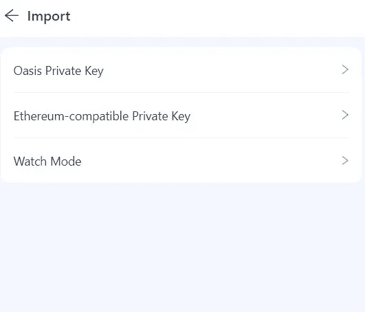

**3。莱杰**

Oasis wallet 还允许用户将他们的分类帐设备与 wallet 应用程序连接起来。

要使用 Ledger，请将设备插入系统，然后在您的 Ledger 上安装 Oasis 应用程序。

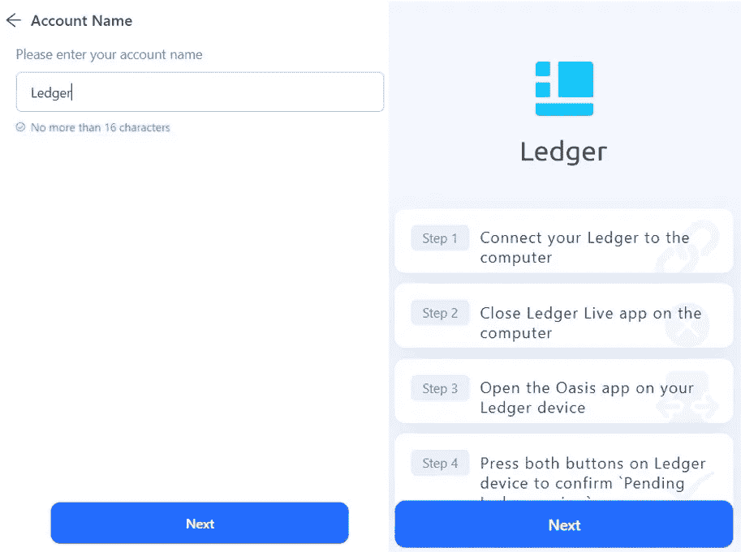

一旦安装了应用程序，您就可以通过您的分类帐设备发送/接收或委托 ROSE 令牌。

**发送**

**发送**选项允许用户向其他 Oasis network 用户发送 ROSE 令牌。

要传输，点击**发送**选项。接下来，输入您希望发送的玫瑰代币数量，并填写收件人地址。审查并确认流程。

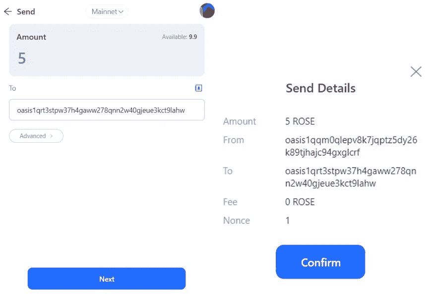

**接收**

要在您的钱包中收到玫瑰令牌，您需要接收地址或公共地址。您可以点击钱包主页上的**接收**按钮，显示您的接收地址。使用此地址在您的帐户中接收玫瑰令牌。

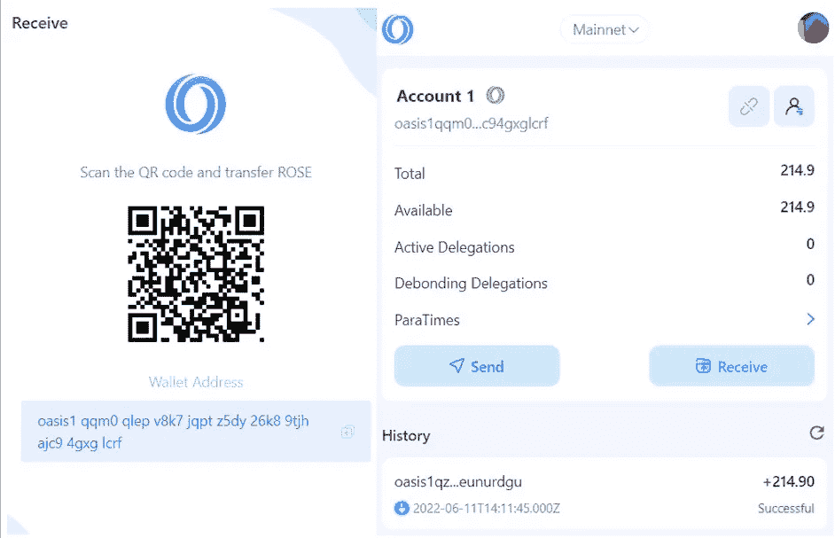

**网络**

Oasis wallet 应用程序允许您连接主网络和测试网络。您可以点击下面突出显示的图标来切换和使用所需的网络。

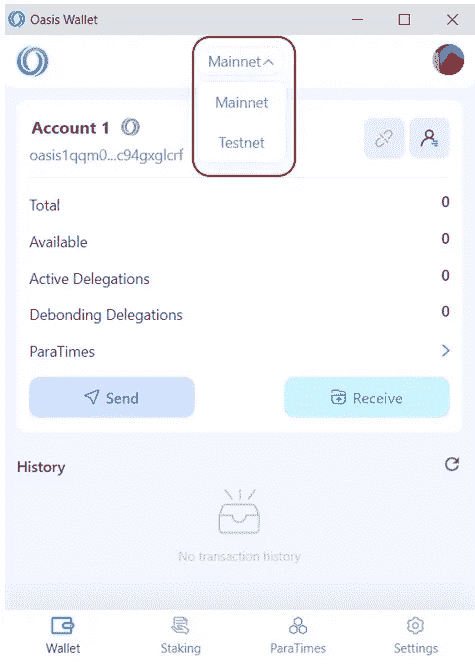

**历史**

历史记录部分列出了与您的帐户相关的交易详情。你可以点击某项交易来了解更多信息。

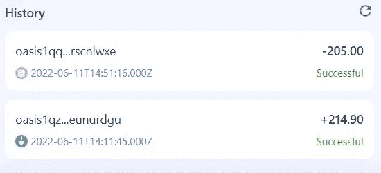

**设置**

钱包的**设置**选项卡允许您执行以下操作:

*   **安全**

从**安全**部分，您可以检查并备份您的密钥短语。您也可以在这里更改钱包的密码。

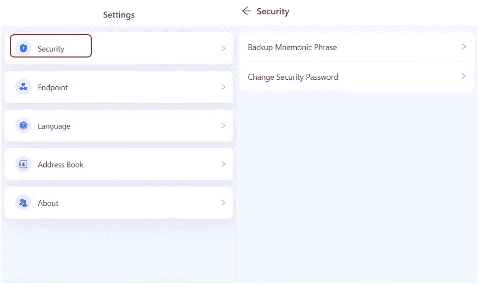

*   **终点**

**端点**部分列出了关于主网络和测试网络的节点细节。如果您愿意，您可以按照下面截图中显示的步骤添加一个节点。

注意，这个过程需要技术知识。我们建议在您具备适当的知识之前，不要更改任何默认设置。

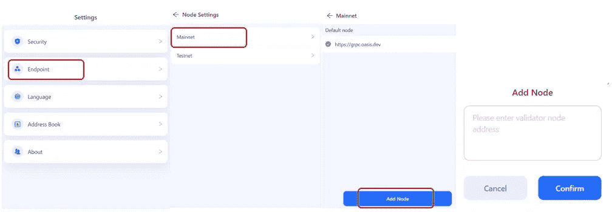

*   **语言**

目前，钱包应用程序仅支持两种语言，即英语和中文。您可以选择任何以您的首选语言查看钱包详细信息。

*   **通讯录**

**地址簿**可让您添加常用联系人，以便于访问。

您可以按照以下步骤向您的联系人添加另一个 Oasis wallet 地址。

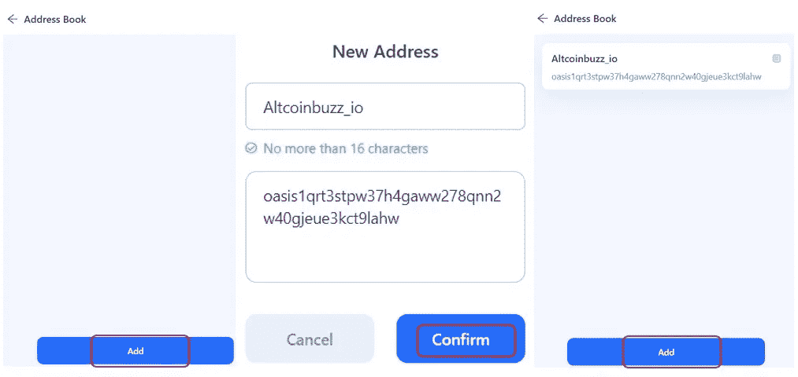

在本系列文章的[下一部分](https://www.altcoinbuzz.io/passive-income/staking/how-to-stake-the-rose-token/)中，我们将解释什么是 Para 时间，以及如何下注 Oasis native token(玫瑰令牌)并赢取奖励。

***注:*** *本帖首发* [*此处*](https://www.altcoinbuzz.io/bitcoin-and-crypto-guide/how-to-use-the-oasis-wallet/) *同 Altcoinbuzz.io.*

**跟着我**

**👉** [推特](https://twitter.com/rumadas123)

**👉** [领英](https://www.linkedin.com/in/ruma-das-a1439320/)

> 交易新手？尝试[加密交易机器人](/coinmonks/crypto-trading-bot-c2ffce8acb2a)或[复制交易](/coinmonks/top-10-crypto-copy-trading-platforms-for-beginners-d0c37c7d698c)