# 如何使用 Objkt 平台

> 原文：<https://medium.com/coinmonks/how-to-use-the-objkt-platform-52a2e316417a?source=collection_archive---------6----------------------->

本指南包含如何使用 Objkt 平台的详细步骤。

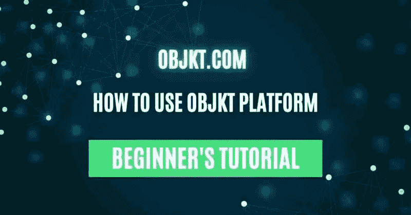

## [Objkt](https://www.altcoinbuzz.io/nft/objkt-leads-the-nft-marketplace-on-tezos/) 是泰佐斯区块链上最受欢迎和最大的 NFT 市场之一。这是一个创作者的中心，他们可以在这里铸造，列表，购买和出售他们独特的 NFT。创作者可以使用任何支持 Tezos 钱包的产品连接平台。他们还可以与其他创作者合作设计一个系列。Tezos 是最便宜的网络之一，与任何基于以太坊的项目相比，它要求用户支付非常低的费用。

因此，在本文中，我们将详细解释如何使用 Objkt 平台。

**进入 Objkt 平台**

要使用该平台，请访问[链接](https://objkt.com/)

**连接钱包**

要使用该平台，用户需要连接他们的钱包。点击**同步**按钮。它将显示以下不同媒体下的钱包类型列表，您可以使用它们来连接:

1.  **浏览器扩展**

*   螺旋
*   寺庙钱包

1.  **桌面&网络钱包**

*   大帆船
*   酷开钱包
*   鲜味

1.  **手机钱包**

*   Airgap 钱包
*   自治
*   南安钱包
*   寺庙钱包

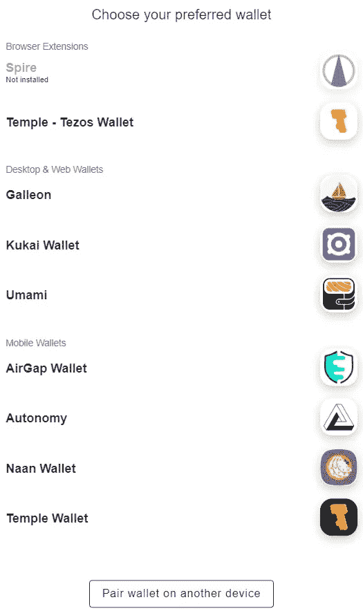

我们在系统中安装了 Temple wallet(浏览器扩展),我们将使用它来连接到平台。

如果你是一个新的 Tezos 用户或第一次使用 Temple wallet，那么你可以在这里阅读我们关于如何安装和使用 Temple wallet 的指南。

因此，从选项中选择 temple wallet，并批准在这两个应用程序之间建立连接的过程。

**直播**

**活动**选项卡包含当前列出、重新列出或从列表中取消的对象列表。这意味着您可以在这里查看与平台对象相关的实时活动。

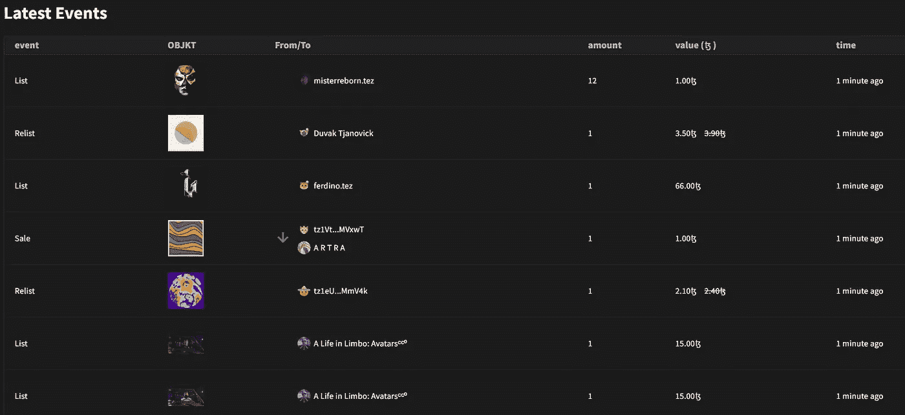

**探索**

explore 选项卡允许您浏览整个 Objkt 平台。在这里，您会发现以下不同的选项卡:

1.  **代币**

在“标记”标签中，您可以看到由不同艺术家创建的 NFT(已列出、未列出)。在每个 NFT 下，您可以查看售价(如果有列出)和版本数。

您还可以在页面左侧找到一个**过滤器**选项，您可以使用它根据以下标准过滤掉 NFT:

*   集合类型
*   标签
*   MIME 类型
*   价格
*   版本
*   属性

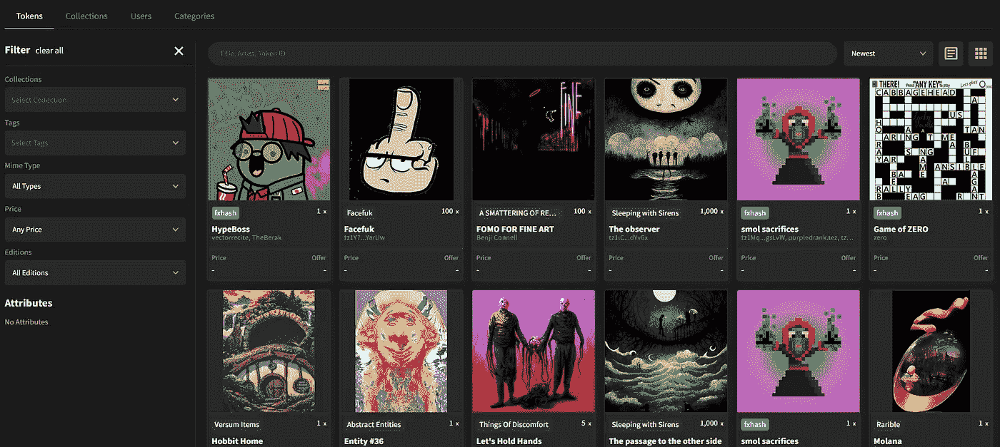

1.  **收藏**

此选项卡列出了 Objkt 市场中存在的各种收藏。定义收藏后，您可以进入此选项卡并搜索您的收藏。我们将在本文后面解释这些步骤。

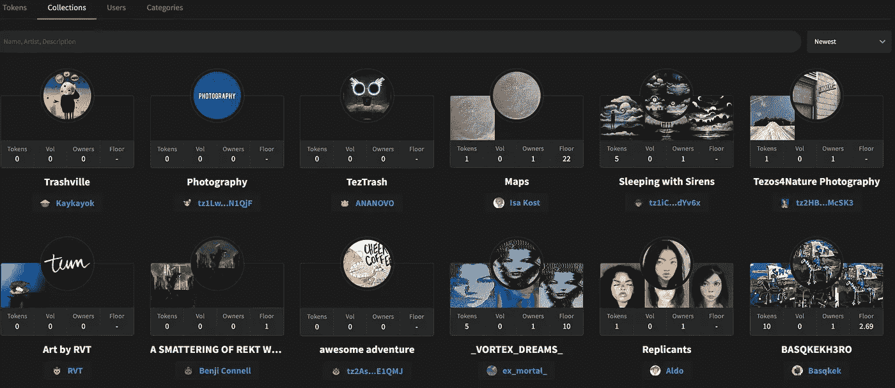

1.  **用户**

**用户**选项卡列出了 Objkt 平台的活跃用户。您可以选择任何用户，以获得关于他/她和他的收藏的更多详细信息。

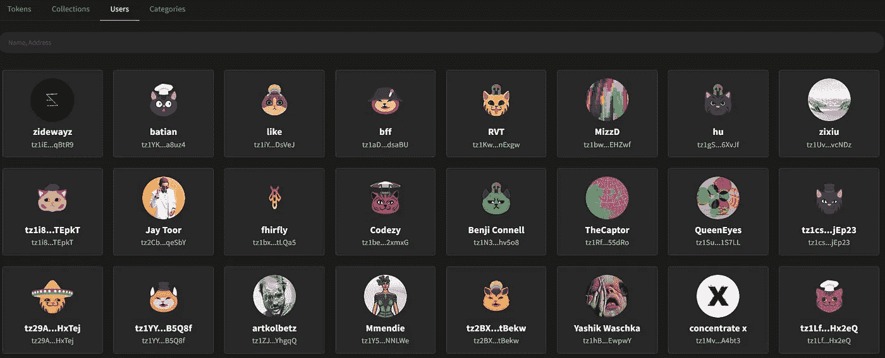

1.  **类别**

在这里，你可以看到存储在音乐、单色、绘画等几个通用类别中的 NFT。这对于新手和不太了解加密术语和标记的用户来说很有用。

你可以通过给出这些简单的已知术语来搜索你想要的 NFT，并且可以学习和探索它们。

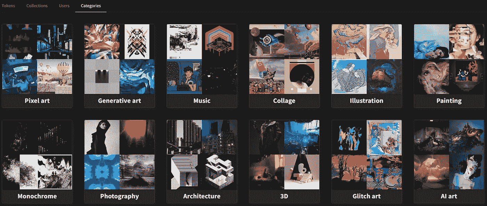

**NFT 详情**

创建 NFT 时，创建者需要定义 NFT 的某些属性。在每个 NFT 中，您会发现三个不同的选项卡，为您提供一些相关信息。以下是不同的选项卡:

1.  **详情**

在**详细信息**选项卡中，您可以查看 NFT 的描述。在这里找到创建者的名字，以及他的个人资料的链接，在那里你可以查看他的其他 NFT。

除此之外，您还可以在这里获得以下关于 NFT 的详细信息:

*   版本
*   拥有
*   版税
*   MIME 类型
*   铸造日期
*   令牌 ID
*   IPFS 链接
*   许可证
*   合同

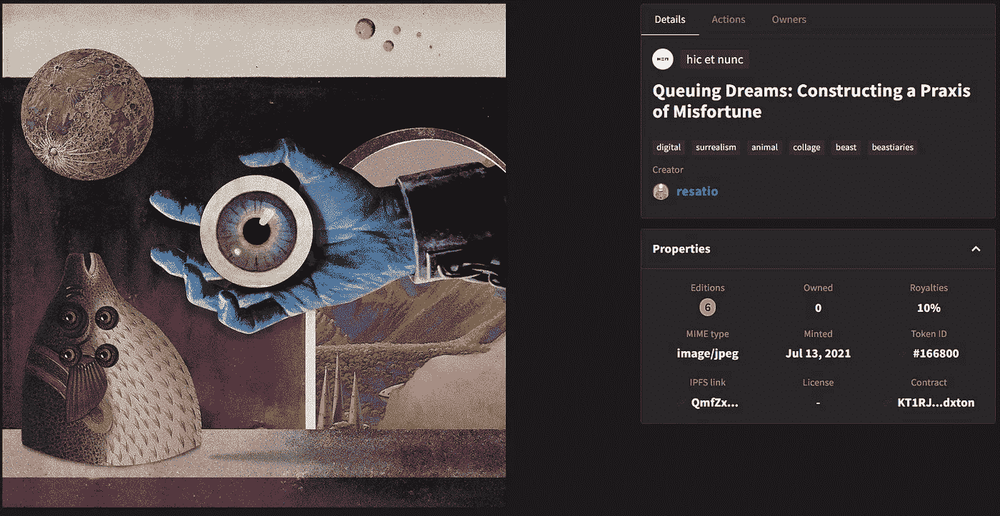

在页面底部，您可以查看 NFT 每笔交易的相关历史记录。

1.  **动作**

“操作”选项卡列出了您或所有者可以执行的各种活动。如果代币未列出，您可以在此处输入出价/出价。对于打折的物品，你可以找到一个**购买**按钮。感兴趣的用户可以购买。

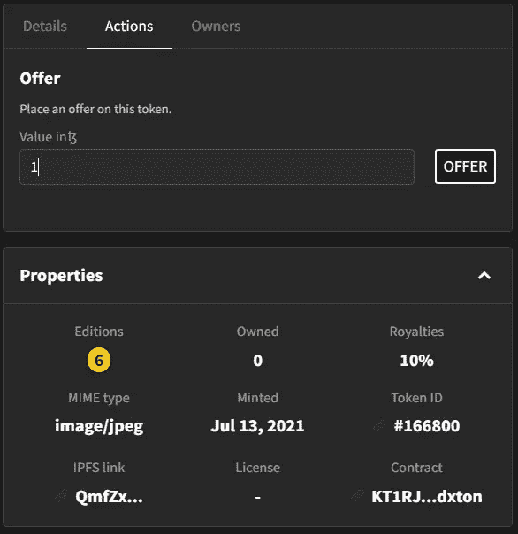

1.  **车主**

Objkt 允许创作者与其他艺术家合作。店主可以通过给出他们的 tezos 钱包地址来邀请其他艺术家，并要求他们在现有的收藏中创作 NFT。因此，您可能会发现一个集合可能有多个所有者。您可以从该选项卡中查看集合的所有现有所有者的列表。

**设置**

在**设置**选项卡下，您可以看到/更新以下内容:

1.  **简介**

在 **Profile** 选项卡下，您会发现多个部分，每个部分都提供了关于您的 Objkt 投资组合的信息:

*   在此查看最近的销售、购买、优惠、列表等
*   **创建-** 显示令牌列表
*   **收藏-** 显示您的收藏
*   **拥有-** 显示您拥有的 NFT
*   历史记录- 在这里查看你的帐户历史记录(名单、铸币、报价等)
*   **优惠-** 查看您的优惠
*   **刊登-** 查看你刊登的物品
*   **拍卖-** 查看拍卖物品的状态
*   **通知**
*   **邀请-** 查看您的合作邀请

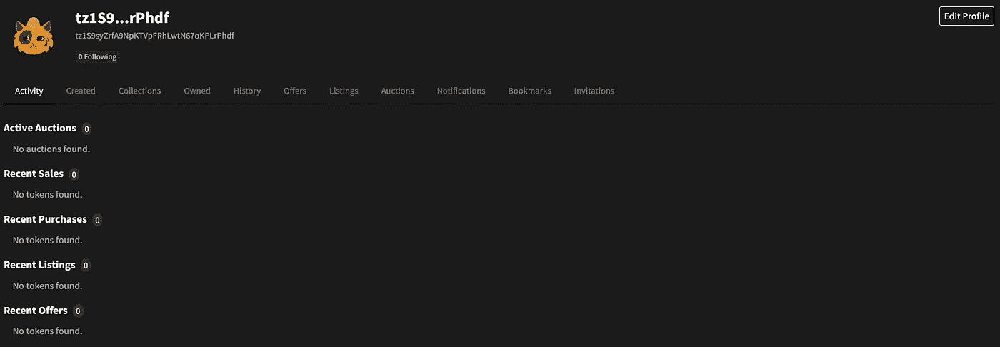

1.  **创建**

Objkt 允许用户通过支付象征性的费用来制造 NFT。您可以转到**创建**部分，并创建 NFT。用户需要首先创建一个集合，然后他们可以在该集合中铸造 NFT。你可以把一个系列想象成一个盒子，里面装着多件质量相似的物品。

*   **创建收藏**

点击**创建**选项，会得到提示**创建新收藏**(如果之前没有创建)。如果您已经有一个集合，那么您可以使用该集合或者创建一个新的集合。

要创建收藏，您需要提供以下详细信息:

*   上传收藏图像
*   唯一名称
*   收藏类型(艺术品、收藏品、其他)
*   描述

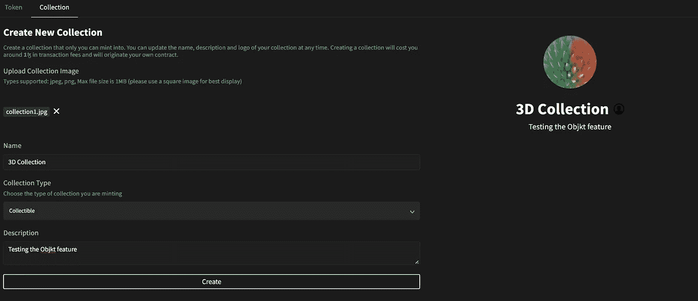

填写完上述所有细节后，点击**创建**按钮。这将在你的 Temple wallet 中触发一笔交易(花费你一小部分 Tezos ),你需要确认。

交易成功后，您可以在**收藏**标签中搜索您的收藏。

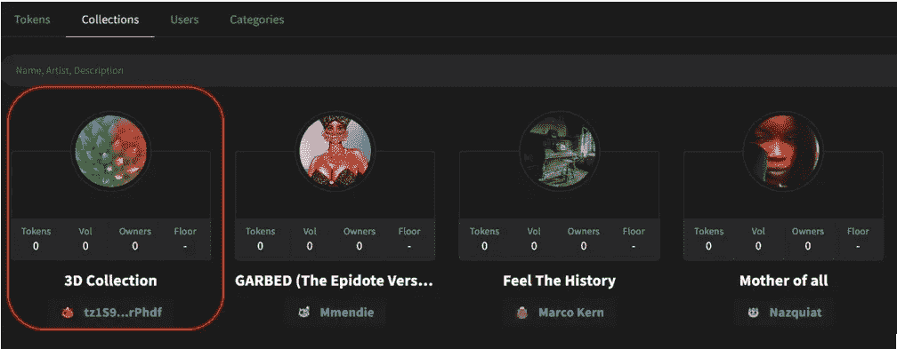

**收款明细&选项**

您可以点击您的收藏，查看您可以对其执行的各种活动。在这里，您可以检查以下参数:

*   集合持有的项目数
*   总体积
*   24 小时体积
*   所有者数量
*   出售的商品数量
*   底价(如果该系列中有任何商品准备出售)
*   最近列出的项目
*   最近铸造的项目
*   售出的物品

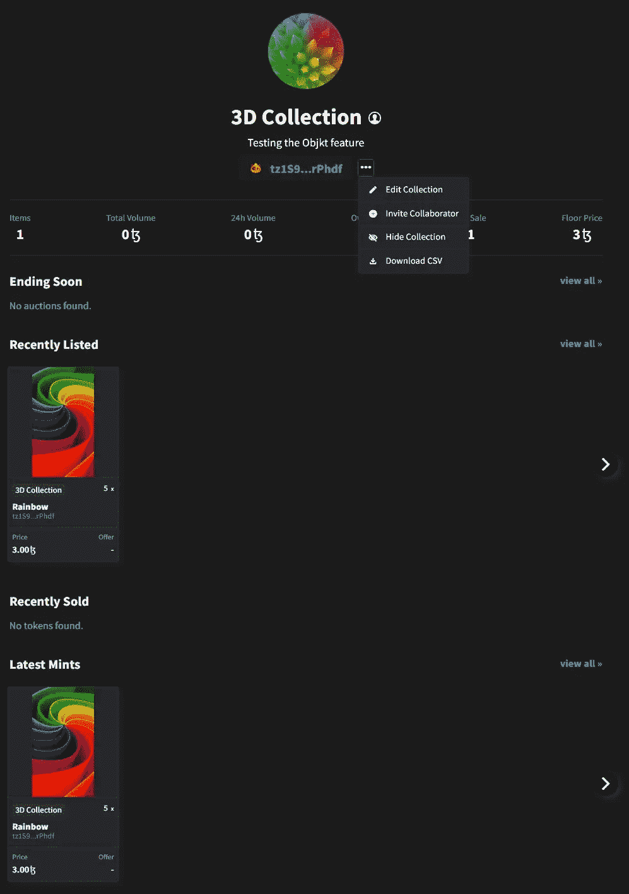

除了这些参数，您还可以找到一个选项，让您对现有的集合进行一些更改。

用户可以找到**编辑收藏**按钮，使用该按钮可以更新现有收藏的名称、收藏图像、收藏类型和描述。

你也可以通过给出他们的钱包地址并邀请他们合作来邀请他们。他们以后可以贡献给你的收藏。只需点击**邀请合作者**并输入他们的 Tezos 支持钱包地址。

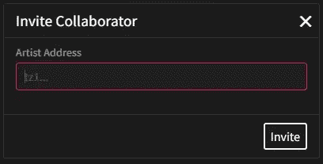

使用**下载 CSV** 选项，收藏所有者可以下载包含收藏详细信息的 CSV 文件，如地址、数量、Twitter 链接、discord 地址等。

**创建新令牌**

创建集合后，现在可以继续创建新令牌。要定义令牌，用户需要提供以下详细信息:

*   上传文件(支持的文件类型- gif、jpeg、mp4、mp3 等，大小在 100MB 以内)
*   输入标题
*   描述
*   添加标签
*   从下拉列表中选择一个集合或定义新集合
*   许可证
*   Edition(您希望制造的份数，应该在 1 到 10，000 之间。)
*   版税(费用的百分比，在 0%- 25%之间)

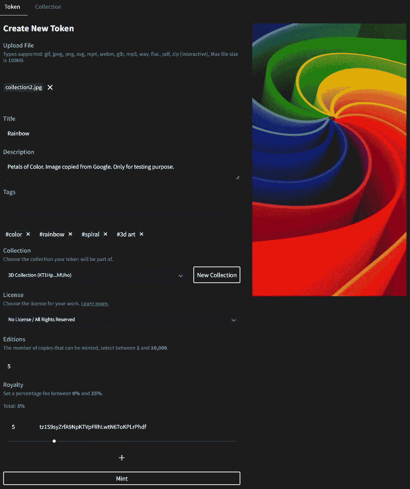

一旦您输入了上述所有详细信息，请点击 **Mint** 。这将在你的 Temple 钱包中触发一个交易，确认它。交易成功后，您可以查看收藏中的代币(见下面的截图)。

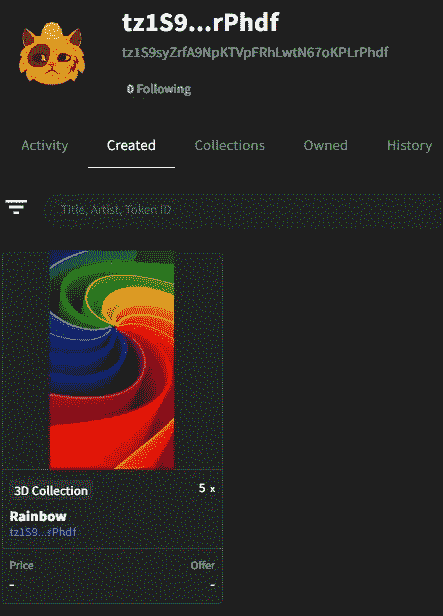

**如何在物品市场中列出代币**

若要在市场上列出你的物品，请选择你的 NFT，然后前往**动作**标签。你可以看到下面的窗户。

在此，在**版本**字段中，输入您希望发售的版本号。在 **Value** 字段中，输入您想要出售该商品的价格(以 Tezos 为单位)。

除此之外，您还可以在这里找到以下功能:

*   将 NFT 发送给用户
*   烧一个 NFT
*   开始拍卖

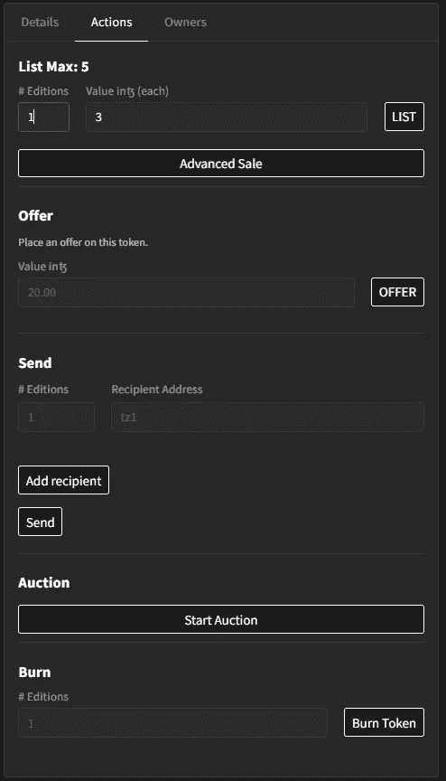

确认流程。交易成功后，您可以进入**浏览**选项卡，搜索您列出的代币/NFT。如果你点击那个特定的 NFT，你会发现**购买**按钮可以让其他用户购买物品。

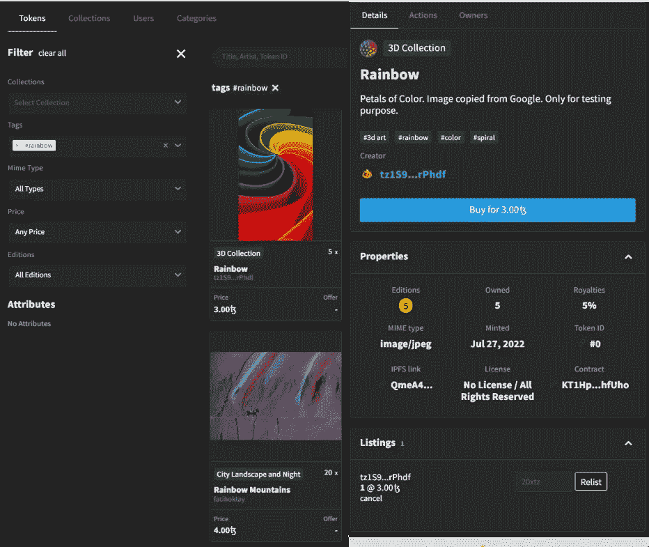

**如何拍卖 NFT 作品**

创作者可以拍卖他们的 NFT。正如我们所知，拍卖意味着你要求感兴趣的用户在一段时间内对物品出价(高于所有者设定的最低价格)。一般在规定时间内出价最高者被选为未来所有人。

若要拍卖你的物品，请开启物品详情。现在，进入**行动选项卡- >拍卖部分**。您可以看到下面的窗口，在这里您需要填写以下详细信息:

*   金额(你希望拍卖的物品数量。一般 1)
*   最低投标金额
*   最小增量
*   到期日期

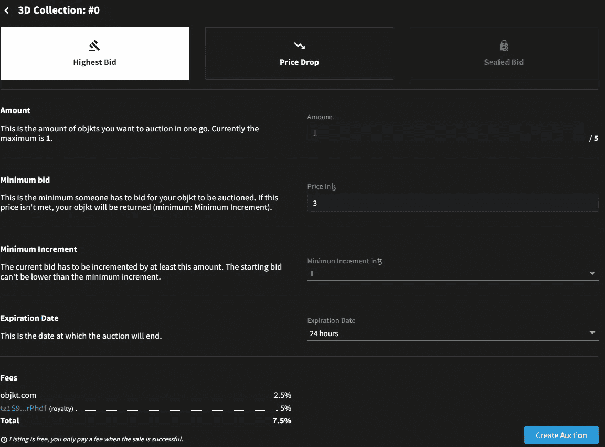

完成后，点击**创建拍卖**按钮，并确认交易。你可以到**个人资料标签- >拍卖区**查看你所有拍卖物品的状态。

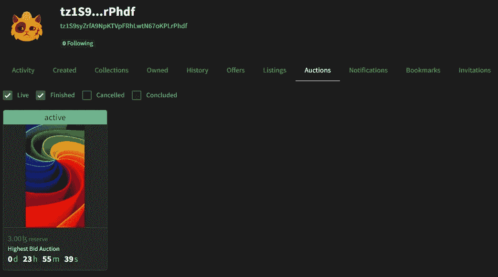

感兴趣的用户可以对拍卖的物品出价。其他用户可以看到下面的屏幕，并在 oXTZ 字段的**值中输入他们希望购买 NFT 的值。**

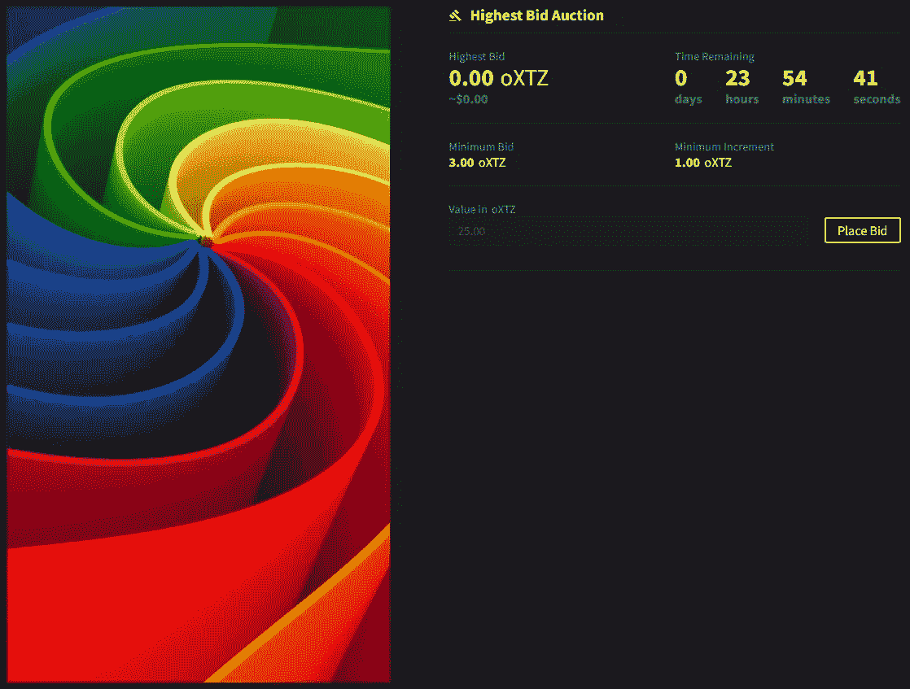

**结论**

Objkt 是 Tezos 上最大的 NFT 市场。区块链网络最近变得流行起来，在实现了 FA2 令牌标准(一种类似于以太坊的 ERC-1155 的令牌标准)之后，吸引了几个 NFT 项目。它提供了一个成本效益高的解决方案，因为该网络收取较低的气费。这种品质可以帮助一些新兴的艺术家越来越多地展示和探索他们的才华，这反过来又有助于整个 NFT 产业和网络的发展。

***注:*** *本帖首发* [*此处*](https://www.altcoinbuzz.io/bitcoin-and-crypto-guide/how-to-use-the-objkt-platform/) *同*[*ltcoinbuzz . io*](https://www.altcoinbuzz.io/)**。**

***跟着我***

***👉**推特*

***👉**[**Linkedin**](https://www.linkedin.com/in/ruma-das-a1439320/)*

> ***交易新手？尝试[加密交易机器人](/coinmonks/crypto-trading-bot-c2ffce8acb2a)或[复制交易](/coinmonks/top-10-crypto-copy-trading-platforms-for-beginners-d0c37c7d698c)***