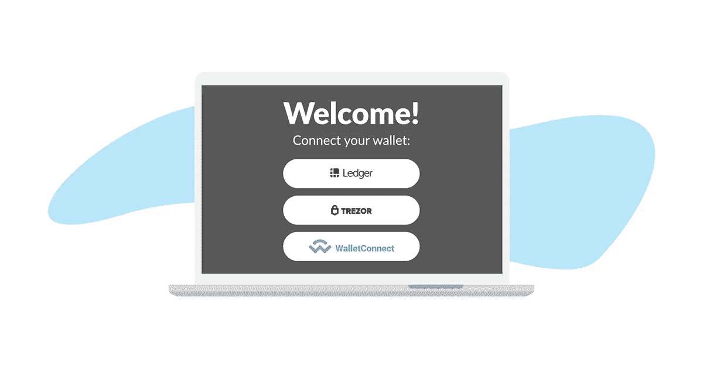
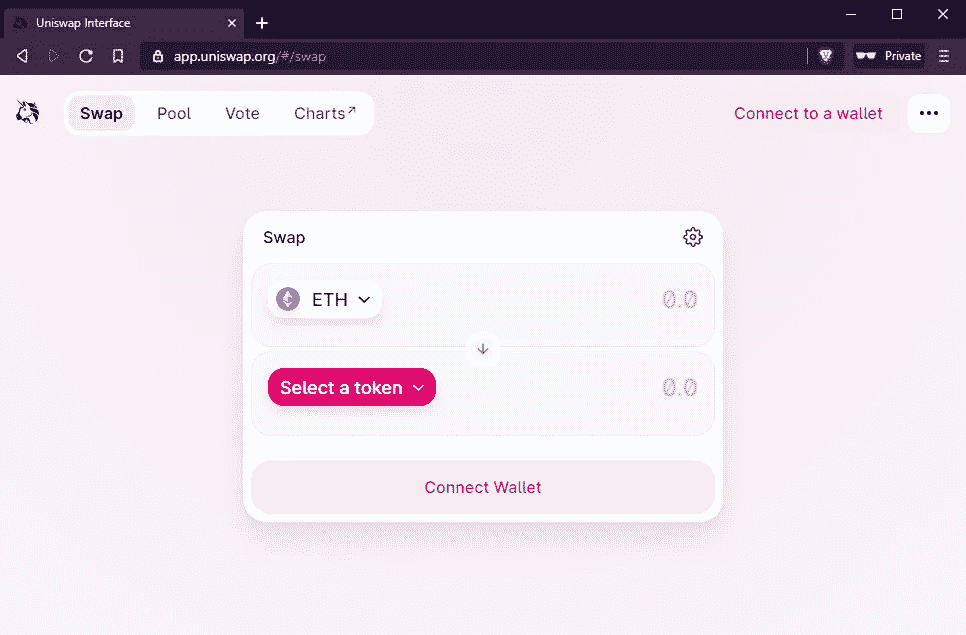
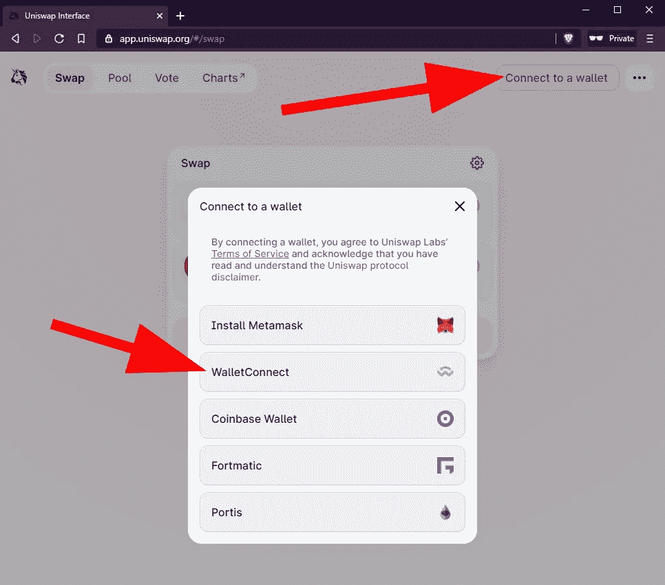
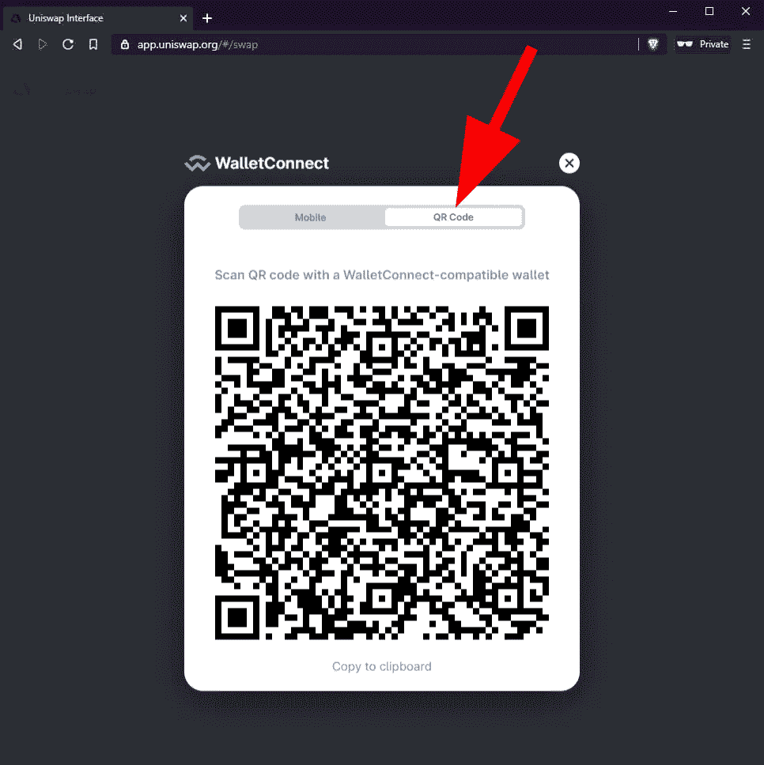

# 如何使用 WalletConnect

> 原文：<https://medium.com/coinmonks/how-to-use-walletconnect-a094671fffde?source=collection_archive---------48----------------------->

WalletConnect 是一个方便的开源工具，使移动钱包能够轻松连接到分散的 web 应用程序，并从您的手机与它们进行交互。

在建立钱包连接的过程中，步骤是:

# 1:下载 Bridge Wallet

下载 Bridge Wallet，安装在手机上，然后启动它。

# 2:打开 web Dapp

打开浏览器，转到您想要使用的应用程序的网站。

在这个例子中，我们去了 app.uniswap.org，但还有许多其他应用程序可以使用，请访问 WalletConnect 的网站，查看支持的应用程序列表。

> 交易新手？试试[密码交易机器人](/coinmonks/crypto-trading-bot-c2ffce8acb2a)或者[复制交易](/coinmonks/top-10-crypto-copy-trading-platforms-for-beginners-d0c37c7d698c)

# 3:与 WalletConnect 连接

在大多数网络 Dapps 上，你会发现一个“连接到钱包”按钮，还有一个“WalletConnect”选项。选择它。

# 4:获取二维码扫描

该网站将显示一个二维码，您必须使用 Bridge Wallet 扫描该二维码。

# 5:在 Bridge 钱包中打开 WalletConnect

打开 Bridge Wallet，然后前往设置> WalletConnect >扫描。

扫描二维码。

# 6:你连上了！

您现在可以使用 web Dapp 进行交易。有些 Dapps 会要求您确认钱包中的交易，在这种情况下，带有交易详细信息的请求将出现在此处显示的屏幕上，您可以批准或拒绝它。

点击关注我们的更多故事[。](http://t.me/etellworld)