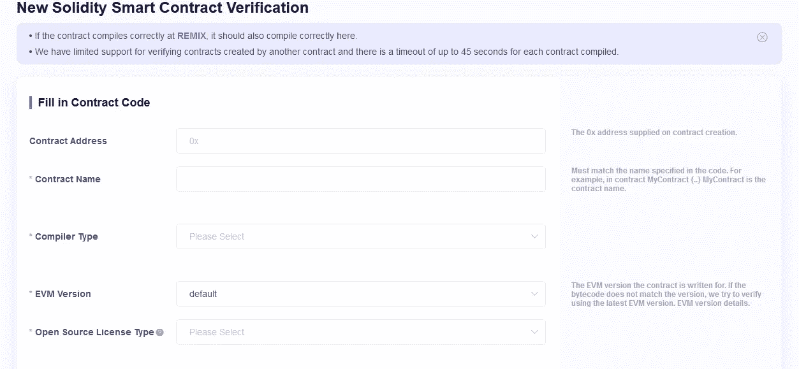
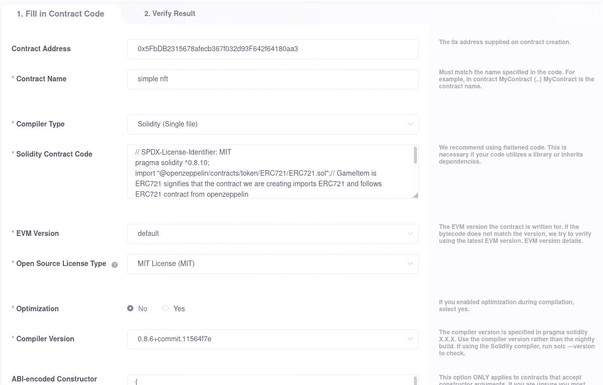

# 如何在 Coinex.net 上验证合同

> 原文：<https://medium.com/coinmonks/how-to-verify-contract-on-coinex-net-8170dc23c7cd?source=collection_archive---------33----------------------->

嘿嘿嘿！

0Xlive 在这里😃

你试过在 coinex.net 验证你的合同吗？在本教程中，我们将在 csc testnet 上部署一个 nft 契约，并在 coinex.net 上验证它



[https://www.coinex.net/verifyContract](https://www.coinex.net/verifyContract)

首先，我们要编码我们的 nft。至初始项目，在终端类型中:

```
mkdir nft
```

然后将目录更改为 nft，并用 npm 初始化一个项目:

```
cd nft
npm init --yes
```

然后我们去安装安全帽:

```
npm install --save-dev hardhat
```

安装完成后，使用 npx 运行 hardhat

```
npx hardhat
```

选择`"Create a basic sample project”` 并输入“是”😃

注意:它会询问您关于`hardhat-waffle , ethereum-waffle and hardhat-ethers`的信息，顺便说一下，您可以使用以下说明手动安装它们:

```
npm install --save-dev @nomiclabs/hardhat-waffle ethereum-waffle chai @nomiclabs/hardhat-ethers ethers
```

并按下回车键

我们将使用 openzeppelin 库来简化它

```
npm install @openzeppelin/contracts
```

我们会在 NFT.sol 中编写一些代码

```
// SPDX-License-Identifier: MIT
pragma solidity ^0.8.10;// Import the openzepplin contracts
import "@openzeppelin/contracts/token/ERC721/ERC721.sol";// GameItem is  ERC721 signifies that the contract we are creating imports ERC721 and follows ERC721 contract from openzeppelin
contract nft is ERC721 {    constructor() ERC721("simple nft", "NFT") {
        // mint an NFT to yourself
        _mint(msg.sender, 1);
    }
}
```

该编译了！

```
npx hardhat compile
```

如果没有错误，我们将开始部署:)

> 交易新手？试试[密码交易机器人](/coinmonks/crypto-trading-bot-c2ffce8acb2a)或[复制交易](/coinmonks/top-10-crypto-copy-trading-platforms-for-beginners-d0c37c7d698c)

# 安全帽配置

首先，在`scripts`文件夹下创建一个名为`run.js`的新文件

将这段代码放在 run.js 中:

```
const { ethers } = require("hardhat");async function main() {
  /*
A ContractFactory in ethers.js is an abstraction used to deploy new smart contracts,
so nftContract here is a factory for instances of our GameItem contract.
*/
  const nftContract = await ethers.getContractFactory("NFT");  // here we deploy the contract
  const deployedNFTContract = await nftContract.deploy();  // print the address of the deployed contract
  console.log("NFT Contract Address:", deployedNFTContract.address);
}// Call the main function and catch if there is any error
main()
  .then(() => process.exit(0))
  .catch((error) => {
    console.error(error);
    process.exit(1);
  });
```

现在，hardhat.config.json 应该是这样的:

```
require("[@nomiclabs/hardhat-waffle](http://twitter.com/nomiclabs/hardhat-waffle)");// This is a sample Hardhat task. To learn how to create your own go to
// [https://hardhat.org/guides/create-task.html](https://hardhat.org/guides/create-task.html)
task("accounts", "Prints the list of accounts", async (taskArgs, hre) => {
  const accounts = await hre.ethers.getSigners();for (const account of accounts) {
    console.log(account.address);
  }
});module.exports = {
  solidity: "0.8.10",
  networks: {
    csc: {
      url: "[https://testnet-rpc.coinex.net](https://testnet-rpc.coinex.net)",
      accounts: ["YOUR-PRIVATE_KEY"],
    }
  }
};
```

要部署合同，请在您的终端中键入:

```
npx hardhat run scripts/run.js --network csc
```

是时候验证合同了。要验证合同，请点击[此处](https://testnet.coinex.net/verifyContract)



合同地址:在此粘贴您的合同地址

合同名称:在此输入您的合同名称。在本例中，我们的合同名称是 simple nft。

编译器类型:在这里选择你的编译器类型。在这个例子中，我们的合同是单列的。

可靠性合同代码:将您的合同代码粘贴到此处以验证合同。这是必需的，因为用户必须确信部署的合同是原始合同。

EVM 版:EVM 是以太坊虚拟机的缩写。合同在 EVM 执行。

开源许可类型:你可以为你的代码选择许可。

优化:如果您启用了优化，请选择是。

编译器版本:选择 solidity 编译器版本来编译您的合同。

ABI 编码的构造函数:我们已经讨论过 ABI.go to Artifacts 目录，将 nft.json 的内容复制到 ABI 编码的构造函数中。

合同库:输入您使用的库名和地址。在本例中，我们使用了 openzeppelin erc721。

如果提交的表格没有问题，合同将得到验证。

祝贺🥳

我们已经在 coinex.net 资源管理器上验证了我们的合同，这有助于用户对我们的合同充满信心和信任。