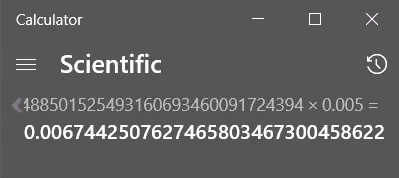

# 如何在 Solidity 中使用浮点？||如何计算 Solidity 中的摊销贷款？

> 原文：<https://medium.com/coinmonks/how-to-work-with-floating-points-in-solidity-how-to-calculate-amortizing-loans-in-solidity-cacfeaaa2b49?source=collection_archive---------16----------------------->

**Solidity** 是一种**面向对象编程语言**，用于在各种区块链平台上实现**智能合约**，最著名的是以太坊。


然而，Solidity 不支持浮点真的很痛苦，对吗？


这就是为什么我， **Wahaj** 在这里提出了一个解决方法，使用**精度**通过将每个值调整到某个幂，这真的很简单，现在有一件事你应该事先知道，它的坚固性不能处理非常大的数字，例如 50 ⁶⁰等，所以我们也将从前端获得帮助，因为智能合约在没有它最好的朋友的帮助下不能做任何事情。

我将通过计算**分期偿还贷款**以及每月应支付多少金额和利息的例子来教授这一点。这将是非常昂贵的，因为循环通常有很多迭代，但主要的一点是要使用浮点。

让我们谈谈如何计算分期偿还贷款:

这里每月还款额=本金金额+利息金额

我们需要的变量是**所需贷款(a)** 、**利率**和**期限(n)** 月份。

现在，

**周期利率(r) =利息/ 12(一年中的月数)**

和

**贷款金额(月还款额)=[a * {r(1+r)^n}]/[{(1+r)^n}-1]**

所以，打开混音，系好安全带，开始吧:

**第一步:安全第一**

您需要做的第一件事是导入 SafeMath 并将其用于 uint256，这样我们就不会最终对编译器做一些真正可怕的事情。

```
**import "@openzeppelin/contracts/utils/math/SafeMath.sol";
contract Loan {****using SafeMath for uint256;****}**
```

**第二步:准确地说是时间**

现在，你必须决定你希望你的精度保持多少位小数。我使用 8 作为精度值。

```
import "@openzeppelin/contracts/utils/math/SafeMath.sol";
contract Loan{using SafeMath for uint256;**uint256 private constant PRECISION = 8;**}
```

**第三步:根据需求创建功能**

在此之前，假设

b = [{(1+r)^n}-1]和 c = [{r(1+r)^n}]

所以公式可能变成:

**付款= (a * c) / b**

我接收这些值作为函数参数的原因是，正如我上面提到的，实性不能理解数字的如此高的幂，因为我们要使用精度，这些值以后会变得非常高。但那是以后的事，这是函数结构。返回的值很简单，我们稍后也会用到它们。

```
import "@openzeppelin/contracts/utils/math/SafeMath.sol";
contract Loan{using SafeMath for uint256;uint256 private constant PRECISION = 8;**function calculate(uint256 b,uint256 c)public pure returns(uint256,uint256[] memory,uint256[] memory){****}**
}
```

**第四步:计算定期利率(r)**

你一定已经预见到了，我们终于开始使用精度了。因此，考虑到利率为 6%,我们可以将该值计算为:

```
import "@openzeppelin/contracts/utils/math/SafeMath.sol";
contract Loan{using SafeMath for uint256;uint256 private constant PRECISION = 8;function calculate(uint256 b,uint256 c)public pure returns(uint256,uint256[] memory,uint256[] memory){**uint256 interest = 6;****uint256 r = (interest* 10**PRECISION) / 1200;**}
}
```

如果你现在打印汇率，你只需回到小数点后 8 位就可以看到实际结果。


将小数取后 8 位，就变成了 0.005，实际上是正确的。

**第五步:添加所需变量**

现在，是时候添加我们将需要的变量了，无论是来自我们的合同还是来自合同之外。你当然可以把它们作为参数，但是现在我只得到 b 和 c。

```
import "@openzeppelin/contracts/utils/math/SafeMath.sol";
contract Loan{using SafeMath for uint256;uint256 private constant PRECISION = 8;function calculate(uint256 b,uint256 c)public pure returns(uint256,uint256[] memory,uint256[] memory){
**uint256 loanRequired = 40000;
uint256 a = loanRequired * 10**PRECISION;
uint256 n = 60;****uint256[] memory interestAmount = new uint256[](10);****uint256[] memory principal =  new uint256[](10);**uint256 interest = 6;uint256 r = (interest* 10**PRECISION) / 1200;
}}
```

让我们来谈谈我刚刚创建的数组。我给他们 10 码而不是 T2 3 码，因为混音的内存有限。这些数组将用于存储我们的答案。

**第六步:每月付款时间**

还记得 b 和 c 的公式吗？

是我们使用它们的时候了…

**b =【{(1+r)^n}-1】**

使用计算器或(前端)我们可以得到 b，即:


而**c =【{r(1+r)^n}】**也就是:



选择数值，直到前 8 位小数。

我们得到 **b = 34885015，c = 674425。**

现在，一切都完好无损，所以是时候我们计算每月付款了。

```
import "@openzeppelin/contracts/utils/math/SafeMath.sol";
contract Loan{using SafeMath for uint256;uint256 private constant PRECISION = 8;function calculate(uint256 b,uint256 c)public pure returns(uint256,uint256[] memory,uint256[] memory){
uint256 loanRequired = 40000;
uint256 a = loanRequired * 10**PRECISION;
uint256 n = 60;uint256[] memory interestAmount = new uint256[](10);uint256[] memory principal =  new uint256[](10);uint256 interest = 6;uint256 r = (interest* 10**PRECISION) / 1200;**uint256 monthly = SafeMath.div(a.mul(c),b);**}}
```

**步骤 7:创建循环并获取前 10 个月的值。**

```
import "@openzeppelin/contracts/utils/math/SafeMath.sol";
contract Loan{using SafeMath for uint256;uint256 private constant PRECISION = 8;function calculate(uint256 b,uint256 c)public pure returns(uint256,uint256[] memory,uint256[] memory){
uint256 loanRequired = 40000;
uint256 a = loanRequired * 10**PRECISION;
uint256 n = 60;uint256[] memory interestAmount = new uint256[](10);uint256[] memory principal =  new uint256[](10);uint256 interest = 6;uint256 r = (interest* 10**PRECISION) / 1200;uint256 monthly = SafeMath.div(a.mul(c),b);**for(uint256 i=0;i<10;i++){****interestAmount[i] = (r.mul(a));****principal[i] = monthly - interestAmount[i]/ 10**PRECISION;****a -= principal[i];****}
return (monthly,interestAmount,principal);**}}
```

这是智能合约的最终状态，我们将返回每月要支付的金额、利息金额和每月的本金金额。

**第八步:测试时间**

以下是来自[余额贷款计算器](https://www.thebalance.com/amortization-calculator-5115846)的实际计算结果。


以下是我们的答案:

**月付款**是:


向后取 8 位小数，我们得到 773.31197936 美元，这正是我们需要的。还有更多的，只是等待

接下来，我们每月支付**利息**:


由于利息支付是用两位 8 进制精度的数字计算的，我们将取 16 位，因此值为 200 美元、197.13344 美元、194.252547 美元和 191.357 美元，这是准确的。你总是可以四舍五入到你想要的小数位数。

最后我们有**本金支付**:


再一次，取 8 个小数位，我们得到 573.311979 美元、576.178539 美元、579.059 美元和 581.9547 美元。

现在我们有了。谢谢你阅读这篇文章，我希望你在此之后能更好地使用浮点运算。如果你喜欢这个，最后在 Linkedin 上关注我，快乐编码！


> 交易新手？尝试[加密交易机器人](/coinmonks/crypto-trading-bot-c2ffce8acb2a)或[复制交易](/coinmonks/top-10-crypto-copy-trading-platforms-for-beginners-d0c37c7d698c)