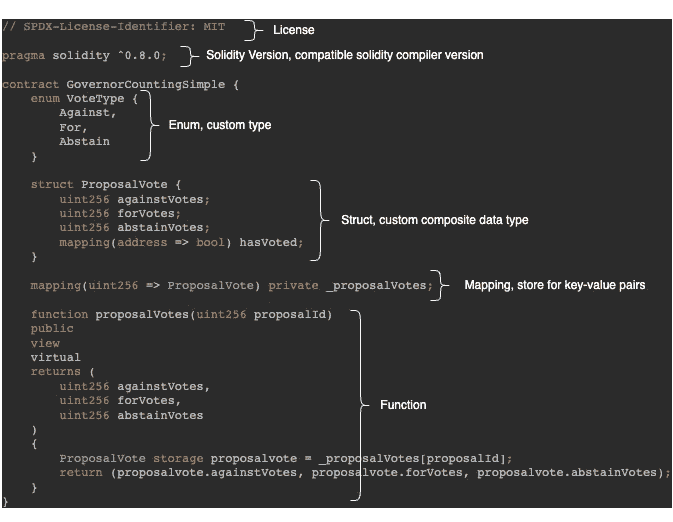

# 如何在 Solidity 中写一份聪明的合同

> 原文：<https://medium.com/coinmonks/how-to-write-a-smart-contract-in-solidity-c560ee34af7?source=collection_archive---------11----------------------->

## 用 Solidity 编写智能合同的初学者指南


## 什么是智能合同？

智能协定包含业务逻辑和状态。它是用 Solidity 这样的高级语言编写的，被编译成以太坊虚拟机(EVM)字节码，并部署到以太坊、Polygon、币安智能链、Cardano、Tron 等 EVM 兼容的区块链上。

> 可靠意义上的契约是代码(其*函数*)和数据(其*状态*)的集合，它们驻留在与 EVM 兼容的区块链上的特定地址。

通过调用修改状态的智能合约函数，生成事务，并且事务是可跟踪的、透明的和不可逆的。

> 智能合同是执行合同条款的计算机化交易协议。
> 
> 智能合同设计的一般目标是满足常见的合同条件(如支付条款、留置权、保密性，甚至强制执行)，最大限度地减少恶意和意外的例外，并最大限度地减少对可信中介的需求。
> 
> 相关的经济目标包括降低欺诈损失、仲裁和执行成本以及其他交易成本— [尼克·萨伯](https://www.fon.hum.uva.nl/rob/Courses/InformationInSpeech/CDROM/Literature/LOTwinterschool2006/szabo.best.vwh.net/smart.contracts.html)

## 智能合约(Solidity)是什么样子的？



High-level contract structure

第一行告诉你合同是根据哪一个**许可**发布的，因此在什么条件下你可以使用代码。你可以在这里找到一个许可证列表[。](https://freedomdefined.org/Licenses#List_of_licenses)

在第二行中，您可以找到受支持的编译器**版本**。

**状态变量**，所有在函数之外定义的变量都是状态变量。在上面的契约中，只有 *_proposalVotes* 是状态变量。

之后，声明一个**枚举**，它包含一个命名常量列表，每个常量都有一个从 0 开始的整数值。比如反对= 0，赞成= 1，弃权= 2。

**Struct** 是由多个变量组成的复合数据类型，相关变量可以像用户或投票一样分组在一起。

映射是一个键值存储，为不存在的条目返回默认值。一个更简单的映射:

```
mapping(address => uint256) public userBalances;
```

如果您尝试输入一个尚未添加的地址，您将收到 0，这是 uint 的默认初始化。

**函数**封装了契约的逻辑。他们可以访问状态和内联定义的内存变量。可以被修饰词改变。具有可见性，并且可以定义访问级别。可以引发事件，也可以保存控制语句。并且它们可以向调用者返回值。

示例 *proposalVotes* 中的函数具有访问级别视图，这意味着它不会改变状态，因此不会生成记录在区块链上的事务。

如果一个功能具有访问级别**视图**，它不能执行以下操作:

*   写入状态变量
*   收到付款
*   上升事件
*   创建新合同
*   调用另一个没有用访问级别视图或 pure 标记的函数

## 什么是气体？

每当在区块链上部署合同或记录交易时，费用都以天然气的形式收取。

Gas 的数量取决于 EVM 在执行事务或部署契约时花费的计算资源。

目前以太坊的煤气费相当高，而其他区块链像多边形和币安智能链有低得多的煤气费。

您可以在下面的列表中查看实际的燃气费，我在撰写本文时添加了正常的燃气费以获得快速印象，这些费用和执行时间是平均的:

*   [以太坊](https://cointool.app/gasPrice/eth)(正常 0.50 美元，执行时间 1 分钟)
*   [多边形](https://cointool.app/gasPrice/matic)(普通$0.0006948991，执行时间 5 秒)
*   [币安智能链](https://cointool.app/gasPrice/bsc)(正常 0.0323 美元，执行时间 5 秒)

以太坊目前比其他区块链更贵、更慢，但相比之下也是最安全的网络。

您可以在这里更深入地了解智能合约的基础知识[。](https://docs.soliditylang.org/en/v0.8.15/introduction-to-smart-contracts.html)

> *加入 Coinmonks* [*电报频道*](https://t.me/coincodecap) *和* [*Youtube 频道*](https://www.youtube.com/c/coinmonks/videos) *了解加密交易和投资*

# 另外，阅读

*   [3 商业评论](/coinmonks/3commas-review-an-excellent-crypto-trading-bot-2020-1313a58bec92) | [Pionex 评论](https://coincodecap.com/pionex-review-exchange-with-crypto-trading-bot) | [Coinrule 评论](/coinmonks/coinrule-review-2021-a-beginner-friendly-crypto-trading-bot-daf0504848ba)
*   [莱杰 vs n rave](/coinmonks/ledger-vs-ngrave-zero-7e40f0c1d694)|[莱杰 nano s vs x](/coinmonks/ledger-nano-s-vs-x-battery-hardware-price-storage-59a6663fe3b0) | [币安评论](/coinmonks/binance-review-ee10d3bf3b6e)
*   [加密交易机器人](/coinmonks/crypto-trading-bot-c2ffce8acb2a) | [Bingbon 评论](https://coincodecap.com/bingbon-review)
*   [Bybit Exchange 审查](/coinmonks/bybit-exchange-review-dbd570019b71) | [Bityard 审查](https://coincodecap.com/bityard-reivew) | [Jet-Bot 审查](https://coincodecap.com/jet-bot-review)