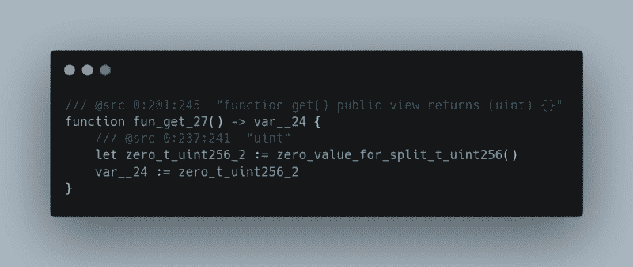
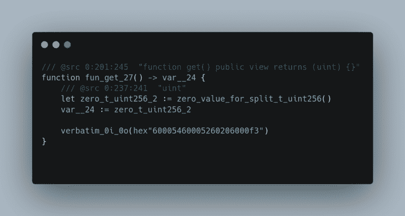

# 如何一字不差地使用 Yul 和 Solidity

> 原文：<https://medium.com/coinmonks/how-to-write-any-function-in-pure-opcodes-and-add-it-to-your-solidity-function-yul-verbatim-c1ce2760f7a5?source=collection_archive---------8----------------------->

solidity 编译器不是很有效。通常对于基本运算，Solidity 编译器会添加大量不必要的操作码。编译器这样做是因为如果开发人员没有搞砸，它会增加许多检查，如果他们搞砸了，编译器会在造成任何损害之前恢复。

当你从扎实开始，只想写点有用的东西时，这是很棒的。**但是由于以太坊上的天然气会变得非常昂贵**，有时我们需要尽可能地优化合同。

**你可以使用内嵌汇编**，但是 solidity 编译器仍然增加了许多检查和不必要的操作码，这只会耗费更多的时间。

还可以使用类似 [**哈夫**](https://huff.sh/) 这样的语言，非常优秀。它允许您访问堆栈，您可以进行任何想要的优化。但是在 Huff 中编写一个复杂的契约是一种折磨，因为你必须一个操作码接一个操作码。

**最好的选择，在我看来，也是本文的主题，**是用 solidity 编写契约，省去需要更多优化的函数，稍后只需用[逐字添加字节码](https://docs.soliditylang.org/en/v0.8.17/yul.html#verbatim)。

## 什么是一字不差？

根据坚固性文件:

> 一组逐字的…内置函数允许您为 Yul 编译器不知道的操作码创建字节码。它还允许您创建不会被优化器修改的字节码序列。

简而言之，它允许我们将自己的字节码添加到已经编译好的契约中。但是有一个小问题。**逐字在 solidity** 中不起作用，所以我们必须首先**将我们的合同向下编译到 YUL** ，然后用逐字添加字节码。

## 如何生成优化后的字节码？

一些工具可以让你做到这一点，但是它们相当复杂，所以我写了一个简单的编译器来为你生成字节码。

1.  **转到这个** [**回购**](https://github.com/Kuly14/mnemonic) **克隆到你的机器上**

```
git clone [https://github.com/Kuly14/mnemonic.git](https://github.com/Kuly14/mnemonic.git)
```

**2。光盘放入文件夹**

```
cd mnemonic
```

**3。创建您的。像这样的 mn 文件**

```
touch yourName.mn
```

**4。用纯操作码编写函数**

通常，如果你用纯操作码来写，它应该是这样的:

```
push1 0x04 calldataload
push1 0x00 mstore
push1 0x20
push1 0x00
return
```

这既烦人又费时。所以我把它添加到编译器中，当你使用 0x:

```
0x04 calldataload
0x00 mstore
0x20 0x00
return
```

所以如果你尝试使用 push 操作码，它不会编译。只需用 0x 写你想压入栈的字节。

**5。编译。用编译器编译 mn 文件**

```
cargo run -- /path/to/your/file/nameOfYourFile.mn
```

这将编译契约并将字节码保存到 bytecode.txt

如果您希望编译器将字节码打印到终端，请使用如下的`-p`标志:

```
cargo run -- /path/to/your/file/nameOfYourFile.mn -p
```

**6。创建你的实体契约，把你想写的函数的操作码留空**

```
function show() public view returns(uint) {}
```

**7。用 solc** 将你的 solidity 文件编译到 YUL

```
solc nameOfYourContract.sol --ir > nameOfYourNewYulFile.yul
```

这将把合同编译到 YUL，并以 nameOfYourNewYulFile.yul 的名称保存

**8。用你最喜欢的编辑器打开 YUL 文件，删除第一行**

第一次打开文件时，第一行应该是这样的

```
IR:
```

删除这一行。

**9。找到你留空的功能**

只需 ctrl+F，编写整个函数

```
ctrl F — function show() public view returns(uint)
```

你应该会看到这样的东西



**10。从 bytecode.txt 文件中复制字节码，并将其添加到 YUL 文件中，如下所示:**



如果你看逐字后面的逐字语句，**有 _0i_0o** 。这意味着我们将把堆栈的 0 个项目放入逐字记录中，并从逐字记录中返回 0 个项目到堆栈中。

如果你只需要优化一个函数的一部分，并且你想把项目从堆栈中取出来，这就很方便了。

但是那会很快变得非常复杂。你必须用调试器来运行这个函数，并找出在那个特定时刻堆栈里有什么。

如果你不知道如何使用 remix 调试器，我写了一篇文章，你可以在这里查阅:[https://medium . com/@ kulman . David/how-to-use-remix-debugger-to-learn-solidity-assembly-5a 745 a 22 bb 07](/@kulman.david/how-to-use-remix-debugger-to-learn-solidity-assembly-5a745a22bb07)

11。将 YUL 合同编译成字节码

```
solc --strict-assembly nameOfYourYulFile.yul --bin
```

这将输出整个契约的字节码。抄下来，继续下一步。

12。部署字节码

现在我们已经有了字节码，我们可以部署契约了。

最好的方法是用安全帽。转到这个回购:[https://github.com/Kuly14/deploy-bytecode](https://github.com/Kuly14/deploy-bytecode)并克隆到你的机器上:

```
git clone [https://github.com/Kuly14/deploy-bytecode.git](https://github.com/Kuly14/deploy-bytecode.git)
```

**12.1 安装依赖项:**

安装部署合同所需的所有必要依赖项:

```
yarn
```

将你的合同添加到 src 文件夹，这很重要，这样 hardhat 就可以生成 ABI。

**12.2 编制合同:**

```
yarn hardhat compile
```

该命令将在工件文件夹中生成 ABI。

现在转到“测试/单元/部署 2.test.ts”

**12.3 导入 ABI**

```
import * as abi from ../../artifacts/path/to/your/abi.json
```

另外，将 **`const 字节码= " 0x 6000……``**更改为您的字节码。

不要忘记在字节码的开头加上“0x ”,否则它将不起作用。

现在在“it”块中，编写你自己的测试，正如你在这里看到的:[https://github . com/kuly 14/deploy-bytecode/blob/main/test/unit/deploy 2 . test . ts](https://github.com/Kuly14/deploy-bytecode/blob/main/test/unit/Deploy2.test.ts)

**12.4 运行您的测试:**

```
yarn hardhat test test/unit/Deploy2.test.ts
```

**恭喜恭喜！！！**

以下是我们在本文中使用的两个回购的链接:

[](https://github.com/Kuly14/mnemonic) [## GitHub-kuly 14/助记符:EVM 操作码的编译器

### 可靠性编译器不是很有效。通常对于基本运算，Solidity 编译器会增加大量的…

github.com](https://github.com/Kuly14/mnemonic) [](https://github.com/Kuly14/deploy-bytecode) [## GitHub - Kuly14/deploy-bytecode:用 hardhat 部署纯字节码。

### 此时您不能执行该操作。您已使用另一个标签页或窗口登录。您已在另一个选项卡中注销，或者…

github.com](https://github.com/Kuly14/deploy-bytecode) 

如果你迷路了，不要犹豫提出问题，或者在这篇文章里留下评论。**感谢阅读！**

## 警告

做这件事风险很大。我们正在手动处理堆栈，这会创建许多攻击媒介，并使合同**易受攻击**。这只是为了好玩。除非绝对必要，否则我绝不会在实际的 main-net 代码中使用它。