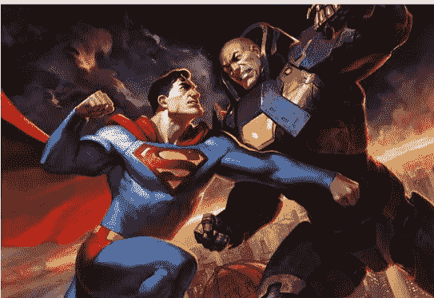
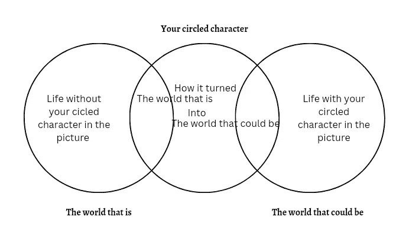

# 如何撰写销售网络 3 项目的市场活动故事

> 原文：<https://medium.com/coinmonks/how-to-write-campaign-stories-that-sell-out-web3-projects-eed697ea0967?source=collection_archive---------15----------------------->

凭借着讲述一个伟大故事的力量，伯瑞达佩 YC 在不到一年的时间里就蹿升到了 40 亿美元的市场。想知道具体怎么做吗？

太棒了。我已经帮助了 6 个以上的网络 3 项目写他们的故事，我会与你分享我如何精心制作引人注目的故事，这样你就可以开始在你的所有活动中摇摆它的细分。

我记得在看《我仍然相信》(I 仍然相信)的时候，我总是紧紧地盯着屏幕，一刻也不能错过，有时我会倒带，只为重温某些瞬间。

我感觉到了杰瑞米·坎普的痛苦，对癌症(它的对手)也有一些怨恨。

即使看了电影，我也无法停止思考。

你对电影有过这种感觉吗？

这就是讲故事的力量。

讲述一个伟大的故事可以让你的观众与你的愿景联系起来，让他们对你的愿景充满感情。

每个故事的核心都有三个要点。人物
2。
欲望 3。冲突

一个好故事的框架是这样的

> 有吸引力的人物会开始一段旅程来获得他/她的欲望(朝着快乐或远离痛苦)，但会遇到一个他/她在获得这个欲望之前需要克服的障碍(冲突)。

简单权利

有了这个框架，你可以用任何方式来构建你的故事。

例如:

> 超人(有吸引力的人物)想保持世界安全(愿望)，但莱克斯路德(对手)肆虐(冲突)

你可以阅读关于讲故事为 web3 项目所做的 5 件事的全部内容。

现在你已经知道了一个故事的基本原理，让我们来复习一下如何写一个故事。

# 如何为 Web3 品牌撰写引人注目的故事(NFTs、DeFi…)

1.列出你的品牌特征(你的价值观/效用)
2。采用两个世界结构
3。使用情绪触发因素

准备好崩溃了吗？然后保持手指滚动。

## 1.列出你的品牌特征

你的品牌特征就是你的效用、价值、利益……你的品牌提供的任何东西，无论是具体的还是可感知的。

我们从在一张纸上写下你的品牌名称和大约 6 个特征开始。

然后，略读这些特征，圈出任何呼唤你的人。

它可以是你的核心价值之一，也可以是你的产品的主要好处，只要是与你的品牌紧密相关的有趣的东西

有吗？

好吧，让我们继续前进

## 2.采用两个世界的结构

在客户心目中
有两个世界
这个世界可能是

“真实世界”就是他们当下的现实，在那里，痛苦、挫折、不适和问题仍然让他们非常苦恼。

把它看作是一个缺少某些东西的世界。

“可以成为的世界”是他们梦想的地方，挫败感消失，问题得到解决，缺失的那块拼图得到修复。

你的工作就是帮助他们把你看作一个可以带他们去“那个可能的世界”的人。

要做到这一点，你需要两个世界结构的帮助。

两个世界的结构是一个带领你的观众从一个世界到另一个世界的心路历程，这个世界可以用你的品牌作为桥梁。

现在让我们回到你的纸上

**1。画两个中等大小的圆，彼此靠近，一个在中心，重叠两个圆。**

**2。将左边标记为“现在的世界”，将右边标记为“可能的世界”**

**3。从标有“真实世界”的圆圈开始**

*   看圈出的人物，用一句话写出没有图中人物的生活是什么样的。

**4。翻到标有“可能的世界”的圆圈**

*   用一句话写出当那个角色在的时候生活是什么样的。

嘿，不要害怕在这里采取任何方法，到目前为止，你有效地描绘了那个世界的画面。

**5。用你的角色**标记中间的圆圈

*   用一句话来写，这个角色是如何把现在的世界变成可能的世界的

瞧啊。你已经有了一个优秀的框架，你可以修改成一个副本，品牌故事，内容…任何营销目的。

## 3.使用情感触发器

现在，你已经有了一个框架，可以有效地传达你的品牌希望如何将它们传递到可能的世界

但这不足以让他们产生共鸣，并与你的品牌产生联系，还缺少一些东西。

你需要激发他们的情绪

情绪导致人们行动，购买或采取你渴望的行动，但你如何才能唤起那种情绪？

首先，你需要明白有 6 种核心情绪，而这些核心情绪会产生 24 种次要情绪

6 种核心情绪是爱、喜悦、惊讶、愤怒、悲伤和恐惧。

爱产生三种次要的情感，即喜爱、欲望和渴望。

快乐产生 7 种次级情绪，分别是愉快、热情、满足、自豪、乐观、着迷和放松。

惊奇产生一种形式的惊奇

愤怒产生 6 种次级情绪，分别是嫉妒、愤怒、厌恶、恼怒、恼怒和折磨。

悲伤产生 5 种次级情绪，分别是失望、羞愧、痛苦、同情和忽视

恐惧用恐惧和紧张这两种次要情绪来包裹它

为什么我要带你穿过这条历史/事实的小路？

嗯，是因为你要写好故事，你得明白，这些不是你能让人感受到的情绪。

很多人犯了一个错误，试图让别人通过他们的故事感受情感

不，不，这是错误的方法。

你看，所有这些情绪都是人们已经感受到的情绪

你的故事只是唤醒了他们。

现在我们知道了这些情绪，我们通过塑造一个买家的角色来触发它们。

KYC(了解你的客户)在故事构建中非常重要，因为没有适合所有人的故事，所以你的故事必须与你的客户对话

营销人员使用人口统计数据，如
【年龄】

【性别】
【国籍】
【关系】
【地理位置】
以及其他类似的指标。

虽然这是一个好的开始，但它们不足以构成一个令人信服的故事，因为它们缺乏动机指标。

他们帮助我们了解客户的想法，这很好，但我们不知道他们为什么这样做。

例如，为什么他们有某种兴趣或购买某些东西？

还记得我们说过一个故事的三个核心吗？
性格
欲望
冲突

这个角色可以是你，你的顾客或者某个第三方。

我们说欲望是朝向快乐或远离痛苦的。

欲望是情绪被触发的点，而冲突是情绪被放大的点

总之，我们并没有试图告诉他们如何去感受，这种方式看起来很虚伪，而且具有操纵性。相反，我们试图理解他们已经感受到的。

所以你可能想知道

我们如何获得这些动机指标？

嗯，没那么复杂。

你需要做的就是问他们

是的，就这么简单。

让我解释一下

他们有一种欲望，那就是(走向快乐或远离痛苦)

这两种欲望是基于爱和恐惧。

既然我们知道了导致这种欲望的主要情绪，下一步就是继续问为什么，直到我们得到一个基于爱/恐惧的答案。

你可以主持一个调查或研究的地方已经提供了答案的问题，如

他们为什么要逃避 X 痛？

为什么他们想达到 Y 的结果？

**让我们用一个为什么的问题来做一个面试练习**

"你为什么想铸造我们的 NFT？"

*   答:因为我相信你正在建设的东西

你为什么相信我们正在建设的东西

*   回答:因为你的白皮书显示了你希望如何实现它的清晰结构

你为什么想成为它的一部分

*   回答:因为我想参与塑造元宇宙的大创新

你为什么想参与重大创新

*   回答:因为我想让我的孩子有一天看到我帮助建造的大东西，并为我感到骄傲。

这个答案就是我们正在寻找的。

你注意到它处理的是感情，也就是爱吗？

*如果你足够了解你的顾客，你也可以自己回答这些问题*

重点是问为什么问题，因为为什么揭示了情绪。

你问的为什么越多，你就越能理解他们做某些事情的动机。

当你理解了这些动机，你就可以创造一个能与他们产生共鸣的角色，并创作一个符合你的价值观和愿景的故事

让我给你看一个好例子

这就是我所说的好故事，它验证了我们所说的 80%以上。

最好的部分是，这个故事可以进一步发展成一部漫画，深入探讨我们的角色的欲望和斗争。

# 关键要点

你准备好写一篇引人注目的故事了吗？
然后别忘了

1.研究了解你的客户
2。确定他们行动的动机&决策
3。圈出你的品牌消除他们恐惧或带给他们快乐的特征
4。有故事核心
5。创建你的两个世界结构
6。使用高质量的视觉效果
7。计划您的活动

你会同意我的观点，仅仅是故事不足以构建一个项目，对吗？

BoredApe 利用了大约 5 种策略

因此，如果你正在寻找更多的技巧，请看看这些 [3 的东西会比广告更好地发展你的网络 3 品牌](/coinmonks/3-strategies-that-will-grow-your-web3-brand-better-than-ads-81282dc4a23b)

> 如果您正在构建 web3，并希望扩大您的社区，创建活动，或更多地谈论讲故事，那么[让我们来谈谈。](http://www.semi-lore.carrd.co)

> 交易新手？尝试[加密交易机器人](/coinmonks/crypto-trading-bot-c2ffce8acb2a)或[复制交易](/coinmonks/top-10-crypto-copy-trading-platforms-for-beginners-d0c37c7d698c)