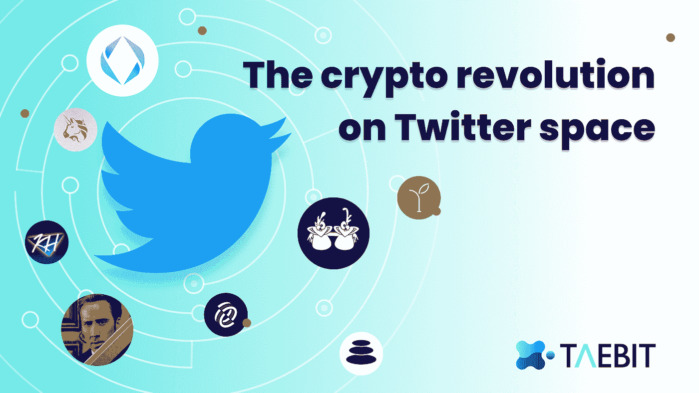
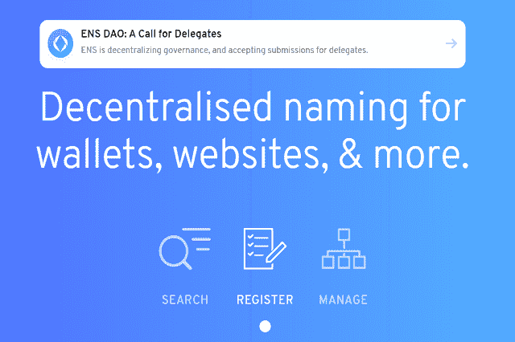

# DAOs 的最佳沟通工具

> 原文：<https://medium.com/coinmonks/how-twitter-spaces-become-the-best-communication-and-marketing-tools-for-daos-and-crypto-fd6bf9f7d73?source=collection_archive---------23----------------------->

加密货币和更广泛的区块链项目建立在平等主义原则的基础上，确保没有任何一个个人或公司可以完全控制。甚至“生态系统”这个词的词源——通常用来描述构成区块链项目的基础设施、产品、工人和支持者的网络——也与互联和共生的思想有关。与任何其他行业相比，区块链和加密货币社区为项目如何开发、交流和运营提供了独特的投入，通常会塑造它们背后支持的公司的技术。

> 当被问及为什么相信加密货币时，亿万富翁企业家杰克·多西表示，他认为这些项目背后的“网络和社区”是变革和美好的驱动力。

加密货币在平等性方面独树一帜，这种平等性的驱动因素来自社区。一个社区的力量不是基于它的规模，而是基于这个社区的和谐和互动程度。

# **繁荣社区的重要性**

在一个繁荣的生态系统中，社区成员在项目的开发中扮演着重要的角色——他们将审查产品，提供他们的见解，并强调市场趋势和需要改变的事情。在尊重社区的同时，区块链的项目正在突破传统领导方式的界限，创造一个扁平的结构和新的治理模式，这意味着发展直接受到市场需求的影响。项目经常要求他们的社区对决策进行投票，允许他们决定如何开发 on-chain，或者下一个合作伙伴或协作应该是什么。对于企业来说，这是向前迈出的一步。长期以来，企业一直将决策权交给西装革履的当局，依靠他们的直觉推动变革。

**积极参与的社区也是社交媒体等领域的最佳倡导者。特别是对于新区块链项目，这种有机的支持是不可或缺的。活跃的社区还通过在社交渠道上解释不同的产品和回答问题来推动新成员的参与。让消息灵通的成员领导社区参与有助于增进社区的理解和支持。**

区块链和秘密社区的美妙之处在于它们通常遍布世界各地，融合了许多不同的文化和国家。它以现代的方式将人们聚集在一起。公司应该通过认识到不同的参与平台与不同的社区成员更相关来庆祝随之而来的多样性。为了确保你最大限度地扩大影响，并确保每个人都感到被包含在内，你必须通过各种渠道传播你的信息。Twitter 是 crypto 中最有影响力的社区建设平台之一，具体来说就是 [Twitter Spaces](https://twitter.com/TwitterSpaces?ref_src=twsrc%5Egoogle%7Ctwcamp%5Eserp%7Ctwgr%5Eauthor) 。

# **作为社区建设工具的 Twitter 空间**

加密货币领域社区建设的一个最重要的方面是促进创始人和社区成员之间的公开对话。Twitter Spaces 是创建扁平结构的一个重要工具，在这个结构中，每个人都有机会发表自己的意见并实时接收反馈。Twitter Spaces 是 Twitter 应用程序上的一个功能，允许个人拥有一个“空间”,其他用户可以选择加入。

这些空间是多功能的——用户可以使用表情符号来传达情感，当他们想加入对话时，可以请求发言，如果他们认为这可以为他们的粉丝群增加价值，甚至可以重新发布空间。

最近，许多道和区块链的项目已经开始在 Twitter 空间上举办每周一次的市政厅会议，以便从他们的社区获得直接反馈。创始人通常通过讨论他们的进展、最近的成就和未来的计划来引导对话，而参与者通常在问答部分加入对话。这些合作对话的结果是在项目开发和社区发展方面取得了巨大的进步，同时也确保了创始人确切地了解他们的社区想要什么，以及他们想要如何实现他们的目标。

# **成功利用 Twitter 空间的道**

## 以太坊名称服务道

以太坊域名服务 DAO 或 [ENS DAO](https://medium.com/the-ethereum-name-service) 最初是通过空投的方式分发给所有注册 ENS 域名的持有者。由于 ENS 令牌价格的升值和 ENS 域名持有者的集中，此次空投获得了相当大的关注。

ENS DAO 使用三层方法来控制治理:

*   通过 Twitter 空间讨论提案
*   代表使用的离线投票
*   对区块链的投票

在构思阶段，大多数提案都是从 ENS 论坛或 discord 频道开始的，后来由 ENS discord 内部的代表进行了离线投票。现在，ENS DAO 使用 Twitter 空间频繁讨论新提案的优点和 DAO 的整体方向。ENS DAO 还能够邀请许多著名的加密货币研究人员和有影响力的人到他们的 [Twitter](https://twitter.com/ensdomains) 空间，以便直接与社区互动并讨论 ENS DAO 项目的技术方面。《道组织章程》是第一个付诸表决的提案，该章程用于控制建议的决定，并为所有未来提案提供参数。ENS DAO 最近在 Twitter Spaces 上讨论了扩展其章程的可能性，以包含有关社区要求的更具体的语言。

在此“一体行动”中可以启动三种类型的提案:

*   社会提案:不需要链上活动的修改
*   可执行提案:通过 DAO 的钱包执行智能合同
*   宪法修正案:对《道宪法》的拟议修改

每个提案都需要投票才能通过，并遵循上面显示的治理的三个步骤。ENS 治理流程复杂且相对缓慢。对于转移到链上投票的提案，只需要 1%的法定人数。这是一个低门槛，意味着只有少数代表能够真正推进提案。

## 朋友与利益道

利益之友道或由网络 3 先锋组成，包括艺术家、创新者、研究者和理论家。FWB 代币是通往 FWB 道的门户，将代币持有者与志同道合的个人联系起来，为共同的目标而努力。

“利益之友”DAO 方法已经从[简单的共识治理模式发展为基于多群体的模式](/friends-with-benefits/fwb-season-two-slow-new-friends-86222d680ca7)，使用 Discord 来交流提案、 [Twitter](https://twitter.com/fwbtweets) 空间来主持提案的正式对话、使提案正式化的文件以及对各种提案进行投票的快照。获得最多投票的建议将由指定的团队付诸实施。

FWB 已经建立了一个 upvot 模式，社区成员可以提出并投票支持他们感兴趣的提案。这一战略有助于在内容和及时性方面对此类提案进行监管。当提案获得大量赞成票时，它们将被推进到治理流程的讨论部分，在这里，创始人和社区成员决定是否应该批准提案。

## 宪法道

ConstitutionDAO 是一种个人可以集中资源使用比特币( [BTC](https://cointelegraph.com/bitcoin-price) )和以太坊( [ETH](https://cointelegraph.com/ethereum-price) )等加密货币进行购买并分享资产所有权的 DAO。

该项目由一个核心小组发起，他们注意到[美国宪法将被拍卖](/one-zero/constitutiondao-how-crypto-folks-plan-to-buy-the-us-constitution-1f4e060ec002)，并希望通过用 DAO 购买来证明所有权碎片化和区块链众筹的有效性。关于购买宪法所需的资金以及如何在投标过程中有效地分散资金进行了大量讨论，但没有进行任何投票。取而代之的是，一场讨论在 Twitter 空间展开，道的创造者和那些出资的人想出了最有效的策略来竞标宪法。

“道”非常接近实现它的目标。这件艺术品[以 4320 万美元](https://cointelegraph.com/news/constitutiondao-a-crypto-red-alert-and-other-cases-of-crypto-powered-social-action-in-2021)成交。虽然“道”能够以 4700 万美元的价格成交，但考虑到税收以及保护、保险和推动宪法的成本，苏富比最终将“道”的出价限制在 4300 万美元。拍卖结束后，刀全额退款给所有捐款人。那些拒绝退款的人保留了他们收到的人民治理令牌，以换取他们的捐赠。在 DAO 明显“失败”后，社区决定支持项目的创始人，并重申尽管投标没有成功，但它仍然代表了权力下放和区块链社区建设的力量。

# **Taebit 作为一个分散的社区**

正如本文第一部分所讨论的，分散社区的形成是基于所有个人在他们支持的项目中拥有平等的利益。Taebit 平台将会以同样的方式运行——社区优先。Taebit 平台是完全去中心化的，这意味着没有人为干预、第三方风险或必须遵守的不透明的规则和法规。相反，Taebit 平台是为热情的投资者和交易者打造的，无论他们是经验丰富的还是初学者，他们都关心参与一个开放而友好的社区，所有人都在为同一个目标而努力——[彻底改变区块链行业](/coinmonks/why-should-forex-traders-move-into-defi-a042ae053db8)。

## ***加入我们的社区频道☯️***

> *推特上的最新内容🐦:*[*https://twitter.com/TaebitDEX*](https://twitter.com/TaebitDEX)
> 
> *交易讨论不和谐👾:*[*https://discord.gg/gBjqjFXmn2*](https://discord.gg/gBjqjFXmn2)
> 
> *关于电报的最新公告*[*https://t.me/+4kkLYgMPtZw3NjJl*](https://t.me/+4kkLYgMPtZw3NjJl)
> 
> *Taebit 网站:*[*https://taebit.io/*](https://taebit.io/)

> 交易新手？尝试[加密交易机器人](/coinmonks/crypto-trading-bot-c2ffce8acb2a)或[复制交易](/coinmonks/top-10-crypto-copy-trading-platforms-for-beginners-d0c37c7d698c)