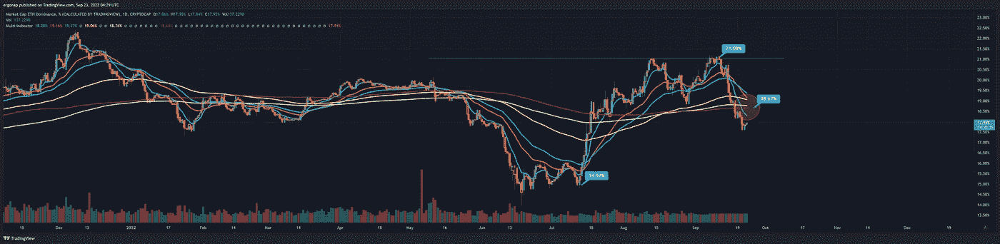

# Eth 有多丑？酒吧里的醉酒勾搭，丑陋。

> 原文：<https://medium.com/coinmonks/how-ugly-is-eth-drunken-hookup-at-a-bar-ugly-7d34dbf7958f?source=collection_archive---------18----------------------->

## 加密货币市场分析 9 月 22 日

我有点像是在度假，因为我的工作重心有所转移，所以我尽可能地写作。大新闻来了。

我在别的地方写了这篇文章，所以我将把它贴在这里来帮助一些人。总的来说:我们最大程度看跌，一切都没有改变。但是，让我们从一些图表开始。首先，这是 BTC 趋势。

[https://www.tradingview.com/x/mKVx0CKV/](https://www.tradingview.com/x/mKVx0CKV/)

猜猜发生了什么变化？没什么。即使突破也不会看涨，我也不认为它会很快出现。所以，数字下降了。这是 4h 的决定因素，没有变化。我们可以拉一个假的周末泵(只是为了打破趋势)，然后再次死亡。

no changes post FOMC. [https://www.tradingview.com/x/SYghiCWq/](https://www.tradingview.com/x/SYghiCWq/)

但是现在，让我们进入 ETH。首先是 ETH。D — Eth 优势。Eth 的主导地位实际上已经急剧下降，现在首先呈下降趋势——重大趋势突破。

[https://www.tradingview.com/x/EuDGIUbZ/](https://www.tradingview.com/x/EuDGIUbZ/)

然后，我们有一个优先 H&S，但等待！我还没说完，不是为了#看空的角度。

[https://www.tradingview.com/x/LA687ZpU/](https://www.tradingview.com/x/LA687ZpU/)

我们还有一个比成人电影女演员还大的双顶。没错。活泼，但是…连续两个熊市信号？但是 mah 合并叙事？

我没有警告人们亚瑟·海斯想要你在他想卖的时候买吗？我一直这么说。这些人不把你的利益放在心上。如果他们能说服另外 1000 人购买 1 eth，他们可能会轻松获得 10%的利润。

别忘了感谢他发布了 https://entrepreneurshandbook.co/eth-flexive-7e1921123f64——就在他离开后的第二天，对币安大加挞伐。我敢打赌，如果有人查找 cryptoquant，他们可以看到爆炸前几天的流入。他以什么结束他的演讲？买蘸酱。

[https://www.tradingview.com/x/Hj2jMfTp/](https://www.tradingview.com/x/Hj2jMfTp/)

不怎么样(合并叙述)。从更宏观的角度来看，这基本上是下跌的开始。这里要指出的是#体积。注意到缺少了吗？是啊。这个婴儿从 2021 年 4 月起就没有被定罪过。

[https://www.tradingview.com/x/NpQJ2ZNF/](https://www.tradingview.com/x/NpQJ2ZNF/)

也不是新的。你可以在这里看到一个漂亮的大 H&S，展示了第一个肩膀进入的那一刻，eth 持有者是如何完全离开的。其他人都被打上了傻瓜的烙印。

[https://www.tradingview.com/x/YHLUziWI/](https://www.tradingview.com/x/YHLUziWI/)

这将如何发展？让我给你看一个 CNYUSD 的例子。(人民币对美元，以美元标价)。很棒，不是吗？我的意思是，对外汇来说很好，但对遭遇严重衰退的中国来说就不那么好了。

[https://www.tradingview.com/x/4B6k9hQr/](https://www.tradingview.com/x/4B6k9hQr/)

那么，这对于 Eth 来说是什么样的呢？注意:这不是最大看跌，这是“回撤至技术底部”。

[https://www.tradingview.com/x/mtH0JSLh/](https://www.tradingview.com/x/mtH0JSLh/)

想知道为什么前几天维塔利克在抽水吗？因为他迫不及待地想在 80 美元时再次买入。与此同时，Eth 像中国一样在走下坡路，但他的社交生活已经够了。

参考:

> 交易新手？试试[加密交易机器人](/coinmonks/crypto-trading-bot-c2ffce8acb2a)或者[复制交易](/coinmonks/top-10-crypto-copy-trading-platforms-for-beginners-d0c37c7d698c)