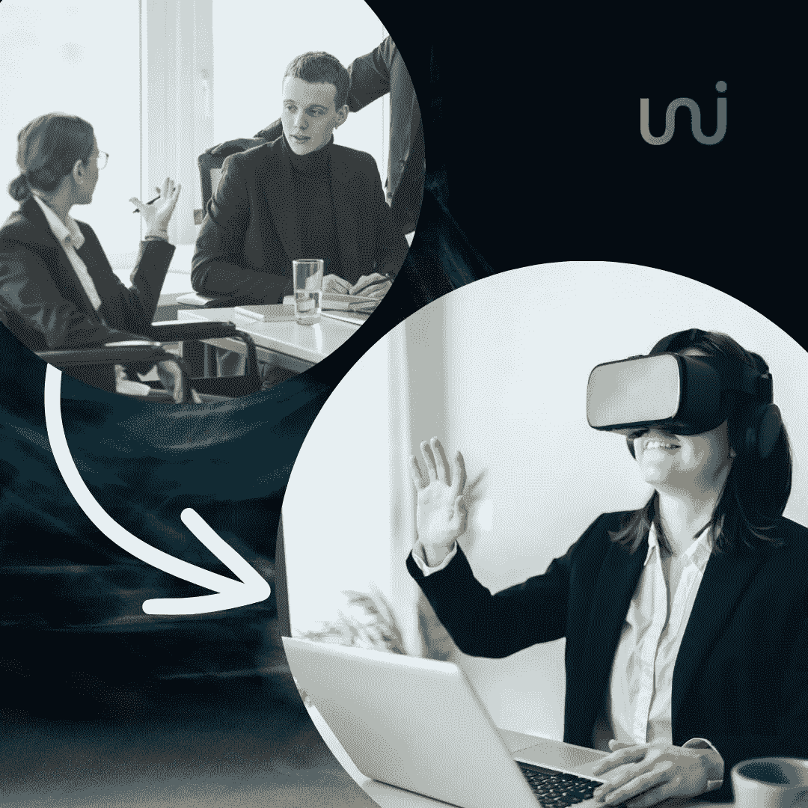

# Uniblok 的元宇宙将如何改变你的在线会议体验:解释

> 原文：<https://medium.com/coinmonks/how-unibloks-metaverse-will-change-your-online-meeting-experience-explained-afc8ebc64265?source=collection_archive---------43----------------------->

显然，元宇宙是互联网发展的下一步。如果你经常使用在线或互联网服务，你可能会对元宇宙这个词很熟悉。在这里，我们将向您解释元宇宙的含义，以及它将如何改变企业的在线会议体验。

# 元宇宙:这是什么

元宇宙是一个在线的，永久的，集成了许多虚拟世界的 3D 环境的想法。这可能被认为是互联网的下一次进化。用户将能够在这些 3D 空间中工作、互动、玩游戏和社交。用户将通过增强现实控制元宇宙中的化身或角色。

# 尤尼布洛克对元宇宙会议的构想

Uniblok 是一个分散的区块链市场，它为用户提供了一个举行商务会议的元宇宙。我们设想制作一个元宇宙，在那里用户可以在很远的地方方便地相互交流，就像他们在 3D 办公室里挨着彼此一样。。

# 遵循这些简单的步骤探索元宇宙的商业空间

*   第一步是与我们签约，选择最适合您需求的商业环境。
*   接下来，你需要选择你的头像，这样你就可以在 3D 环境中与他人互动。
*   您的会议现在准备开始，您将体验到元宇宙会议带来的动态体验。

# 最后的想法

元宇宙是一个新兴的概念，世界各地的许多大组织都在致力于使其更可行、更有价值和更易访问。我们 Uniblok 的目标也是在这个方向上为商业专业人士贡献我们的元宇宙理念。这个概念通过允许他们进行虚拟会议、降低旅行成本和减少对物理办公空间的需求，使工作更加方便。

# 在上查看 [Uniblok](https://uniblok.io/)

[Instagram](https://www.instagram.com/uniblok_techpvtltd/) | [脸书](https://www.facebook.com/Uniblok-Tech-Pvt-Ltd-115934447782742/)|[Linkedin](https://www.linkedin.com/company/uniblok-tech-pvt-ltd)|[Twitter](https://twitter.com/UniblokPVTLTD)|[Pinterest](https://in.pinterest.com/UniblokTechPvtLtd/)

> 交易新手？尝试[加密交易机器人](/coinmonks/crypto-trading-bot-c2ffce8acb2a)或[复制交易](/coinmonks/top-10-crypto-copy-trading-platforms-for-beginners-d0c37c7d698c)