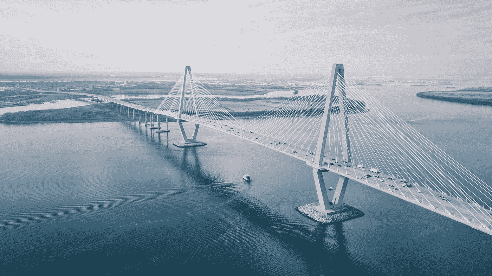
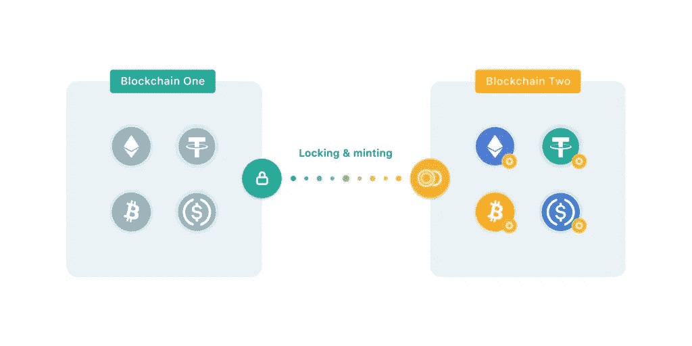

# 区块链大桥是多么不必要

> 原文：<https://medium.com/coinmonks/how-unnecessary-the-blockchain-bridge-is-630876abb761?source=collection_archive---------15----------------------->

Photo by [David Martin](https://unsplash.com/@davidmartinjr?utm_source=medium&utm_medium=referral) on [Unsplash](https://unsplash.com?utm_source=medium&utm_medium=referral)

加密桥是无用和不必要的。所有类型的区块链桥都有一个共同的安全弱点，使区块链容易受到黑客攻击。

[https://blog.makerdao.com/what-are-blockchain-bridges-and-why-are-they-important-for-defi/](https://blog.makerdao.com/what-are-blockchain-bridges-and-why-are-they-important-for-defi/)