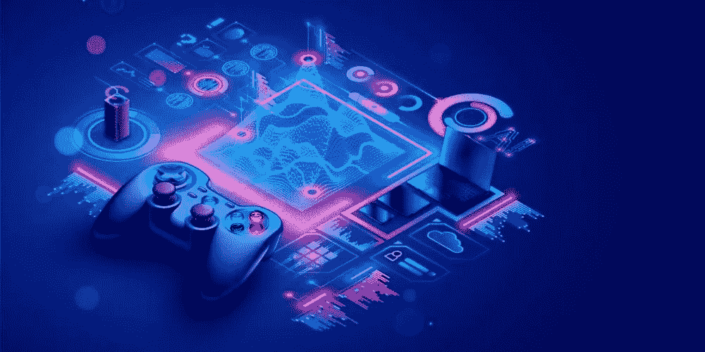
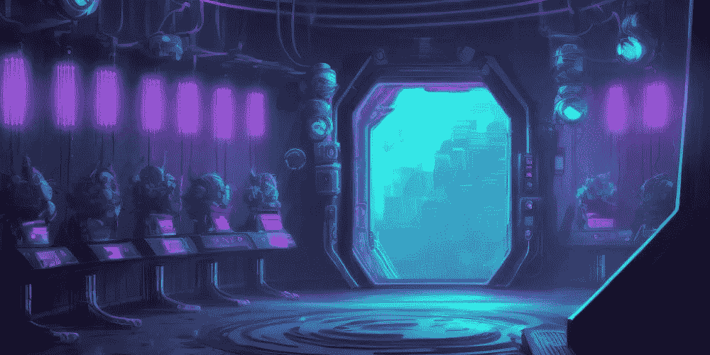
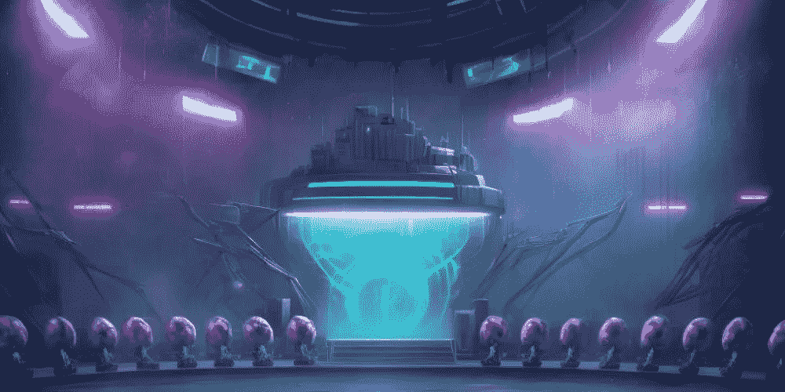

# 我们如何在游戏中使用人工智能:4 个关键点

> 原文：<https://medium.com/coinmonks/how-we-use-ai-in-gaming-4-key-points-ccbbac442986?source=collection_archive---------12----------------------->

最近，人工智能技术迅速进入了游戏行业。游戏行业是一个竞争激烈的行业，游戏经常使用人工智能来为所有用户提供更好的体验。作为无投降英雄，我们通常使用具有机器学习的人工智能来理解玩家的体验过程，并使用它来支持我们的游戏社区。因为建立一个可持续的社区，我们把玩家的体验放在第一位。通过以各种方式使用各种人工智能，我们的目标是每天改善玩家的旅程。

[**No Surrender Heroes**](https://app.adjust.com/nw8swri?redirect=https%3A%2F%2Ftwitter.com%2FNoSurrenderHero)

# 什么是游戏中的 AI？

游戏中的人工智能指的是响应性和适应性的视频游戏体验。这些由人工智能驱动的互动体验通常是通过非玩家角色或 NPC 产生的，这些角色表现得很聪明或有创造力，就像由人类游戏玩家控制一样。

在游戏设计中，人工智能程序生成，也称为程序讲故事，指的是通过算法产生的游戏数据，而不是由开发者专门构建的每个元素。人工智能在游戏中的发展已经将游戏体验的控制权从开发者转移到了玩家手中。游戏引擎负责决定 NPC 在游戏世界中的行为，并越来越关注玩家如何接近它。多人游戏的一个日益增长的趋势是设计它们，使算法为玩家产生内容，这意味着游戏和叙事的流程可以根据玩家的行为产生，而不是由人类开发者规划每一个选择和行动。

# 为什么人工智能游戏如此重要？

人工智能增强了玩家的体验，当开发人员将游戏体验交付给智能手机、VR 耳机等设备时，这一点尤为重要。AI 使开发者能够跨各种平台交付高质量的游戏。

人工智能有能力让游戏更加身临其境，更加有趣，更加社会化。游戏中的人工智能意味着让玩家可以在任何地方、任何设备上自由地玩他们最喜欢的游戏。这意味着跨设备提供类似控制台的体验。这份游戏中的人工智能报告探讨了游戏开发的未来，是什么推动了它的增长，它需要改进的地方，以及人工智能将如何在游戏体验的每个方面发挥重要作用。

# 用人工智能创造

我们在创作作品时使用人工智能工具，如****。同时，我们在使用大数据和 A/B 测试创建的广告中使用人工智能来创建我们的视觉效果。另外，在制作我们的角色皮肤的同时，用人工智能设计概念美术。****

****此外，我们使用 [**Copy.ai**](https://www.copy.ai/) 工具为我们的文本内容，以便更快地产生内容。****

# ****可疑玩家追踪****

****检测和防止游戏中的作弊往往具有挑战性。****

****作为 [**无投降英雄**](https://app.adjust.com/nw8swri?redirect=https%3A%2F%2Ftwitter.com%2FNoSurrenderHero) ，我们专注于具有机器学习和基于行为的检测的 AI。我们跟踪人类玩家的行为，并使用这些知识来检测异常行为。我们的目标是开发工具来标记机器人和骗子，但避免标记人类玩家——这是一项艰巨的任务。****

********

****[**No Surrender Heroes**](https://app.adjust.com/nw8swri?redirect=https%3A%2F%2Ftwitter.com%2FNoSurrenderHero)****

****我们对玩家了解得越多，就越容易发现骗子和机器人。我们尽可能多地在地图上追踪和标注玩家的行动、情况和区域。我们正在使用数据分析和机器学习来检测游戏中的作弊，这是我们的实时作弊检测技术。****

****此外，我们实时监控我们的游戏内经济，并利用人工智能跟踪可疑交易和欺诈。****

# ****玩家留存是手机游戏盈利的关键****

****在我们的游戏中，我们根据历史数据和玩家状态来创造正确的体验。****

****考察用户行为，保存数据，分析我们保存的数据，是我们为玩家提供体验最重要的点。****

********

****[**No Surrender Heroes**](https://app.adjust.com/nw8swri?redirect=https%3A%2F%2Ftwitter.com%2FNoSurrenderHero)****

****我们通过个性化服务来管理我们的游戏经济。例如，如果你需要 5 张卡来升级一个英雄，你将不会在报价部分看到 20 张卡。或者，如果您多次向您的同党申请信用卡，此交易将被自动检测到，您的优惠将相应地确定。****

# ****高级重定目标****

****我们使用持久但不烦人的 crm 数据收集方法。****

****我们关心通过检查用户行为使玩家的旅程更有趣。通过检查卡的使用习惯，我们生产个性化的内容，以维持游戏的平衡。目标是平衡游戏，以便为每个玩家提供愉快的体验。实现这一目标的最大帮助是我们强化的人工智能和机器学习技术，当然还有管理它的团队。****

********

****[**No Surrender Heroes**](https://app.adjust.com/nw8swri?redirect=https%3A%2F%2Ftwitter.com%2FNoSurrenderHero)****

****好吧，我们说我们在理论上这样做，但我们在实践中如何做呢？我们通过检查具有相似优势和特征的玩家的行为来进行匹配。玩家代理培训，不是上线，和大众一起做迭代，平衡游戏再开始迭代，而是培训事先测试游戏的 Ai 玩家代理，掌握它。我们看到 AI 团队持有的牌大多是最强大的。我们在上市前对游戏进行了平衡，并相应地调整了卡牌。****

# ****结论****

****总之，随着技术的发展，为产品用户提供卓越的体验变得越来越可衡量。在《不投降英雄》中，我们以玩家的旅程为先，给玩家更愉快的体验。我们通过收集用户数据并利用人工智能和机器学习来加强我们收集的数据来做到这一点。我们还使用人工智能技术来采取更快的行动，并在我们的大部分工作中生产更多的产品。这里的关键点是确定你能用这项技术做什么，并知道如何正确使用它。****

********

****[**No Surrender Heroes**](https://app.adjust.com/nw8swri?redirect=https%3A%2F%2Ftwitter.com%2FNoSurrenderHero)****

****与我们共度更多时光； [**碎碎念**](https://app.adjust.com/nw8swri?redirect=https%3A%2F%2Ftwitter.com%2FNoSurrenderHero) **|** [**中等**](/@nosurrenderheroes)****